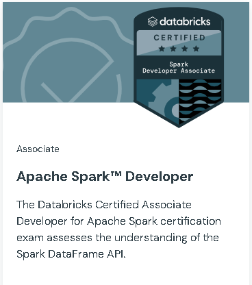

# Databricks Certified Associate Developer for Apache Spark

[Link](https://www.databricks.com/learn/certification/apache-spark-developer-associate)

### This exam covers:

1. Apache Spark Architecture and Components - 20%
2. Using Spark SQL - 20%
3. Developing Apache Spark™ DataFrame/DataSet API Applications - 30%
4. Troubleshooting and Tuning Apache Spark DataFrame API Applications - 10%
5. Structured Streaming - 10%
6. Using Spark Connect to deploy applications - 5%
7. Using Pandas API on Apache Spark - 5%
