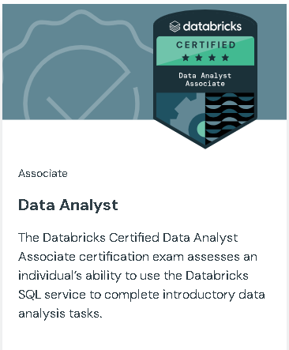

# Databricks Certified Data Analyst Associate

[Link](https://www.databricks.com/learn/certification/data-analyst-associate?itm_source=www&itm_category=learn&itm_page=certification&itm_location=Data%20Analyst&itm_component=card&itm_offer=data-analyst-associate)

### **This exam covers:**

1. Understanding of Databricks Data Intelligence Platform - 11%
2. Managing Data - 8%
3. Importing Data - 5%
4. Executing queries using Databricks SQL and Databricks SQL Warehouses - 20%
5. Analyzing Queries - 15%
6. Creating Dashboards and Visualizations in Databricks - 16%
7. Developing, Sharing, and Maintaining AI/BI Genie spaces - 12%
8. Data Modeling with Databricks SQL - 5%
9. Securing Data - 8%
