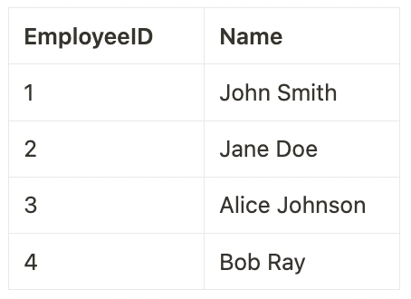
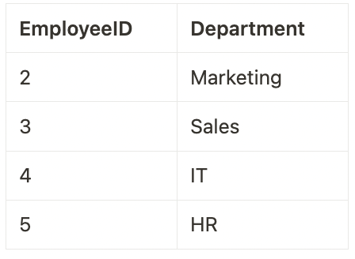
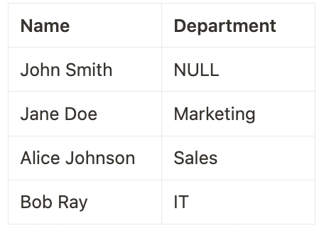
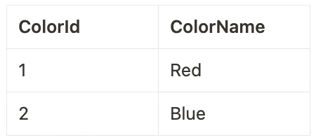
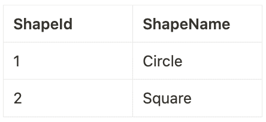
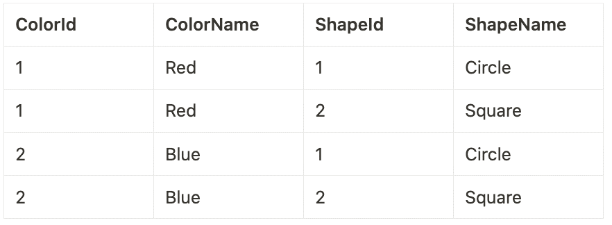
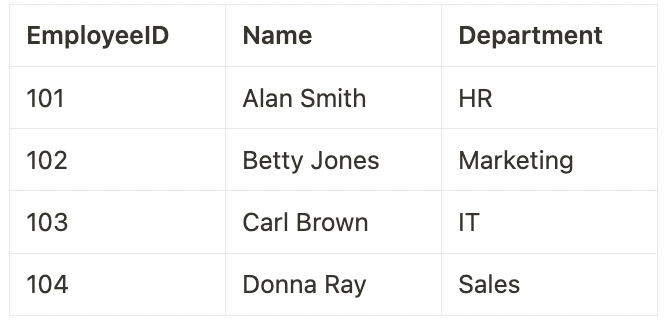
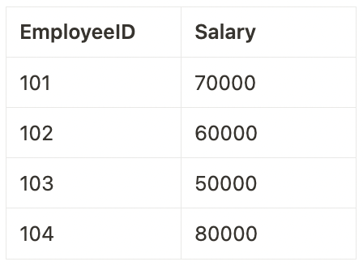
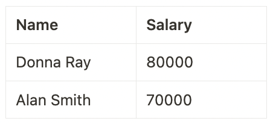

# T_002 (Practice Test 2)

#### Q1) In data analytics, identify a scenario where data enhancement would significantly improve the outcome.

a) During the initial stages of data collection where data volume is more critical than data quality.

b) When performing routine data backup and recovery processes.

c) When migrating data from one storage system to another without changing its format or content.

d) ***In a marketing campaign, to enrich customer data with additional demographic and psychographic information for targeted advertising.***

e) When aggregating large volumes of data for storage efficiency without analysis.

<u> **Overall explanation** </u>

Data enhancement is particularly beneficial in scenarios where adding more detailed, relevant information can lead to better decision-making or more personalized services. In the context of a marketing campaign, enriching customer data with additional demographic and psychographic information allows for more targeted and effective advertising. This enhanced data provides deeper insights into customer preferences and behaviors, enabling marketers to tailor their strategies and communications more precisely to the needs and interests of different customer segments.

```
Domain
Analytics applications
```

<br />

#### Q2) Assuming you have a table TrafficData with columns Timestamp (timestamp) and VehicleCount (integer), and you need to calculate the sum of VehicleCount for every 10-minute window.
Which SQL query using the `window_time` function correctly achieves this in a Databricks environment?


a) 
```
SELECT window_time(Timestamp, '10 minutes'), COUNT(VehicleCount) 
FROM TrafficData 
GROUP BY Timestamp;
```

b) 
```
SELECT window_time(Timestamp, '10 minutes'), AVG(VehicleCount) 
FROM TrafficData 
GROUP BY window_time(Timestamp, '10 minutes');
```

c) ***CORRECT ANSWER***
```
SELECT window_time(Timestamp, '10 minutes'), SUM(VehicleCount) 
FROM TrafficData 
GROUP BY window_time(Timestamp, '10 minutes');;
```

d) 
```
SELECT Timestamp, 
    SUM(VehicleCount) OVER (PARTITION BY window_time(Timestamp, '10 minutes')) 
FROM TrafficData;
```

e) 
```
SELECT Timestamp, 
    SUM(VehicleCount) OVER (ORDER BY Timestamp RANGE BETWEEN INTERVAL 10 MINUTES PRECEDING AND CURRENT ROW)
FROM TrafficData;
```

<u> **Overall explanation** </u>

This question tests the understanding of using the `window_time` function for time-based aggregation in SQL, a common requirement for analyzing time-series data such as traffic counts.

References:
https://learn.microsoft.com/en-us/azure/databricks/sql/language-manual/functions/window_time


```
Domain
SQL in the Lakehouse
```

<br />

#### Q3) The Medallion Architecture in Databricks is a conceptual framework for data organization and pipeline management. How does it structure the data processing pipeline?

a) None of the above

b) It involves a single stage of data processing where raw, refined, and curated data are merged into a unified table known as the Platinum table.

c) It uses a reverse-pyramid structure starting with the most refined data in the base layer, moving to semi-processed data, and ending with raw data at the top.

d) It starts with unstructured data in Gold tables, then structures the data in Silver tables, and finally stores the raw data in Bronze tables.

e) ***It begins with raw data in Bronze tables, moves to refined data in Silver tables, and culminates in curated data in Gold tables.***

<u> **Overall explanation** </u>

The Medallion Architecture in Databricks is an approach to organizing and processing data in a lakehouse environment. This architecture is characterized by its multi-layered structure, each representing a different level of data quality and refinement:

1. **Bronze Layer (Raw Data)**: This is the first layer where raw data from external source systems is collected. The data is stored in a format that closely mirrors the structure of the source system, along with additional metadata such as load date/time and process ID. The primary focus at this stage is on capturing Change Data Capture efficiently and providing a historical archive for data lineage and auditability.
2. **Silver Layer (Cleansed and Conformed Data)**: In this layer, the data from the Bronze layer undergoes matching, merging, conforming, and cleansing. The goal is to create an "Enterprise view" of key business entities, concepts, and transactions. This layer enables self-service analytics for ad-hoc reporting, advanced analytics, and machine learning. The Silver layer typically follows an ELT methodology (Extract, Load, Transform), focusing on speed and agility in data ingestion.
3. **Gold Layer (Curated Business-Level Tables)**: The final layer involves the organization of data into consumption-ready databases. The data in the Gold layer is highly refined, aggregated, and optimized for reading, making it ideal for reporting and analytics. This layer employs more de-normalized and read-optimized data models, often using Kimball-style star schemas or Inmon-style data marts.

References:
https://www.databricks.com/glossary/medallion-architecture
https://learn.microsoft.com/en-us/azure/databricks/lakehouse/medallion


```
Domain
Databricks SQL
```

<br />

#### Q4) How do you set the location of a table in Databricks when creating or altering it?

a) Location setting is not supported in Databricks.

b) By moving the data files to the desired location manually.

c) By using the `SET LOCATION` command in the table creation query

d) ***By using the `CREATE TABLE ... LOCATION` or `ALTER TABLE ... SET LOCATION` command.***

e) By specifying the location in the Databricks UI during table creation.

<u> **Overall explanation** </u>

In Databricks, the location of a table can be set or changed using SQL commands. During table creation, the location is specified using the `CREATE TABLE ... LOCATION` syntax. For existing tables, the location can be altered using the `ALTER TABLE ... SET LOCATION` command. This functionality allows for flexibility in data management and storage optimization within Databricks.

References:
[Databricks Documentation](https://docs.databricks.com/en/tables/index.html)
[Link 1](https://learn.microsoft.com/en-us/azure/databricks/sql/language-manual/sql-ref-syntax-ddl-create-table-using)
[Link 2](https://docs.databricks.com/en/sql/language-manual/sql-ref-syntax-ddl-alter-table.html)


```
Domain
Data Management
```

<br />

#### Q5) In the context of Databricks, there are distinct types of parameters used in dashboards and visualizations. Based on the descriptions provided, how do Widget Parameters, Dashboard Parameters, and Static Values differ in their application and impact?

a) Widget Parameters apply to the entire dashboard and can change the layout, whereas Dashboard Parameters are fixed and do not allow for interactive changes. Static Values are dynamic and change frequently based on user input.

b) ***Widget Parameters are tied to a single visualization and affect only the query underlying that specific visualization. Dashboard Parameters, on the other hand, can influence multiple visualizations within a dashboard and are configured at the dashboard level. Static Values are used to replace parameters, making them 'disappear' and setting a fixed value in their place.***

c) Static Values are used to create interactive elements in dashboards, while Widget and Dashboard Parameters are used for aesthetic modifications only, without impacting the data or queries.

d) Both Widget Parameters and Dashboard Parameters have the same functionality and impact, allowing for dynamic changes across all visualizations in a dashboard. Static Values provide temporary placeholders for these parameters.

e) Dashboard Parameters are specific to individual visualizations and cannot be shared across multiple visualizations within a dashboard. Widget Parameters are used at the dashboard level to influence all visualizations. Static Values change dynamically in response to user interactions.

<u> **Overall explanation** </u>

- **Widget Parameters** are specific to individual visualizations within a dashboard. They appear within the visualization panel and their values apply only to the query of that particular visualization.
- **Dashboard Parameters** are more versatile and can be applied to multiple visualizations within a dashboard. They are configured for one or more visualizations and are displayed at the top of the dashboard. The values specified for these parameters apply to all visualizations that reuse them. A dashboard can contain multiple such parameters, each affecting different sets of visualizations.
- **Static Values** replace the need for a parameter and are used to hard code a value. When a static value is used, the parameter it replaces no longer appears on the dashboard or widget, effectively making the parameter static and non-interactive.

References:
[Link](https://learn.microsoft.com/en-us/azure/databricks/sql/user/queries/query-parameters)


```
Domain
Data Visualization and Dashboards
```

<br />

#### Q6) In Databricks SQL, how is a "Query Based Dropdown List" used to enhance the functionality of a dashboard with query parameters?

a) It automatically updates query parameters based on external data sources, without user interaction.

b) The dropdown list is purely aesthetic, with no impact on the actual queries or data displayed.

c) It's used to manually input query parameters, unrelated to the output of any other query.

d) ***It dynamically generates a dropdown list based on the distinct output of a separate query, allowing users to select values as query parameters.***

e) It creates a fixed list of predefined options that users can choose from to filter dashboard data.

<u> <u> **Overall explanation** </u> </u>

A "Query Based Dropdown List" in Databricks SQL is a dynamic tool used to create query parameters. It generates a list of options for the user to choose from, where these options are the distinct results of a different, specified query. This method allows for more interactive and responsive dashboards, as users can filter and explore data based on real-time results from other queries, enhancing the dashboard's interactivity and data exploration capabilities.

References:
https://learn.microsoft.com/en-us/azure/databricks/sql/user/queries/query-parameters#query-based-dropdown-list


```
Domain
Data Visualization and Dashboards
```

<br />

#### Q7) In Databricks SQL, when dealing with the ingestion of data, how does the platform handle directories containing multiple files?

a) ***Databricks SQL can ingest directories of files, provided all files in the directory are of the same type, such as all CSV or all JSON.***

b) Databricks SQL automatically converts and ingests files of different types from a directory into a standard format.

c) Databricks SQL requires manual conversion of all files in a directory to a uniform format before ingestion.

d) Databricks SQL can only ingest a single file at a time, regardless of file type.

e) Databricks SQL can ingest directories containing files of mixed types, such as CSV and JSON, simultaneously.

<u> **Overall explanation** </u>

Databricks SQL has the capability to ingest directories of files, provided all the files in the directory are of the same type. This is facilitated by Databricks' read_files table-valued function, which supports reading various file formats such as JSON, CSV, TEXT, BINARYFILE, PARQUET, AVRO, and ORC. This function can automatically detect the file format and infer a unified schema across all files in the directory. The read_files function can read individual files or all files under a given directory, supporting file discovery through glob patterns to filter directories or files. This makes it an efficient tool for ingesting directories containing multiple files of the same type, simplifying the process of data loading and ingestion in Databricks SQL.

In addition, Databricks SQL also supports flexible data loading patterns, including the use of the Auto Loader for efficient data ingestion from cloud object storage. Auto Loader can ingest image or binary data into Delta Lake and supports glob patterns for filtering directories and files. This adds versatility to the data ingestion process in Databricks SQL, allowing for various patterns of data loading and ensuring efficient processing of data stored in directories.

Databricks SQL, along with Apache Spark and other Databricks tools, provides a comprehensive environment for working with files in various formats and locations. These tools collectively enhance the data processing capabilities of Databricks, allowing users to efficiently manage and analyze large datasets stored in cloud object storage or other data sources.

References:
https://docs.databricks.com/en/sql/language-manual/functions/read_files.html
https://docs.databricks.com/en/files/index.html


```
Domain
Databricks SQL
```

<br />

#### Q8) What is the minimum permission a user needs to configure a refresh schedule on a Databricks SQL Dashboard?

a) Modify Permissions.

b) ***Can Edit.***

c) Owner.

d) No permissions.

e) Can View.

<u> **Overall explanation** </u>

A dashboard’s owner and users with the Can Edit permission can configure a dashboard to automatically refresh on a schedule.

References:
https://docs.databricks.com/en/sql/user/dashboards/index.html#automatically-refresh-a-dashboard


```
Domain
Data Visualization and Dashboarding
```

<br />

#### Q9) A data analyst is tasked with presenting yearly revenue data to stakeholders in a way that is both informative and visually appealing. The analyst decides to use a line graph to show the revenue trends over the year. What is the best approach the analyst should take in terms of formatting the graph?

a) Incorporate various font styles and sizes for each data point to make the graph more dynamic.

b) ***Apply a minimalistic design with a consistent color scheme and clear labeling to enhance focus on the data.***

c) Use a wide range of vibrant colors for different data points to make the graph more colorful.

d) Add multiple background images related to the company's business to make the graph more engaging.

e) Use 3D effects on the graph lines to give a more modern and advanced look.

<u> **Overall explanation** </u>

Adding visual appeal to a data visualization, like a line graph, is not just about making it colorful or visually busy. It's about enhancing the viewer's ability to understand and engage with the data being presented. A minimalistic design approach, with a consistent color scheme and clear labeling, helps in reducing clutter and focusing the viewer's attention on the key trends and insights in the data. This approach ensures that the graph is both aesthetically pleasing and functionally informative, which is crucial for effective data communication, especially in a professional or business context.

> **References**:
- [Storytelling with Data: The Basics of Good Design](https://www.storytellingwithdata.com/blog/2018/6/26/the-basics-of-good-design)
- Harvard Business Review: Visualizations That Really Work
- Smashing Magazine: Data Visualization Best Practices


```
Domain
Data Visualization and Dashboarding
```

<br />

#### Q10) In the Databricks Unity Catalog, which SQL command correctly creates a new table named `customer_data` in a database sales under the catalog `us_catalog`, based on a `SELECT` query from an existing table `transactions` in the same database and catalog?

a) `TABLE CREATE us_catalog.sales.customer_data AS (SELECT * FROM transactions);`

b) `NEW TABLE us_catalog.sales.customer_data FROM SELECT * IN transactions;`

c) `CREATE TABLE customer_data IN us_catalog.sales AS SELECT * FROM transactions;`

d) ***`CREATE TABLE us_catalog.sales.customer_data AS SELECT * FROM us_catalog.sales.transactions;`***

e) `us_catalog.sales: CREATE TABLE customer_data AS SELECT * FROM transactions;`

<u> **Overall explanation** </u>

In Databricks Unity Catalog, which supports a three-level namespace (catalog.database.table), the correct SQL command to create a new table based on a SELECT query from an existing table involves specifying the catalog, database, and table names. 
The correct syntax is:

> CREATE TABLE catalog_name.database_name.new_table_name AS SELECT * FROM catalog_name.database_name.existing_table_name;

This command is used to create a new table (`customer_data`) in the specified database (`sales`) and catalog (`us_catalog`) that contains all records from the specified existing table (`transactions`).

References:
https://learn.microsoft.com/en-us/azure/databricks/data-governance/unity-catalog/
https://learn.microsoft.com/en-us/azure/databricks/sql/language-manual/


```
Domain
Data Management
```

<br />

#### Q11) In the context of Databricks dashboards, how do query parameters influence the output of underlying SQL queries within a dashboard?

a) They modify the layout of the dashboard, rearranging the visualizations based on user preferences, but do not change the data output of the queries.

b) Query parameters are used to format the visual aspects of the output, such as color and font, without changing the actual data returned by the query.

c) ***Query parameters serve as placeholders in SQL queries, allowing for dynamic data filtering based on user input, thus altering the output of the query according to the specified parameter values.***

d) Query parameters act as static reference points in SQL queries, ensuring that the output remains constant irrespective of user interactions.

e) They automatically update the SQL queries on a set schedule, such as daily or weekly, to change the output data based on temporal parameters.

<u> **Overall explanation** </u>

Query parameters in Databricks dashboards are powerful tools used to create flexible and interactive SQL queries. They act as placeholders within the SQL query structure, where the actual values can be dynamically provided by the user or another source. When a user interacts with the dashboard and changes a query parameter, the SQL query automatically adjusts to include this new value. This allows the query to return different results based on the parameter, enabling a more dynamic and interactive data exploration experience within the dashboard. For instance, if a query parameter is set to filter data by a specific date range or region, changing this parameter will directly alter the data returned by the query, reflecting the specified date range or region.

References:
https://learn.microsoft.com/en-us/azure/databricks/sql/user/queries/query-parameters

```
Domain
Data Visualization and Dashboarding
```

<br />

#### Q12) In a Databricks environment, you're analyzing query performance improvements. After several runs of a complex query on a large dataset, you notice a significant reduction in latency. What feature of Databricks is most likely contributing to this decrease in query execution time?

a) Increased hardware resources allocation.

b) Improved data indexing mechanisms.

c) Use of persistent tables instead of temporary views.

d) Automatic query rewriting for optimization.

e) ***Caching of intermediate data and results from previous query executions.***

<u> **Overall explanation** </u>

When a query is run multiple times, Databricks stores the results and intermediate data in cache. Subsequent executions of the same query or those with similar computations can leverage this cached data, leading to significantly reduced query latency. This efficiency gain is particularly notable in complex queries on large datasets, where accessing cached results avoids the need for repeated data processing and computation.

References:
https://learn.microsoft.com/en-us/azure/databricks/sql/admin/query-caching

```
Domain
SQL in the Lakehouse
```

<br />

#### Q13) In a Spark SQL dataset EmployeeData, you have a column monthlyPerformanceRatings which is an array of integers representing monthly performance ratings of employees.
#### You are tasked with identifying employees whose performance has consistently improved over the last three months.
#### Which Spark SQL query utilizing a higher-order function is best suited for this task?


a) 
```
SELECT employeeId 
FROM EmployeeData 
WHERE ZIP_WITH(monthlyPerformanceRatings, monthlyPerformanceRatings, (current, next) -> next > current);
```

b) 
```
SELECT employeeId 
FROM EmployeeData 
WHERE REDUCE(monthlyPerformanceRatings, 0, (acc, rating) -> acc + rating, acc -> acc) > 3;
```

c) ***All***
```
SELECT employeeId 
FROM EmployeeData 
WHERE ARRAY_SORT(monthlyPerformanceRatings) = monthlyPerformanceRatings;
```

d) 
```
SELECT employeeId 
FROM EmployeeData 
WHERE EXISTS(monthlyPerformanceRatings, rating -> rating > 3);
```

e) 
```
SELECT employeeId 
FROM EmployeeData 
WHERE SLICE(monthlyPerformanceRatings, -3, 3) = ARRAY_SORT(SLICE(monthlyPerformanceRatings, -3, 3));
```

<u> **Overall explanation** </u>

References:
https://learn.microsoft.com/en-us/azure/databricks/sql/language-manual/functions/array_sort
https://learn.microsoft.com/en-us/azure/databricks/sql/language-manual/functions/slice


```
Domain
SQL in the Lakehouse
```

<br />

#### Q14) What is the correct sequence of steps to execute a SQL query in Databricks?

a) Choose a SQL warehouse, construct and edit the query, execute the query, and visualize results.

b) Create a query using Terraform, execute the query in a Databricks job, and use COPY INTO to load data.

c) ***Open SQL Editor, select a SQL warehouse, construct and edit the query, execute the query.***

d) Write the query in an external tool, import it into Databricks, select a data source, and execute the query.

e) Manually input data, write a query in Databricks notebook, execute the query, and export the results.

<u> **Overall explanation** </u>

The correct sequence for executing a SQL query in Databricks starts with opening the SQL Editor. Then, you select a SQL warehouse where the query will be executed. After this, you construct and edit your SQL query directly in the editor, which supports features like autocomplete. Once the query is ready, you execute it and the results are displayed in the results pane. During or after execution, you can manage or terminate the query if necessary. Additionally, Databricks SQL provides options to visualize the results and create dashboards for deeper analysis and sharing insights.

References:
https://docs.databricks.com/en/sql/user/queries/queries.html
https://docs.databricks.com/en/sql/get-started/index.html

```
Domain
Databricks SQL
```

<br />

#### Q15) What is a key benefit of using ANSI SQL as the standard query language in the Lakehouse architecture?

a) It allows for real-time data streaming and complex event processing.

b) It enables automatic data encryption and security.

c) It supports native machine learning algorithms.

d) ***It ensures compatibility and interoperability across different database systems.***

e) It provides enhanced graphical data visualization tools.

<u> **Overall explanation** </u>

The benefit of using ANSI SQL as the standard query language in the Lakehouse architecture, such as Databricks, lies in its compatibility and interoperability across various database systems. ANSI SQL provides a uniform syntax and set of capabilities, ensuring that SQL queries and operations are consistent and portable between different SQL-compliant database systems. This standardization simplifies data management, query development, and integration with other systems, enhancing the efficiency of data operations in a Lakehouse environment.

References:
https://www.databricks.com/blog/2021/11/16/evolution-of-the-sql-language-at-databricks-ansi-standard-by-default-and-easier-migrations-from-data-warehouses.html

```
Domain
SQL in the Lakehouse
```

<br />

#### Q16) In the landscape of Business Intelligence (BI) and data analytics, what role does Databricks SQL play when integrated with other BI tools?

a) Databricks SQL replaces traditional BI tools for data analysis and reporting.

b) ***Databricks SQL acts as a data processing and query engine, complementing BI tools for enhanced data analysis and reporting.***

c) Databricks SQL primarily enhances data visualization capabilities.

d) Databricks SQL and BI tools cannot be used together.

e) Databricks SQL is used only for data storage, with BI tools handling all data processing and analysis.

<u> **Overall explanation** </u>

Databricks SQL is designed to complement existing BI tools by serving as an effective data processing and query engine. This integration enhances the overall capabilities of BI workflows, allowing for sophisticated data analysis and leveraging the strengths of both Databricks SQL and the BI tools.

Databricks SQL integrates effectively with various Business Intelligence (BI) tools, enhancing data warehousing capabilities. This integration facilitates an environment where data analysts can work with SQL queries and their preferred BI tools for ad-hoc queries and dashboard creation on data stored in data lakes. Databricks SQL supports validated integrations with popular BI tools like Power BI and Tableau, allowing users to work with data through Databricks clusters and SQL warehouses. These integrations often provide low-code or no-code experiences, simplifying the process of connecting and using BI tools with Databricks.

References:
https://docs.databricks.com/en/getting-started/connect/index.html

```
Domain
Databricks SQL
```

<br />

#### Q17) In a data analytics environment, how can dashboards be configured to automatically refresh and display the most current data?

a) Automatic dashboard refreshes require a complete system reboot at regular intervals.

b) Dashboards must be manually refreshed by the user to display the latest data.

c) Automatic refreshes are achieved by scripting a periodic page reload in the web browser displaying the dashboard.

d) ***Dashboards can be set up to refresh automatically at specified intervals using built-in scheduling features.***

e) Dashboards automatically refresh only when the underlying data source is replaced with a new one.

<u> **Overall explanation** </u>

In Databricks SQL, dashboards can be configured to automatically refresh at specific intervals. This is done by scheduling the dashboard for regular refreshes. You can set this up by clicking "Schedule" at the top of the dashboard page, then selecting "Add schedule." Here, you can choose the interval for the automatic refresh, such as every hour. Additionally, you can modify the schedule name and specify a SQL warehouse for running the dashboard's queries during the refresh. This feature ensures that the dashboard displays up-to-date information based on the latest data

References:
https://docs.databricks.com/en/sql/user/dashboards/index.html#automatically-refresh-a-dashboard

```
Domain
Databricks SQL
```

<br />

#### Q18) In the context of a Databricks Lakehouse architecture, you are working with silver-level data that has been aggregated from various bronze tables.
#### You notice inconsistencies in customer names due to variations in casing and spacing (e.g., 'John Doe', 'john doe', 'John Doe').
#### What would be an appropriate SQL statement to standardize these customer names in the silver table CustomerData?

a) ALTER TABLE CustomerData MODIFY COLUMN customer_name SET DATA TYPE VARCHAR(255) NOT NULL;

b) CREATE VIEW CleanCustomerData AS SELECT DISTINCT TRIM(LOWER(customer_name)) FROM CustomerData;

c) ***UPDATE CustomerData SET customer_name = TRIM(UPPER(customer_name));***

d) SELECT customer_name FROM CustomerData GROUP BY customer_name;

e) SELECT DISTINCT TRIM(UPPER(customer_name)) FROM CustomerData;

<u> **Overall explanation** </u>

The correct answer is UPDATE CustomerData SET customer_name = TRIM(UPPER(customer_name)); as it directly standardizes customer names in the silver table by removing extra spaces and converting text to uppercase.

Other options do not modify the data. GROUP BY clusters values without standardizing them, ALTER TABLE changes structure but not content, SELECT DISTINCT only displays cleaned names and does not modify the data, and CREATE VIEW creates a separate dataset without fixing the original table.

References:
https://learn.microsoft.com/en-us/azure/databricks/sql/language-manual/sql-ref-syntax-qry-select
https://learn.microsoft.com/en-us/azure/databricks/sql/language-manual/functions/trim
https://learn.microsoft.com/en-us/azure/databricks/sql/language-manual/functions/upper

```
Domain
SQL in the Lakehouse
```

<br />

#### Q19) Given a sales database with a table SalesData containing columns Region, ProductType, and SalesAmount, you are tasked with creating a report that includes the total sales amount for each combination of Region and ProductType, as well as totals for each Region alone and the overall total.
**Which SQL query correctly generates this report?**

**SalesData** table:


a) SELECT Region, ProductType, COUNT(SalesAmount) FROM SalesData GROUP BY CUBE(Region, ProductType);

b) SELECT Region, SUM(SalesAmount) FROM SalesData GROUP BY CUBE(Region);

c) SELECT Region, ProductType, SUM(SalesAmount) FROM SalesData GROUP BY Region, ProductType WITH CUBE;

d) SELECT Region, ProductType, SUM(SalesAmount) FROM SalesData GROUP BY ROLLUP(Region, ProductType);

e) ***SELECT Region, ProductType, SUM(SalesAmount) FROM SalesData GROUP BY CUBE(Region, ProductType);***

<u> **Overall explanation** </u>

This question assesses the understanding of the SQL CUBE function for multi-dimensional aggregation, useful in scenarios requiring subtotals and grand totals across multiple dimensions.
When you apply GROUP BY CUBE(Region, ProductType) to this table, it generates rows for each combination of Region and ProductType, as well as rows for totals of each Region, each ProductType, and a grand total.

References:
https://learn.microsoft.com/en-us/azure/databricks/sql/language-manual/sql-ref-syntax-qry-select-groupby
https://learn.microsoft.com/en-us/azure/databricks/sql/language-manual/functions/cube

```
Domain
SQL in the Lakehouse
```

<br />

#### Q20) In the context of analytics, what is an example of effectively enhancing data in a common application?

a) Keeping data in its original, raw format for archival purposes.

b) Restricting data access to a limited number of users to ensure data security.

c) Performing routine software updates on data analysis tools without modifying data.

d) ***Integrating weather data into a retail sales analysis to understand the impact of weather on sales trends.***

e) Strictly categorizing data based on its source without additional processing.

<u> **Overall explanation** </u>

In analytics, data enhancement often involves integrating additional context to existing datasets to derive more insightful conclusions. An example of this is incorporating weather data into retail sales analysis. By doing so, analysts can examine how different weather conditions affect sales trends, enabling more informed business decisions like inventory planning or promotional strategies. This approach exemplifies how enriching data with relevant external information can lead to a better understanding of business dynamics and customer behavior.

```
Domain
Analytics applications
```

<br />

#### Q21) Which of the following best describes the purpose of descriptive statistics in data analysis?

a) To test hypotheses about the relationship between variables.

b) To categorize data into distinct groups based on algorithmic models.

c) To make predictions about future trends based on historical data.

d) ***To summarize and describe the main features of a dataset.***

e) To establish causal relationships between different variables.

<u> **Overall explanation** </u>

Descriptive statistics are crucial for providing a quick overview of the data's tendencies and characteristics, such as central tendency, dispersion, and distribution. They are the first step in data analysis, giving a foundational understanding before proceeding to more complex inferential analysis.

References:
https://www.simplilearn.com/what-is-descriptive-statistics-article#what_is_descriptive_statistics

```
Domain
Analytics applications
```

<br />

#### Q22) In the context of Databricks, when dealing with the import of small text files, such as lookup tables or for quick data integrations, which approach is recommended to optimize performance and ease of use?

a) Convert small text files to a binary format to increase upload speed and efficiency.

b) Upload small text files to a temporary storage service before importing them into Databricks.

c) Utilize large-file upload methods for all types of data, regardless of file size.

d) ***Employ small-file upload techniques specifically designed for handling small text files efficiently.***

e) Always compress text files into larger archives before uploading, regardless of the original file size.

<u> **Overall explanation** </u>

The practice of using small-file upload methods in Databricks is suitable for efficiently handling the import of small text files, such as lookup tables or for quick data integrations. This approach is supported by various tools and functionalities within the Databricks platform:

1. File Upload UI and Add Data UI: Databricks offers a user-friendly interface for data ingestion, including the File upload UI and Add data UI. These interfaces facilitate the import of small files into Databricks, allowing users to create new tables or overwrite existing ones with ease. This feature is particularly useful for small local files and supports a range of ingestion needs, including ingestion from different data sources like Azure Data Lake Storage, Amazon S3, Kafka, and Kinesis.
2. Working with Workspace Files: Databricks allows the use of workspace files to store and access data. Workspace files are particularly recommended for small data files, primarily for development and testing purposes. This functionality is designed to accommodate smaller files efficiently, making it an ideal solution for small text file uploads.
3. Optimization Techniques: Databricks provides various optimization techniques to handle small files effectively. This includes settings like autoOptimize.optimizeWrite and autoOptimize.autoCompact, which can optimize the handling of small files during ingestion and querying processes. These settings help in improving performance and managing data more efficiently.

References:
https://www.databricks.com/blog/easy-ingestion-lakehouse-file-upload-and-add-data-ui
https://docs.databricks.com/en/files/index.html

```
Domain
Databricks SQL
```

<br />

#### Q23) Consider the following two tables:

Table 1: **Employees**



Table 2: **Departments**



Given the output from joining both tables:



#### Which of the queries below could have been used to generate the output?

a) 
```
SELECT Employees.Name, Departments.Department
FROM Employees
FULL JOIN Departments ON Employees.EmployeeID = Departments.EmployeeID;
```

b) 
```
SELECT *
FROM Employees
RIGHT JOIN Departments ON Employees.EmployeeID = Departments.EmployeeID;
```

c) ***CORRECT ANSWER***
```
SELECT Employees.Name, Departments.Department
FROM Employees
LEFT JOIN Departments ON Employees.EmployeeID = Departments.EmployeeID;
```

d) 
```
SELECT *
FROM Employees
LEFT JOIN Departments ON Employees.EmployeeID = Departments.EmployeeID;
```

e) 
```
SELECT Employees.Name, Departments.Department
FROM Employees
RIGHT JOIN Departments ON Employees.EmployeeID = Departments.EmployeeID;
```

<u> **Overall explanation** </u>

The query uses a LEFT JOIN, which returns all records from the left table (Employees), and the matched records from the right table (Departments). If there is no match, the result is NULL on the side of the right table. Therefore, all employees including John Smith (with NULL department) will be in the output.

References:
https://learn.microsoft.com/en-us/azure/databricks/sql/language-manual/sql-ref-syntax-qry-select-join

```
Domain
SQL in the Lakehouse
```

<br />

#### Q24) What are the key differences in behavior between managed and unmanaged tables in Databricks?

a) Managed tables automatically back up data, whereas unmanaged tables require manual backups.

b) Managed tables can only store structured data, while unmanaged tables can store both structured and unstructured data.

c) Unmanaged tables are optimized for streaming data, whereas managed tables are not.

d) ***Managed tables store their data in a default location managed by Databricks, while unmanaged tables allow specifying a storage location.***

e) Managed tables support ACID transactions, while unmanaged tables do not.

<u> **Overall explanation** </u>

Managed tables in Databricks have their data and metadata managed by Databricks and are stored in a default warehouse location. For unmanaged tables, Databricks manages only the metadata, and the data is stored in a location specified by the user. This distinction affects how data is managed, accessed, and deleted.

References:
https://docs.databricks.com/en/lakehouse/data-objects.html

```
Domain
Data Management
```

<br />

#### Q25) In the realm of data visualization and analysis, Databricks SQL dashboards serve a specific purpose. What is the primary function of Databricks SQL dashboards in the context of data query results?

a) To serve as an interactive platform for writing and testing new SQL queries.

b) ***To showcase the results of multiple SQL queries simultaneously in a unified view.***

c) To display the output of a single, complex SQL query.

d) To store raw data for long-term archival purposes.

e) To execute real-time data transformations without displaying results.

<u> **Overall explanation** </u>

Databricks SQL dashboards are designed as a versatile tool for data visualization, primarily used for displaying the results of multiple SQL queries at once. This feature allows data analysts and scientists to create a comprehensive view of their data analysis by integrating various query results into a single dashboard. These dashboards provide an intuitive and interactive interface where different aspects of data, pulled from multiple queries, can be visualized simultaneously, offering a holistic understanding of the datasets at hand. This functionality is crucial for in-depth data analysis, reporting, and decision-making processes where multiple data points and trends need to be assessed collectively.

References:
https://docs.databricks.com/en/sql/get-started/index.html

```
Domain
Databricks SQL
```

<br />

#### Q26) In Databricks, what distinguishes a managed table from an unmanaged (external) table in terms of data and metadata management?

a) Managed tables allow for external file storage, whereas unmanaged tables store data within the Databricks environment.

b) Managed tables require manual data deletion after dropping the table, whereas unmanaged tables automatically delete data.

c) Unmanaged tables enable ACID transactions, unlike managed tables.

d) Managed tables store both data and metadata in the cloud, while unmanaged tables store only metadata.

e) ***Managed tables have their data and metadata managed by Databricks, while unmanaged tables have only metadata managed.***

<u> **Overall explanation** </u>

In Databricks, managed tables are where both the data and metadata are managed by Databricks. Dropping a managed table will delete the underlying data along with the metadata. In contrast, for unmanaged (external) tables, Databricks only manages the metadata, and dropping the table does not affect the underlying data. This distinction is crucial for understanding data persistence and governance in Databricks environments.

References:
https://learn.microsoft.com/en-us/azure/databricks/lakehouse/data-objects

```
Domain
Data Management
```

<br />

#### Q27) When using the schema browser in the Query Editor of Databricks, what type of information can you expect to find displayed? Choose the most appropriate option.

a) Only the SQL queries that have been executed in the past sessions.

b) List of all users and groups who have access to the Databricks workspace.

c) ***Available databases, tables, and columns, along with their data types.***

d) Real-time performance metrics and logs of the Databricks cluster.

e) Detailed documentation and syntax for all SQL functions and commands.

<u> **Overall explanation** </u>

The SQL editor within Databricks SQL is designed to provide users with a comprehensive environment for querying data. One of its key features is the schema browser, which displays a variety of important data-related information. When using the schema browser in the SQL editor, users can expect to view the following:

1. Available Databases and Tables: The schema browser shows the databases and tables that are accessible in your Databricks environment. This allows users to easily navigate through the data structure and identify the specific datasets they need for their queries.
2. Table Columns and Data Types: In addition to listing the tables, the schema browser also provides details about the columns within these tables, including their data types. This feature is particularly useful for understanding the structure of your data and planning your SQL queries accordingly.
3. Metadata Read Permissions: The information displayed in the schema browser is subject to the user's metadata read permissions. This means that users will only see the data objects (databases, tables, columns) for which they have been granted access.
4. Tools for Query Construction: The SQL editor supports the construction of queries by allowing users to insert elements from the schema browser directly into the SQL editor. It also features autocomplete to suggest valid completions as you type, enhancing the efficiency of writing SQL queries.

References:
https://learn.microsoft.com/en-us/azure/databricks/sql/user/sql-editor/

```
Domain
Databricks SQL
```

<br />

#### Q28) Consider the following two tables:

**Colors** Table:



**Shapes** Table:



After executing an SQL JOIN query, you receive the following result:



What type of JOIN was used to produce this result?

a) RIGHT JOIN

b) ***CROSS JOIN***

c) INNER JOIN

d) FULL  JOIN

e) LEFT JOIN

<u> **Overall explanation** </u>

This question tests the understanding of CROSS JOIN, which combines each row of one table with each row of another table, often used for creating combinations or permutations.

References:
https://learn.microsoft.com/en-us/azure/databricks/sql/language-manual/sql-ref-syntax-qry-select-join

```
Domain
SQL in the Lakehouse
```

<br />

#### Q29) Consider two tables in a database:

**Employees** Table:



**Salaries** Table:



Given the output of a join between the two tables:



#### Which of the queries below could have been used to generate the output?

a) 
```
SELECT E.Name, S.Salary 
FROM Employees E 
INNER JOIN Salaries S 
ON E.EmployeeID = S.EmployeeID 
WHERE S.Salary > (SELECT MAX(Salary) FROM Salaries) 
ORDER BY S.Salary DESC;
```

b) 
```
SELECT E.Name, S.Salary 
FROM Employees E 
INNER JOIN Salaries S 
ON E.EmployeeID = S.EmployeeID 
WHERE S.Salary > (SELECT AVG(Salary) FROM Salaries) 
ORDER BY S.Salary ASC;
```

c) ***CORRECT ANSWER***
```
SELECT E.Name, S.Salary 
FROM Employees E 
INNER JOIN Salaries S 
ON E.EmployeeID = S.EmployeeID 
WHERE S.Salary > (SELECT AVG(Salary) FROM Salaries) 
ORDER BY S.Salary DESC;
```

d) 
```
SELECT E.Name, S.Salary 
FROM Employees E 
INNER JOIN Salaries S 
ON E.EmployeeID = S.EmployeeID 
WHERE S.Salary > (SELECT MAX(Salary) FROM Salaries) 
ORDER BY S.Salary DESC;
```

e) 
```
SELECT *
FROM Employees E 
INNER JOIN Salaries S ON E.EmployeeID = S.EmployeeID 
WHERE S.Salary > (SELECT AVG(Salary) FROM Salaries) 
ORDER BY S.Salary DESC;
```

<u> **Overall explanation** </u>

The query selects the name and salary of employees whose salary is greater than the average salary in the Salaries table. It then orders the results in descending order of salary.

References:
https://learn.microsoft.com/en-us/azure/databricks/sql/language-manual/

```
Domain
SQL in the Lakehouse
```

<br />

#### Q30) In data engineering, how is "performing last-mile ETL as project-specific data enhancement" best described?

a) Implementing general ETL processes applicable to all datasets across the organization.

b) ***Conducting final data transformations and enrichments specific to the needs of a particular project.***

c) Migrating all data to a centralized data warehouse for unified access.

d) Utilizing advanced data analytics techniques to generate predictive insights.

e) Performing initial data extraction from various source systems into a staging area.

<u> **Overall explanation** </u>

Last-mile ETL as project-specific data enhancement refers to the final steps in the ETL process, where data is tailored and enriched to meet the unique requirements of a specific project. This step often involves fine-tuning the data, such as applying specific transformations, cleaning, or enrichments, to ensure it is optimally structured and formatted for the particular analytical or operational needs of the project. This process is crucial for ensuring the data is not only accurate but also aligned with the specific objectives and context of the project.

```
Domain
Analytics applications
```

<br />

#### Q31) How can you change access rights to a table in Databricks using Catalog Explorer?

a) ***By selecting the table, navigating to the 'Permissions' tab, and modifying permissions.***

b) Access rights can only be changed via the Databricks CLI, not in Data Explorer.

c) Through the 'Access Rights' menu in the table's context menu in Data Explorer.

d) By editing the table schema in the 'Schema' section of Data Explorer.

e) By executing a SQL command in Data Explorer for access modification.

<u> **Overall explanation** </u>

In Databricks, using Catalog Explorer, access rights to a table can be changed by selecting the table and navigating to the 'Security' tab. Here, users can modify permissions, allowing them to control who can view, edit, or delete the table. This functionality is crucial for managing data security and compliance within the Databricks environment.

```
Domain
Data Management
```

<br />

#### Q32) You are analyzing a dataset in Databricks SQL named WeatherReadings which includes the columns StationID (integer), ReadingTimestamp (timestamp), and Temperature (float).
#### You need to calculate the average temperature for each station in 1-hour windows, sliding every 30 minutes. Which SQL query correctly uses the windowing function to achieve this?

a) 
```
SELECT StationID, 
        window(ReadingTimestamp, '1 hour'), 
        AVG(Temperature) 
FROM WeatherReadings 
GROUP BY StationID, window(ReadingTimestamp, '1 hour');
```

b) 
```
SELECT StationID, 
        AVG(Temperature) OVER (PARTITION BY StationID, window(ReadingTimestamp, '1 hour', '30 minutes')) 
FROM WeatherReadings;
```

c) 
```
SELECT StationID, 
        AVG(Temperature) OVER (PARTITION BY StationID ORDER BY ReadingTimestamp RANGE BETWEEN INTERVAL 1 HOUR PRECEDING AND CURRENT ROW) 
FROM WeatherReadings;
```

d) ***CORRECT ANSWER***
```
SELECT StationID, 
        window(ReadingTimestamp, '1 hour', '30 minutes'), AVG(Temperature) 
FROM WeatherReadings 
GROUP BY StationID, window(ReadingTimestamp, '1 hour', '30 minutes');
```

e) 
```
SELECT StationID, 
        AVG(Temperature) OVER (PARTITION BY StationID ORDER BY ReadingTimestamp ROWS BETWEEN INTERVAL '30 minutes' PRECEDING AND INTERVAL '30 minutes' FOLLOWING) 
FROM WeatherReadings;
```

<u> **Overall explanation** </u>

References:
https://learn.microsoft.com/en-us/azure/databricks/sql/language-manual/functions/window

```
Domain
SQL in the Lakehouse
```

<br />

#### Q33) You are working with a sales data table in Databricks SQL that contains columns for Region, Product, and SalesAmount. You want to generate a report that includes the total sales amount for each combination of Region and Product, as well as the total for each Region and the overall total. But not the total for each Product.
**Which SQL query would you use to achieve this?**

a) 
```
SELECT Region, Product, SUM(SalesAmount) 
FROM sales 
GROUP BY GROUPING SETS ((Region, Product), ());
```

b) 
```
SELECT Region, Product, SUM(SalesAmount) 
FROM sales 
GROUP BY CUBE(Region, Product);
```

c) 
```
SELECT Region, Product, SUM(SalesAmount) 
FROM sales 
GROUP BY ROLLUP Product, Region;
```

d) 
```
SELECT Region, Product, SUM(SalesAmount) 
FROM sales 
GROUP BY Region, Product WITH CUBE;
```

e) ***CORRECT ANSWER***
```
SELECT Region, Product, SUM(SalesAmount) 
FROM sales 
GROUP BY ROLLUP(Region, Product);
```

<u> **Overall explanation** </u>

To achieve this, you can use the `GROUP BY` with `ROLLUP` in Databricks SQL. The `ROLLUP` function will generate subtotals for each combination, each `Region`, and also the overall total.

`CUBE(Region, Product) , GROUP BY Region, Product WITH CUBE` and `GROUP BY Product, Region WITH ROLLUP` will return the totals for Product which was not a requirement.

`GROUP BY ROLLUP Product, Region` is incorrect syntax.

References:
https://learn.microsoft.com/en-us/azure/databricks/sql/language-manual/sql-ref-syntax-qry-select-groupby
https://learn.microsoft.com/en-us/azure/databricks/sql/language-manual/functions/cube

```
Domain
SQL in the Lakehouse
```

<br />

#### Q34) In the context of Databricks, what is the primary advantage of using a Serverless Databricks SQL endpoint/warehouse?

a) It provides a dedicated environment for developing complex data pipelines and ETL processes.

b) It offers enhanced data security and privacy controls suitable for sensitive data processing.

c) It is primarily designed for large-scale machine learning workloads requiring extensive computational resources.

d) ***It enables quick-start capabilities, significantly reducing the time to initiate SQL queries and data analysis tasks.***

e) It specializes in real-time data streaming and complex event processing for IoT applications.

<u> **Overall explanation** </u>

Serverless SQL warehouses in Databricks offer an efficient solution for handling SQL workloads with the advantage of instant compute access. This feature enables quick start-up for SQL queries and data analysis tasks, providing a significant benefit for users who need to process queries without waiting for clusters to start up or scale out.

Key aspects of Serverless SQL warehouses include:

1. Instant Compute Access: Serverless SQL warehouses in Databricks provide users instant access to fully managed and elastic compute resources. This capability allows for quick initiation of SQL queries and BI workloads, with minimal management required. The compute layer for serverless SQL exists within the Databricks account, making it readily accessible for various tasks.
2. Cost and Capacity Optimization: The serverless model in Databricks is designed for cost efficiency, reducing the overall cost by optimizing capacity utilization. It matches capacity to usage, avoiding over-provisioning and idle capacity, which can lead to cost savings.
3. Easy Integration with BI Tools: Serverless SQL warehouses in Databricks are easy to connect with popular BI tools, providing a seamless experience for business analysts who wish to analyze data with their preferred tools.
4. Auto-restart Feature: Serverless SQL warehouses automatically restart under certain conditions, such as when a stopped warehouse is needed for a query or job, enhancing the convenience for users.
5. Secure and Managed Configuration: The serverless compute platform operates on a pool of servers managed by Databricks, ensuring a secure configuration with three layers of isolation. This includes Kubernetes containers, virtual machines, and virtual networks, each tied to a specific workspace.
Serverless SQL warehouses in Databricks offer a combination of quick access, ease of use, cost efficiency, and security, making them an advantageous option for a variety of SQL and BI workloads.

References:
https://docs.databricks.com/en/compute/sql-warehouse/serverless.html

```
Domain
Databricks SQL
```

<br />

#### Q35) A data analyst at an e-commerce company is using Databricks SQL to visualize customer feedback scores (ranging from 1 to 5) against product categories. The analyst wants to identify patterns and outliers in the feedback scores across different categories. Which visualization type should the analyst select in Databricks SQL to effectively communicate these insights?

a) Treemap, to represent feedback scores as proportions within each category.

b) Stacked bar chart, for showing the total feedback scores by category.

c) ***Box chart, to display the distribution of feedback scores within each category, highlighting the median, quartiles, and outliers.***

d) Radar chart, to compare the feedback scores of different categories in a circular format.

e) Bubble chart, for showing the volume of feedback in relation to scores across categories.

<u> **Overall explanation** </u>

A box chart is an ideal choice for visualizing the distribution of a dataset and is particularly useful for identifying outliers, median, and quartiles. In this scenario, it would effectively show how customer feedback scores are spread across different product categories, highlighting any unusual scores (outliers) and giving a clear picture of the central tendency and variability within each category.

References:
https://docs.databricks.com/en/sql/user/visualizations/index.html
https://learn.microsoft.com/en-us/azure/databricks/visualizations/visualization-types

```
Domain
Data Visualization and Dashboards
```

<br />

#### Q36) In a large-scale Databricks environment, you have a dataset Transactions with a column TransactionAmount. You need to apply a custom scaling function to normalize transaction amounts for analysis.
#### You decide to create a UDF (User-Defined Function) in Python.
#### Which of the following approaches correctly illustrates the creation and application of a UDF for this purpose?

a) ***Define a Python function `normalize(amount)` and register it as a UDF, then use `SELECT normalize(TransactionAmount) FROM Transactions`;***

b) Create a Python script outside Databricks to preprocess the data, then import the normalized dataset into Databricks.

c) Implement a machine learning model within Databricks to automatically normalize `TransactionAmount`.

d) Use a built-in SQL function to normalize `TransactionAmount` directly within a SQL query without defining a UDF.

e) Manually apply the normalization function to each row of the `Transactions` dataset using a Spark DataFrame loop.

<u> **Overall explanation** </u>

In this scenario, a UDF is created to apply a specific normalization function to the TransactionAmount column. This approach is efficient and scalable in large data environments, like Databricks, as it allows for complex, customized data transformations that are not available through standard SQL or built-in functions.

References:
https://learn.microsoft.com/en-us/azure/databricks/udf/

```
Domain
SQL in the Lakehouse
```

<br />

#### Q37) In Databricks, a data analyst needs to share a dashboard with colleagues (with relevant access to the workspace), ensuring that the dashboard displays up-to-date results whenever it is accessed. Which method should the analyst use to share the dashboard for this purpose?

a) Print out the dashboard and distribute physical copies to colleagues.

b) Take screenshots of the dashboard and share them via a messaging platform.

c) Export the dashboard as a static PDF and email it to colleagues.

d) ***Share a direct link to the dashboard that is hosted on the Databricks platform, allowing colleagues to view the latest results in real-time.***

e) Save the dashboard as a static HTML file and share it via a file-sharing service.

<u> **Overall explanation** </u>

The most effective way to share a Databricks dashboard while ensuring that it displays the most current data is to share a direct link to the dashboard within the Databricks platform. This approach allows colleagues to access the dashboard in a dynamic and interactive manner, where they can view the most up-to-date results as the underlying data and queries are refreshed. Unlike static exports like PDFs, screenshots, or HTML files, a shared link provides access to a live version of the dashboard, ensuring that the information is current and reflects the latest data available.

References:
https://learn.microsoft.com/en-us/azure/databricks/security/auth-authz/access-control/dashboard-acl#--sharing-settings

```
Domain
Data Visualization and Dashboarding
```

<br />

#### Q38) How do Delta Lake tables in Databricks maintain their historical data?

a) Delta Lake tables do not maintain historical data.

b) Through automatic backups at regular intervals.

c) By storing historical data in a separate cloud storage.

d) ***By maintaining a versioned history of data changes for a configurable period of time.***

e) By creating a new table for each update.

<u> **Overall explanation** </u>

Delta Lake tables in Databricks utilize a versioned approach to data management, where each modification to the table (such as insert, update, or delete operations) is tracked and stored as a new version. This allows the tables to maintain a history of changes for a period of time, which can be configured based on the user's requirements. This feature is critical for enabling features like data rollback, audit trails, and incremental data processing.

References:
https://learn.microsoft.com/en-us/azure/databricks/delta/history

```
Domain
Data Management
```

<br />

#### Q39) In Databricks SQL, which types of visualizations can be developed to represent data?

a) Histogram, Radar Chart, Tree Map, Choropleth.

b) Bar Chart, Line Graph, Heatmap, Gauge.

c) Table, Details, Counter, Pivot.

d) Table, Details, Counter, Pivot.

e) ***Line Chart, Bubble Chart, Word Cloud, Counter.***

<u> **Overall explanation** </u>

References:
https://docs.databricks.com/en/visualizations/visualization-types.html

```
Domain
Data Visualization and Dashboarding
```

<br />

#### Q40) Which of the following features is a primary function of the Catalog Explorer in Databricks?

a) ***Previewing and exploring data, along with configuring security and access controls.***

b) Scheduling and automating data pipeline workflows.

c) Executing complex machine learning algorithms on large datasets.

d) Generating real-time analytics and visualizations without the need for coding.

e) Automatically transforming data into normalized forms for analysis.

<u> **Overall explanation** </u>

Catalog Explorer in Databricks is designed to enable users to easily explore and preview their data. It also provides functionalities to set up security measures and access controls to ensure data governance and compliance. This tool simplifies the process of data analysis and management by providing a user-friendly interface for these tasks.

References:
https://learn.microsoft.com/en-us/azure/databricks/catalog-explorer/

```
Domain
Data Management
```

<br />

#### Q41) You are working with a population_data table and type the following SQL query:

> SELECT country, continent, sum(population) FROM population_data GROUP BY ROLLUP(continent, country);

**Which of the below queries would return the same result?**

a) `SELECT country, continent, sum(population) FROM population_data GROUP BY GROUPING SETS  ((continent, country), (country), ());`

b) `SELECT country, continent, sum(population) FROM population_data GROUP BY CUBE(continent, country);`

c) `SELECT country, continent, sum(population) FROM population_data GROUP BY GROUPING SETS ((continent, country),());`

d) ***`SELECT country, continent, sum(population) FROM population_data GROUP BY GROUPING SETS  ((continent, country), (continent), ());`***

e) `SELECT country, continent, sum(population) FROM population_data GROUP BY CUBE((continent)), country;`

<u> **Overall explanation** </u>

References:
GROUP BY ROLLUP(continent, country) returns the totals for each combination of country and continent, each continent and an overall total.

Therefore GROUP BY GROUPING SETS  ((continent, country), (continent), ()) returns the appropriate aggregations.

https://learn.microsoft.com/en-us/azure/databricks/sql/language-manual/sql-ref-syntax-qry-select-groupby
https://learn.microsoft.com/en-us/azure/databricks/sql/language-manual/functions/cube

```
Domain
SQL in the Lakehouse
```

<br />

#### Q42) In managing Databricks SQL endpoints or warehouses, a key consideration is the balance between computational power and cost. Which statement best encapsulates this trade-off?

a) ***Larger clusters enhance performance but increase costs, suitable for demanding data tasks, whereas smaller clusters reduce costs but may limit performance.***

b) Larger clusters offer lower performance but are more cost-effective, ideal for high-volume data processing.

c) Cluster size has no impact on cost or performance in Databricks SQL.

d) Smaller clusters are more expensive and offer high performance, suitable for complex analytics.

e) Cluster size impacts only the storage capacity, not the cost or performance.

<u> **Overall explanation** </u>

The trade-off between cluster size and cost in Databricks SQL endpoints/warehouses is a critical aspect of resource management. Larger clusters provide enhanced performance, making them suitable for demanding data processing and complex analytics tasks. However, this comes at an increased cost. On the other hand, smaller clusters are more cost-effective but may offer limited performance, making them suitable for less intensive tasks. This trade-off requires careful consideration to balance the computational needs against the budgetary constraints of a project or organization.

References:
https://docs.databricks.com/en/compute/sql-warehouse/warehouse-behavior.html

```
Domain
Databricks SQL
```

<br />

#### Q43) In Databricks, how do you identify the owner of a table using Catalog Explorer?

a) Through the 'Owner' column in the Catalog Explorer's table list.

b) By executing a SQL query in Catalog Explorer to retrieve the table owner.

c) By inspecting the table's creation script in Catalog Explorer.

d) ***The owner is displayed when clicking on a table in the Catalog Explorer.***

e) Table ownership is not visible in Catalog Explorer.

<u> **Overall explanation** </u>

In Databricks, the Catalog Explorer tool allows users to view various properties of tables, including the ownership information.

```
Domain
Data Management
```

<br />

#### Q44) How does Delta Lake manage table metadata in Databricks?

a) Delta Lake does not manage table metadata.

b) Through manual updates by the database administrator.

c) ***By maintaining a transaction log that records metadata changes.***

d) By storing metadata in a separate, dedicated cloud storage.

e) By automatically synchronizing metadata with the primary data storage.

<u> **Overall explanation** </u>

Delta Lake manages table metadata through a transaction log, a key component of Delta tables. This log records details about every change made to the table's metadata, such as schema updates, partitioning information, and other metadata modifications. This ensures consistency and reliability of the metadata, which is crucial for data governance and integrity in a Delta Lake environment.

References:
https://delta.io/

```
Domain
Data Management
```

<br />

#### Q45) In Databricks SQL, when alerts are configured based on specific criteria, how are notifications typically sent to inform users or administrators of the triggered alerts?

a) Notifications are sent through SMS messages to designated phone numbers when alerts are triggered.

b) ***Alerts trigger notifications via a variety of channels, such as email, Slack, or webhook integrations, based on the defined configuration.***

c) Alerts generate a pop-up notification within the Databricks SQL Analytics interface, visible to all users.

d) Notifications are not supported for alerts in Databricks SQL Analytics.

e) Notifications are automatically sent to the dashboard's viewers via email when alerts are triggered.

<u> **Overall explanation** </u>

Databricks SQL allows users to configure alerts based on specific criteria, and these alerts can be set up to trigger notifications through various channels. The notification channels can include email, messaging platforms like Slack, or webhook integrations, depending on the configuration chosen by the user. This flexibility ensures that users or administrators can be informed of triggered alerts in a way that suits their preferences and needs.

References:
https://learn.microsoft.com/en-us/azure/databricks/sql/user/alerts/

```
Domain
Data Visualization and Dashboarding
```

<br />

