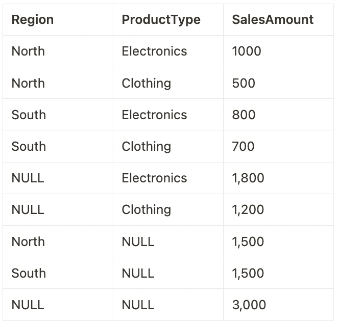

# T_002 (Practice Test 2)

#### Q1) In data analytics, identify a scenario where data enhancement would significantly improve the outcome.

a) During the initial stages of data collection where data volume is more critical than data quality.

b) When performing routine data backup and recovery processes.

c) When migrating data from one storage system to another without changing its format or content.

d) ***In a marketing campaign, to enrich customer data with additional demographic and psychographic information for targeted advertising.***

e) When aggregating large volumes of data for storage efficiency without analysis.

**Overall explanation**

Data enhancement is particularly beneficial in scenarios where adding more detailed, relevant information can lead to better decision-making or more personalized services. In the context of a marketing campaign, enriching customer data with additional demographic and psychographic information allows for more targeted and effective advertising. This enhanced data provides deeper insights into customer preferences and behaviors, enabling marketers to tailor their strategies and communications more precisely to the needs and interests of different customer segments.

```
Domain
Analytics applications
```

<br />

#### Q2) Assuming you have a table TrafficData with columns Timestamp (timestamp) and VehicleCount (integer), and you need to calculate the sum of VehicleCount for every 10-minute window.
*Which SQL query using the window_time function correctly achieves this in a Databricks environment?*


a) 
```
SELECT window_time(Timestamp, '10 minutes'), COUNT(VehicleCount) 
FROM TrafficData 
GROUP BY Timestamp;
```

b) 
```
SELECT window_time(Timestamp, '10 minutes'), AVG(VehicleCount) 
FROM TrafficData 
GROUP BY window_time(Timestamp, '10 minutes');
```

c) ***CORRECT ANSWER***
```
SELECT window_time(Timestamp, '10 minutes'), SUM(VehicleCount) 
FROM TrafficData 
GROUP BY window_time(Timestamp, '10 minutes');;
```

d) 
```
SELECT Timestamp, 
    SUM(VehicleCount) OVER (PARTITION BY window_time(Timestamp, '10 minutes')) 
FROM TrafficData;
```

e) 
```
SELECT Timestamp, 
    SUM(VehicleCount) OVER (ORDER BY Timestamp RANGE BETWEEN INTERVAL 10 MINUTES PRECEDING AND CURRENT ROW)
FROM TrafficData;
```

**Overall explanation**

This question tests the understanding of using the `window_time` function for time-based aggregation in SQL, a common requirement for analyzing time-series data such as traffic counts.

References:
https://learn.microsoft.com/en-us/azure/databricks/sql/language-manual/functions/window_time


```
Domain
SQL in the Lakehouse
```

<br />

#### Q3) The Medallion Architecture in Databricks is a conceptual framework for data organization and pipeline management. How does it structure the data processing pipeline?

a) None of the above

b) It involves a single stage of data processing where raw, refined, and curated data are merged into a unified table known as the Platinum table.

c) It uses a reverse-pyramid structure starting with the most refined data in the base layer, moving to semi-processed data, and ending with raw data at the top.

d) It starts with unstructured data in Gold tables, then structures the data in Silver tables, and finally stores the raw data in Bronze tables.

e) ***It begins with raw data in Bronze tables, moves to refined data in Silver tables, and culminates in curated data in Gold tables.***

**Overall explanation**

The Medallion Architecture in Databricks is an approach to organizing and processing data in a lakehouse environment. This architecture is characterized by its multi-layered structure, each representing a different level of data quality and refinement:

1. **Bronze Layer (Raw Data)**: This is the first layer where raw data from external source systems is collected. The data is stored in a format that closely mirrors the structure of the source system, along with additional metadata such as load date/time and process ID. The primary focus at this stage is on capturing Change Data Capture efficiently and providing a historical archive for data lineage and auditability.
2. **Silver Layer (Cleansed and Conformed Data)**: In this layer, the data from the Bronze layer undergoes matching, merging, conforming, and cleansing. The goal is to create an "Enterprise view" of key business entities, concepts, and transactions. This layer enables self-service analytics for ad-hoc reporting, advanced analytics, and machine learning. The Silver layer typically follows an ELT methodology (Extract, Load, Transform), focusing on speed and agility in data ingestion.
3. **Gold Layer (Curated Business-Level Tables)**: The final layer involves the organization of data into consumption-ready databases. The data in the Gold layer is highly refined, aggregated, and optimized for reading, making it ideal for reporting and analytics. This layer employs more de-normalized and read-optimized data models, often using Kimball-style star schemas or Inmon-style data marts.

References:
https://www.databricks.com/glossary/medallion-architecture
https://learn.microsoft.com/en-us/azure/databricks/lakehouse/medallion


```
Domain
Databricks SQL
```

<br />

#### Q4) How do you set the location of a table in Databricks when creating or altering it?

a) Location setting is not supported in Databricks.

b) By moving the data files to the desired location manually.

c) By using the `SET LOCATION` command in the table creation query

d) ***By using the `CREATE TABLE ... LOCATION` or `ALTER TABLE ... SET LOCATION` command.***

e) By specifying the location in the Databricks UI during table creation.

**Overall explanation**

In Databricks, the location of a table can be set or changed using SQL commands. During table creation, the location is specified using the `CREATE TABLE ... LOCATION` syntax. For existing tables, the location can be altered using the `ALTER TABLE ... SET LOCATION` command. This functionality allows for flexibility in data management and storage optimization within Databricks.

References:
Databricks Documentation.
https://learn.microsoft.com/en-us/azure/databricks/sql/language-manual/sql-ref-syntax-ddl-create-table-using
https://docs.databricks.com/en/sql/language-manual/sql-ref-syntax-ddl-alter-table.html


```
Domain
Data Management
```

<br />

#### Q5) In the context of Databricks, there are distinct types of parameters used in dashboards and visualizations. Based on the descriptions provided, how do Widget Parameters, Dashboard Parameters, and Static Values differ in their application and impact?

a) Widget Parameters apply to the entire dashboard and can change the layout, whereas Dashboard Parameters are fixed and do not allow for interactive changes. Static Values are dynamic and change frequently based on user input.

b) ***Widget Parameters are tied to a single visualization and affect only the query underlying that specific visualization. Dashboard Parameters, on the other hand, can influence multiple visualizations within a dashboard and are configured at the dashboard level. Static Values are used to replace parameters, making them 'disappear' and setting a fixed value in their place.***

c) Static Values are used to create interactive elements in dashboards, while Widget and Dashboard Parameters are used for aesthetic modifications only, without impacting the data or queries.

d) Both Widget Parameters and Dashboard Parameters have the same functionality and impact, allowing for dynamic changes across all visualizations in a dashboard. Static Values provide temporary placeholders for these parameters.

e) Dashboard Parameters are specific to individual visualizations and cannot be shared across multiple visualizations within a dashboard. Widget Parameters are used at the dashboard level to influence all visualizations. Static Values change dynamically in response to user interactions.

**Overall explanation**

- **Widget Parameters** are specific to individual visualizations within a dashboard. They appear within the visualization panel and their values apply only to the query of that particular visualization.
- **Dashboard Parameters** are more versatile and can be applied to multiple visualizations within a dashboard. They are configured for one or more visualizations and are displayed at the top of the dashboard. The values specified for these parameters apply to all visualizations that reuse them. A dashboard can contain multiple such parameters, each affecting different sets of visualizations.
- **Static Values** replace the need for a parameter and are used to hard code a value. When a static value is used, the parameter it replaces no longer appears on the dashboard or widget, effectively making the parameter static and non-interactive.

References:
https://learn.microsoft.com/en-us/azure/databricks/sql/user/queries/query-parameters


```
Domain
Data Visualization and Dashboards
```

<br />

#### Q6) In Databricks SQL, how is a "Query Based Dropdown List" used to enhance the functionality of a dashboard with query parameters?

a) It automatically updates query parameters based on external data sources, without user interaction.

b) The dropdown list is purely aesthetic, with no impact on the actual queries or data displayed.

c) It's used to manually input query parameters, unrelated to the output of any other query.

d) ***It dynamically generates a dropdown list based on the distinct output of a separate query, allowing users to select values as query parameters.***

e) It creates a fixed list of predefined options that users can choose from to filter dashboard data.

**Overall explanation**

A "Query Based Dropdown List" in Databricks SQL is a dynamic tool used to create query parameters. It generates a list of options for the user to choose from, where these options are the distinct results of a different, specified query. This method allows for more interactive and responsive dashboards, as users can filter and explore data based on real-time results from other queries, enhancing the dashboard's interactivity and data exploration capabilities.

References:
https://learn.microsoft.com/en-us/azure/databricks/sql/user/queries/query-parameters#query-based-dropdown-list


```
Domain
Data Visualization and Dashboards
```

<br />

#### Q7) In Databricks SQL, when dealing with the ingestion of data, how does the platform handle directories containing multiple files?

a) ***Databricks SQL can ingest directories of files, provided all files in the directory are of the same type, such as all CSV or all JSON.***

b) Databricks SQL automatically converts and ingests files of different types from a directory into a standard format.

c) Databricks SQL requires manual conversion of all files in a directory to a uniform format before ingestion.

d) Databricks SQL can only ingest a single file at a time, regardless of file type.

e) Databricks SQL can ingest directories containing files of mixed types, such as CSV and JSON, simultaneously.

**Overall explanation**

Databricks SQL has the capability to ingest directories of files, provided all the files in the directory are of the same type. This is facilitated by Databricks' read_files table-valued function, which supports reading various file formats such as JSON, CSV, TEXT, BINARYFILE, PARQUET, AVRO, and ORC. This function can automatically detect the file format and infer a unified schema across all files in the directory. The read_files function can read individual files or all files under a given directory, supporting file discovery through glob patterns to filter directories or files. This makes it an efficient tool for ingesting directories containing multiple files of the same type, simplifying the process of data loading and ingestion in Databricks SQL.

In addition, Databricks SQL also supports flexible data loading patterns, including the use of the Auto Loader for efficient data ingestion from cloud object storage. Auto Loader can ingest image or binary data into Delta Lake and supports glob patterns for filtering directories and files. This adds versatility to the data ingestion process in Databricks SQL, allowing for various patterns of data loading and ensuring efficient processing of data stored in directories.

Databricks SQL, along with Apache Spark and other Databricks tools, provides a comprehensive environment for working with files in various formats and locations. These tools collectively enhance the data processing capabilities of Databricks, allowing users to efficiently manage and analyze large datasets stored in cloud object storage or other data sources.

References:
https://docs.databricks.com/en/sql/language-manual/functions/read_files.html
https://docs.databricks.com/en/files/index.html


```
Domain
Databricks SQL
```

<br />

#### Q8) What is the minimum permission a user needs to configure a refresh schedule on a Databricks SQL Dashboard?

a) Modify Permissions.

b) ***Can Edit.***

c) Owner.

d) No permissions.

e) Can View.

**Overall explanation**

A dashboard’s owner and users with the Can Edit permission can configure a dashboard to automatically refresh on a schedule.

References:
https://docs.databricks.com/en/sql/user/dashboards/index.html#automatically-refresh-a-dashboard


```
Domain
Data Visualization and Dashboarding
```

<br />

#### Q9) A data analyst is tasked with presenting yearly revenue data to stakeholders in a way that is both informative and visually appealing. The analyst decides to use a line graph to show the revenue trends over the year. What is the best approach the analyst should take in terms of formatting the graph?

a) Incorporate various font styles and sizes for each data point to make the graph more dynamic.

b) ***Apply a minimalistic design with a consistent color scheme and clear labeling to enhance focus on the data.***

c) Use a wide range of vibrant colors for different data points to make the graph more colorful.

d) Add multiple background images related to the company's business to make the graph more engaging.

e) Use 3D effects on the graph lines to give a more modern and advanced look.

**Overall explanation**

Adding visual appeal to a data visualization, like a line graph, is not just about making it colorful or visually busy. It's about enhancing the viewer's ability to understand and engage with the data being presented. A minimalistic design approach, with a consistent color scheme and clear labeling, helps in reducing clutter and focusing the viewer's attention on the key trends and insights in the data. This approach ensures that the graph is both aesthetically pleasing and functionally informative, which is crucial for effective data communication, especially in a professional or business context.

References:
- Storytelling with Data: The Basics of Good Design
- Harvard Business Review: Visualizations That Really Work
- Smashing Magazine: Data Visualization Best Practices


```
Domain
Data Visualization and Dashboarding
```

<br />

#### Q10) In the Databricks Unity Catalog, which SQL command correctly creates a new table named `customer_data` in a database sales under the catalog `us_catalog`, based on a `SELECT` query from an existing table `transactions` in the same database and catalog?

a) `TABLE CREATE us_catalog.sales.customer_data AS (SELECT * FROM transactions);`

b) `NEW TABLE us_catalog.sales.customer_data FROM SELECT * IN transactions;`

c) `CREATE TABLE customer_data IN us_catalog.sales AS SELECT * FROM transactions;`

d) ***`CREATE TABLE us_catalog.sales.customer_data AS SELECT * FROM us_catalog.sales.transactions;`***

e) `us_catalog.sales: CREATE TABLE customer_data AS SELECT * FROM transactions;`

**Overall explanation**

In Databricks Unity Catalog, which supports a three-level namespace (catalog.database.table), the correct SQL command to create a new table based on a SELECT query from an existing table involves specifying the catalog, database, and table names. 
The correct syntax is:

> CREATE TABLE catalog_name.database_name.new_table_name AS SELECT * FROM catalog_name.database_name.existing_table_name;

This command is used to create a new table (`customer_data`) in the specified database (`sales`) and catalog (`us_catalog`) that contains all records from the specified existing table (`transactions`).

References:
https://learn.microsoft.com/en-us/azure/databricks/data-governance/unity-catalog/
https://learn.microsoft.com/en-us/azure/databricks/sql/language-manual/


```
Domain
Data Management
```

<br />

#### Q11) In the context of Databricks dashboards, how do query parameters influence the output of underlying SQL queries within a dashboard?

a) They modify the layout of the dashboard, rearranging the visualizations based on user preferences, but do not change the data output of the queries.

b) Query parameters are used to format the visual aspects of the output, such as color and font, without changing the actual data returned by the query.

c) ***Query parameters serve as placeholders in SQL queries, allowing for dynamic data filtering based on user input, thus altering the output of the query according to the specified parameter values.***

d) Query parameters act as static reference points in SQL queries, ensuring that the output remains constant irrespective of user interactions.

e) They automatically update the SQL queries on a set schedule, such as daily or weekly, to change the output data based on temporal parameters.

**Overall explanation**

Query parameters in Databricks dashboards are powerful tools used to create flexible and interactive SQL queries. They act as placeholders within the SQL query structure, where the actual values can be dynamically provided by the user or another source. When a user interacts with the dashboard and changes a query parameter, the SQL query automatically adjusts to include this new value. This allows the query to return different results based on the parameter, enabling a more dynamic and interactive data exploration experience within the dashboard. For instance, if a query parameter is set to filter data by a specific date range or region, changing this parameter will directly alter the data returned by the query, reflecting the specified date range or region.

References:
https://learn.microsoft.com/en-us/azure/databricks/sql/user/queries/query-parameters

```
Domain
Data Visualization and Dashboarding
```

<br />

#### Q12) In a Databricks environment, you're analyzing query performance improvements. After several runs of a complex query on a large dataset, you notice a significant reduction in latency. What feature of Databricks is most likely contributing to this decrease in query execution time?

a) Increased hardware resources allocation.

b) Improved data indexing mechanisms.

c) Use of persistent tables instead of temporary views.

d) Automatic query rewriting for optimization.

e) ***Caching of intermediate data and results from previous query executions.***

**Overall explanation**

When a query is run multiple times, Databricks stores the results and intermediate data in cache. Subsequent executions of the same query or those with similar computations can leverage this cached data, leading to significantly reduced query latency. This efficiency gain is particularly notable in complex queries on large datasets, where accessing cached results avoids the need for repeated data processing and computation.

References:
https://learn.microsoft.com/en-us/azure/databricks/sql/admin/query-caching

```
Domain
SQL in the Lakehouse
```

<br />

#### Q13) In a Spark SQL dataset EmployeeData, you have a column monthlyPerformanceRatings which is an array of integers representing monthly performance ratings of employees.
#### You are tasked with identifying employees whose performance has consistently improved over the last three months.
#### Which Spark SQL query utilizing a higher-order function is best suited for this task?


a) 
```
SELECT employeeId 
FROM EmployeeData 
WHERE ZIP_WITH(monthlyPerformanceRatings, monthlyPerformanceRatings, (current, next) -> next > current);
```

b) 
```
SELECT employeeId 
FROM EmployeeData 
WHERE REDUCE(monthlyPerformanceRatings, 0, (acc, rating) -> acc + rating, acc -> acc) > 3;
```

c) ***All***
```
SELECT employeeId 
FROM EmployeeData 
WHERE ARRAY_SORT(monthlyPerformanceRatings) = monthlyPerformanceRatings;
```

d) 
```
SELECT employeeId 
FROM EmployeeData 
WHERE EXISTS(monthlyPerformanceRatings, rating -> rating > 3);
```

e) 
```
SELECT employeeId 
FROM EmployeeData 
WHERE SLICE(monthlyPerformanceRatings, -3, 3) = ARRAY_SORT(SLICE(monthlyPerformanceRatings, -3, 3));
```

**Overall explanation**

References:
https://learn.microsoft.com/en-us/azure/databricks/sql/language-manual/functions/array_sort
https://learn.microsoft.com/en-us/azure/databricks/sql/language-manual/functions/slice


```
Domain
SQL in the Lakehouse
```

<br />

#### Q14) What is the correct sequence of steps to execute a SQL query in Databricks?

a) Choose a SQL warehouse, construct and edit the query, execute the query, and visualize results.

b) Create a query using Terraform, execute the query in a Databricks job, and use COPY INTO to load data.

c) ***Open SQL Editor, select a SQL warehouse, construct and edit the query, execute the query.***

d) Write the query in an external tool, import it into Databricks, select a data source, and execute the query.

e) Manually input data, write a query in Databricks notebook, execute the query, and export the results.

**Overall explanation**

The correct sequence for executing a SQL query in Databricks starts with opening the SQL Editor. Then, you select a SQL warehouse where the query will be executed. After this, you construct and edit your SQL query directly in the editor, which supports features like autocomplete. Once the query is ready, you execute it and the results are displayed in the results pane. During or after execution, you can manage or terminate the query if necessary. Additionally, Databricks SQL provides options to visualize the results and create dashboards for deeper analysis and sharing insights.

References:
https://docs.databricks.com/en/sql/user/queries/queries.html
https://docs.databricks.com/en/sql/get-started/index.html

```
Domain
Databricks SQL
```

<br />

#### Q15) What is a key benefit of using ANSI SQL as the standard query language in the Lakehouse architecture?

a) It allows for real-time data streaming and complex event processing.

b) It enables automatic data encryption and security.

c) It supports native machine learning algorithms.

d) ***It ensures compatibility and interoperability across different database systems.***

e) It provides enhanced graphical data visualization tools.

**Overall explanation**

The benefit of using ANSI SQL as the standard query language in the Lakehouse architecture, such as Databricks, lies in its compatibility and interoperability across various database systems. ANSI SQL provides a uniform syntax and set of capabilities, ensuring that SQL queries and operations are consistent and portable between different SQL-compliant database systems. This standardization simplifies data management, query development, and integration with other systems, enhancing the efficiency of data operations in a Lakehouse environment.

References:
https://www.databricks.com/blog/2021/11/16/evolution-of-the-sql-language-at-databricks-ansi-standard-by-default-and-easier-migrations-from-data-warehouses.html

```
Domain
SQL in the Lakehouse
```

<br />

#### Q16) In the landscape of Business Intelligence (BI) and data analytics, what role does Databricks SQL play when integrated with other BI tools?

a) Databricks SQL replaces traditional BI tools for data analysis and reporting.

b) ***Databricks SQL acts as a data processing and query engine, complementing BI tools for enhanced data analysis and reporting.***

c) Databricks SQL primarily enhances data visualization capabilities.

d) Databricks SQL and BI tools cannot be used together.

e) Databricks SQL is used only for data storage, with BI tools handling all data processing and analysis.

**Overall explanation**

Databricks SQL is designed to complement existing BI tools by serving as an effective data processing and query engine. This integration enhances the overall capabilities of BI workflows, allowing for sophisticated data analysis and leveraging the strengths of both Databricks SQL and the BI tools.

Databricks SQL integrates effectively with various Business Intelligence (BI) tools, enhancing data warehousing capabilities. This integration facilitates an environment where data analysts can work with SQL queries and their preferred BI tools for ad-hoc queries and dashboard creation on data stored in data lakes. Databricks SQL supports validated integrations with popular BI tools like Power BI and Tableau, allowing users to work with data through Databricks clusters and SQL warehouses. These integrations often provide low-code or no-code experiences, simplifying the process of connecting and using BI tools with Databricks.

References:
https://docs.databricks.com/en/getting-started/connect/index.html

```
Domain
Databricks SQL
```

<br />

#### Q17) In a data analytics environment, how can dashboards be configured to automatically refresh and display the most current data?

a) Automatic dashboard refreshes require a complete system reboot at regular intervals.

b) Dashboards must be manually refreshed by the user to display the latest data.

c) Automatic refreshes are achieved by scripting a periodic page reload in the web browser displaying the dashboard.

d) ***Dashboards can be set up to refresh automatically at specified intervals using built-in scheduling features.***

e) Dashboards automatically refresh only when the underlying data source is replaced with a new one.

**Overall explanation**

In Databricks SQL, dashboards can be configured to automatically refresh at specific intervals. This is done by scheduling the dashboard for regular refreshes. You can set this up by clicking "Schedule" at the top of the dashboard page, then selecting "Add schedule." Here, you can choose the interval for the automatic refresh, such as every hour. Additionally, you can modify the schedule name and specify a SQL warehouse for running the dashboard's queries during the refresh. This feature ensures that the dashboard displays up-to-date information based on the latest data

References:
https://docs.databricks.com/en/sql/user/dashboards/index.html#automatically-refresh-a-dashboard

```
Domain
Databricks SQL
```

<br />

#### Q18) In the context of a Databricks Lakehouse architecture, you are working with silver-level data that has been aggregated from various bronze tables.
#### You notice inconsistencies in customer names due to variations in casing and spacing (e.g., 'John Doe', 'john doe', 'John Doe').
#### What would be an appropriate SQL statement to standardize these customer names in the silver table CustomerData?

a) ALTER TABLE CustomerData MODIFY COLUMN customer_name SET DATA TYPE VARCHAR(255) NOT NULL;

b) CREATE VIEW CleanCustomerData AS SELECT DISTINCT TRIM(LOWER(customer_name)) FROM CustomerData;

c) ***UPDATE CustomerData SET customer_name = TRIM(UPPER(customer_name));***

d) SELECT customer_name FROM CustomerData GROUP BY customer_name;

e) SELECT DISTINCT TRIM(UPPER(customer_name)) FROM CustomerData;

**Overall explanation**

The correct answer is UPDATE CustomerData SET customer_name = TRIM(UPPER(customer_name)); as it directly standardizes customer names in the silver table by removing extra spaces and converting text to uppercase.

Other options do not modify the data. GROUP BY clusters values without standardizing them, ALTER TABLE changes structure but not content, SELECT DISTINCT only displays cleaned names and does not modify the data, and CREATE VIEW creates a separate dataset without fixing the original table.

References:
https://learn.microsoft.com/en-us/azure/databricks/sql/language-manual/sql-ref-syntax-qry-select
https://learn.microsoft.com/en-us/azure/databricks/sql/language-manual/functions/trim
https://learn.microsoft.com/en-us/azure/databricks/sql/language-manual/functions/upper

```
Domain
SQL in the Lakehouse
```

<br />

#### Q19) Given a sales database with a table SalesData containing columns Region, ProductType, and SalesAmount, you are tasked with creating a report that includes the total sales amount for each combination of Region and ProductType, as well as totals for each Region alone and the overall total.
**Which SQL query correctly generates this report?**

**SalesData** table:



a) SELECT Region, ProductType, COUNT(SalesAmount) FROM SalesData GROUP BY CUBE(Region, ProductType);

b) SELECT Region, SUM(SalesAmount) FROM SalesData GROUP BY CUBE(Region);

c) SELECT Region, ProductType, SUM(SalesAmount) FROM SalesData GROUP BY Region, ProductType WITH CUBE;

d) SELECT Region, ProductType, SUM(SalesAmount) FROM SalesData GROUP BY ROLLUP(Region, ProductType);

e) ***SELECT Region, ProductType, SUM(SalesAmount) FROM SalesData GROUP BY CUBE(Region, ProductType);***

**Overall explanation**

This question assesses the understanding of the SQL CUBE function for multi-dimensional aggregation, useful in scenarios requiring subtotals and grand totals across multiple dimensions.
When you apply GROUP BY CUBE(Region, ProductType) to this table, it generates rows for each combination of Region and ProductType, as well as rows for totals of each Region, each ProductType, and a grand total.

References:
https://learn.microsoft.com/en-us/azure/databricks/sql/language-manual/sql-ref-syntax-qry-select-groupby
https://learn.microsoft.com/en-us/azure/databricks/sql/language-manual/functions/cube

```
Domain
SQL in the Lakehouse
```

<br />

#### Q20) In the context of analytics, what is an example of effectively enhancing data in a common application?

a) Keeping data in its original, raw format for archival purposes.

b) Restricting data access to a limited number of users to ensure data security.

c) Performing routine software updates on data analysis tools without modifying data.

d) ***Integrating weather data into a retail sales analysis to understand the impact of weather on sales trends.***

e) Strictly categorizing data based on its source without additional processing.

**Overall explanation**

In analytics, data enhancement often involves integrating additional context to existing datasets to derive more insightful conclusions. An example of this is incorporating weather data into retail sales analysis. By doing so, analysts can examine how different weather conditions affect sales trends, enabling more informed business decisions like inventory planning or promotional strategies. This approach exemplifies how enriching data with relevant external information can lead to a better understanding of business dynamics and customer behavior.

```
Domain
Analytics applications
```

<br />

#### Q21) In data analytics, identify a scenario where data enhancement would significantly improve the outcome.

a) 

b) 

c) ***All***

d) 

e) 

**Overall explanation**


```
Domain
Data Visualization and Dashboarding
```

<br />

#### Q2) In data analytics, identify a scenario where data enhancement would significantly improve the outcome.

a) 

b) 

c) ***All***

d) 

e) 

**Overall explanation**


```
Domain
Data Visualization and Dashboarding
```

<br />

#### Q3) In data analytics, identify a scenario where data enhancement would significantly improve the outcome.

a) 

b) 

c) ***All***

d) 

e) 

**Overall explanation**


```
Domain
Data Visualization and Dashboarding
```

<br />

#### Q4) In data analytics, identify a scenario where data enhancement would significantly improve the outcome.

a) 

b) 

c) ***All***

d) 

e) 

**Overall explanation**


```
Domain
Data Visualization and Dashboarding
```

<br />

#### Q5) In data analytics, identify a scenario where data enhancement would significantly improve the outcome.

a) 

b) 

c) ***All***

d) 

e) 

**Overall explanation**


```
Domain
Data Visualization and Dashboarding
```

<br />

#### Q6) In data analytics, identify a scenario where data enhancement would significantly improve the outcome.

a) 

b) 

c) ***All***

d) 

e) 

**Overall explanation**


```
Domain
Data Visualization and Dashboarding
```

<br />

#### Q7) In data analytics, identify a scenario where data enhancement would significantly improve the outcome.

a) 

b) 

c) ***All***

d) 

e) 

**Overall explanation**


```
Domain
Data Visualization and Dashboarding
```

<br />

#### Q8) In data analytics, identify a scenario where data enhancement would significantly improve the outcome.

a) 

b) 

c) ***All***

d) 

e) 

**Overall explanation**


```
Domain
Data Visualization and Dashboarding
```

<br />

#### Q9) In data analytics, identify a scenario where data enhancement would significantly improve the outcome.

a) 

b) 

c) ***All***

d) 

e) 

**Overall explanation**


```
Domain
Data Visualization and Dashboarding
```

<br />

#### Q10) In data analytics, identify a scenario where data enhancement would significantly improve the outcome.

a) 

b) 

c) ***All***

d) 

e) 

**Overall explanation**


```
Domain
Data Visualization and Dashboarding
```

<br />

#### Q1) In data analytics, identify a scenario where data enhancement would significantly improve the outcome.

a) 

b) 

c) ***All***

d) 

e) 

**Overall explanation**


```
Domain
Data Visualization and Dashboarding
```

<br />

#### Q2) In data analytics, identify a scenario where data enhancement would significantly improve the outcome.

a) 

b) 

c) ***All***

d) 

e) 

**Overall explanation**


```
Domain
Data Visualization and Dashboarding
```

<br />

#### Q3) In data analytics, identify a scenario where data enhancement would significantly improve the outcome.

a) 

b) 

c) ***All***

d) 

e) 

**Overall explanation**


```
Domain
Data Visualization and Dashboarding
```

<br />

#### Q4) In data analytics, identify a scenario where data enhancement would significantly improve the outcome.

a) 

b) 

c) ***All***

d) 

e) 

**Overall explanation**


```
Domain
Data Visualization and Dashboarding
```

<br />

#### Q5) In data analytics, identify a scenario where data enhancement would significantly improve the outcome.

a) 

b) 

c) ***All***

d) 

e) 

**Overall explanation**


```
Domain
Data Visualization and Dashboarding
```

<br />

#### Q6) In data analytics, identify a scenario where data enhancement would significantly improve the outcome.

a) 

b) 

c) ***All***

d) 

e) 

**Overall explanation**


```
Domain
Data Visualization and Dashboarding
```

<br />

#### Q7) In data analytics, identify a scenario where data enhancement would significantly improve the outcome.

a) 

b) 

c) ***All***

d) 

e) 

**Overall explanation**


```
Domain
Data Visualization and Dashboarding
```

<br />

#### Q8) In data analytics, identify a scenario where data enhancement would significantly improve the outcome.

a) 

b) 

c) ***All***

d) 

e) 

**Overall explanation**


```
Domain
Data Visualization and Dashboarding
```

<br />

#### Q9) In data analytics, identify a scenario where data enhancement would significantly improve the outcome.

a) 

b) 

c) ***All***

d) 

e) 

**Overall explanation**


```
Domain
Data Visualization and Dashboarding
```

<br />

#### Q10) In data analytics, identify a scenario where data enhancement would significantly improve the outcome.

a) 

b) 

c) ***All***

d) 

e) 

**Overall explanation**


```
Domain
Data Visualization and Dashboarding
```

<br />

#### Q1) In data analytics, identify a scenario where data enhancement would significantly improve the outcome.

a) 

b) 

c) ***All***

d) 

e) 

**Overall explanation**


```
Domain
Data Visualization and Dashboarding
```

<br />

#### Q2) In data analytics, identify a scenario where data enhancement would significantly improve the outcome.

a) 

b) 

c) ***All***

d) 

e) 

**Overall explanation**


```
Domain
Data Visualization and Dashboarding
```

<br />

#### Q3) In data analytics, identify a scenario where data enhancement would significantly improve the outcome.

a) 

b) 

c) ***All***

d) 

e) 

**Overall explanation**


```
Domain
Data Visualization and Dashboarding
```

<br />

#### Q4) In data analytics, identify a scenario where data enhancement would significantly improve the outcome.

a) 

b) 

c) ***All***

d) 

e) 

**Overall explanation**


```
Domain
Data Visualization and Dashboarding
```

<br />

#### Q5) In data analytics, identify a scenario where data enhancement would significantly improve the outcome.

a) 

b) 

c) ***All***

d) 

e) 

**Overall explanation**


```
Domain
Data Visualization and Dashboarding
```

<br />

#### Q6) In data analytics, identify a scenario where data enhancement would significantly improve the outcome.

a) 

b) 

c) ***All***

d) 

e) 

**Overall explanation**


```
Domain
Data Visualization and Dashboarding
```

<br />

#### Q7) In data analytics, identify a scenario where data enhancement would significantly improve the outcome.

a) 

b) 

c) ***All***

d) 

e) 

**Overall explanation**


```
Domain
Data Visualization and Dashboarding
```

<br />

#### Q8) In data analytics, identify a scenario where data enhancement would significantly improve the outcome.

a) 

b) 

c) ***All***

d) 

e) 

**Overall explanation**


```
Domain
Data Visualization and Dashboarding
```

<br />

#### Q9) In data analytics, identify a scenario where data enhancement would significantly improve the outcome.

a) 

b) 

c) ***All***

d) 

e) 

**Overall explanation**


```
Domain
Data Visualization and Dashboarding
```

<br />

#### Q10) In data analytics, identify a scenario where data enhancement would significantly improve the outcome.

a) 

b) 

c) ***All***

d) 

e) 

**Overall explanation**


```
Domain
Data Visualization and Dashboarding
```

<br />


