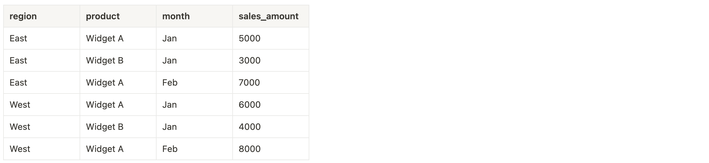
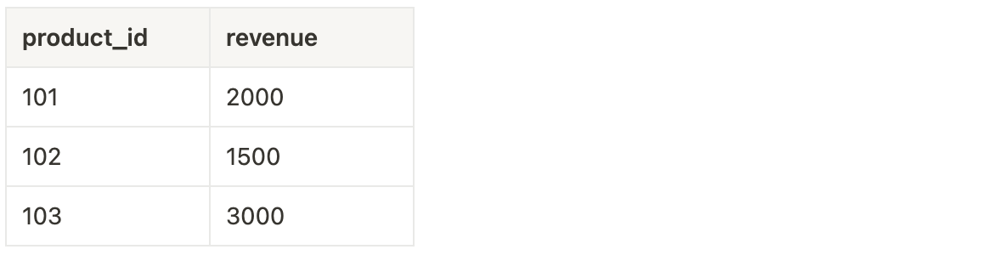
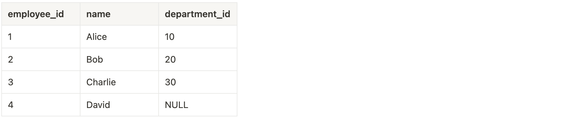
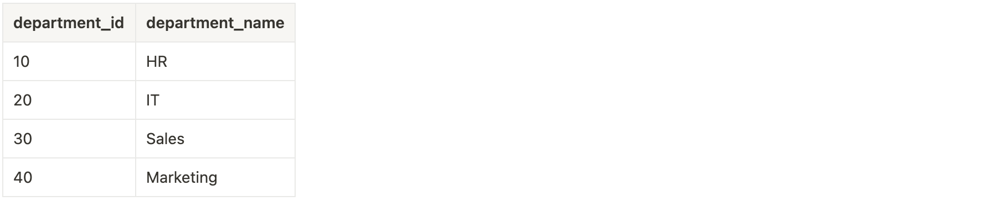
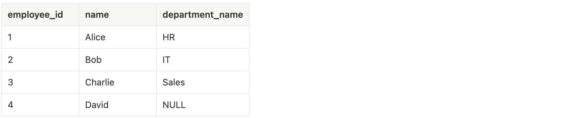
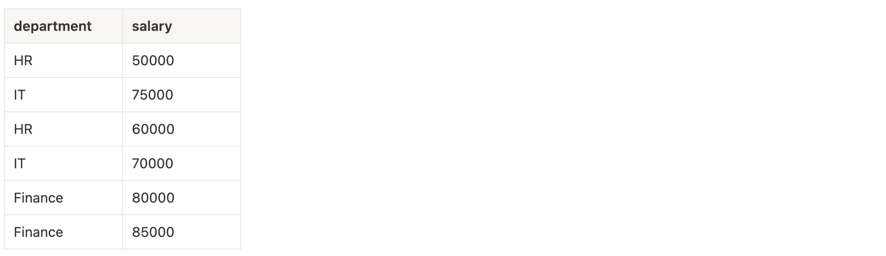
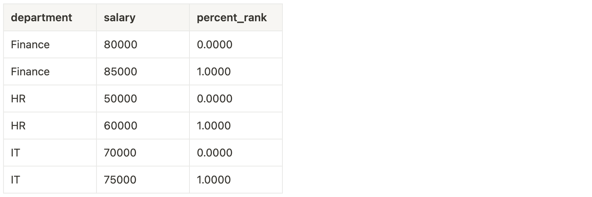
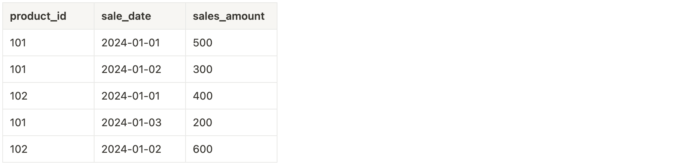

# T_003 (Practice Test 3)

#### Q1) A data analyst is publishing a dashboard in Databricks and is deciding whether to embed their credentials or not. If the analyst chooses to embed their credentials, which of the following is a consequence?

a) Viewers will need to run queries using their own credentials to access the dashboard data and compute resources.

b) Users will need to have direct access to the workspace, underlying data, and SQL warehouse to view the dashboard.

c) ***All viewers of the dashboard can run queries using the analyst's credentials, even if they don't have access to the underlying data or SQL warehouse.***

d) The dashboard will automatically be versioned, and users can revert to previous published versions.

e) The published dashboard will be emailed to subscribers with limited access to the underlying data.

**Overall explanation**

When a dashboard is published with embedded credentials, viewers can run queries using the dashboard owner's credentials. This allows them to view the dashboard even if they don’t have access to the underlying data or compute resources. This is the default setting, but it can expose sensitive data to users who wouldn’t normally have access to it.

References:
https://learn.microsoft.com/en-us/azure/databricks/dashboards/#--publish-a-dashboard

```
Domain
Data Visualization and Dashboarding
```

<br />

#### Q2) Which of the following best describes the capability of a Lakehouse architecture, particularly within Databricks, regarding data processing workloads?

a) It exclusively supports real-time streaming workloads, designed for continuous data ingestion and analysis.

b) ***It allows for the seamless integration of batch and streaming workloads within a unified platform.***

c) It separates batch and streaming workloads, requiring dedicated environments for each type of processing.

d) It requires manual synchronization between batch and streaming processes, with limited automation.

e) It restricts data processing to batch workloads only, optimizing for large-scale batch processing.

**Overall explanation**

B. It allows for the seamless integration of batch and streaming workloads within a unified platform.
The Lakehouse architecture, as implemented in platforms like Databricks, is designed to support the seamless integration of both batch and streaming workloads within a single, unified environment. This capability is one of the key strengths of the Lakehouse approach, allowing organizations to handle diverse data processing needs—whether they involve processing large volumes of historical data in batch mode or ingesting and analyzing real-time data streams. By enabling both types of workloads to coexist and interact within the same platform, the Lakehouse provides a versatile and efficient solution for modern data management and analytics, eliminating the need for separate systems and reducing complexity.

References:
https://community.databricks.com/t5/technical-blog/beginners-guide-to-databricks-batch-processing-and-streaming/ba-p/38701

```
Domain
Databricks SQL
```

<br />

#### Q3) A data analyst is creating a new visualization in Databricks SQL for a dashboard to show total sales by product category. After running the SQL query to retrieve the sales data, the analyst quickly wants to visualize the results without manually selecting a chart type. Which type of visualization will be automatically selected as the default?

a) ***Bar chart***

b) Line chart

c) Pivot table

d) Pie chart

e) Table

**Overall explanation**

In Databricks SQL, the Bar chart is the default visualization type when creating a new visualization. It is commonly used to display categorical data and their respective values, making it a suitable default for many types of summary data, such as sales by product category. The analyst can modify the visualization later, but the initial visualization will default to a bar chart.

References:
https://learn.microsoft.com/en-us/azure/databricks/visualizations/visualization-types

```
Domain
Data Visualization and Dashboarding
```

<br />

#### Q4) What is the primary method for importing data from object storage into Databricks SQL?

a) Using Databricks SQL to create a direct connection to the object storage without any intermediate steps.

b) Writing a custom Python script to handle the import of data from object storage into Databricks SQL.

c) ***Utilizing the COPY INTO command to load data from object storage into a Databricks SQL table.***

d) Manually downloading the data from object storage and uploading it into Databricks SQL.

e) Configuring an external API to automatically sync data from object storage to Databricks SQL.

**Overall explanation**

Utilizing the COPY INTO command to load data from object storage into a Databricks SQL table.
To import data from object storage into Databricks SQL, the most effective method is to use the COPY INTO command. This command allows you to load data directly from external object storage (such as AWS S3, Azure Blob Storage, or Google Cloud Storage) into a Databricks SQL table. It is designed to be straightforward and efficient, enabling users to specify the source file location and target table within Databricks SQL, automating the process of importing data. Other methods, like manual uploads or custom scripts, are less efficient and more error-prone compared to the built-in capabilities provided by Databricks SQL with the COPY INTO command.

References:
https://learn.microsoft.com/en-us/azure/databricks/ingestion/cloud-object-storage/copy-into/

```
Domain
Databricks SQL
```

<br />

#### Q5) An analyst is working in Databricks and frequently runs similar queries on a large dataset while developing a new report. To optimize their workflow and reduce query latency, they want to leverage query history and caching. Which of the following strategies would best achieve this goal?

a) Disable caching to force every query to run from scratch, ensuring data freshness and accuracy in development.

b) Review query history to identify frequently run queries and set up automatic execution to pre-load results into memory.

c) Rely on query history to copy and paste past queries into new notebooks, ensuring consistent query structure without the need for caching.

d) Use query history to export past query results and manually import them into new sessions to avoid rerunning queries.

e) ***Enable result caching to store the results of frequently run queries in memory, reducing the need to re-execute the underlying computations.***

**Overall explanation**

- **Correct Approach**: Enabling result caching in Databricks is an effective way to reduce query latency and development time. When a query is run and the results are cached, subsequent executions of the same or similar queries can retrieve the results directly from memory, avoiding the need to reprocess the data. This significantly speeds up development cycles, especially when working with large datasets or complex queries.
- **Query History Utilization**: While query history is useful for tracking what queries have been run, it doesn’t directly reduce query latency. Query history can be helpful in identifying frequently run queries that might benefit from caching, but it’s the caching itself that reduces latency.
- **Manual Result Management**: Manually exporting and importing past query results, or copying queries from history into new notebooks, can be cumbersome and doesn’t optimize performance as effectively as caching does.
- **Disabling Caching**: Disabling caching can lead to longer execution times, as each query would have to recompute results from the raw data. While this ensures data freshness, it’s counterproductive when the goal is to reduce latency and speed up development.

Using query history to identify frequently run queries and combining this with caching is the most effective strategy for reducing both development time and query latency in a Databricks environment.

References:
https://learn.microsoft.com/en-us/azure/databricks/optimizations/disk-cache

```
Domain
SQL
```

<br />

#### Q6) A data analyst has created a dashboard in Databricks and needs to share it with stakeholders who do not have access to the workspace or the underlying compute resources. The analyst is considering whether to embed their credentials when sharing the dashboard. What is a key consideration when deciding whether or not to embed credentials?

a) Not embedding credentials will allow users without workspace access to still view the dashboard, as it relies on the analyst's data access.

b) ***Embedding credentials allows all viewers to use the same shared cache for maximum efficiency and access the dashboard, even if they don’t have access to the workspace.***

c) Not embedding credentials ensures the dashboard is always accessible, regardless of compute resource availability.

d) Embedding credentials disables real-time updates to the dashboard.

e) Embedding credentials forces viewers to have individual compute resources for dashboard refreshes.

**Overall explanation**

When embedding credentials, viewers can access the dashboard and use the analyst’s data and compute permissions, even if they don’t have access to the underlying workspace or compute resources. This also allows for shared caching, improving efficiency.
However, if credentials are not embedded, each viewer must have their own access to the workspace and the required compute resources, which limits who can view the dashboard. This ensures data security but might restrict access for stakeholders without the necessary permissions.

References:
https://learn.microsoft.com/en-us/azure/databricks/dashboards/share#data-and-compute-for-shared-dashboards

```
Domain
Data Visualization and Dashboards
```

<br />

#### Q7) An analyst is working with the following `sales_data` table, which records sales amounts by `region`, `product`, and `month`:

**sales_data** Table: Before Aggregation



#### The analyst wants to generate a summary table that includes subtotals for all possible combinations of `region`,`product`, and `month`, as well as a grand total for all sales. Which of the following queries will produce the desired results?

a) 
> SELECT region, product, month, SUM(sales_amount) AS sales_amount
    FROM sales_data
    GROUP BY region, product, month;

b) 
> SELECT region, product, month, SUM(sales_amount) AS sales_amount
    FROM sales_data
    GROUP BY region, product;

c) 
> SELECT region, product, month, SUM(sales_amount) AS sales_amount
    FROM sales_data
    GROUP BY ROLLUP(region, product, month);

d) 
> SELECT region, product, month, SUM(sales_amount) AS sales_amount
    FROM sales_data
    GROUP BY GROUPING SETS ((region, product, month), (region, product), (region), ());

e) ***CORRECT ANSWER***
> SELECT region, product, month, SUM(sales_amount) AS sales_amount
    FROM sales_data
    GROUP BY CUBE(region, product, month);

**Overall explanation**

The CUBE function is used to generate all possible combinations of the specified columns, including subtotals and a grand total. In this case, CUBE(region, product, month) aggregates the data at various levels: by region, by product, by month, by combinations of these, and finally, it includes the grand total. This produces the detailed summary table as described.

References:
https://learn.microsoft.com/en-us/azure/databricks/sql/language-manual/functions/cube

```
Domain
SQL
```

<br />

#### Q8) An analyst needs to apply a custom scaling transformation to the revenue column in a SQL-based Spark environment. The scaling factor is 2.5. The analyst decides to create a User Defined Function (UDF) to accomplish this task.

Given the following table **sales_data**:



#### Which of the following SQL-based steps correctly demonstrates how to create and apply a UDF to scale the revenue column by 2.5?

a) 
- Step 1: Define UDF
> CREATE FUNCTION scale_revenue(revenue FLOAT) RETURNS FLOAT
    RETURN revenue * 2.5;

- Step 2: Apply the UDF
> SELECT product_id, scale_revenue(revenue) AS scaled_revenue
    FROM sales_data;

b) ***CORRECT ANSWER***
- Step 1: Define UDF
> CREATE FUNCTION scale_revenue(revenue DOUBLE) RETURNS DOUBLE
    RETURN revenue * 2.5;

- Step 2: Apply the UDF
> SELECT product_id, scale_revenue(revenue) AS scaled_revenue
    FROM sales_data;

c) 
- Step 1: Define UDF
> CREATE FUNCTION scale_revenue(revenue FLOAT) RETURNS INT
    RETURN revenue * 2.5;

- Step 2: Apply the UDF
> SELECT product_id, scale_revenue(revenue) AS scaled_revenue
    FROM sales_data;

d) 
- Step 1: Define UDF
> CREATE FUNCTION scale_revenue() RETURNS DOUBLE
    RETURN revenue * 2.5;

- Step 2: Apply the UDF
> SELECT product_id, revenue * scale_revenue() AS scaled_revenue
    FROM sales_data;

e) 
- Step 1: Define UDF
> CREATE FUNCTION scale_revenue(revenue DOUBLE) RETURNS DOUBLE
    RETURN revenue * 2.5;

- Step 2: Apply the UDF
> SELECT product_id, scale_revenue(revenue) AS scaled_revenue
    FROM sales_data
    WHERE revenue > 1000;

**Overall explanation**

**Correct Approach**:
The correct option defines a UDF with the appropriate data type (usually DOUBLE or FLOAT for handling numerical precision) and includes the scaling logic directly within the UDF. The UDF is then applied correctly in a SELECT statement to transform the desired column. This approach ensures that the scaling operation is encapsulated within the function and can be easily applied to the column across the entire dataset.

**Incorrect Answer Explanations**:
- Incorrect Data Type: Some options may define the UDF with an incorrect data type (e.g., INT). Using an integer type when scaling by a decimal factor (like 2.5) can lead to loss of precision, as integer multiplication might truncate decimal values.
- Unnecessary Conditions: Certain options might include additional conditions (e.g., WHERE clauses) in the query that are not required for the task. While these conditions might still allow the query to work, they are irrelevant to the primary goal of applying the scaling transformation across all data.
- Alternative Logic Placement: Other options may place the scaling factor in the SELECT statement rather than within the UDF itself. While this can technically achieve the same result, it is less efficient and defeats the purpose of using a UDF to encapsulate and reuse logic.
- Inappropriate Function Structure: Some incorrect options might define a UDF that doesn’t directly apply the scaling factor to the column within the function, instead using the UDF to return a constant value or perform an unrelated operation. This approach does not properly leverage the power of UDFs and can lead to confusion or errors.

References:
https://learn.microsoft.com/en-us/azure/databricks/udf/

```
Domain
SQL
```

<br />

#### Q9) Which of the following best describes the benefits of using Delta Lake within a Lakehouse architecture?

a) Delta Lake simplifies the integration of multiple data sources by providing built-in connectors for various databases and APIs.

b) Delta Lake facilitates real-time data analysis by automatically converting batch data into streaming data pipelines.

c) Delta Lake enables the creation of highly interactive data visualizations and dashboards directly on top of raw data in the Lakehouse.

d) ***Delta Lake enhances the Lakehouse architecture by providing ACID transactions, scalable metadata handling, and unified batch and streaming data processing, thereby ensuring data consistency and reliability.***

e) Delta Lake reduces storage costs in a Lakehouse by compressing data files and eliminating the need for data redundancy.

**Overall explanation**

Delta Lake plays a crucial role within the Lakehouse architecture by bringing together the benefits of a data warehouse and a data lake. It ensures:
- ACID Transactions: This feature guarantees data reliability and consistency even in complex multi-step operations.
- Scalable Metadata Handling: Delta Lake can efficiently manage large datasets and complex metadata without compromising performance.
- Unified Batch and Streaming Processing: Delta Lake allows seamless integration of both batch and streaming data, enabling real-time analytics alongside historical data processing.

These benefits make Delta Lake an essential component of the Lakehouse architecture, bridging the gap between data lakes' flexibility and data warehouses' robustness.

References:
https://learn.microsoft.com/en-us/azure/databricks/delta/

```
Domain
Data Management
```

<br />

#### Q10) What is a key benefit of having ANSI SQL as the standard query language in a Lakehouse architecture?

a) It provides a more secure environment by limiting access to certain SQL functions.

b) It reduces the ability to perform real-time analytics in the Lakehouse.

c) It forces the use of proprietary SQL extensions, making the system more vendor-dependent.

d) It restricts the use of complex queries, ensuring that only basic operations can be performed.

e) ***It ensures compatibility with legacy databases and allows analysts to use familiar SQL syntax across different platforms.***

**Overall explanation**

Having ANSI SQL as the standard in a Lakehouse architecture ensures that queries are compatible with a wide range of platforms and databases. This standardization allows data professionals to use familiar SQL syntax, reducing the learning curve and enabling seamless integration and migration of data across different systems. It enhances productivity by allowing consistent querying practices, making it easier for teams to collaborate and leverage existing SQL knowledge without worrying about proprietary or non-standard SQL variations.

```
Domain
SQL
```

<br />

#### Q11) Which of the following best describes the purpose of the gold layer in the Databricks Lakehouse architecture?

a) It is the layer where data is prepared and transformed, typically used for staging before further processing.

b) It is used exclusively for storing metadata related to datasets and table structures.

c) ***It is optimized for quick, scalable querying and analytics, where data is cleaned, aggregated, and ready for reporting.***

d) It is used for storing raw, unprocessed data as it is ingested from various sources.

e) It serves as a backup storage layer for historical data, ensuring data integrity and availability.

**Overall explanation**

It is optimized for quick, scalable querying and analytics, where data is cleaned, aggregated, and ready for reporting.
In the Databricks Lakehouse architecture, the gold layer represents the final, refined data layer that is most commonly used by data analysts for querying and generating insights. This layer contains data that has been cleaned, enriched, and aggregated, making it ideal for reporting, dashboards, and advanced analytics. The gold layer is optimized for performance, ensuring that queries can be run quickly and efficiently. Unlike the bronze layer, which stores raw data, or the silver layer, which is used for data preparation and transformation, the gold layer provides analysts with ready-to-use data for their analysis tasks.

References:
https://learn.microsoft.com/en-us/azure/databricks/sql/

```
Domain
Databricks SQL
```

<br />

#### Q12) Which of the following is required to set up a partner for use with Partner Connect in Databricks?

a) A direct API connection to the partner's platform.

b) An active Databricks workspace with admin-level permissions.

c) A pre-configured cluster specifically set up for partner integration.

d) ***The partner application must be available in the Databricks Partner Connect interface.***

e) A configured SQL warehouse with the CAN CREATE permission.

**Overall explanation**

The partner application must be available in the Databricks Partner Connect interface, as it is the most critical requirement for initiating an integration through Partner Connect.

References:
https://learn.microsoft.com/en-us/azure/databricks/partner-connect/

```
Domain
Databricks SQL
```

<br />

#### Q13) A data analyst creates two objects: a view and a temporary view. They use the following commands:

> CREATE VIEW vw_east_sales AS SELECT * FROM sales_data WHERE region = 'East';
    CREATE TEMP VIEW vw_west_sales AS SELECT * FROM sales_data WHERE region = 'West';

The analyst logs out and logs back in. They then attempt to run queries against both `vw_east_sales` and `vw_west_sales`:
> SELECT * FROM vw_east_sales;
    SELECT * FROM vw_west_sales;

#### What will happen when these queries are executed?

a) ***The query on vw_east_sales will run successfully, but the query on vw_west_sales will fail because the temporary view no longer exists.***

b) The query on vw_west_sales will run successfully, but the query on vw_east_sales will fail because the view has expired.

c) The queries will return the same results since both views are stored in memory.

d) Both queries will run successfully, returning the expected results.

e) Both queries will fail because views are not persistent across sessions.

**Overall explanation**

In SQL environments like Databricks, a permanent view is stored in the database and persists across sessions, meaning it will still exist after the user logs out and logs back in. However, a temporary view (created using CREATE TEMP VIEW) is session-specific and is not persisted. When the user logs out, the temporary view is dropped, and thus the second query will fail because vw_west_sales no longer exists. The first query on vw_east_sales will execute successfully as the view is still available.

References:
https://learn.microsoft.com/en-us/azure/databricks/sql/language-manual/sql-ref-syntax-ddl-create-view

```
Domain
Data Management
```

<br />

#### Q14) A data analyst is attempting to drop a table named `sales_data`. The analyst wants to delete both the table’s metadata and its data files. They execute the following command:

> DROP TABLE IF EXISTS sales_data;

#### After running this command, the table no longer appears in the result of the SHOW TABLES command, but the data files still exist in the storage location.
#### Which of the following explains why the data files still exist while the metadata was deleted?

a) The table's data exceeded the storage limit

b) The table was replicated across multiple storage locations

c) The table had no defined schema

d) ***The table was unmanaged (external)***

e) The table was managed

**Overall explanation**

In Delta Lake, tables can be either managed or unmanaged. For a managed table, both the metadata and data files are deleted when the table is dropped. However, for an unmanaged (external) table, only the metadata is removed, and the data files remain in their original location. This distinction is why the data files for sales_data still exist after the table was dropped.

References:
https://learn.microsoft.com/en-us/azure/databricks/tables/

```
Domain
Data Management
```

<br />

#### Q15) Consider the following two tables, employees and departments:

**employees** Table:


**departments** Table:


An analyst performed a SQL JOIN operation to create the following result table:
**Result** Table:


#### Which type of JOIN was used to create this result table?

a) INNER

b) ***LEFT***

c) FULL OUTER

d) RIGHT

e) CROSS

**Overall explanation**

The correct answer is a LEFT JOIN. In a LEFT JOIN, all rows from the left table (employees) are included in the result, along with matching rows from the right table (departments). If there is no match, NULL values are returned for columns from the right table. This explains why David appears in the result with NULL for department_name.

```
Domain
SQL
```

<br />

#### Q16) When handling Personally Identifiable Information (PII) data within an organization, which of the following considerations is most crucial to ensure compliance and data protection?

a) PII data should be stored in a separate database with a lower backup frequency to reduce storage costs.

b) PII data should be anonymized only when shared outside the organization, but not when used internally.

c) PII data should be freely shared across departments to ensure that all business units have access to the same information for decision-making.

d) PII data should only be stored on local servers to prevent exposure in cloud environments.

e) ***Access to PII data should be restricted based on user roles, with regular audits to ensure compliance with data protection regulations.***

**Overall explanation**

Handling PII data requires careful consideration to protect individuals' privacy and comply with data protection regulations such as GDPR, CCPA, or HIPAA. Key organizational considerations include:

- Access Control: Limiting access to PII based on roles ensures that only authorized personnel can view or manipulate sensitive data.
- Regular Audits: Conducting regular audits helps monitor and enforce compliance with data protection regulations.
- Data Anonymization: In many cases, it's crucial to anonymize or pseudonymize PII data to reduce risk, especially when sharing data outside the organization.

These practices help organizations mitigate the risks associated with handling sensitive data and ensure compliance with legal and regulatory requirements.

```
Domain
Data Management
```

<br />

#### Q17) A data analyst is analyzing a dataset and wants to summarize the central tendency and spread of the data. They decide to calculate the mean, median, standard deviation, and range. Which of the following statements best compares and contrasts these key statistical measures?

a) The mean is always the best measure of central tendency, regardless of outliers, while the median is used only when all data points are identical.

b) The range and standard deviation both measure the central tendency, and the mean and median measure how spread out the data is.

c) ***The standard deviation measures the spread of the data, while the mean and median measure the central tendency, and the range provides the difference between the highest and lowest values.***

d) The mean is used to calculate the average distance between data points, while the range measures the spread of the data based on quartiles.

e) The median and mean both measure the spread of the data, while the standard deviation gives the average value in the dataset.

**Overall explanation**

- Mean and Median: Both measure central tendency, but the mean can be influenced by outliers, whereas the median is resistant to them. The median gives the middle value when the data is ordered.
- Standard Deviation: This measures the spread of the data around the mean, indicating how much the values deviate from the average.
- Range: The range represents the difference between the highest and lowest values in the dataset, giving a sense of the overall spread of the data but without detailing how the data is distributed in between.

These statistical measures provide different insights into the data's distribution, central point, and variability.

```
Domain
Analytics Applications
```

<br />

#### Q18) A data analyst is setting up a new Databricks SQL environment and wants to minimize the startup time for executing SQL queries. Which of the following options should the analyst choose to ensure quick and efficient query execution with minimal startup delays?

a) Create a high-concurrency cluster

b) Set up a single-node cluster with autoscaling

c) ***Use a Serverless Databricks SQL warehouse***

d) Deploy a standard Databricks SQL endpoint

e) Configure a Databricks job cluster

**Overall explanation**

Serverless Databricks SQL warehouses are designed to start quickly, allowing users to execute SQL queries with minimal delay, making them an ideal option for quick-starting query execution environments.

References:
https://learn.microsoft.com/en-us/azure/databricks/admin/sql/warehouse-types

```
Domain
Databricks SQL
```

<br />

#### Q19) A data analyst is working with a customer transaction dataset that includes basic information such as customer ID, purchase amount, and transaction date. The marketing team wants to run more targeted campaigns based on customer demographics and purchasing behavior patterns. In which of the following scenarios would data enhancement be most beneficial?

a) To convert the purchase amount into a different currency for international reports.

b) To split the transaction date into separate columns for day, month, and year.

c) ***To add additional columns with customer age, income level, and location to create more personalized marketing campaigns.***

d) To remove duplicate customer IDs from the dataset to improve data quality.

e) To reduce the size of the dataset by aggregating transaction data on a monthly basis.

**Overall explanation**

Data enhancement refers to the process of enriching a dataset by adding external or supplementary information that provides more context or detail. In this case, adding customer demographic information such as age, income level, and location would allow the marketing team to create more targeted campaigns, which is a prime example of how data enhancement can provide valuable insights.
Other options like removing duplicates or splitting columns improve data quality and structure but don't involve adding new, enriching information. Converting currency is helpful for reporting but does not enhance the data in the same way that adding demographic or behavioral information does.

```
Domain
Analytics Applications
```

<br />

#### Q20) In Databricks, the persistence and scope of a table depend on how it is created and managed. Which of the following statements accurately describe the persistence and scope of different types of tables?

a) Managed tables are stored temporarily in memory and are deleted when the session ends, while unmanaged tables store data permanently in DBFS.

b) Unmanaged tables are automatically deleted when the session ends, while managed tables and temporary tables persist across sessions.

c) ***Temporary tables are session-scoped and are automatically deleted when the session ends, while managed and unmanaged tables persist across sessions.***

d) Managed tables persist only within the session and store both data and metadata in the DBFS, while unmanaged tables store both data and metadata permanently in DBFS.

e) Temporary tables store data in the cloud permanently but restrict access to the current session.

**Overall explanation**

In Databricks:
- **Managed Tables**: These tables are fully managed by Databricks, meaning that both their data and metadata are stored in the Databricks File System (DBFS). They persist across sessions and are not automatically deleted unless explicitly dropped.
- **Unmanaged (External) Tables**: These tables store their metadata in DBFS but store their data externally (e.g., in cloud storage like AWS S3 or Azure Blob Storage). They also persist across sessions.
- **Temporary Tables (or Temp Views)**: These are session-scoped, meaning they only exist for the duration of the session in which they were created. They are automatically dropped when the session ends.
This understanding is crucial when working with data in Databricks, as it affects how data is managed and accessed across different user sessions.

References:
https://learn.microsoft.com/en-us/azure/databricks/tables/
https://learn.microsoft.com/en-us/azure/databricks/views/

```
Domain
Data Management
```

<br />

#### Q21) A data analyst has created a dashboard in Databricks to showcase key business metrics, but the stakeholders find it difficult to navigate because the dashboard lacks structure and visual clarity. To improve the visual appeal and make the dashboard more user-friendly, the analyst wants to add titles, headings, and explanatory text in a well-formatted manner. What is the best approach to enhance the dashboard’s formatting?

a) Modify the SQL queries to include formatted text outputs for better presentation.

b) Embed the explanations and instructions within the axis labels of the charts.

c) Change the font size of the visualization labels to increase readability.

d) Use only color schemes in visualizations to differentiate sections of the dashboard.

e) ***Add markdown text to create well-structured headings, titles, and explanatory notes for the dashboard.***

**Overall explanation**

To add visual appeal and structure to a Databricks dashboard, markdown text is a powerful tool. It allows the analyst to add headings, titles, and notes with proper formatting, making the dashboard easier to read and navigate. By using markdown, the analyst can introduce sections, highlight important points, and improve the overall user experience without cluttering the visualizations themselves.

```
Domain
Data Visualization and Dashboarding
```

<br />

#### Q22) A data analyst has set up a Databricks dashboard to auto-refresh periodically throughout the day. However, they have noticed that the associated SQL Warehouse is running constantly, leading to unexpectedly high costs, even during periods of inactivity when the dashboard is not being actively viewed. What should the analyst check to reduce these costs?

a) Disable the auto-refresh feature for the dashboard to prevent the SQL Warehouse from running constantly.

b) Increase the compute capacity of the SQL Warehouse to handle periods of inactivity more efficiently.

c) Reduce the dashboard refresh interval to lower the frequency of query execution.

d) ***Check the SQL Warehouse auto stop setting to ensure it shuts down after periods of inactivity when the dashboard is not being actively refreshed.***

e) Manually stop the SQL Warehouse after each dashboard refresh.

**Overall explanation**

The SQL Warehouse auto stop setting allows the SQL Warehouse to automatically shut down after a period of inactivity, helping to manage costs. In this case, the SQL Warehouse may be running continuously due to periodic dashboard refreshes, even when the dashboard is not actively being used. By configuring the auto stop feature, the analyst can ensure that the SQL Warehouse shuts down during idle periods, reducing unnecessary costs while still allowing the dashboard to refresh when needed.
Other options like reducing the refresh interval or disabling auto-refresh might limit functionality but won't address the core issue of controlling warehouse uptime and associated costs.

References:
https://learn.microsoft.com/en-us/azure/databricks/compute/sql-warehouse/create#--configure-sql-warehouse-settings

```
Domain
Data Visualization and Dashboarding
```

<br />

#### Q23) An analyst is tasked with loading and updating data in a Delta Lake table called customer_data. They are considering using MERGE INTO, INSERT INTO, or COPY INTO based on different requirements.
#### Given the scenarios below, which option correctly matches the statement with its most appropriate use case?
#### Which of the queries below could have been used to generate the output?

**Scenarios**:

- **Scenario 1**: The analyst needs to update existing records and insert new records into `customer_data` from a staging table, ensuring that duplicates are handled based on a matching condition.
- **Scenario 2**: The analyst has a set of new data files that need to be bulk-loaded into `customer_data`, appending the data without modifying any existing records.
- **Scenario 3**: The analyst needs to append new records from another table into `customer_data`, with the source table already matching the structure of the target table.

a) 
> `COPY INTO` for Scenario 1, `INSERT INTO` for Scenario 2, `MERGE INTO` for Scenario 3

b) ***CORRECT ANSWER***
> `MERGE INTO` for Scenario 1, `COPY INTO` for Scenario 2, `INSERT INTO` for Scenario 3

c) 
> `MERGE INTO` for Scenario 1, `INSERT INTO` for Scenario 2, `COPY INTO` for Scenario 3

d) 
> `INSERT INTO` for Scenario 1, `COPY INTO` for Scenario 2, `MERGE INTO` for Scenario 3

e) 
> `INSERT INTO` for Scenario 1, `MERGE INTO` for Scenario 2, `COPY INTO` for Scenario 3

**Overall explanation**

- **Scenario 1**: The `MERGE INTO` statement is used when you need to perform upserts (updates + inserts) based on a condition. It allows you to match records between a source and target table and then decide whether to insert, update, or delete records in the target table based on that match.
- **Scenario 2**: The `COPY INTO` statement is ideal for bulk-loading data from external files into a table. It efficiently copies files from cloud storage directly into a Delta Lake table, appending the data.
- **Scenario 3**: The `INSERT INTO` statement is used to append new records to an existing table from another table or a query result. It assumes the structure of the source and target tables are compatible.

Each of these SQL operations serves distinct purposes:
- `MERGE INTO`: Best for complex operations involving conditional logic to decide when to insert, update, or delete rows.
- `INSERT INTO`: Simple and straightforward for appending rows to an existing table.
- `COPY INTO`: Optimized for loading data from files into tables, particularly in cloud environments like Databricks.

References:
https://learn.microsoft.com/en-us/azure/databricks/sql/language-manual/delta-merge-into
https://learn.microsoft.com/en-us/azure/databricks/sql/language-manual/sql-ref-syntax-dml-insert-into
https://learn.microsoft.com/en-us/azure/databricks/sql/language-manual/delta-copy-into

```
Domain
SQL
```

<br />

#### Q24) An administrator needs to change access rights to a table within Databricks using the Catalog Explorer interface. Which of the following steps should they follow to modify the permissions for a specific user or group?

a) ***Open the Catalog Explorer, locate the table, click on the "Permissions" tab, and adjust the access rights by adding or modifying roles for specific users or groups.***

b) Access the table's storage location in DBFS and manually update the access control list (ACL) for the data files.

c) Navigate to the Catalog tab, select the table, and directly edit the table's metadata to change access rights.

d) Create a new version of the table with different access rights and replace the existing table with this new version.

e) Use a SQL command in a notebook to alter the permissions, as Catalog Explorer does not support changing access rights.

**Overall explanation**

To change access rights to a table in Databricks using the Catalog Explorer, you should:

1. Open the Catalog Explorer from the Databricks workspace.
2. Navigate to the specific table you want to modify.
3. Click on the "Permissions" tab associated with the table.
4. From there, you can add, modify, or remove permissions for specific users or groups by adjusting their roles (e.g., Viewer, Editor, Owner).

This process allows administrators to manage table-level access control directly within the Databricks user interface without needing to use SQL commands or manually update file system permissions.

References:
https://learn.microsoft.com/en-us/azure/databricks/catalog-explorer/

```
Domain
Data Management
```

<br />

#### Q25) A data analyst wants to visualize the results of several SQL queries simultaneously in Databricks SQL. Which feature should the analyst use to achieve this?

a) SQL Editor

b) ***Dashboards***

c) Data Explorer

d) Alerts

e) Query History

**Overall explanation**

Databricks SQL Dashboards allow the analyst to display the results of multiple SQL queries in a single, cohesive view. This feature enables the creation of interactive and shareable dashboards that can combine various visualizations and query results, providing a comprehensive analysis in one place.

References:
https://learn.microsoft.com/en-us/azure/databricks/dashboards/

```
Domain
Databricks SQL
```

<br />

#### Q26) A data analyst is working within Databricks SQL and is exploring the Schema Browser from the Query Editor page. The analyst wants to understand what kind of information is displayed in the Schema Browser.
#### Which of the following types of information can the analyst view in the Schema Browser on the Query Editor page?
(Please select 2 answers)

a) Active dashboard visualizations

b) Details of SQL alerts

c) ***List of available catalogs***

d) ***Available schemas and their tables***

e) Information about running queries

**Overall explanation**

The Schema Browser in the Query Editor page of Databricks SQL provides a structured view of the data available in your environment. Specifically, the analyst can view a list of available catalogs (which are collections of schemas) and the schemas within those catalogs, along with the tables and columns contained in those schemas. This feature helps the analyst navigate and explore the database objects available for querying, but it does not show details of SQL alerts, active dashboard visualizations, or information about running queries.

References:
https://learn.microsoft.com/en-us/azure/databricks/sql/user/sql-editor/#--browse-data-objects-in-sql-editor

```
Domain
Databricks SQL
```

<br />

#### Q27) An analyst needs to retrieve data from a customers table in a database where the age is greater than 30 and the region is 'West'. The analyst wants to ensure that only customers who meet both conditions are included in the result.
#### Which of the following SQL queries will correctly retrieve the desired data?

a) 
> SELECT *
    FROM customers
    WHERE age > 30 OR region LIKE 'West';

b) 
> SELECT *
    FROM customers
    WHERE age > 30 OR region = 'West';

c) 
> SELECT *
    FROM customers
    WHERE age >= 30 AND region = 'West';

d) 
> SELECT *
    FROM customers
    WHERE age > 30 AND region LIKE 'West%';

e) ***CORRECT ANSWER***
> SELECT *
    FROM customers
    WHERE age > 30 AND region = 'West';

**Overall explanation**

The correct query uses the `AND` operator to ensure that both conditions (`age > 30` and `region = 'West'`) are met. This retrieves only those records where the `age` is greater than 30 and the `region` is exactly 'West'. Using `OR` or incorrect operators like `>=` would either broaden the results or include unwanted records.

```
Domain
SQL
```

<br />

#### Q28) When connecting Databricks to Fivetran using Partner Connect for data managed by Unity Catalog, several permissions and privileges are required to ensure proper integration and data ingestion. Which of the following is not one of those required permissions?

a) USE CATALOG privilege on the catalog managed by Unity Catalog.

b) CREATE SCHEMA privilege on the catalog managed by Unity Catalog.

c) ***CREATE EXTERNAL TABLE privilege on the external location.***

d) CAN USE permission for a SQL warehouse.

e) CAN USE permission for token usage.

**Overall explanation**

The CREATE EXTERNAL TABLE privilege on the external location is only required if you are specifying a destination location for external tables. It is optional and not universally required for connecting Databricks to Fivetran using Partner Connect when dealing with data managed by Unity Catalog.

References:
https://learn.microsoft.com/en-us/azure/databricks/partners/ingestion/fivetran#--before-you-connect-using-partner-connect

```
Domain
Databricks SQL
```

<br />

#### Q29) A data analytics team is utilizing gold-level tables from a Delta Live Tables pipeline built on the medallion architecture. Before completing their analysis, the team needs to perform final transformations and data processing on the gold tables. What is the term used to describe this type of work?

a) Data testing

b) ***Last-mile ETL***

c) Data enchancement

d) Data blending

e) Last-mile dashboarding

**Overall explanation**

The term "Last-mile ETL" refers to the final stage of processing that occurs just before analysis, after the core ETL (Extract, Transform, Load) processes are completed. It involves performing additional transformations and cleaning that are specific to the analysis at hand, ensuring the data is fully prepared for final use.

References:
https://learn.microsoft.com/en-us/azure/databricks/sql/language-manual/

```
Domain
Analytics Applications
```

<br />

#### Q30) A data engineering team has built a Structured Streaming pipeline that processes data in micro-batches and updates gold-level tables every minute. A data analyst has created a dashboard based on this gold-level data. Stakeholders want the dashboard to reflect new data within one minute of it being available in the gold-level tables. Which caution should the data analyst raise before proceeding with this request?

a) The dashboard cannot be refreshed that quickly

b) The gold-level tables are not appropriately clean for business reporting

c) ***The required compute resources could be costly***

d) The streaming cluster is not fault tolerant

e) The streaming data is not an appropriate data source for a dashboard

**Overall explanation**

Refreshing a dashboard frequently (every minute in this case) can demand significant compute resources, especially when dealing with real-time streaming data. Each refresh triggers queries against the gold-level tables, and when this occurs frequently, the computational cost can increase considerably. The data analyst should caution stakeholders about the potential expense of constantly querying the latest data to meet the desired refresh rate.

References:
https://learn.microsoft.com/en-us/azure/databricks/dashboards/schedule-subscribe

```
Domain
Data Visualization and Dashboarding
```

<br />

#### Q31) Delta Lake stores table data as a series of data files, but it also stores additional information that is crucial for data management. Which of the following types of information is stored alongside data files when using Delta Lake?

a) Schema history, performance statistics, and user activity logs

b) None of the above

c) Visualization summaries, query execution plans, and performance statistics

d) Data backup files, table metadata, and user access permissions

e) ***Table metadata, transaction logs, and schema history***

**Overall explanation**

Delta Lake not only stores the raw data in data files but also maintains additional information to ensure data integrity and consistency. This includes table metadata (information about the structure and schema of the table), transaction logs (which keep track of changes and updates to the data), and schema history (allowing for schema evolution and time travel). These features enable Delta Lake to provide ACID transactions and other advanced data management capabilities.

References:
https://delta.io/blog/delta-lake-etl/

```
Domain
Data Management
```

<br />

#### Q32) What is one advantage of Databricks SQL utilizing ANSI SQL as its standard SQL dialect?

a) It provides better performance compared to other SQL dialects

b) ***It simplifies the migration of existing SQL queries to Databricks SQL***

c) It ensures better compatibility with Spark's interpreters

d) It enables the use of Photon’s computation optimizations

e) It offers greater customization options

**Overall explanation**

It simplifies the migration of existing SQL queries to Databricks SQL
Using ANSI SQL as the standard dialect in Databricks SQL makes it easier for users to migrate their existing SQL queries from other environments with minimal changes. ANSI SQL is widely adopted and understood, making the transition to Databricks SQL straightforward and reducing the learning curve for analysts and engineers.

References:
https://www.databricks.com/blog/2021/11/16/evolution-of-the-sql-language-at-databricks-ansi-standard-by-default-and-easier-migrations-from-data-warehouses.html

```
Domain
Databricks SQL
```

<br />

#### Q33) An analyst has a complex query that retrieves the top 3 products by sales from each region. Instead of writing a long, complicated query, the analyst decides to simplify the process using subqueries. Which of the following SQL queries correctly uses a subquery to achieve this?

a) ***CORRECT ANSWER***
```
SELECT product_id, region, sales_amount
FROM (
        SELECT product_id, region, sales_amount, RANK() OVER (PARTITION BY region ORDER BY sales_amount DESC) as sales_rank
        FROM sales
    )subquery
WHERE subquery.sales_rank <= 3;
```

b) 
```
SELECT product_id, region, sales_amount
FROM sales
WHERE product_id = (SELECT product_id FROM sales WHERE region = 'North');
```

c) 
```
SELECT product_id, region, sales_amount
FROM sales
WHERE sales_amount > (SELECT MAX(sales_amount) FROM sales WHERE region = 'West');
```

d) 
```
SELECT product_id, region, sales_amount
FROM sales
WHERE sales_amount > ALL (SELECT sales_amount FROM sales WHERE region = 'East');
```

e) 
```
SELECT product_id, region, sales_amount
FROM sales
WHERE region IN (SELECT DISTINCT region FROM sales);
```

**Overall explanation**

The correct option uses a subquery to rank or filter the data based on a specific condition (e.g., finding the top 3 products by sales within each region). The subquery simplifies the main query by breaking down the logic into manageable steps, such as ranking within each partition (region) and then filtering based on that rank.

```
Domain
SQL
```

<br />

#### Q34) A data analyst has been asked to calculate the total sales amount for each product category and has written the following query:

> SELECT category, SUM(sales_amount)
    FROM product_sales
    ORDER BY category;

#### If there is a mistake in the query, which of the following describes the mistake?

a) The query is selecting category, but category should only occur in the `ORDER BY` clause.

b) The query is using `ORDER BY`, which is not allowed in an aggregation.

c) ***The query is missing a `GROUP BY` category clause.***

d) There are no mistakes in the query.

e) The query is using `SUM(sales_amount)`, which should be `COUNT(sales_amount)` to aggregate the data.

**Overall explanation**

The correct answer is the one that identifies the missing GROUP BY clause. In a query that aggregates data (like using SUM(sales_amount)), a GROUP BY clause is necessary to specify how the data should be grouped before applying the aggregation. Without the GROUP BY clause, the query will produce an error because SQL doesn’t know how to organize the data for aggregation.

References:
https://learn.microsoft.com/en-us/azure/databricks/sql/language-manual/sql-ref-syntax-qry-select-groupby

```
Domain
SQL
```

<br />

#### Q35) An analyst has a table employee_salaries with the following structure:



#### The analyst wants to create a new table salary_ranks that ranks each salary within its department using the PERCENT_RANK window function. The result should look like this:



#### Which of the following SQL queries will produce the desired output?

a) ***CORRECT ANSWER***
```
SELECT department, salary, PERCENT_RANK() OVER (ORDER BY salary) AS percent_rank
FROM employee_salaries;
```

b) 
```
SELECT department, salary, PERCENT_RANK() OVER (PARTITION BY salary ORDER BY department) AS percent_rank
FROM employee_salaries;
```

c) 
```
SELECT department, salary, PERCENT_RANK() OVER (PARTITION BY department ORDER BY salary DESC) AS percent_rank
FROM employee_salaries;
```

d) ***CORRECT ANSWWER***
```
SELECT department, salary, PERCENT_RANK() OVER (PARTITION BY department ORDER BY salary ASC) AS percent_rank
FROM employee_salaries;
```

e) 
```
SELECT department, salary, DENSE_RANK() OVER (PARTITION BY department ORDER BY salary) AS percent_rank
FROM employee_salaries;
```

**Overall explanation**

The PERCENT_RANK function calculates the relative standing of a row within a partition (in this case, within each department). Option A correctly partitions the data by department and orders it by salary in ascending order, ensuring that the percent ranks are calculated correctly. Option D uses descending order, which would reverse the rank order. Other options either lack the necessary partitioning or use the incorrect function for ranking.

References:
https://learn.microsoft.com/en-us/azure/databricks/sql/language-manual/sql-ref-window-functions
https://learn.microsoft.com/en-us/azure/databricks/sql/language-manual/functions/percent_rank

```
Domain
SQL
```

<br />

#### Q36) A data analyst is tasked with combining data from two different source applications: a customer relationship management (CRM) system and an e-commerce platform. The goal is to create a unified view of customer transactions, where the CRM provides customer details and the e-commerce platform provides purchase history. What is the term used to describe this process of combining and integrating data from these two sources?

a) Partitioning

b) Data migration

c) Data archiving

d) Data deduplication

e) ***Data blending***

**Overall explanation**

Data blending refers to the process of combining data from multiple sources, like a CRM and an e-commerce platform, to create a unified view. In this scenario, data from the CRM (customer details) is blended with data from the e-commerce platform (purchase history) to create a comprehensive dataset that provides more insights than either dataset alone.

- Data deduplication involves removing duplicate records.
- Data migration refers to moving data from one system to another.
- Data partitioning involves splitting data for storage or performance optimization.
- Data archiving is the process of storing data for long-term retention.
Data blending allows analysts to bring together different datasets for a more complete analysis.

```
Domain
Analytics Applications
```

<br />

#### Q37) Which of the following statements correctly identifies a key feature of Delta Lake tables regarding data history?

a) ***Delta Lake tables maintain a history of changes, allowing users to access and query previous versions of the data for a configurable period of time.***

b) Delta Lake tables only maintain history for the last transaction, discarding any earlier versions of the data.

c) Delta Lake tables store historical data indefinitely, without any option to configure the retention period.

d) Delta Lake tables automatically delete all historical data once a new version of the table is created.

e) Delta Lake tables do not maintain any historical versions of the data once the table is updated.

**Overall explanation**

Delta Lake tables offer a powerful feature called time travel, which allows users to access and query previous versions of the data. This is achieved by maintaining a history of changes in the form of snapshots, which are stored for a configurable period of time. The retention period can be adjusted according to organizational needs, enabling users to revert to earlier versions if necessary or audit changes over time. This feature is especially useful for debugging, compliance, and auditing purposes.

References:
https://learn.microsoft.com/en-us/azure/databricks/delta/history

```
Domain
Data Management
```

<br />

#### Q38) An analyst needs to flatten a nested array structure within the order_items column of the orders table, so that each item appears as a separate row. Which function should be used to complete the following SQL query?

```
SELECT order_id, _______(order_items) AS item
FROM orders;
```

a) `json_tuple`

b) `group_by`

c) `from_json`

d) `cast`

e) ***`explode`***

**Overall explanation**

- `explode` (Correct Answer): The `explode()` function is specifically designed to flatten nested arrays or maps, turning each element in the array into a separate row.
- `json_tuple`: This function is used for extracting values from a JSON object, not for flattening arrays.
- `group_by`: This clause is used for aggregating data based on groups, not for working with nested structures.
- `from_json`: This function is used to parse JSON strings into a structured format based on a schema but does not flatten arrays.
- `cast`: This function is used to change the data type of a column, not for handling nested data structures.

The correct function to use in this scenario is explode, as it allows the analyst to transform each element of the order_items array into individual rows in the orders table.

References:
https://learn.microsoft.com/en-us/azure/databricks/sql/language-manual/functions/explode

```
Domain
SQL
```

<br />

#### Q39) An analyst needs to calculate the running total of sales over time for each product in the `sales_data` table. The table has the following structure:



#### To calculate the running total (`cumulative_sales`) for each `product_id`, ordered by `sale_date`, the analyst should use the following SQL query:

```
SELECT product_id, sale_date, sales_amount,
    SUM(sales_amount) OVER (PARTITION BY product_id ORDER BY sale_date ____ BETWEEN UNBOUNDED PRECEDING AND CURRENT ROW) AS running_total
FROM sales_data;
```

#### Which function should be used to fill in the blank?

a) `GROUP`

b) `ORDER`

c) `RANGE`

d) ***`ROWS`***

e) `WINDOW`

**Overall explanation**

- `ROWS` **(Correct Answer)**: The `ROWS` keyword is used in window functions to specify how to aggregate data within a window frame. In this case, `ROWS BETWEEN UNBOUNDED PRECEDING AND CURRENT ROW` would typically be implied, calculating the running total for each *product_id* by summing up sales amounts from the start up to the current row.
- `RANGE`: Also used in window functions but generally for ranges of values rather than specific rows. It's not suitable for a running total in this context.
- `WINDOW`: Not a valid keyword in this context; windowing is done using `OVER` with `ROWS` or `RANGE`.
- `GROUP`: Used in `GROUP BY` clauses, not in window functions.
- `ORDER`: Used to sort the results but doesn’t define how to aggregate data in a window frame.

The `ROWS` option correctly applies the running total aggregation over each *product_id* partition, ordered by *sale_date*.

References:
https://learn.microsoft.com/en-us/azure/databricks/sql/language-manual/sql-ref-window-functions

```
Domain
SQL
```

<br />

#### Q40) A data analyst has added a parameter to a Databricks SQL dashboard that allows users to select a specific region when viewing the sales data. The parameter is configured to filter the data based on the region selected by the user. What is the behavior of this dashboard parameter?

a) The parameter disables certain dashboard features when a region is selected.

b) The parameter caches the results for each region to speed up query performance.

c) The parameter only changes the visualization’s appearance but doesn't affect the data displayed.

d) ***The parameter updates the dashboard data in real-time based on the user’s input, filtering results according to the selected region.***

e) The parameter creates multiple dashboards for each region and switches between them based on the user’s selection.

**Overall explanation**

Dashboard parameters in Databricks allow users to interact with the data dynamically. In this case, the parameter filters the data based on the selected region and updates the displayed data in real-time. This enables users to quickly view and analyze data for different regions without creating separate dashboards or manually modifying queries. The other options suggest behaviors that are not typical of dashboard parameters in Databricks, such as only altering visualization appearance or caching results, which aren't the primary purpose of parameters.

References:
https://learn.microsoft.com/en-us/azure/databricks/dashboards/parameters

```
Domain
Data Visualization and Dashboarding
```

<br />


#### Q41) An analyst is working with a large dataset containing nested arrays in Spark SQL. To improve performance when processing these arrays, the analyst wants to apply a function to each element of an array and return a transformed array. Which of the following higher-order Spark SQL functions should the analyst use to optimize performance?

a) `EXPLODE()` to flatten the array into individual rows for further processing.

b) ***`TRANSFORM()` to apply a function to each element of an array, returning a new array with the transformed elements.***

c) `AGGREGATE()` to reduce the elements of an array into a single value, applying a binary function.

d) `MAP()` to transform the values of a map column, optimizing key-value pair processing.

e) `ARRAY_CONTAINS()` to check if an array contains a specific value, optimizing filtering operations.

**Overall explanation**

The `TRANSFORM()` function is a higher-order function in Spark SQL that allows you to apply a transformation to each element of an array and return a new array with the transformed elements. This function is particularly useful for optimizing performance when working with large datasets that contain nested arrays, as it enables efficient in-memory processing of array elements without the need for additional shuffling or complex operations.
While functions like `EXPLODE()` and `AGGREGATE()` are also powerful, they serve different purposes and are not specifically aimed at optimizing array transformations in the same way `TRANSFORM()` does.

References:
https://learn.microsoft.com/en-us/azure/databricks/sql/language-manual/functions/transform

```
Domain
SQL
```

<br />

#### Q42) A data analyst is working with two different datasets. One dataset contains the number of customers visiting a store each day, while the other contains the daily revenue generated by the store. What is the key difference between the types of statistics the analyst will use to analyze these datasets?

a) Discrete data represents trends, while continuous data represents absolute values.

b) Discrete data involves percentages, while continuous data always involves ratios.

c) Discrete data is used to measure time-related metrics, while continuous data measures frequency.

d) Discrete data can only be visualized in bar charts, while continuous data can only be visualized in line charts.

e) ***Discrete data deals with whole numbers and categories, while continuous data involves data that can take any value within a range.***

**Overall explanation**

Discrete data consists of countable, distinct values, such as the number of customers (whole numbers). It cannot take fractional values. Continuous data, on the other hand, includes measurements that can take any value within a range, such as daily revenue, which can be a decimal value.
- Discrete data is often visualized using bar charts or tables, representing countable items.
- Continuous data can be visualized using line charts, histograms, or scatter plots, showing smooth variations over a range.
The main distinction is that discrete data deals with separate, distinct values, while continuous data covers a range and can include any fractional values within that range.

```
Domain
Analytics Applications
```

<br />

#### Q43) When creating a database in Databricks, how does the LOCATION keyword affect the default location of the database contents?

a) The `LOCATION` keyword is used to specify an alternative location for storing the database's metadata only, while the actual data files are stored in the default location.

b) The `LOCATION` keyword is used to specify a temporary storage location for the database contents, which is cleared when the session ends.

c) The `LOCATION` keyword only affects the storage of table indexes, while the actual data files remain in the default location.

d) ***The `LOCATION` keyword changes the storage location for both the database's metadata and data files to the specified path, overriding the default storage location.***

e) The `LOCATION` keyword specifies where the database logs are stored, but does not impact where the data files are stored.

**Overall explanation**

In Databricks, when you create a database and use the LOCATION keyword, you are specifying a custom directory where both the metadata and the data files for the tables within that database will be stored. This overrides the default storage location that would otherwise be used. This feature is particularly useful for organizing data storage in a way that aligns with specific project structures or storage requirements, ensuring that all contents of the database are stored in a designated path.

References:
https://learn.microsoft.com/en-us/azure/databricks/connect/unity-catalog/managed-storage#set-a-managed-storage-location-for-a-metastore

```
Domain
Data Management
```

<br />

#### Q44) A new data analyst has joined your team that uses Databricks SQL, but they are unfamiliar with the platform. The analyst wants to know where they can write and execute SQL queries within Databricks SQL.
#### On which of the following pages can the analyst write and execute SQL queries.

a) Data page

b) Alerts page

c) Dashboards page

d) ***SQL Editor page***

e) Queries page

**Overall explanation**

The SQL Editor page in Databricks SQL is specifically designed for writing and executing SQL queries. This is where the data analyst can compose and run their SQL queries directly within the Databricks environment.

References:
https://learn.microsoft.com/en-us/azure/databricks/sql/user/sql-editor/

```
Domain
Databricks SQL
```

<br />

#### Q45) A data analyst has been asked to visualize the energy flow between different sources and consumers in a power grid. Which of the following visualization types is most appropriate for representing this type of flow?

a) ***Sankey***

b) Choropleth

c) Heatmap

d) Pivot Table

e) Word Cloud

**Overall explanation**

A Sankey diagram is best suited for visualizing flow, especially when it involves showing how different quantities move between sources and destinations. In the scenario of visualizing energy flow between sources and consumers in a power grid, a Sankey diagram would clearly depict the connections, the direction of flow, and the magnitude of energy transfer between various nodes.
Other options like heatmap, choropleth, word cloud, and pivot table are useful for different kinds of visualizations (such as density, geographic data, text frequencies, or summarizing data), but they are not designed to represent flow between entities.

References:
https://learn.microsoft.com/en-us/azure/databricks/dashboards/visualization-types

```
Domain
Data Visualization and Dashboards
```

<br />


