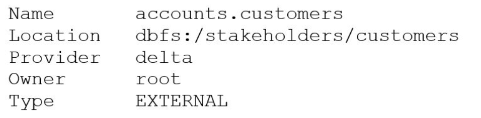
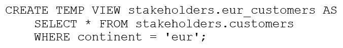
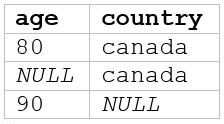
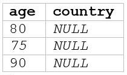
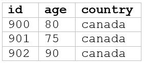

# T_009 (ExamTopics)

#### Q1) Which of the following layers of the medallion architecture is most commonly used by data analysts?

A. None of these layers are used by data analysts

***B. Gold***

C. All of these layers are used equally by data analysts

D. Silver

E. Bronze

```
The correct answer is Gold because it represents the refined, aggregated, and business-ready data designed for consumption by data analysts.

Here's a detailed justification:

The medallion architecture is a data design pattern used to logically organize data in a data lake, with the aim of incrementally improving the data structure and quality at each level. It comprises three main layers: Bronze, Silver, and Gold.

Bronze (Raw Data): This layer stores data in its raw, unprocessed format, directly from source systems. Data analysts rarely interact with this layer directly, as it's primarily used for data ingestion and archival.

Silver (Cleaned and Transformed Data): This layer contains data that has been cleaned, standardized, and potentially joined from multiple sources. While data analysts might occasionally explore the silver layer, it's not their primary focus.

Gold (Aggregated and Business-Level Data): This layer holds data that has been transformed and aggregated to meet specific business requirements and analytical needs. It is commonly organized into data marts or dimensional models (star or snowflake schemas). Data analysts use the Gold layer most often because it provides curated datasets designed for reporting, dashboards, and ad-hoc analysis. The gold layer provides the business context and aggregations that make the data readily usable for extracting insights.

Therefore, data analysts primarily utilize the Gold layer because it presents the data in a form most suitable for generating business insights and supporting decision-making. The gold layer optimizes for query performance and focuses on specific analytical use cases that are core to a data analysts role.Links for further research:

Databricks Medallion Architecture: https://www.databricks.com/glossary/medallion-architecture
Delta Lake Architecture : https://www.databricks.com/blog/2019/04/24/diving-into-delta-lake-unpacking-the-transaction-log.html
```
<br />

#### Q2) A data analyst has recently joined a new team that uses Databricks SQL, but the analyst has never used Databricks before. The analyst wants to know where in Databricks SQL they can write and execute SQL queries.
#### On which of the following pages can the analyst write and execute SQL queries?

A. Data page

B. Dashboards page

C. Queries page

D. Alerts page

***E. SQL Editor page***

```
The correct answer is E. SQL Editor page. Here's a detailed justification:

Databricks SQL is a platform for data warehousing and analytics that allows users to execute SQL queries against data stored in a data lake, typically in formats like Delta Lake. To interact with data and perform analysis using SQL, Databricks provides a dedicated interface for writing, editing, and executing SQL queries. This interface is called the SQL Editor.

The SQL Editor is specifically designed for SQL development. It provides features such as syntax highlighting, auto-completion, query history, and result visualization. Data analysts use this editor to write their queries, submit them to the Databricks SQL engine, and view the results. The other options are incorrect:

A. Data page: This page is typically used for managing and browsing data assets (e.g., tables, views) within the Databricks environment, not for writing and executing SQL queries directly.
B. Dashboards page: Dashboards are visual representations of data derived from SQL queries, not the place where the queries themselves are written. They are used to monitor key performance indicators (KPIs) and share insights.
C. Queries page: While a "Queries" page might exist as a repository for saved queries, the primary interface for creating and executing new queries remains the SQL Editor. A Queries page would often just list previously created queries accessible via the SQL editor.
D. Alerts page: Alerts are notifications triggered by specific conditions evaluated through SQL queries. The queries themselves are written in the SQL Editor, not on the Alerts page.
Therefore, the SQL Editor is the central hub for the described activity.

For more information on Databricks SQL and its components, refer to the official Databricks documentation:

Databricks SQL Overview: https://docs.databricks.com/sql/index.html
Databricks SQL Editor: https://docs.databricks.com/sql/user/queries/sql-editor.html
```

<br />

#### Q3) Which of the following describes how Databricks SQL should be used in relation to other business intelligence (BI) tools like Tableau, Power BI, and looker?

A. As an exact substitute with the same level of functionality

B. As a substitute with less functionality

C. As a complete replacement with additional functionality

D. As a complementary tool for professional-grade presentations

***E. As a complementary tool for quick in-platform BI work***

```
The correct answer is E: As a complementary tool for quick in-platform BI work. Here's why:

Databricks SQL provides a built-in SQL analytics service tailored for data warehousing and analytical workloads directly within the Databricks platform. While it offers visualization and dashboarding capabilities, it's not intended to replace fully-featured BI tools like Tableau, Power BI, or Looker. These dedicated BI platforms offer richer interactive visualizations, more sophisticated data modeling, advanced reporting features, and seamless integration with diverse data sources beyond just the Databricks environment.

Databricks SQL excels at enabling data analysts and scientists to quickly query, explore, and visualize data residing in the data lakehouse. It supports efficient SQL-based analysis directly against data stored in Delta Lake, offering fast query performance through Photon. It allows for rapid prototyping of reports and dashboards for internal use, facilitating quick insights and data exploration within the Databricks ecosystem.

For polished, external-facing dashboards and complex reporting requirements, or when integrating data from multiple sources outside the Databricks environment, a dedicated BI tool like Tableau, Power BI, or Looker is generally a better choice. These tools often connect directly to Databricks SQL as a data source, allowing users to leverage Databricks' data processing power while using familiar BI interfaces. Therefore, Databricks SQL complements dedicated BI tools by providing a convenient and efficient means for in-platform data exploration and prototyping, while specialized BI tools are used for advanced analysis and presentation.

In essence, think of Databricks SQL as a powerful first-line tool for data analysts within the Databricks environment, while dedicated BI tools are for more advanced analysis and professional-grade presentations.

Further Resources:

Databricks SQL Documentation: https://docs.databricks.com/sql/index.html
Databricks and BI Tools: Search "Databricks integration with Tableau/Power BI/Looker" on the Databricks website to find relevant articles and documentation.
```

<br />

#### Q4) Which of the following approaches can be used to connect Databricks to Fivetran for data ingestion?

A. Use Workflows to establish a SQL warehouse (formerly known as a SQL endpoint) for Fivetran to interact with

B. Use Delta Live Tables to establish a cluster for Fivetran to interact with

C. Use Partner Connect's automated workflow to establish a cluster for Fivetran to interact with

***D. Use Partner Connect's automated workflow to establish a SQL warehouse (formerly known as a SQL endpoint) for Fivetran to interact with***

E. Use Workflows to establish a cluster for Fivetran to interact with

```
The correct answer is D: Use Partner Connect's automated workflow to establish a SQL warehouse (formerly known as a SQL endpoint) for Fivetran to interact with. Let's break down why.

Partner Connect is designed to simplify integration between Databricks and various partner solutions, including Fivetran. Fivetran is a data pipeline service that automates data extraction, loading, and transformation (ELT) into a data warehouse. To connect Fivetran to Databricks, Fivetran needs a secure and reliable way to access data within Databricks.

A SQL warehouse (formerly a SQL endpoint) serves as the ideal interface for this interaction. SQL warehouses provide a managed, optimized environment for running SQL queries on data stored in the Databricks Lakehouse. They are specifically designed for BI and analytics workloads, allowing Fivetran to efficiently query and load data.

Partner Connect streamlines the setup process by automating the creation of the necessary SQL warehouse and configuring the connection details between Fivetran and Databricks. This eliminates the need for manual configuration, reducing complexity and potential errors. The automated workflow handles the secure provisioning and permissioning, allowing Fivetran to access the Databricks data using standard SQL commands. Options A and E are incorrect because Workflows are typically used for orchestrating Databricks jobs, not directly connecting external tools like Fivetran for data ingestion. Options B and C mention using a cluster or Delta Live Tables, which, while related to data processing, are not the direct interfaces that Fivetran uses to initially ingest and query data. While DLT can be a downstream target after Fivetran loads data into the lakehouse, it's not involved in the initial connection. Partner Connect's integration with Fivetran specifically focuses on establishing a SQL warehouse as the entry point.

Here are some links for further research:

Databricks Partner Connect: https://www.databricks.com/product/partner-connect
Fivetran: https://www.fivetran.com/
Databricks SQL Warehouses: https://docs.databricks.com/sql/index.html
```
<br />

#### Q5) Data professionals with varying titles use the Databricks SQL service as the primary touchpoint with the Databricks Lakehouse Platform. However, some users will use other services like Databricks Machine Learning or Databricks Data Science and Engineering.
#### Which of the following roles uses Databricks SQL as a secondary service while primarily using one of the other services?

A. Business analyst

B. SQL analyst

***C. Data engineer***

D. Business intelligence analyst

E. Data analyst

```
The correct answer is C, Data Engineer. Here's a detailed justification:

Data Engineers are primarily responsible for building and maintaining the data pipelines and infrastructure necessary for data analysis, machine learning, and other data-driven activities. Their core focus lies on data ingestion, transformation, storage, and serving data to downstream consumers. While they might use Databricks SQL occasionally for tasks such as ad-hoc querying, data validation, or troubleshooting data pipelines, it's not their primary tool.

Their daily workflows typically involve using other Databricks services such as Databricks Data Science & Engineering for Spark-based data processing and orchestrating workflows using tools like Apache Airflow. They construct robust and scalable data architectures, focusing on the efficiency and reliability of data flow throughout the Lakehouse. They deal with technologies for data extraction, data wrangling, data modeling, and data delivery to various destinations.

In contrast, roles like Business Analysts, SQL Analysts, Business Intelligence Analysts, and Data Analysts commonly use Databricks SQL as their primary interface to interact with and analyze data stored in the Lakehouse. They write queries, build dashboards, and generate reports to derive insights and support business decision-making. Data engineers enable these other roles by ensuring that reliable and well-structured data is available for analysis within the Lakehouse. Consequently, Databricks SQL functions as a secondary tool for data engineers, assisting in their broader tasks of data pipeline development and management. Their primary tasks involve leveraging other Databricks services for building and maintaining the infrastructure that supports data analysis rather than performing the analysis itself.For further research:

Databricks Documentation: This is the official resource for understanding the Databricks platform and its services. You can explore the Databricks SQL documentation to understand its capabilities and how different roles might use it.
https://docs.databricks.com/
Databricks Lakehouse Platform: Understanding the Lakehouse architecture helps clarify the roles involved.
https://www.databricks.com/product/lakehouse-platform
Data Engineering Role: Research data engineering best practices to understand their typical workflows and tools.
While there's no single authoritative link, searching for "Data Engineering Best Practices" will reveal resources from various reputable sources.
```

<br />

#### Q6) A data analyst has set up a SQL query to run every four hours on a SQL endpoint, but the SQL endpoint is taking too long to start up with each run.
#### Which of the following changes can the data analyst make to reduce the start-up time for the endpoint while managing costs?

A. Reduce the SQL endpoint cluster size

B. Increase the SQL endpoint cluster size

C. Turn off the Auto stop feature

D. Increase the minimum scaling value

***E. Use a Serverless SQL endpoint***

```
The correct answer is E: Use a Serverless SQL endpoint.

Here's why: The problem is excessive start-up time. Standard SQL endpoints have a warm-up period when they start up. During this period, resources are being allocated and the cluster is initializing before it can execute queries. Because the SQL endpoint is being run every four hours, it is regularly being shut down and restarted.

Serverless SQL Endpoints: Serverless SQL endpoints in Databricks offer immediate compute availability. They eliminate the warm-up period associated with traditional SQL endpoints because they are managed by Databricks. The compute resources are dynamically allocated as needed, allowing for quicker query execution without waiting for cluster initialization.
Databricks Serverless SQL Endpoints Documentation(https://docs.databricks.com/sql/admin/sql-endpoints.html#serverless-sql-endpoints)
Let's look at why the other options are not as suitable:

A. Reduce the SQL endpoint cluster size: Reducing the cluster size could increase start-up time as there are fewer resources to initialize. It might also cause performance issues if the query requires more resources than are available.
B. Increase the SQL endpoint cluster size: Increasing the cluster size would make the endpoint more powerful, but it doesn't address the start-up time problem directly and would likely increase costs.
C. Turn off the Auto stop feature: Turning off auto-stop would keep the cluster running continuously, thus eliminating the start-up time. However, this is very expensive since the cluster would be consuming resources even when it's not in use. This is not cost-effective for a query that runs every four hours.
D. Increase the minimum scaling value: Increasing the minimum scaling value also means the cluster will use more resources and this would not reduce the start up time.
Therefore, using a Serverless SQL endpoint is the best option. It reduces the start-up time significantly by eliminating the warm-up period while managing costs by only consuming resources when queries are actually running.
```

<br />

#### Q7) A data engineering team has created a Structured Streaming pipeline that processes data in micro-batches and populates gold-level tables. The microbatches are triggered every minute.
#### A data analyst has created a dashboard based on this gold-level data. The project stakeholders want to see the results in the dashboard updated within one minute or less of new data becoming available within the gold-level tables.
#### Which of the following cautions should the data analyst share prior to setting up the dashboard to complete this task?

***A. The required compute resources could be costly***

B. The gold-level tables are not appropriately clean for business reporting

C. The streaming data is not an appropriate data source for a dashboard

D. The streaming cluster is not fault tolerant

E. The dashboard cannot be refreshed that quickly

```
The correct answer is A: "The required compute resources could be costly." Here's why:

The requirement to update the dashboard within one minute of new data appearing in the gold-level tables implies a very low latency requirement. While Structured Streaming can deliver data in near real-time, querying and refreshing a dashboard against a constantly updating table at this frequency comes with several challenges that primarily relate to cost.

Compute Requirements: Continuously querying the gold-level tables every minute to update the dashboard puts a significant load on the underlying compute resources. The system needs to be able to handle these frequent queries without impacting the stream processing pipeline's performance. This may require scaling up the compute resources associated with the data warehouse or query engine powering the dashboard.

Cost Implications: More compute resources directly translate to higher costs in a cloud environment like Databricks. The data analyst should caution stakeholders that achieving this level of refresh frequency might lead to a substantial increase in infrastructure costs.

The other options are less directly relevant to the specified scenario:

B. The gold-level tables are not appropriately clean for business reporting: The question does not give any indication that the gold-level tables are not appropriately cleaned. By definition, gold-level tables are supposed to represent the highest quality of data for use in business reporting.
C. The streaming data is not an appropriate data source for a dashboard: Streaming data is an appropriate source for dashboards when near real-time insights are needed.
D. The streaming cluster is not fault tolerant: While fault tolerance is a valid concern for streaming pipelines, it is not the primary caution a data analyst should share in this context. Databricks Structured Streaming is designed to be fault-tolerant.
E. The dashboard cannot be refreshed that quickly: Modern dashboarding tools often can refresh quickly. The primary limitation is usually the backend data processing and query infrastructure, especially with demanding refresh intervals.
Therefore, the most important caution the data analyst should share is that the necessary infrastructure to support the near real-time dashboard refresh will likely incur significant costs.

Further Research:

Databricks Structured Streaming: https://spark.apache.org/docs/latest/structured-streaming/
Databricks Cost Management: https://www.databricks.com/product/cost-management
```

<br />

#### Q8) Which of the following approaches can be used to ingest data directly from cloud-based object storage?

A. Create an external table while specifying the DBFS storage path to FROM

B. Create an external table while specifying the DBFS storage path to PATH

C. It is not possible to directly ingest data from cloud-based object storage

D. Create an external table while specifying the object storage path to FROM

***E. Create an external table while specifying the object storage path to LOCATION***

```
The correct answer is E. Create an external table while specifying the object storage path to LOCATION. This is the standard and recommended method for directly ingesting data from cloud-based object storage into Databricks.

External tables in Databricks (and Spark in general) are metadata definitions that point to data stored in external systems, such as cloud object storage (e.g., AWS S3, Azure Blob Storage, Google Cloud Storage). They allow you to query data without actually loading it into the Databricks environment's managed storage. The LOCATION clause in the CREATE EXTERNAL TABLE statement specifies the path to the data within the object storage.

Options A, B, and D are incorrect. FROM is generally used for creating tables based on the results of a query or by cloning an existing table, not for specifying the data source's path. While DBFS (Databricks File System) can be used as an intermediary, directly referencing the object storage path to LOCATION is a more efficient and direct approach as it avoids unnecessary data copying. Option C is incorrect; direct ingestion from cloud object storage is a core feature of Databricks. Using the LOCATION parameter creates a pointer to the data's location. The engine then reads data directly from the storage service on demand. This method is highly scalable and cost-effective, as you only pay for the storage and the queries you run.

For further reading, consult the official Databricks documentation on creating tables:

Databricks - Create Table(https://docs.databricks.com/spark/latest/spark-sql/language-manual/sql-ref-syntax-ddl-create-table.html)
Databricks - External Tables(https://docs.databricks.com/data/tables.html#external-tables)
```

<br />

#### Q9) A data analyst wants to create a dashboard with three main sections: Development, Testing, and Production. They want all three sections on the same dashboard, but they want to clearly designate the sections using text on the dashboard.
#### Which of the following tools can the data analyst use to designate the Development, Testing, and Production sections using text?

A. Separate endpoints for each section

B. Separate queries for each section

***C. Markdown-based text boxes***

D. Direct text written into the dashboard in editing mode

E. Separate color palettes for each section

```
The correct answer is C: Markdown-based text boxes.

Markdown-based text boxes are the most suitable tool for designating sections within a Databricks dashboard. Databricks dashboards support Markdown, allowing analysts to add formatted text, headings, and even images directly within the dashboard interface. This enables clear visual separation and labeling of sections like Development, Testing, and Production. Using Markdown, you can create distinct headings (e.g., # Development, ## Testing), descriptive text, and even horizontal rules to divide the dashboard into visually coherent sections. This enhances readability and user understanding.

Options A, B, D, and E are not as effective for this specific use case:

A. Separate endpoints for each section: While endpoints relate to data access, they don't directly contribute to visual sectioning within a dashboard. They are more related to the underlying data sources.

B. Separate queries for each section: Separate queries address the data displayed in each section but do not provide visual delineation. Queries are used to populate the visualizations, not to label them.

D. Direct text written into the dashboard in editing mode: While you can add text directly, using Markdown offers formatting options that improve the visual appeal and clarity of the section headings. Simple "direct text" may lack the necessary emphasis for effective section separation. The lack of formatting support limits its effectiveness.

E. Separate color palettes for each section: Color palettes can differentiate visuals but don't explicitly designate sections using text. Color alone may not be sufficient for users to immediately understand the distinction between Development, Testing, and Production. Color differentiation works better when coupled with clear text labels.

Markdown's lightweight markup language is specifically designed for easy formatting and readability. Its integration into Databricks dashboards makes it an ideal tool for annotating and structuring the dashboard for improved user comprehension.

Databricks Dashboards DocumentationMarkdown Guide(https://docs.databricks.com/notebooks/dashboards.html)
```

<br />

#### Q10) A data analyst needs to use the Databricks Lakehouse Platform to quickly create SQL queries and data visualizations. It is a requirement that the compute resources in the platform can be made serverless, and it is expected that data visualizations can be placed within a dashboard.
#### Which of the following Databricks Lakehouse Platform services/capabilities meets all of these requirements?

A. Delta Lake

B. Databricks Notebooks

C. Tableau

D. Databricks Machine Learning

***E. Databricks SQL***

```
Databricks SQL is the correct answer because it directly addresses all the requirements outlined in the scenario.

Firstly, it's designed explicitly for SQL queries, making it ideal for analysts needing to quickly create and execute them on data within the Lakehouse. Databricks SQL offers a familiar SQL interface, simplifying the transition for users already proficient in SQL.

Secondly, Databricks SQL supports serverless compute. This allows the data analyst to take advantage of automated resource management. The system automatically scales compute resources based on demand and shuts them down when not in use. This eliminates the need to manage infrastructure and optimize costs.

Thirdly, Databricks SQL integrates data visualization capabilities, allowing users to create charts, graphs, and other visual representations of data directly from their SQL queries. These visualizations can then be organized into interactive dashboards, fulfilling the requirement of placing visualizations within dashboards for easy monitoring and analysis. This enables data exploration and sharing of insights within the Databricks environment.

Delta Lake (A) is a storage layer, not a query/visualization tool. Databricks Notebooks (B) is more general-purpose and requires more coding than SQL. Tableau (C) is a third-party BI tool, not a native Databricks service. Databricks Machine Learning (D) is focused on machine learning workflows, not general data analysis or SQL querying.

Further research:

Databricks SQL: https://www.databricks.com/product/databricks-sql
Serverless Compute (Databricks SQL): https://www.databricks.com/blog/2022/04/27/databricks-sql-serverless-generally-available.html
```

<br />

#### Q11) A data analyst is attempting to drop a table my_table. The analyst wants to delete all table metadata and data.
#### They run the following command:

> DROP TABLE IF EXISTS my_table;

#### While the object no longer appears when they run SHOW TABLES, the data files still exist.
#### Which of the following describes why the data files still exist and the metadata files were deleted?

A. The table's data was larger than 10 GB

B. The table did not have a location

***C. The table was external***

D. The table's data was smaller than 10 GB

E. The table was managed

```
Here's a detailed justification for why option C, "The table was external," is the correct answer.

When a table is created in Databricks, it can be either a managed (internal) table or an external table. The key difference lies in who manages the data and metadata location.

Managed Tables: Databricks manages both the data and the metadata. If you DROP TABLE for a managed table, Databricks removes both the metadata from the metastore and the underlying data files from the storage location Databricks controls (usually DBFS root).

External Tables: Only the metadata is managed by Databricks. The data resides in a storage location specified by the user, such as an Azure Blob Storage or AWS S3 bucket. When you DROP TABLE for an external table, Databricks only removes the metadata from the metastore. The underlying data files in the external storage location remain untouched. This is by design, allowing the data to persist even if the table definition is dropped.

The scenario described in the question states that the data files still exist after running DROP TABLE IF EXISTS my_table. This directly implies that only the metadata was removed, and the underlying data was retained in its storage location. This is characteristic of an external table. Options A, B, D, and E are incorrect because the size of the data, the presence of a location, or whether the data is larger/smaller than 10 GB does not affect the behavior of DROP TABLE command with external or managed tables. The fundamental distinction is whether Databricks controls the data location or not.

Therefore, the table my_table must have been an external table, leading to the described behavior.

Authoritative Links for Further Research:

Databricks documentation on creating tables: https://docs.databricks.com/en/sql/language-manual/sql-ref-syntax-ddl-create-table.html (Pay attention to the MANAGED/EXTERNAL keywords).
Databricks documentation on DROP TABLE: https://docs.databricks.com/en/sql/language-manual/sql-ref-syntax-ddl-drop-table.html
```

<br />

#### Q12) After running DESCRIBE EXTENDED accounts.customers;, the following was returned:

 

#### Now, a data analyst runs the following command:

> DROP accounts.customers;

#### Which of the following describes the result of running this command?

A. Running SELECT * FROM delta. `dbfs:/stakeholders/customers` results in an error.

B. Running SELECT * FROM accounts.customers will return all rows in the table.

C. All files with the .customers extension are deleted.

D. The accounts.customers table is removed from the metastore, and the underlying data files are deleted.

***E. The accounts.customers table is removed from the metastore, but the underlying data files are untouched.***

```
The accounts.customers table is removed from the metastore, but the underlying data files are untouched.
```

<br />

#### Q13) Which of the following should data analysts consider when working with personally identifiable information (PII) data?

A. Organization-specific best practices for PII data

B. Legal requirements for the area in which the data was collected

C. None of these considerations

D. Legal requirements for the area in which the analysis is being performed

***E. All of these considerations***

```
The correct answer is E, "All of these considerations," because responsible data analysis involving Personally Identifiable Information (PII) demands a comprehensive approach that encompasses organizational policies, data origin jurisdiction laws, and the jurisdiction where the analysis is being performed.

Here's why each aspect is crucial:

Organization-specific best practices for PII data (A): Organizations often establish internal policies and guidelines for handling PII to ensure data security, privacy, and compliance with industry standards. These practices may include data encryption, access controls, data minimization, and data retention policies. Analysts must adhere to these internal guidelines to maintain compliance and protect sensitive information.

Legal requirements for the area in which the data was collected (B): Different regions and countries have varying data protection laws, such as GDPR in Europe, CCPA in California, and PIPEDA in Canada. These laws govern how PII can be collected, processed, stored, and transferred. Ignoring these legal requirements can result in severe penalties, reputational damage, and legal liabilities. For example, data collected in Europe must adhere to GDPR principles, regardless of where it is analyzed.

Legal requirements for the area in which the analysis is being performed (D): The location where data analysis takes place also has legal implications. Even if data was collected legally in one region, performing analysis in another region might subject the data to different regulations. For example, analyzing European PII data in a country with less stringent privacy laws might still be subject to GDPR restrictions based on the data's origin. Cross-border data transfers are a significant concern in this regard.

Therefore, a data analyst must consider all these aspects to ensure ethical and legal compliance when working with PII data, safeguarding individual privacy rights, and mitigating potential risks. This holistic approach necessitates a deep understanding of organizational policies, relevant data protection laws, and the legal landscape in both the data collection and analysis regions.It is impossible to disregard any of these three factors.Ignoring any of these factors can lead to legal repercussions and data security breaches.

Relevant links for further research:

General Data Protection Regulation (GDPR): https://gdpr-info.eu/
California Consumer Privacy Act (CCPA): https://oag.ca.gov/privacy/ccpa
Personal Information Protection and Electronic Documents Act (PIPEDA): https://www.priv.gc.ca/en/privacy-topics/privacy-laws-in-canada/the-personal-information-protection-and-electronic-documents-act-pipeda/
```

<br />

#### Q14) Delta Lake stores table data as a series of data files, but it also stores a lot of other information.
#### Which of the following is stored alongside data files when using Delta Lake?

A. None of these

B. Table metadata, data summary visualizations, and owner account information

***C. Table metadata***

D. Data summary visualizations

E. Owner account information

```
The correct answer is C, Table metadata. Delta Lake, built on top of Apache Spark, offers ACID transactions and scalable metadata handling to data lakes. While Delta Lake does store data in data files within the underlying storage (e.g., cloud object storage like AWS S3 or Azure Blob Storage), it meticulously manages metadata to provide transactional guarantees and versioning. This metadata is crucial for features like time travel, data lineage, and schema evolution.

Specifically, the metadata stored includes transaction logs, table schema information, and statistics about the data (e.g., min/max values, null counts) which assists in query optimization (data skipping). This metadata is vital for understanding the table's structure and its history. Options A, B, D, and E are incorrect because while visualizations or account information might exist outside of Delta Lake, Delta Lake's core storage alongside data files primarily focuses on table metadata to maintain its ACID properties and functionalities. Data summary visualizations are typically generated by external BI tools, and owner account information would be managed by the identity and access management system of the cloud provider, not directly stored within the Delta Lake file structure. Therefore, table metadata is the crucial element directly managed alongside the data files within a Delta Lake table.

For more detailed information, refer to the official Databricks Delta Lake documentation:

Delta Lake Overview(https://docs.databricks.com/delta/index.html)
Delta Lake Transactions(https://docs.databricks.com/delta/transaction-isolation.html)
```

<br />

#### Q15) Which of the following is an advantage of using a Delta Lake-based data lakehouse over common data lake solutions?

***A. ACID transactions***

B. Flexible schemas

C. Data deletion

D. Scalable storage

E. Open-source formats

```
The correct answer, A. ACID transactions, is a primary advantage of Delta Lake over traditional data lake solutions like those built solely on object storage (e.g., AWS S3, Azure Blob Storage, Google Cloud Storage).

Traditional data lakes often lack ACID (Atomicity, Consistency, Isolation, Durability) transaction guarantees. This means that concurrent read and write operations can lead to data corruption or inconsistent reads. For example, if a user is querying data while another process is updating it, the user might see a partially updated or inconsistent state. This complicates data pipelines and analytics.

Delta Lake addresses this by providing ACID transactions on top of the data lake. Delta Lake uses a transaction log to track all changes to the data stored in the data lake. This log ensures that multiple concurrent operations are serialized and executed in an atomic manner. Updates are all-or-nothing; either the entire change is applied, or none of it is. Consistency ensures that after a transaction, the data lake is in a consistent state, preventing data corruption. Isolation ensures that concurrent transactions do not interfere with each other. Durability ensures that once a transaction is committed, it is permanent, even in the event of system failures.

While options B, C, D, and E might be features associated with data lakehouses in general or are related to cloud storage options, they aren't unique advantages of Delta Lake over other data lake solutions. Many file formats used in data lakes are already open-source (E). Data lakes often support scalable storage (D) regardless of whether they use Delta Lake. Schema evolution and flexibility (B) are indeed benefits, but not exclusive to Delta Lake. Data deletion (C), while possible in many data lakes, lacks the reliable transactional guarantees provided by Delta Lake's DELETE, UPDATE, and MERGE commands, which maintain data integrity and auditability. Delta Lake provides capabilities like OPTIMIZE and VACUUM to manage data and storage efficiently. Therefore, only ACID transactions are the unique, and significant value proposition that sets Delta Lake apart.

For further research, you can explore:

Databricks Delta Lake Documentation: https://docs.databricks.com/delta/index.html
Delta Lake Open Source Project: https://delta.io/
```

<br />

#### Q16) Which of the following benefits of using Databricks SQL is provided by Data Explorer?

A. It can be used to run UPDATE queries to update any tables in a database.

***B. It can be used to view metadata and data, as well as view/change permissions.***

C. It can be used to produce dashboards that allow data exploration.

D. It can be used to make visualizations that can be shared with stakeholders.

E. It can be used to connect to third party BI cools.

```
The correct answer is B, "It can be used to view metadata and data, as well as view/change permissions." Here's why:

Data Explorer in Databricks SQL is primarily a user interface designed for data discovery and management. Its core functionality revolves around enabling users to understand the structure and contents of their data assets. It allows users to browse databases, tables, and views within the Databricks workspace. Specifically, Data Explorer reveals crucial metadata information like column names, data types, table schemas, table statistics, and associated comments. This feature helps data analysts quickly understand the organization and quality of the available data.

Furthermore, Data Explorer provides the ability to preview actual data stored in tables, allowing users to visually inspect the content and identify potential data quality issues or patterns. Finally, and importantly for data governance and security, Data Explorer facilitates managing permissions on data assets. Users can control who can access and modify data, ensuring that data is protected and accessed only by authorized personnel.

While Databricks SQL can be used for the functionalities outlined in the other options, they are not specifically provided by the Data Explorer interface. For example, running UPDATE queries is possible through the SQL editor in Databricks SQL, but the Data Explorer itself doesn't directly enable running them. Dashboards (option C) and visualizations (option D) are created using Databricks SQL's built-in tools or by connecting to external BI tools. Connecting to third-party BI tools (option E) is a general capability of Databricks SQL, leveraging its connectivity features, and is not exclusive to Data Explorer. Therefore, viewing metadata, data, and managing permissions is the most accurate and direct benefit offered by Data Explorer.

Authoritative Links:

Databricks SQL Documentation: https://docs.databricks.com/sql/index.html (While a direct page for "Data Explorer" might not exist, navigating the Databricks SQL documentation will highlight how Data Explorer is integral to data discovery and governance within the Databricks SQL environment.)
Databricks Data Governance Features: https://www.databricks.com/product/data-governance (This link outlines the broader data governance capabilities of Databricks, which includes permission management available through Data Explorer.)
```

<br />

#### Q17) The stakeholders.customers table has 15 columns and 3,000 rows of data. The following command is run:



#### After running SELECT * FROM stakeholders.eur_customers, 15 rows are returned. After the command executes completely, the user logs out of Databricks.
#### After logging back in two days later, what is the status of the stakeholders.eur_customers view?

A. The view remains available and SELECT * FROM stakeholders.eur_customers will execute correctly.

***B. The view has been dropped.***

C. The view is not available in the metastore, but the underlying data can be accessed with SELECT * FROM delta. `stakeholders.eur_customers`.

D. The view remains available but attempting to SELECT from it results in an empty result set because data in views are automatically deleted after logging out.

E. The view has been converted into a table.

```
The view has been dropped.
```


<br />

#### Q18) A data analyst created and is the owner of the managed table my_ table. They now want to change ownership of the table to a single other user using Data Explorer.
#### Which of the following approaches can the analyst use to complete the task?

A. Edit the Owner field in the table page by removing their own account

B. Edit the Owner field in the table page by selecting All Users

***C. Edit the Owner field in the table page by selecting the new owner's account***

D. Edit the Owner field in the table page by selecting the Admins group

E. Edit the Owner field in the table page by removing all access

```
The correct approach is to edit the Owner field in the table page and select the new owner's account. Here's why:

Data ownership in Databricks (and other data platforms) grants specific privileges, including the ability to manage permissions, modify the table schema, and ultimately drop the table. Changing the owner transfers these responsibilities. Option A, removing the current owner, would likely result in the table having no defined owner, which is not the intended outcome and might lead to unintended consequences or access issues. Option B, selecting "All Users," is not a valid method for assigning ownership. It typically relates to granting access permissions and not ownership. Option D, selecting the "Admins" group, is also not appropriate. While admins have broad privileges, assigning ownership to a group rather than a specific user can complicate auditing and accountability. The most direct and correct method is to explicitly assign the new owner's account.

The Databricks UI, specifically Data Explorer, facilitates easy owner changes. The owner field allows direct assignment to another user, ensuring a clear transfer of responsibility. Assigning ownership to a specific user provides clarity regarding accountability and streamlines access management. The new owner can then manage access controls as required.https://docs.databricks.com/data-governance/unity-catalog/index.htmlhttps://docs.databricks.com/sql/language-manual/security/index.html
```

<br />

#### Q19) A data analyst has a managed table table_name in database database_name. They would now like to remove the table from the database and all of the data files associated with the table. The rest of the tables in the database must continue to exist.
#### Which of the following commands can the analyst use to complete the task without producing an error?

A. DROP DATABASE database_name;

***B. DROP TABLE database_name.table_name;***

C. DELETE TABLE database_name.table_name;

D. DELETE TABLE table_name FROM database_name;

E. DROP TABLE table_name FROM database_name;

```
The correct command to remove a managed table and its associated data files in Databricks, while preserving other tables in the database, is DROP TABLE database_name.table_name;.

Here's why:

DROP TABLE is the standard SQL command specifically designed to remove a table from a database. When used with a managed table, it removes both the table's metadata from the metastore (e.g., Hive metastore or Unity Catalog) and the underlying data files stored in the cloud storage location associated with the table (e.g., S3, ADLS, or GCS).

database_name.table_name specifies the fully qualified name of the table, indicating the database where the table resides and the table's name. This ensures the correct table is targeted for removal.

Now, let's examine why the other options are incorrect:

A. DROP DATABASE database_name;: This command would drop the entire database, including all tables within it, which is not the desired outcome. The analyst wants to remove only a single table while keeping the others.

C. DELETE TABLE database_name.table_name;: DELETE is used for removing rows within a table, not for removing the entire table structure and its data files. DELETE statements require a WHERE clause to specify which rows to delete. It's not designed for dropping the table itself.

D. DELETE TABLE table_name FROM database_name;: This syntax is incorrect SQL and will result in a syntax error. DELETE operates on rows within a table, and the FROM clause is followed by the table name directly, not the database name.

E. DROP TABLE table_name FROM database_name;: This syntax is also incorrect and will cause an error. The correct syntax for specifying the table's database is to prefix the table name with the database name using a dot (.) as a separator.

In summary, DROP TABLE database_name.table_name; is the only command that accomplishes the task of removing the specified table and its data files without affecting other tables in the database.

Further research:

Databricks DROP TABLE command: https://spark.apache.org/docs/3.1.1/sql-ref-syntax-ddl-drop-table.html (Although this link pertains to Apache Spark SQL, the DROP TABLE syntax and its functionality are consistent within Databricks.)
Databricks documentation on managed tables: Refer to Databricks' official documentation on managed tables and external tables for more details on the difference between these table types and how their data is handled during table removal.
```

<br />

#### Q20) A data analyst runs the following command:

> SELECT age, country FROM my_table 
WHERE age >= 75 AND country = 'canada';

#### Which of the following tables represents the output of the above command?

A) 




B) 



C) 



D) 


***E)*** 


<br />

#### Q21) 

<br />


#### Q11) 

<br />

#### Q11) 

<br />

#### Q11) 

<br />

