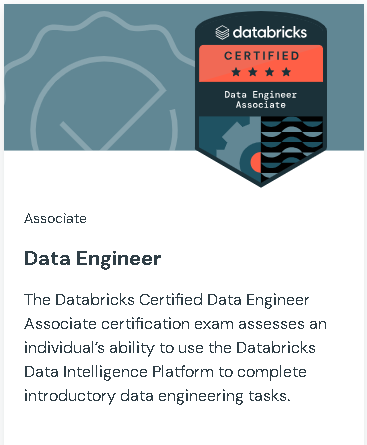

# Databricks Certified Data Engineer Associate

[Link](https://www.databricks.com/learn/certification/data-engineer-associate?itm_source=www&itm_category=learn&itm_page=certification&itm_location=Data%20Engineer&itm_component=card&itm_offer=data-engineer-associate)

### Exam outline

- <b> Databricks Intelligence Platform </b>
	- Understand the core components of the Databricks Data Intelligence Platform, such as its architecture, Delta Lake, and Unity Catalog.
	- Understand Databricks Data Intelligence Platform’s compute services, including their characteristics, limitations, and cost models, and select the most suitable option for each workload use case.
- <b> Data Ingestion and Loading </b>
	- Enable and detail data ingestion patterns, including batch, streaming, and incremental loading, and import data from sources such as local files, Lakeflow Connect standard connectors, and Lakeflow Connect managed connectors.
	- Use the COPY INTO command to incrementally load files from cloud object storage (ADLS/S3/GCS) into Unity‑Catalog–governed tables.
	- Use Auto Loader with schema enforcement and schema evolution in batch modes (for example, directory listing or file notification) to land data into UnityCatalog–governed tables.
	- Configure Lakeflow Connect to reliably ingest data from diverse enterprise sources into UnityCatalog–governed tables.
	- Use JDBC/ODBC or REST clients in notebooks to land data into cloud storage or directly into UnityCatalog–governed tables, usually orchestrated and scheduled with Lakeflow Jobs.
	- Prioritize between Auto Loader, Lakeflow Connect (standard and managed connectors), partner connectors, and other ingestion methods based on technical requirements such as data volume, ingestion frequency, data types, and governance needs with Unity Catalog.
	- Ingest semi-structured and unstructured data (for example, JSON and nested data) via Lakeflow Connect and other managed connectors into UnityCatalog–governed Delta tables.
- <b> Data Transformation and Modeling </b>
	- Implement data cleaning by reading bronze tables with PySpark/SQL, cleaning nulls, standardizing data types, and writing to new silver tables.
	- Combine DataFrames with operations such as Inner join, left join, broadcast join, multiple keys, cross join, union, and union all.
	- Manipulate columns, rows, and table structures by adding, dropping, splitting, renaming column names, applying filters, and exploding arrays.
	- Perform data deduplication operations and aggregate operations on DataFrames, such as count, approximate count distinct, and mean, summary.
	- Understand the basic tuning parameters (spark.sql.shuffle.partitions:, spark.default.parallelism, spark.executor/driver.memory,
spark.sql.autoBroadcastJoinThreshold) and re-measure the performance.
	- Understand the difference between, and how to build, Gold layer objects such as materialized views, views, streaming tables, and tables for BI and analytics teams in Unity Catalog.
	- Apply data quality checks and validation rules to ensure reliable Silver and Gold datasets.
- <b> Working with Lakeflow Jobs </b>
	- Implement control flows (retries and conditional tasks such as branching and looping) using Lakeflow Jobs for pipeline orchestration
	- Configure common tasks (notebook, SQL query, dashboard, and pipeline tasks) and their dependencies using Lakeflow Jobs and its DAG‑based task graph 
	- Implement job schedules using Lakeflow Jobs with an understanding of trigger types (scheduled, file arrival, and table update)
	- Choose between time‑based and data‑driven triggers based on data availability and pipeline dependencies.
- <b> Implementing CI/CD </b>
	- Manage your code development workflow within the Databricks workspace UI, including creating and switching between branches in Databricks Git Folders (formerly Databricks Repos), committing and pushing changes, and creating pull requests using Databricks Git integration.
	- Understand environment-specific configuration using Automation Bundle (formerly Databricks Asset Bundles)  variables and overrides while promoting the same codebase across dev, test, and prod targets.
	- Deploy Declarative Automation Bundles (formerly Databricks Asset Bundles) to package, configure, and promote Lakeflow Jobs, Lakeflow Spark Declarative Pipelines, and other workspace assets across dev, test, and prod environments.
	- Understand the Databricks CLI to validate, deploy, and manage Declarative Automation Bundles  (formerly Databricks Asset Bundles)  and other workspace assets in automated CI/CD workflows.
- <b> Troubleshooting, Monitoring, and Optimization </b>
	- Identify trends in job performance using the Lakeflow Jobs run history view to compare current execution times against historical baselines.
	- Use the Lakeflow Jobs UI to monitor pipeline health by interpreting job statuses, viewing DAG‑based task graphs to spot upstream blockers, and tracking pipeline run times and failure rates.
	- Identify common performance bottlenecks such as data skew, shuffling, and disk spilling by interpreting stage-level metrics in the Spark UI.
	- Understand the features of Liquid Clustering and predictive optimization.
	- Diagnose cluster startup failures, library conflicts, and out-of-memory issues.
- <b> Governance and Security </b>
	- Differentiate between managed and external tables in Unity Catalog and perform basic operations (create, modify, delete, and convert between managed and external tables) on them.
	- Configure access controls using the UI and SQL by applying GRANT, REVOKE, and DENY privileges to principals (users, groups, and service principals) at appropriate levels of the security hierarchy.
	- Understand column-level masking and row-level security to restrict data visibility based on user groups.
	- Understand Unity Catalog ABAC policies to centrally control row-level filtering and column masking for sensitive data.
