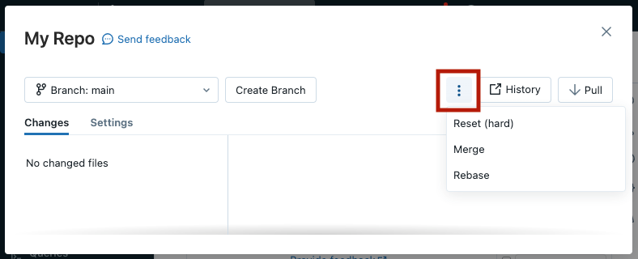

# T_001 (Practice Test 1)


### Q1. Which of the following commands can a data engineer use to compact small data files of a Delta table into larger ones ?

a) PARTITION BY

b) ZORDER BY

c) COMPACT

d) VACUUM

e) ***OPTIMIZE***


**Overall explanation**

Delta Lake can improve the speed of read queries from a table. One way to improve this speed is by compacting small files into larger ones. You trigger compaction by running the `OPTIMIZE` command.

Reference: https://docs.databricks.com/sql/language-manual/delta-optimize.html

```
Domain
Databricks Lakehouse Platform
```

<br />


### Q2. A data engineer is trying to use Delta time travel to rollback a table to a previous version, but the data engineer received an error that the data files are no longer present.
### Which of the following commands was run on the table that caused deleting the data files?

a) ***VACUUM***

b) OPTIMIZE

c) ZORDER BY

d) DEEP CLONE

e) DELETE

**Overall explanation**

Running the VACUUM command on a Delta table deletes the unused data files older than a specified data retention period. As a result, you lose the ability to time travel back to any version older than that retention threshold.

```
Domain
Databricks Lakehouse Platform
```

<br />

### Q3. In Delta Lake tables, which of the following is the primary format for the data files?

a) Delta

b) ***Parquet***

c) JSON

d) Hive-specific format

e) Both, Parquet and JSON

**Overall explanation**

Delta Lake builds upon standard data formats. Delta lake table gets stored on the storage in one or more data files in Parquet format, along with transaction logs in JSON format.

Reference: https://docs.databricks.com/delta/index.html

```
Domain
Databricks Lakehouse Platform
```

<br />


### Q4. Which of the following locations hosts the Databricks web application ?

a) Data plane

b) ***Control plane***

c) Databricks Filesystem

d) Databricks-managed cluster

e) Customer Cloud Account

**Overall explanation**

According to the Databricks Lakehouse architecture, Databricks workspace is deployed in the control plane along with Databricks services like Databricks web application (UI), Cluster manager, workflow service, and notebooks.

Reference: https://docs.databricks.com/getting-started/overview.html

```
Domain
Databricks Lakehouse Platform
```

<br />

### Q5. In Databricks Repos (Git folders), which of the following operations a data engineer can use to update the local version of a repo from its remote Git repository ?

a) Clone

b) Commit

c) Merge

d) Push

e) ***Pull***

**Overall explanation**

The git Pull operation is used to fetch and download content from a remote repository and immediately update the local repository to match that content.

References:
•	https://docs.databricks.com/repos/index.html
•	https://github.com/git-guides/git-pull


```
Domain
Databricks Lakehouse Platform
```

<br />

### Q6. According to the Databricks Lakehouse architecture, which of the following is located in the customer's cloud account?

a) Databricks web application

b) Notebooks

c) Repos

d) ***Cluster virtual machines***

e) Workflows

**Overall explanation**

When the customer sets up a Spark cluster, the cluster virtual machines are deployed in the data plane in the customer's cloud account.

Reference: https://docs.databricks.com/getting-started/overview.html

```
Domain
Databricks Lakehouse Platform
```

<br />

### Q7. Which of the following best describes Databricks Lakehouse?

a) ***Single, flexible, high-performance system that supports data, analytics, and machine learning workloads.***

b) Reliable data management system with transactional guarantees for organization’s structured data.

c) Platform that helps reduce the costs of storing organization’s open-format data files in the cloud.

d) Platform for developing increasingly complex machine learning workloads using a simple, SQL-based solution.

e) Platform that scales data lake workloads for organizations without investing on-premises hardware.

**Overall explanation**

Databricks Lakehouse is a unified analytics platform that combines the best elements of data lakes and data warehouses. So, in the Lakehouse, you can work on data engineering, analytics, and AI, all in one platform.

Reference: https://www.databricks.com/glossary/data-lakehouse

```
Domain
Databricks Lakehouse Platform
```

<br />

### Q8. If the default notebook language is SQL, which of the following options a data engineer can use to run a Python code in this SQL Notebook ?

a) They need first to import the python module in a cell

b) This is not possible! They need to change the default language of the notebook to Python

c) Databricks detects cells language automatically, so they can write Python syntax in any cell

d) They can add `%language` magic command at the start of a cell to force language detection.

e) ***They can add `%python` at the start of a cell.***

**Overall explanation**

By default, cells use the default language of the notebook. You can override the default language in a cell by using the language magic command at the beginning of a cell. The supported magic commands are: `%python`, `%sql`, `%scala`, and `%r`.

Reference: https://docs.databricks.com/notebooks/notebooks-code.html

```
Domain
Databricks Lakehouse Platform
```

<br />

### Q9. Which of the following tasks is not supported by Databricks Repos (Git folders), and must be performed in your Git provider ?

a) Clone, push to, or pull from a remote Git repository.

b) Create and manage branches for development work.

c) Create notebooks, and edit notebooks and other files.

d) Visually compare differences upon commit.

e) ***Delete branches***

**Overall explanation**

The following tasks are not supported by Databricks Repos, and must be performed in your Git provider:
- Create a pull request
- Delete branches
- Merge and rebase branches *

> NOTE: Recently, merge and rebase branches have become supported in Databricks Repos. However, this may still not be updated in the current exam version.



Reference: https://docs.databricks.com/repos/index.html

```
Domain
Databricks Lakehouse Platform
```

<br />


### Q10. Which of the following statements is Not true about Delta Lake ?

a) Delta Lake provides ACID transaction guarantees

b) Delta Lake provides scalable data and metadata handling

c) Delta Lake provides audit history and time travel

d) ***Delta Lake builds upon standard data formats: Parquet + XML***

e) Delta Lake supports unified streaming and batch data processing

**Overall explanation**

It is not true that Delta Lake builds upon XML format. It builds upon Parquet and JSON formats

Reference: https://docs.databricks.com/delta/index.html

```
Domain
Databricks Lakehouse Platform
```

<br />

### Q11. How long is the default retention period of the VACUUM command ?

a) 0 days

b) ***7 days***

c) 30 days

d) 90 days

e) 365 days

**Overall explanation**

By default, the retention threshold of the VACUUM command is 7 days. This means that VACUUM operation will prevent you from deleting files less than 7 days old, just to ensure that no long-running operations are still referencing any of the files to be deleted.

Reference: https://docs.databricks.com/sql/language-manual/delta-vacuum.html

```
Domain
Databricks Lakehouse Platform
```

<br />

### Q12. The data engineering team has a Delta table called employees that contains the employees personal information including their gross salaries.

### Which of the following code blocks will keep in the table only the employees having a salary greater than 3000 ?

a) DELETE FROM employees WHERE salary > 3000;

b) SELECT CASE WHEN salary <= 3000 THEN DELETE ELSE UPDATE END FROM employees;

c) UPDATE employees WHERE salary > 3000 WHEN MATCHED SELECT;

d) UPDATE employees WHERE salary <= 3000 WHEN MATCHED DELETE;

e) ***DELETE FROM employees WHERE salary <= 3000;***

**Overall explanation**

In order to keep only the employees having a salary greater than 3000, we must delete the employees having salary less than or equal 3000. To do so, use the DELETE statement:
`DELETE FROM table_name WHERE condition;`

Reference: https://docs.databricks.com/sql/language-manual/delta-delete-from.html

```
Domain
ELT with Spark SQL and Python
```

<br />

### Q13. A data engineer wants to create a relational object by pulling data from two tables. The relational object must be used by other data engineers in other sessions on the same cluster only. In order to save on storage costs, the date engineer wants to avoid copying and storing physical data.

### Which of the following relational objects should the data engineer create?

a) Temporary view

b) External table

c) Managed table

d) Global Temporary view

e) ***View***

**Overall explanation**

In order to avoid copying and storing physical data, the data engineer must create a view object. A view in databricks is a virtual table that has no physical data. It’s just a saved SQL query against actual tables.
The view type should be Global Temporary view that can be accessed in other sessions on the same cluster. Global Temporary views are tied to a cluster temporary database called global_temp.

Reference: https://docs.databricks.com/sql/language-manual/sql-ref-syntax-ddl-create-view.html

```
Domain
ELT with Spark SQL and Python
```

<br />


### Q14. A data engineer has developed a code block to completely reprocess data based on the following if-condition in Python:
> 	if process_mode = "init" and not is_table_exist:
	   print("Start processing ...")

### This if-condition is returning an invalid syntax error.
### Which of the following changes should be made to the code block to fix this error ?

a) 
> if process_mode = "init" & not is_table_exist:
    print("Start processing ...")

b) 
> if process_mode = "init" and not is_table_exist = True:
    print("Start processing ...")


c) 
> if process_mode = "init" and is_table_exist = False:
    print("Start processing ...")

d) 
> (process_mode = "init") and (not is_table_exist):
    print("Start processing ...")

e) ***Correct Answer***
> if process_mode == "init" and not is_table_exist:
    print("Start processing ...")

**Overall explanation**

Python if statement looks like this in its simplest form:
> if <expr>:
    <statement>

Python supports the usual logical conditions from mathematics:
- Equals: a == b
- Not Equals: a != b
- <, <=, >, >=

To combine conditional statements, you can use the following logical operators:
- `and`
- `or`
The negation operator in Python is: `not`

Reference: https://www.w3schools.com/python/python_conditions.asp

```
Domain
ELT with Spark SQL and Python
```

<br />

### Q15. Fill in the below blank to successfully create a table in Databricks using data from an existing PostgreSQL database:

> CREATE TABLE employees
    USING ____________
    OPTIONS (
    url "jdbc:postgresql:dbserver",
    dbtable "employees"
    )

a) ***org.apache.spark.sql.jdbc***

b) postgresql

c) DELTA

d) dbserver

e) cloudfiles

**Overall explanation**

Using the JDBC library, Spark SQL can extract data from any existing relational database that supports JDBC. Examples include mysql, postgres, SQLite, and more.

Reference: https://learn.microsoft.com/en-us/azure/databricks/external-data/jdbc

```
Domain
ELT with Spark SQL and Python
```

<br />

### Q16. Which of the following commands can a data engineer use to create a new table along with a comment ?

a) ***Correct Answer***
> CREATE TABLE payments
    COMMENT "This table contains sensitive information"
    AS SELECT * FROM bank_transactions

b) 
> CREATE TABLE payments
    COMMENT("This table contains sensitive information")
    AS SELECT * FROM bank_transactions

c) 
> CREATE TABLE payments
    AS SELECT * FROM bank_transactions
    COMMENT "This table contains sensitive information"
    
d) 
> CREATE TABLE payments
    AS SELECT * FROM bank_transactions
    COMMENT "This table contains sensitive information"
    COMMENT "This table contains sensitive information"

e) 
> CREATE TABLE payments
    AS SELECT * FROM bank_transactions

**Overall explanation**

The `CREATE TABLE` clause supports adding a descriptive comment for the table. This allows for easier discovery of table contents.

Syntax:
> CREATE TABLE table_name
    COMMENT "here is a comment"
    AS query

```
Domain
ELT with Spark SQL and Python
```

<br />

### Q17. A junior data engineer usually uses `INSERT INTO` command to write data into a Delta table. A senior data engineer suggested using another command that avoids writing of duplicate records.
### Which of the following commands is the one suggested by the senior data engineer ?

a) ***`MERGE INTO`***

b) `APPLY CHANGES INTO`

c) `UPDATE`

d) `COPY INTO`

e) `INSERT OR OVERWRITE`

**Overall explanation**

`MERGE INTO` allows to merge a set of updates, insertions, and deletions based on a source table into a target Delta table. With `MERGE INTO`, you can avoid inserting the duplicate records when writing into Delta tables.

References:
- https://docs.databricks.com/sql/language-manual/delta-merge-into.html
- https://docs.databricks.com/delta/merge.html#data-deduplication-when-writing-into-delta-tables

```
Domain
ELT with Spark SQL and Python
```

<br />


### Q18. A data engineer is designing a Delta Live Tables pipeline. The source system generates files containing changes captured in the source data. Each change event has metadata indicating whether the specified record was inserted, updated, or deleted. In addition to a timestamp column indicating the order in which the changes happened. The data engineer needs to update a target table based on these change events.
### Which of the following commands can the data engineer use to best solve this problem?

a) `MERGE INTO`

b) ***`APPLY CHANGES INTO`***

c) `UPDATE`

d) `COPY INTO`

e) `INSERT OR OVERWRITE`

**Overall explanation**

The events described in the question represent Change Data Capture (CDC) feed. CDC is logged at the source as events that contain both the data of the records along with metadata information:
- Operation column indicating whether the specified record was inserted, updated, or deleted
- Sequence column that is usually a timestamp indicating the order in which the changes happened
You can use the APPLY CHANGES INTO statement to use Delta Live Tables CDC functionality

Reference: https://docs.databricks.com/workflows/delta-live-tables/delta-live-tables-cdc.html

```
Domain
ELT with Spark SQL and Python
```

<br />


### Q19. In PySpark, which of the following commands can you use to query the Delta table employees created in Spark SQL?

a) `pyspark.sql.read(SELECT * FROM employees)`

b) spark.sql("employees")`

c) `spark.format(“sql”).read("employees")`

d) ***``spark.table("employees")`***`

e) `Spark SQL tables can not be accessed from PySpark`

**Overall explanation**

`spark.table()` function returns the specified Spark SQL table as a PySpark DataFrame

Reference:
https://spark.apache.org/docs/2.4.0/api/python/_modules/pyspark/sql/session.html#SparkSession.table

```
Domain
ELT with Spark SQL and Python
```

<br />

### Q20. Which of the following code blocks can a data engineer use to create a user defined function (UDF) ?

a) 
> CREATE FUNCTION plus_one(value INTEGER)
    RETURN value +1

b) 
> CREATE UDF plus_one(value INTEGER)
    RETURNS INTEGER
    RETURN value +1;

c) 
> CREATE UDF plus_one(value INTEGER)
    RETURN value +1;

d) ***CORRECT ANSWER***`
> CREATE FUNCTION plus_one(value INTEGER)
    RETURNS INTEGER
    RETURN value +1;

e) 
> CREATE FUNCTION plus_one(value INTEGER)
    RETURNS INTEGER
    value +1;

**Overall explanation**

The correct syntax to create a UDF is:
```
CREATE [OR REPLACE] FUNCTION function_name ( [ parameter_name data_type [, ...] ] )
    RETURNS data_type
    RETURN { expression | query }
```

Reference: https://docs.databricks.com/udf/index.html


### Q2. 


<br />

### Q3. 


<br />


### Q4. 


<br />


### Q5. 


<br />


### Q6. 


<br />


### Q7. 


<br />


### Q8. 


<br />


### Q9. 


<br />


### Q10. 

### Q10. 


### Q2. 


<br />

### Q3. 


<br />


### Q4. 


<br />


### Q5. 


<br />


### Q6. 


<br />


### Q7. 


<br />


### Q8. 


<br />


### Q9. 


<br />


### Q10. 

### Q10. 


### Q2. 


<br />

### Q3. 


<br />


### Q4. 


<br />


### Q5. 


<br />


### Q6. 


<br />


### Q7. 


<br />


### Q8. 


<br />


### Q9. 


<br />


### Q10. 
