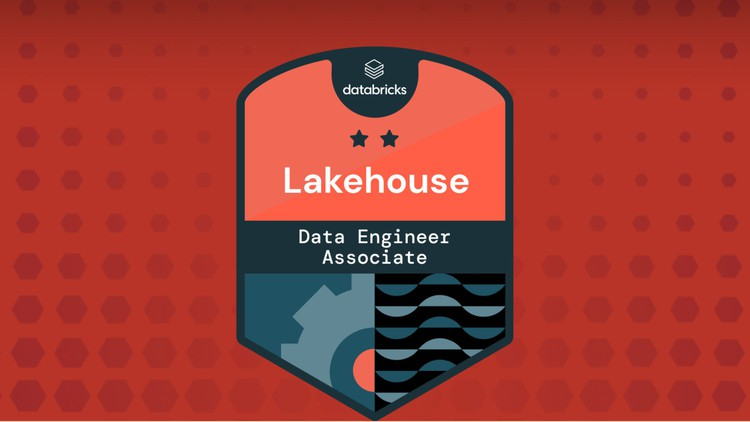

# T_001



### Q1. Which of the following commands can a data engineer use to compact small data files of a Delta table into larger ones ?

a) PARTITION BY

b) ZORDER BY

c) COMPACT

d) VACUUM

e) ***OPTIMIZE***


**Overall explanation**

Delta Lake can improve the speed of read queries from a table. One way to improve this speed is by compacting small files into larger ones. You trigger compaction by running the `OPTIMIZE` command.

Reference: https://docs.databricks.com/sql/language-manual/delta-optimize.html

```
Domain
Databricks Lakehouse Platform
```

<br />


### Q2. A data engineer is trying to use Delta time travel to rollback a table to a previous version, but the data engineer received an error that the data files are no longer present.
### Which of the following commands was run on the table that caused deleting the data files?

a) ***VACUUM***

b) OPTIMIZE

c) ZORDER BY

d) DEEP CLONE

e) DELETE

**Overall explanation**
Running the VACUUM command on a Delta table deletes the unused data files older than a specified data retention period. As a result, you lose the ability to time travel back to any version older than that retention threshold.

```
Domain
Databricks Lakehouse Platform
```

<br />

### Q3. 


<br />


### Q4. 


<br />


### Q5. 


<br />


### Q6. 


<br />


### Q7. 


<br />


### Q8. 


<br />


### Q9. 


<br />


### Q10. 


<br />


### Q1. 


<br />

### Q2. 


<br />

### Q3. 


<br />


### Q4. 


<br />


### Q5. 


<br />


### Q6. 


<br />


### Q7. 


<br />


### Q8. 


<br />


### Q9. 


<br />


### Q10. 

