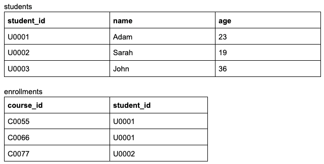
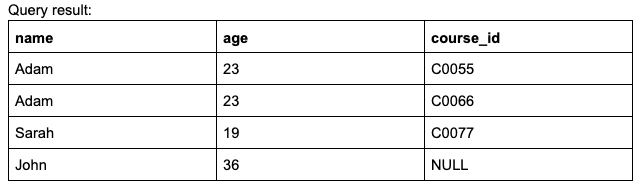
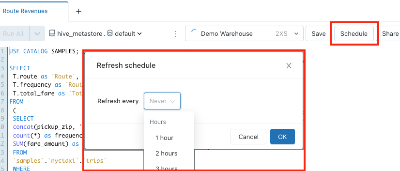
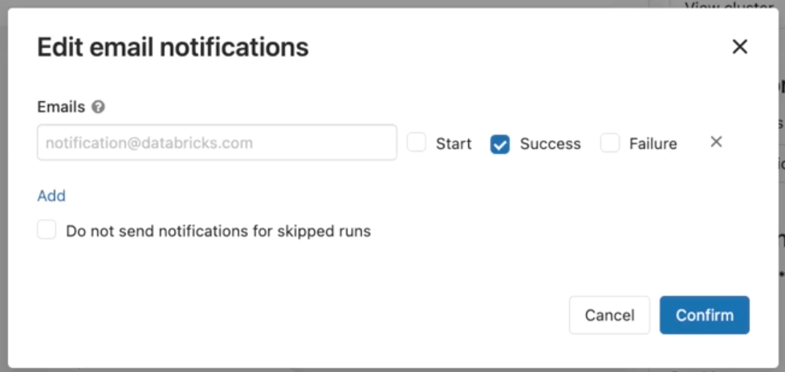
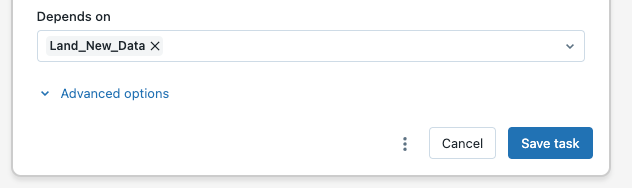
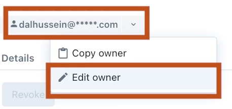

# T_002 (Practice Test 2)

#### Q1. One of the foundational technologies provided by the Databricks Lakehouse Platform is an open-source, file-based storage format that brings reliability to data lakes.

**Which of the following technologies is being described in the above statement?**

a) Delta Lives Tables (DLT)

b) ***Delta Lake***

c) Apache Spark

d) Unity Catalog

e) Photon

<u> **Overall explanation** </u>

Delta Lake is an open source technology that extends Parquet data files with a file-based transaction log for ACID transactions that brings reliability to data lakes.


> **References**: https://docs.databricks.com/delta/index.html

```
Domain
Databricks Lakehouse Platform
```

<br />

#### Q2. Which of the following commands can a data engineer use to purge stale data files of a Delta table?

a) DELETE

b) GARBAGE COLLECTION

c) CLEAN

d) ***VACUUM***

e) OPTIMIZE

<u> **Overall explanation** </u>

The VACUUM command deletes the unused data files older than a specified data retention period.

> **References**: https://docs.databricks.com/sql/language-manual/delta-vacuum.html

```
Domain
Databricks Lakehouse Platform
```

<br />

#### Q3. In Databricks Repos (Git folders), which of the following operations a data engineer can use to save local changes of a repo to its remote repository ?

a) Create Pull Request

b) Commit & Pull

c) ***Commit & Push***

d) Merge & Push

e) Merge & Pull

<u> **Overall explanation** </u>

Commit & Push is used to save the changes on a local repo, then uploads this local repo content to the remote repository.

> **References**:
- https://docs.databricks.com/repos/index.html
- https://github.com/git-guides/git-push

```
Domain
Databricks Lakehouse Platform
```

<br />

#### Q4. In Delta Lake tables, which of the following is the primary format for the transaction log files?

a) Delta

b) Parquet

c) ***JSON***

d) Hive-specific format

e) XML

<u> **Overall explanation** </u>

Delta Lake builds upon standard data formats. Delta lake table gets stored on the storage in one or more data files in Parquet format, along with transaction logs in JSON format.

> **References**: https://docs.databricks.com/delta/index.html

```
Domain
Databricks Lakehouse Platform
```

<br />

#### Q5. Which of the following functionalities can be performed in Databricks Repos (Git folders)?

a) Create pull requests

b) Create new remote Git repositories

c) Delete branches

d) Create CI/CD pipelines

e) ***Pull from a remote Git repository***

<u> **Overall explanation** </u>

Databricks Repos supports git Pull operation. It is used to fetch and download content from a remote repository and immediately update the local repo to match that content.

> **References**s:
•	https://docs.databricks.com/repos/index.html
•	https://github.com/git-guides/git-pull

```
Domain
Databricks Lakehouse Platform
```

<br />

#### Q6. Which of the following locations completely hosts the customer data ?

a) ***Customer's cloud account***

b) Control plane

c) Databricks account

d) Databricks-managed cluster

e) Repos

<u> **Overall explanation** </u>

According to the Databricks Lakehouse architecture, the storage account hosting the customer data is provisioned in the data plane in the Databricks customer's cloud account.

> **References**: https://docs.databricks.com/getting-started/overview.html

```
Domain
Databricks Lakehouse Platform
```

<br />

#### Q7. If the default notebook language is Python, which of the following options a data engineer can use to run SQL commands in this Python Notebook ?

a) They need first to import the SQL library in a cell

b) This is not possible! They need to change the default language of the notebook to SQL

c) Databricks detects cells language automatically, so they can write SQL syntax in any cell

d) They can add `%language` magic command at the start of a cell to force language detection.

e) ***They can add %sql at the start of a cell.***

<u> **Overall explanation** </u>

By default, cells use the default language of the notebook. You can override the default language in a cell by using the language magic command at the beginning of a cell. The supported magic commands are: %python, %sql, %scala, and %r.

> **References**: https://docs.databricks.com/notebooks/notebooks-code.html

```
Domain
Databricks Lakehouse Platform
```

<br />

#### Q8. A junior data engineer uses the built-in Databricks Notebooks versioning for source control. A senior data engineer recommended using Databricks Repos (Git folders) instead.
**Which of the following could explain why Databricks Repos is recommended instead of Databricks Notebooks versioning?**

a) ***Databricks Repos supports creating and managing branches for development work.***

b) Databricks Repos automatically tracks the changes and keeps the history.

c) Databricks Repos allows users to resolve merge conflicts

d) Databricks Repos allows users to restore previous versions of a notebook

e) All of these advantages explain why Databricks Repos is recommended instead of Notebooks versioning

<u> **Overall explanation** </u>

One advantage of Databricks Repos over the built-in Databricks Notebooks versioning is that Databricks Repos supports creating and managing branches for development work.

> **References**: https://docs.databricks.com/repos/index.html

```
Domain
Databricks Lakehouse Platform
```

<br />

#### Q9. Which of the following services provides a data warehousing experience to its users?

a) ***Databricks SQL***

b) Databricks Machine Learning

c) Data Science and Engineering Workspace

d) Unity Catalog

e) Delta Lives Tables (DLT)

<u> **Overall explanation** </u>

Databricks SQL (DB SQL) is a data warehouse on the Databricks Lakehouse Platform that lets you run all your SQL and BI applications at scale.

> **References**: https://www.databricks.com/product/databricks-sql

```
Domain
Databricks Lakehouse Platform
```

<br />

#### Q10. A data engineer noticed that there are unused data files in the directory of a Delta table. They executed the VACUUM command on this table; however, only some of those unused data files have been deleted.
**Which of the following could explain why only some of the unused data files have been deleted after running the VACUUM command ?**

a) The deleted data files were larger than the default size threshold. While the remaining files are smaller than the default size threshold and can not be deleted.

b) The deleted data files were smaller than the default size threshold. While the remaining files are larger than the default size threshold and can not be deleted.

c) ***The deleted data files were older than the default retention threshold. While the remaining files are newer than the default retention threshold and can not be deleted.***

d) The deleted data files were newer than the default retention threshold. While the remaining files are older than the default retention threshold and can not be deleted.

e) More information is needed to determine the correct answer

<u> **Overall explanation** </u>

Running the VACUUM command on a Delta table deletes the unused data files older than a specified data retention period. Unused files newer than the default retention threshold are kept untouched.

> **References**: https://docs.databricks.com/sql/language-manual/delta-vacuum.html

```
Domain
Databricks Lakehouse Platform
```

<br />

#### Q11. The data engineering team has a Delta table called products that contains products’ details including the net price.
**Which of the following code blocks will apply a 50% discount on all the products where the price is greater than 1000 and save the new price to the table?**

a) `UPDATE products SET price = price * 0.5 WHERE price >= 1000;`

b) `SELECT price * 0.5 AS new_price FROM products WHERE price > 1000;`

c) `MERGE INTO products WHERE price < 1000 WHEN MATCHED UPDATE price = price * 0.5;`

d) ***`UPDATE products SET price = price * 0.5 WHERE price > 1000;`***

e) `MERGE INTO products WHERE price > 1000 WHEN MATCHED UPDATE price = price * 0.5;`


<u> **Overall explanation** </u>

The UPDATE statement is used to modify the existing records in a table that match the WHERE condition. In this case, we are updating the products where the price is strictly greater than 1000.

Syntax:
```
UPDATE table_name
SET column_name = expr
WHERE condition
```

> **References**:
https://docs.databricks.com/sql/language-manual/delta-update.html

```
Domain
Databricks Lakehouse Platform
```

<br />

#### Q12. A data engineer wants to create a relational object by pulling data from two tables. The relational object will only be used in the current session. In order to save on storage costs, the date engineer wants to avoid copying and storing physical data.
**Which of the following relational objects should the data engineer create?**

a) External table

b) ***Temporary view***

c) Managed table

d) Global Temporary view

e) View

<u> **Overall explanation** </u>

In order to avoid copying and storing physical data, the data engineer must create a view object. A view in databricks is a virtual table that has no physical data. It’s just a saved SQL query against actual tables.
The view type should be Temporary view since it’s tied to a Spark session and dropped when the session ends.

> **References**: https://docs.databricks.com/sql/language-manual/sql-ref-syntax-ddl-create-view.html

```
Domain
ELT with Spark SQL and Python
```

<br />

#### Q13. A data engineer has a database named `db_hr`, and they want to know where this database was created in the underlying storage.
***Which of the following commands can the data engineer use to complete this task?***

a) DESCRIBE db_hr

b) DESCRIBE EXTENDED db_hr

c) ***DESCRIBE DATABASE db_hr***

d) SELECT location FROM db_hr.db

e) There is no need for a command since all databases are created under the default hive metastore directory

<u> **Overall explanation** </u>

The `DESCRIBE DATABASE` or `DESCRIBE SCHEMA` returns the metadata of an existing database (schema). The metadata information includes the database’s name, comment, and location on the filesystem. If the optional `EXTENDED` option is specified, database properties are also returned.

Syntax:
> DESCRIBE DATABASE [ EXTENDED ] database_name

> **References**: https://docs.databricks.com/sql/language-manual/sql-ref-syntax-aux-describe-schema.html

```
Domain
Databricks Lakehouse Platform
```

<br />

#### Q14. Which of the following commands a data engineer can use to register the table orders from an existing SQLite database ?

a) 
```
CREATE TABLE orders
	USING sqlite
	OPTIONS (
	    url "jdbc:sqlite:/bookstore.db",
	    dbtable "orders"
	)
```

b) ***CORRECT ANSWER***
```
CREATE TABLE orders
	USING org.apache.spark.sql.jdbc
	OPTIONS (
	    url "jdbc:sqlite:/bookstore.db",
	    dbtable "orders"
	)
```

c) 
```
CREATE TABLE orders
	USING cloudfiles
	OPTIONS (
	    url "jdbc:sqlite:/bookstore.db",
	    dbtable "orders"
	)
```

d) 
```
CREATE TABLE orders
	USING EXTERNAL
	OPTIONS (
	    url "jdbc:sqlite:/bookstore.db",
	    dbtable "orders"
	)
```

e) 
```
CREATE TABLE orders
	USING DATABASE
	OPTIONS (
	    url "jdbc:sqlite:/bookstore.db",
	    dbtable "orders"
	)
```

<u> **Overall explanation** </u>

Using the JDBC library, Spark SQL can extract data from any existing relational database that supports JDBC. Examples include mysql, postgres, SQLite, and more.

> **References**: https://learn.microsoft.com/en-us/azure/databricks/external-data/jdbc

```
Domain
ELT with Spark SQL and Python
```

<br />

#### Q15. When dropping a Delta table, which of the following explains why both the table's metadata and the data files will be deleted ?

a) The table is shallow cloned

b) The table is external

c) The user running the command has the necessary permissions to delete the data files

d) ***The table is managed***

e) The data files are older than the default retention period

<u> **Overall explanation** </u>

Managed tables are tables whose metadata and the data are managed by Databricks.
When you run DROP TABLE on a managed table, both the metadata and the underlying data files are deleted.

> **References**: https://docs.databricks.com/lakehouse/data-objects.html#what-is-a-managed-table

```
Domain
ELT with Spark SQL and Python
```

<br />

#### Q16. Given the following commands:

```
CREATE DATABASE db_hr;
	 
USE db_hr;
CREATE TABLE employees;
```

**In which of the following locations will the employees table be located?**

a) dbfs:/user/hive/warehouse

b) ***dbfs:/user/hive/warehouse/db_hr.db***

c) dbfs:/user/hive/warehouse/db_hr

d) dbfs:/user/hive/databases/db_hr.db

e) More information is needed to determine the correct answer

<u> **Overall explanation** </u>

Since we are creating the database here without specifying a `LOCATION` clause, the database will be created in the default warehouse directory under dbfs:/user/hive/warehouse. The database folder have the extension (.db)
And since we are creating the table also without specifying a `LOCATION` clause, the table becomes a managed table created under the database directory (in db_hr.db folder)

> **References**: https://docs.databricks.com/sql/language-manual/sql-ref-syntax-ddl-create-schema.html

```
Domain
ELT with Spark SQL and Python
```

<br />

#### Q17. Which of the following code blocks can a data engineer use to create a Python function to multiply two integers and return the result?

a) 
```
def multiply_numbers(num1, num2):
    print(num1 * num2)
```

b) 
```
def fun: multiply_numbers(num1, num2):
    return num1 * num2
```

c) ***CORRECT***
```
def multiply_numbers(num1, num2):
    return num1 * num2
```

d) 
```
fun multiply_numbers(num1, num2):
    return num1 * num2
```

e) 
```
fun def multiply_numbers(num1, num2):
    return num1 * num2
```

<u> **Overall explanation** </u>

In Python, a function is defined using the `def` keyword. Here, we used the `return` keyword since the question clearly asks to return the result, and not printing the output.

Syntax:
```
def function_name(params):
    return params
```

> **References**: https://www.w3schools.com/python/python_functions.asp

```
Domain
ELT with Spark SQL and Python
```

<br />

#### Q18. Given the following 2 tables:



**Fill in the blank to make the following query returns the below result**:

```
SELECT students.name, students.age, enrollments.course_id
FROM students
_____________ enrollments
ON students.student_id = enrollments.student_id
```



a) RIGHT JOIN

b) ***LEFT JOIN***

c) INNER JOIN

d) ANTI JOIN

e) CROSS JOIN

<u> **Overall explanation** </u>

`LEFT JOIN` returns all values from the left table and the matched values from the right table, or appends NULL if there is no match. In the above example, we see NULL in the course_id of John (U0003) since he is not enrolled in any course.

> **References**: https://docs.databricks.com/sql/language-manual/sql-ref-syntax-qry-select-join.html

```
Domain
ELT with Spark SQL and Python
```

<br />

#### Q19. Which of the following SQL keywords can be used to rotate rows of a table by turning row values into multiple columns ?

a) ROTATE

b) TRANSFORM

c) ***PIVOT***

d) GROUP BY

e) ZORDER BY

<u> **Overall explanation** </u>

`PIVOT` transforms the rows of a table by rotating unique values of a specified column list into separate columns. In other words, It converts a table from a long format to a wide format.

> **References**: https://docs.databricks.com/sql/language-manual/sql-ref-syntax-qry-select-pivot.html

```
Domain
ELT with Spark SQL and Python
```

<br />

#### Q20. Fill in the below blank to get the number of courses incremented by 1 for each student in array column students.

```
SELECT
    faculty_id,
    students,
    ___________ AS new_totals
FROM faculties

```

a) TRANSFORM (students, total_courses + 1)

b) ***TRANSFORM (students, i -> i.total_courses + 1)***

c) FILTER (students, total_courses + 1)

d) FILTER (students, i -> i.total_courses + 1)

e) 
```
CASE WHEN students.total_courses IS NOT NULL THEN students.total_courses + 1
ELSE NULL
END
```

<u> **Overall explanation** </u>

`transform(input_array, lambd_function)` is a higher order function that returns an output array from an input array by transforming each element in the array using a given lambda function.

Example:
`SELECT transform(array(1, 2, 3), x -> x + 1);`
output: [2, 3, 4]


> **References**:
•	https://docs.databricks.com/sql/language-manual/functions/transform.html
•	https://docs.databricks.com/optimizations/higher-order-lambda-functions.html

```
Domain
ELT with Spark SQL and Python
```

<br />

#### Q21. Fill in the below blank to successfully create a table using data from CSV files located at `/path/input`.

```
CREATE TABLE my_table
    (col1 STRING, col2 STRING)
    ____________
    OPTIONS (header = "true",
    delimiter = ";")
    LOCATION = "/path/input"
```

a) FROM CSV

b) ***USING CSV***

c) USING DELTA

d) AS

e) AS CSV

<u> **Overall explanation** </u>

`CREATE TABLE USING` allows to specify an external data source type like CSV format, and with any additional options. This creates an external table pointing to files stored in an external location.

> **References**: https://docs.databricks.com/sql/language-manual/sql-ref-syntax-ddl-create-table-using.html

```
Domain
ELT with Spark SQL and Python
```

<br />

#### Q22. Which of the following statements best describes the usage of `CREATE SCHEMA` command ?

a) It's used to create a table schema (columns names and datatype)

b) It’s used to create a Hive catalog

c) It’s used to infer and store schema in “cloudFiles.schemaLocation”

d) ***It’s used to create a database***

e) It’s used to merge the schema when writing data into a target table

<u> **Overall explanation** </u>

`CREATE SCHEMA` is an alias for `CREATE DATABASE` statement. While usage of SCHEMA and DATABASE is interchangeable, SCHEMA is preferred.

> **References**: https://docs.databricks.com/sql/language-manual/sql-ref-syntax-ddl-create-database.html

```
Domain
ELT with Spark SQL and Python
```

<br />

#### Q23. Which of the following statements is Not true about CTAS statements ?

a) CTAS statements automatically infer schema information from query results

b) ***CTAS statements support manual schema declaration***

c) CTAS statements stand for CREATE TABLE _ AS SELECT statement

d) With CTAS statements, data will be inserted during the table creation

e) All these statements are Not true about CTAS statements

<u> **Overall explanation** </u>

`CREATE TABLE AS SELECT` statements, or CTAS statements create and populate Delta tables using the output of a SELECT query. CTAS statements automatically infer schema information from query results and do not support manual schema declaration.

> **References**: (cf. `AS query` clause)
https://docs.databricks.com/sql/language-manual/sql-ref-syntax-ddl-create-table-using.html

```
Domain
ELT with Spark SQL and Python
```

<br />

#### Q24. Which of the following SQL commands will append this new row to the existing Delta table users?

a) `APPEND INTO users VALUES (“0015”, “Adam”, 23)`

b) ***`INSERT VALUES (“0015”, “Adam”, 23)  INTO users`***

c) `APPEND VALUES (“0015”, “Adam”, 23) INTO users`

d) `INSERT INTO users VALUES (“0015”, “Adam”, 23)`

e) `UPDATE users VALUES (“0015”, “Adam”, 23)`

<u> **Overall explanation** </u>

`INSERT INTO` allows inserting new rows into a Delta table. You specify the inserted rows by value expressions or the result of a query.

> **References**: https://docs.databricks.com/sql/language-manual/sql-ref-syntax-dml-insert-into.html

```
Domain
ELT with Spark SQL and Python
```

<br />

#### Q25. Given the following Structured Streaming query:

```
(spark.table("orders")
    .withColumn("total_after_tax", col("total")+col("tax"))
    .writeStream
    .option("checkpointLocation", checkpointPath)
    .outputMode("append")
    .___________
    .table("new_orders") )
```
**Fill in the blank to make the query executes multiple micro-batches to process all available data, then stops the trigger.**

a) trigger(“micro-batches”)

b) trigger(once=True)

c) trigger(processingTime=”0 seconds")

d) trigger(micro-batches=True)

e) ***trigger(availableNow=True)***

<u> **Overall explanation** </u>

In Spark Structured Streaming, we use trigger(availableNow=True) to run the stream in batch mode where it processes all available data in multiple micro-batches. The trigger will stop on its own once it finishes processing the available data.

> **References**: https://docs.databricks.com/structured-streaming/triggers.html#configuring-incremental-batch-processing

```
Domain
Incremental Data Processing
```

<br />

#### Q26. Which of the following techniques allows Auto Loader to track the ingestion progress and store metadata of the discovered files ?

a) mergeSchema

b) COPY INTO

c) Watermarking

d) ***Checkpointing***

e) Z-Ordering

<u> **Overall explanation** </u>

Auto Loader keeps track of discovered files using checkpointing in the checkpoint location. Checkpointing allows Auto loader to provide exactly-once ingestion guarantees.

> **References**: https://docs.databricks.com/ingestion/auto-loader/index.html#how-does-auto-loader-track-ingestion-progress

```
Domain
Incremental Data Processing
```

<br />

#### Q27. A data engineer has defined the following data quality constraint in a Delta Live Tables pipeline:

```
CONSTRAINT valid_id EXPECT (id IS NOT NULL) _____________
```
**Fill in the above blank so records violating this constraint cause the pipeline to fail.**

a) ON VIOLATION FAIL

b) ***ON VIOLATION FAIL UPDATE***

c) ON VIOLATION DROP ROW

d) ON VIOLATION FAIL PIPELINE

e) There is no need to add ON VIOLATION clause. By default, records violating the constraint cause the pipeline to fail.

<u> **Overall explanation** </u>

With `ON VIOLATION FAIL UPDATE`, records that violate the expectation will cause the pipeline to fail. When a pipeline fails because of an expectation violation, you must fix the pipeline code to handle the invalid data correctly before re-running the pipeline.

> **References**:
https://learn.microsoft.com/en-us/azure/databricks/workflows/delta-live-tables/delta-live-tables-expectations#--fail-on-invalid-records

```
Domain
Incremental Data Processing
```

<br />

#### Q28. In multi-hop architecture, which of the following statements best describes the Silver layer tables?

a) They maintain data that powers analytics, machine learning, and production applications

b) They maintain raw data ingested from various sources

c) The table structure in this layer resembles that of the source system table structure with any additional metadata columns like the load time, and input file name.

d) They provide business-level aggregated version of data

e) ***They provide a more refined view of raw data, where it’s filtered, cleaned, and enriched.***

<u> **Overall explanation** </u>

Silver tables provide a more refined view of the raw data. For example, data can be cleaned and filtered at this level. And we can also join fields from various bronze tables to enrich our silver records

> **References**:
https://www.databricks.com/glossary/medallion-architecture

```
Domain
Incremental Data Processing
```

<br />

#### Q29. The data engineer team has a DLT pipeline that updates all the tables at defined intervals until manually stopped. The compute resources of the pipeline continue running to allow for quick testing.
**Which of the following best describes the execution modes of this DLT pipeline ?**

a) The DLT pipeline executes in Continuous Pipeline mode under Production mode.

b) ***The DLT pipeline executes in Continuous Pipeline mode under Development mode.***

c) The DLT pipeline executes in Triggered Pipeline mode under Production mode.

d) The DLT pipeline executes in Triggered Pipeline mode under Development mode.

e) More information is needed to determine the correct response

<u> **Overall explanation** </u>

Continuous pipelines update tables continuously as input data changes. Once an update is started, it continues to run until the pipeline is shut down.

In Development mode, the Delta Live Tables system ease the development process by
•	Reusing a cluster to avoid the overhead of restarts. The cluster runs for two hours when development mode is enabled.
•	Disabling pipeline retries so you can immediately detect and fix errors.

> **References**:
https://docs.databricks.com/workflows/delta-live-tables/delta-live-tables-concepts.html

```
Domain
Incremental Data Processing
```

<br />

#### Q30. Given the following Structured Streaming query:

```
(
    spark.readStream
        .table("cleanedOrders")
        .groupBy("productCategory")
        .agg(sum("totalWithTax"))
        .writeStream
        .option("checkpointLocation", checkpointPath)
        .outputMode("complete")
        .table("aggregatedOrders")
)
```
**Which of the following best describe the purpose of this query in a multi-hop architecture?**

a) The query is performing raw data ingestion into a Bronze table

b) The query is performing a hop from a Bronze table to a Silver table

c) ***The query is performing a hop from Silver layer to a Gold table***

d) The query is performing data transfer from a Gold table into a production application

e) This query is performing data quality controls prior to Silver layer

<u> **Overall explanation** </u>

The above Structured Streaming query creates business-level aggregates from clean orders data in the silver table cleanedOrders, and loads them in the gold table aggregatedOrders.

> **References**:
https://www.databricks.com/glossary/medallion-architecture

```
Domain
Incremental Data Processing
```

<br />

#### Q31. Given the following Structured Streaming query:

```
(
    (spark.readStream
        .table("orders")
        .writeStream
        .option("checkpointLocation", checkpointPath)
        .table("Output_Table")
)
```
**Which of the following is the trigger Interval for this query ?**

a) ***Every half second***

b) Every half min

c) Every half hour

d) The query will run in batch mode to process all available data at once, then the trigger stops.

e) More information is needed to determine the correct response


<u> **Overall explanation** </u>

By default, if you don’t provide any trigger interval, the data will be processed every half second. This is equivalent to trigger(processingTime=”500ms")

> **References**: https://docs.databricks.com/structured-streaming/triggers.html#what-is-the-default-trigger-interval

```
Domain
Incremental Data Processing
```

<br />

#### Q32. A data engineer has the following query in a Delta Live Tables pipeline
**The pipeline is failing to start due to an error in this query.**

**Which of the following changes should be made to this query to successfully start the DLT pipeline ?**

a) 
```
CREATE LIVE TABLE sales_silver
AS
    SELECT store_id, total + tax AS total_after_tax
    FROM STREAMING(LIVE.sales_bronze)
```

b) 
```
CREATE STREAMING TABLE sales_silver
AS
    SELECT store_id, total + tax AS total_after_tax
    FROM STREAMING(STREAM.sales_bronze)
```

c) 
```
CREATE STREAMING TABLE sales_silver
AS
    SELECT store_id, total + tax AS total_after_tax
    FROM STREAM(sales_bronze)
```

d) 
```
CREATE STREAMING TABLE sales_silver
AS
    SELECT store_id, total + tax AS total_after_tax
    FROM STREAMING(LIVE.sales_bronze)
```

e) ***CORRECT ANSWER***
```
CREATE STREAMING TABLE sales_silver
AS
    SELECT store_id, total + tax AS total_after_tax
    FROM STREAM(LIVE.sales_bronze)
```

<u> **Overall explanation** </u>

In DLT pipelines, You can stream data from other tables in the same pipeline by using the STREAM() function. In this case, you must define a streaming table using the CREATE STREAMING TABLE syntax*.

Remember, to query another DLT table, prepend always the LIVE. keyword to the table name.
```
CREATE STREAMING TABLE table_name
AS
    SELECT *
    FROM STREAM(LIVE.another_table)
```
* Note that the previously used `CREATE STREAMING LIVE TABLE` syntax is now deprecated; however, you may still encounter it in the current exam version.

> **References**: https://docs.databricks.com/workflows/delta-live-tables/delta-live-tables-incremental-data.html#streaming-from-other-datasets-within-a-pipeline&language-sql

```
Domain
Incremental Data Processing
```

<br />

#### Q33. In multi-hop architecture, which of the following statements best describes the Gold layer tables?

a) They provide a more refined view of the data

b) They maintain raw data ingested from various sources

c) The table structure in this layer resembles that of the source system table structure with any additional metadata columns like the load time, and input file name.

d) ***They provide business-level aggregations that power analytics, machine learning, and production applications***

e) They represent a filtered, cleaned, and enriched version of data

<u> **Overall explanation** </u>

Gold layer is the final layer in the multi-hop architecture, where tables provide business level aggregates often used for reporting and dashboarding, or even for Machine learning.

> **References**:
https://www.databricks.com/glossary/medallion-architecture

```
Domain
Incremental Data Processing
```

<br />

#### Q34. The data engineer team has a DLT pipeline that updates all the tables once and then stops. The compute resources of the pipeline terminate when the pipeline is stopped.
**Which of the following best describes the execution modes of this DLT pipeline ?**

a) The DLT pipeline executes in Continuous Pipeline mode under Production mode.

b) The DLT pipeline executes in Continuous Pipeline mode under Development mode.

c) ***The DLT pipeline executes in Triggered Pipeline mode under Production mode.***

d) The DLT pipeline executes in Triggered Pipeline mode under Development mode.

e) More information is needed to determine the correct response

<u> **Overall explanation** </u>

Triggered pipelines update each table with whatever data is currently available and then they shut down.

In Production mode, the Delta Live Tables system:
•	Terminates the cluster immediately when the pipeline is stopped.
•	Restarts the cluster for recoverable errors (e.g., memory leak or stale credentials).
•	Retries execution in case of specific errors (e.g., a failure to start a cluster)

> **References**:
https://docs.databricks.com/workflows/delta-live-tables/delta-live-tables-concepts.html

```
Domain
Incremental Data Processing
```

<br />

#### Q35. A data engineer needs to determine whether to use Auto Loader or COPY INTO command in order to load input data files incrementally.
**In which of the following scenarios should the data engineer use Auto Loader over COPY INTO command ?**

a) ***If they are going to ingest files in the order of millions or more over time***

b) If they are going to ingest few number of files in the order of thousands

c) If they are going to load a subset of re-uploaded files

d) If the data schema is not going to evolve frequently

e) There is no difference between using Auto Loader and Copy Into command

<u> **Overall explanation** </u>

Here are a few things to consider when choosing between Auto Loader and COPY INTO command:

•	If you’re going to ingest files in the order of thousands, you can use COPY INTO. If you are expecting files in the order of millions or more over time, use Auto Loader.
•	If your data schema is going to evolve frequently, Auto Loader provides better primitives around schema inference and evolution.

> **References**: https://docs.databricks.com/ingestion/index.html#when-to-use-copy-into-and-when-to-use-auto-loader

```
Domain
Incremental Data Processing
```

<br />

#### Q36. From which of the following locations can a data engineer set a schedule to automatically refresh a Databricks SQL query ?

a) From the jobs Ul

b) From the SQL warehouses page in Databricks SQL

c) From the Alerts page in Databricks SQL

d) ***From the query's page in Databricks SQL***

e) There is no way to automatically refresh a query in Databricks SQL. Schedules can be set only for dashboards to refresh their underlying queries.

<u> **Overall explanation** </u>

In Databricks SQL, you can set a schedule to automatically refresh a query from the query's page.



> **References**: https://docs.databricks.com/sql/user/queries/schedule-query.html

```
Domain
Production Pipelines
```

<br />

#### Q37. Databricks provides a declarative ETL framework for building reliable and maintainable data processing pipelines, while maintaining table dependencies and data quality.
**Which of the following technologies is being described above?**

a) ***Delta Live Tables***

b) Delta Lake

c) Databricks Jobs

d) Unity Catalog Linage

e) Databricks SQL

<u> **Overall explanation** </u>

Delta Live Tables is a framework for building reliable, maintainable, and testable data processing pipelines. You define the transformations to perform on your data, and Delta Live Tables manages task orchestration, cluster management, monitoring, data quality, and error handling.

> **References**: https://docs.databricks.com/workflows/delta-live-tables/index.html

```
Domain
Production Pipelines
```

<br />

#### Q38. Which of the following services can a data engineer use for orchestration purposes in Databricks platform ?

a) Delta Live Tables

b) Cluster Pools

c) ***Databricks Jobs***

d) Data Explorer

e) Unity Catalog Linage

<u> **Overall explanation** </u>

Databricks Jobs allow to orchestrate data processing tasks. This means the ability to run and manage multiple tasks as a directed acyclic graph (DAG) in a job.

> **References**: https://docs.databricks.com/workflows/jobs/jobs.html

```
Domain
Production Pipelines
```

<br />

#### Q39. A data engineer has a Job with multiple tasks that takes more than 2 hours to complete. In the last run, the final task unexpectedly failed.
**Which of the following actions can the data engineer perform to complete this Job Run while minimizing the execution time ?**

a) They can rerun this Job Run to execute all the tasks

b) ***They can repair this Job Run so only the failed tasks will be re-executed***

c) They need to delete the failed Run, and start a new Run for the Job

d) They can keep the failed Run, and simply start a new Run for the Job

e) They can run the Job in Production mode which automatically retries execution in case of errors

<u> **Overall explanation** </u>

You can repair failed multi-task jobs by running only the subset of unsuccessful tasks and any dependent tasks. Because successful tasks are not re-run, this feature reduces the time and resources required to recover from unsuccessful job runs.

> **References**: https://docs.databricks.com/workflows/jobs/repair-job-failures.html

```
Domain
Production Pipelines
```

<br />

#### Q40. A data engineering team has a multi-tasks Job in production. The team members need to be notified in the case of job failure.
**Which of the following approaches can be used to send emails to the team members in the case of job failure ?**

a) They can use Job API to programmatically send emails according to each task status

b) ***They can configure email notifications settings in the job page***

c) There is no way to notify users in the case of job failure

d) Only Job owner can be configured to be notified in the case of job failure

e) They can configure email notifications settings per notebook in the task page

<u> **Overall explanation** </u>

Databricks Jobs support email notifications to be notified in the case of job start, success, or failure. Simply, click Edit email notifications from the details panel in the Job page. From there, you can add one or more email addresses.



> **References**: https://docs.databricks.com/workflows/jobs/jobs.html#alerts-job

```
Domain
Production Pipelines
```

<br />

#### Q41. For production jobs, which of the following cluster types is recommended to use?

a) All-purpose clusters

b) Production clusters

c) ***Job clusters***

d) On-premises clusters

e) Serverless clusters

<u> **Overall explanation** </u>

Job Clusters are dedicated clusters for a job or task run. A job cluster auto terminates once the job is completed, which saves cost compared to all-purpose clusters.
In addition, Databricks recommends using job clusters in production so that each job runs in a fully isolated environment.

> **References**: https://docs.databricks.com/workflows/jobs/jobs.html#choose-the-correct-cluster-type-for-your-job

```
Domain
Production Pipelines
```

<br />

#### Q42. In Databricks Jobs, which of the following approaches can a data engineer use to configure a linear dependency between `Task A` and `Task B` ?

a) ***They can select the Task A in the Depends On field of the Task B configuration***

b) They can assign Task A an Order number of 1, and assign Task B an Order number of 2

c) They can visually drag and drop an arrow from Task A to Task B in the Job canvas

d) They can configure the dependency at the notebook level using the dbutils.jobs utility

e) Databricks Jobs do not support linear dependency between tasks. This can only be achieved in Delta Live Tables pipelines

<u> **Overall explanation** </u>

You can define the order of execution of tasks in a job using the Depends on dropdown menu. You can set this field to one or more tasks in the job.



> **References**: https://docs.databricks.com/workflows/jobs/jobs.html#task-dependencies

```
Domain
Production Pipelines
```

<br />

#### Q43. Which part of the Databricks Platform can a data engineer use to revoke permissions from users on tables ?

a) ***Data Explorer***

b) Cluster event log

c) Workspace Admin Console

d) DBFS

e) There is no way to revoke permissions in Databricks platform. The data engineer needs to clone the table with the updated permissions

<u> **Overall explanation** </u>

Data Explorer in Databricks SQL allows you to manage data object permissions. This includes revoking privileges on tables and databases from users or groups of users.

> **References**: https://docs.databricks.com/security/access-control/data-acl.html#data-explorer

```
Domain
Data Governance
```

<br />

#### Q44. A data engineer uses the following SQL query:

> GRANT USAGE ON DATABASE sales_db TO finance_team

**Which of the following is the benefit of the USAGE  privilege ?**

a) Gives read access on the database

b) Gives full permissions on the entire database

c) Gives the ability to view database objects and their metadata

d) ***No effect! but it's required to perform any action on the database***

e) USAGE privilege is not part of the Databricks governance model

<u> **Overall explanation** </u>

The USAGE does not give any abilities, but it's an additional requirement to perform any action on a schema (database) object.

> **References**: https://docs.databricks.com/security/access-control/table-acls/object-privileges.html#privileges

```
Domain
Data Governance
```

<br />

#### Q45. In which of the following locations can a data engineer change the owner of a table?

a) In DBFS, from the properties tab of the table’s data files

b) In Data Explorer, under the Permissions tab of the table's page

c) ***In Data Explorer, from the Owner field in the table's page***

d) In Data Explorer, under the Permissions tab of the database's page, since owners are set at database-level

e) In Data Explorer, from the Owner field in the database's page, since owners are set at database-level

<u> **Overall explanation** </u>

From Data Explorer in Databricks SQL, you can navigate to the table's page to review and change the owner of the table. Simply, click on the Owner field, then Edit owner to set the new owner.



> **References**: https://docs.databricks.com/security/access-control/data-acl.html#manage-data-object-ownership

```
Domain
Data Governance
```

<br />
