# T_003 (Practice Test 3)

#### Q1. You were asked to create a table that can store the below data, orderTime is a timestamp but the finance team when they query this data normally prefer the orderTime in date format, you would like to create a calculated column that can convert the orderTime column timestamp datatype to date and store it, fill in the blank to complete the DDL.

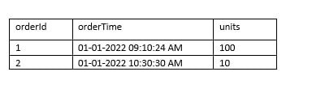

```
CREATE TABLE orders (
    orderId int,
    orderTime timestamp,
    orderdate date _____________________________________________ ,
    units int
)
```

a) `AS DEFAULT (CAST(orderTime as DATE))`

b) ***`GENERATED ALWAYS AS (CAST(orderTime as DATE))`***

c) `GENERATED DEFAULT AS (CAST(orderTime as DATE))`

d) `AS (CAST(orderTime as DATE))`

e) Delta lake does not support calculated columns, value should be inserted into the table as part of the ingestion process


**Overall explanation**

The answer is, `GENERATED ALWAYS AS (CAST(orderTime as DATE))`
https://docs.microsoft.com/en-us/azure/databricks/delta/delta-batch#--use-generated-columns
Delta Lake supports generated columns which are a special type of columns whose values are automatically generated based on a user-specified function over other columns in the Delta table. When you write to a table with generated columns and you do not explicitly provide values for them, Delta Lake automatically computes the values.

> Note: *Databricks also supports partitioning using generated column*

```
Domain
ELT with Spark SQL and Python
```

<br />

#### Q2. The data engineering team noticed that one of the job fails randomly as a result of using spot instances, what feature in Jobs/Tasks can be used to address this issue so the job is more stable when using spot instances?

a) ***Use Databrick REST API to monitor and restart the job

b) Use Jobs runs, active runs UI section to monitor and restart the job

c) Add second task and add a check condition to rerun the first task if it fails

d) Restart the job cluster, job automatically restarts

e) Add a retry policy to the task

**Overall explanation**

The answer is,  Add a retry policy to the task

Tasks in Jobs support Retry Policy, which can be used to retry a failed tasks,  especially when using spot instance it is common to have failed executors or driver.

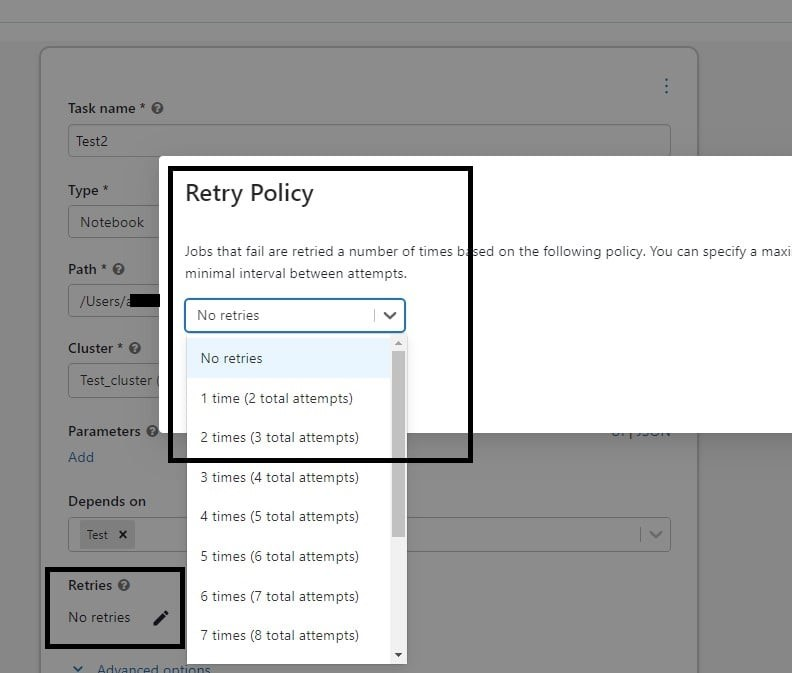

```
Domain
Production Pipelines
```

<br />

#### Q3. What is the main difference between `AUTO LOADER`  and `COPY INTO`?

a) COPY INTO supports schema evolution.

b) AUTO LOADER supports schema evolution.

c) COPY INTO supports file notification when performing incremental loads.

d) AUTO LOADER supports reading data from Apache Kafka

e) ***AUTO LOADER Supports file notification when performing incremental loads.***

**Overall explanation**

Auto loader supports both directory listing and file notification but COPY INTO only supports directory listing.

Auto loader file notification will automatically set up a notification service and queue service that subscribe to file events from the input directory in cloud object storage like Azure blob storage or S3. File notification mode is more performant and scalable for large input directories or a high volume of files.

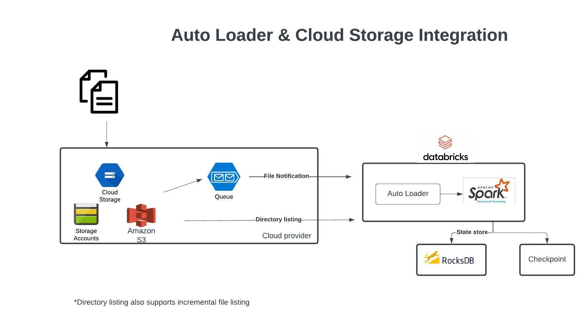

Auto Loader and Cloud Storage Integration

Auto Loader supports a couple of ways to ingest data incrementally

1.	Directory listing - List Directory and maintain the state in RocksDB, supports incremental file listing
2.	File notification - Uses a trigger+queue to store the file notification which can be later used to retrieve the file, unlike Directory listing File notification can scale up to millions of files per day.


[OPTIONAL]
Auto Loader vs COPY INTO?

Auto Loader
Auto Loader incrementally and efficiently processes new data files as they arrive in cloud storage without any additional setup. Auto Loader provides a new Structured Streaming source called cloudFiles. Given an input directory path on the cloud file storage, the cloudFiles source automatically processes new files as they arrive, with the option of also processing existing files in that directory.
When to use Auto Loader instead of the COPY INTO?

•	You want to load data from a file location that contains files in the order of millions or higher. Auto Loader can discover files more efficiently than the COPY INTO SQL command and can split file processing into multiple batches.
•	You do not plan to load subsets of previously uploaded files. With Auto Loader, it can be more difficult to reprocess subsets of files. However, you can use the COPY INTO SQL command to reload subsets of files while an Auto Loader stream is simultaneously running.


Auto loader file notification will automatically set up a notification service and queue service that subscribe to file events from the input directory in cloud object storage like Azure blob storage or S3. File notification mode is more performant and scalable for large input directories or a high volume of files.

Here are some additional notes on when to use COPY INTO vs Auto Loader

When to use COPY INTO
https://docs.databricks.com/delta/delta-ingest.html#copy-into-sql-command
When to use Auto Loader
https://docs.databricks.com/delta/delta-ingest.html#auto-loader

```
Domain
Incremental Data Processing
```

<br />

#### Q4. Why does AUTO LOADER require schema location?

a) Schema location is used to store user provided schema

b) Schema location is used to identify the schema of target table

c) AUTO LOADER does not require schema location, because its supports Schema evolution

d) ***Schema location is used to store schema inferred by AUTO LOADER***

e) Schema location is used to identify the schema of target table and source table

**Overall explanation**

The answer is, Schema location is used to store schema inferred by AUTO LOADER, so the next time AUTO LOADER runs faster as does not need to infer the schema every single time by trying to use the last known schema.

Auto Loader samples the first 50 GB or 1000 files that it discovers, whichever limit is crossed first. To avoid incurring this inference cost at every stream start up, and to be able to provide a stable schema across stream restarts, you must set the option cloudFiles.schemaLocation. Auto Loader creates a hidden directory _schemas at this location to track schema changes to the input data over time.

The below link contains detailed documentation on different options

(Auto Loader options | Databricks on AWS](https://databricks.com/blog/2020/01/30/what-is-a-data-lakehouse.html)

```
Domain
Incremental Data Processing
```

<br />

#### Q5. Which of the following statements are incorrect about the lakehouse

a) Support end-to-end streaming and batch workloads

b) Supports ACID

c) Support for diverse data types that can store both structured and unstructured

d) Supports BI and Machine learning

e) ***Storage is coupled with Compute***

**Overall explanation**

The answer is,  Storage is coupled with Compute.

The question was asking what is the incorrect option, in Lakehouse Storage is decoupled with compute so both can scale independently.

[What Is a Lakehouse? - The Databricks Blog](https://databricks.com/blog/2020/01/30/what-is-a-data-lakehouse.html)

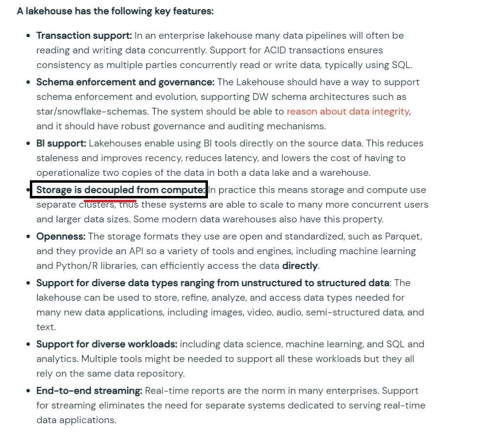

```
Domain
Databricks Lakehouse Platform
```

<br />

#### Q6. You are designing a data model that works for both machine learning using images and Batch ETL/ELT workloads. Which of the following features of data lakehouse can help you meet the needs of both workloads?

a) Data lakehouse requires very little data modeling.

b) Data lakehouse combines compute and storage for simple governance.

c) Data lakehouse provides autoscaling for compute clusters.

d) ***Data lakehouse can store unstructured data and support ACID transactions.***

e) Data lakehouse fully exists in the cloud.

**Overall explanation**

The answer is A data lakehouse stores unstructured data and is ACID-compliant,

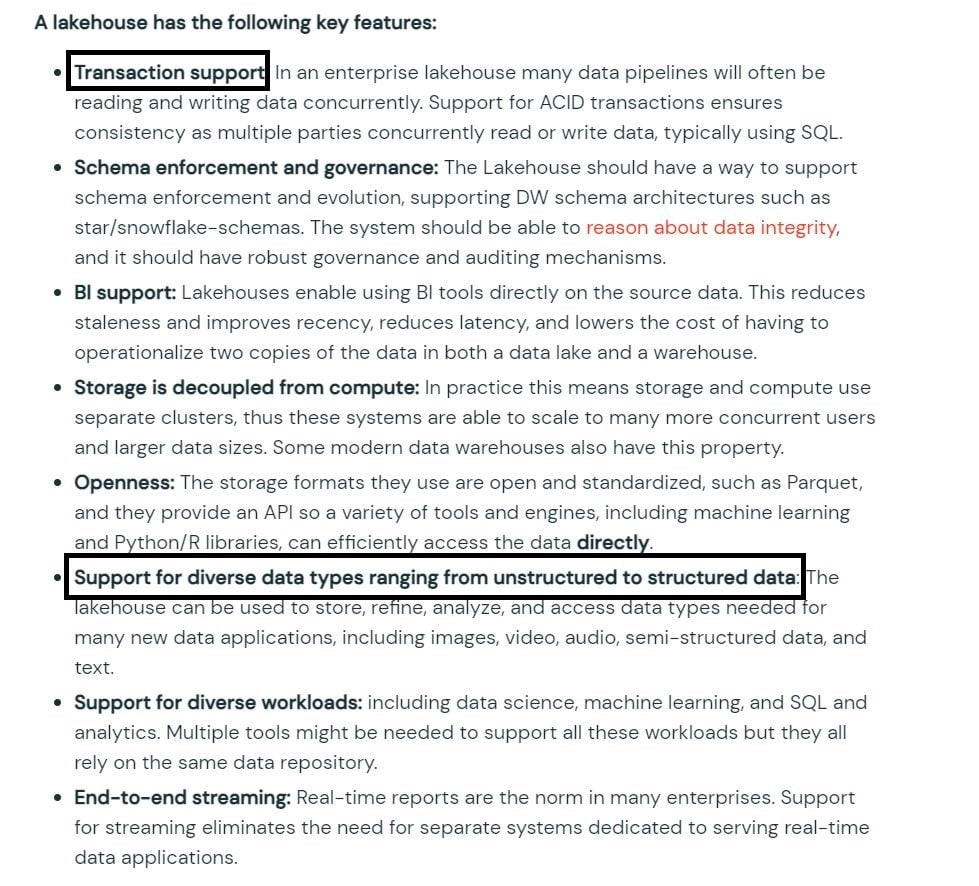

```
Domain
Databricks Lakehouse Platform
```

<br />

#### Q7. Which of the following locations in Databricks product architecture hosts jobs/pipelines and queries?

a) Data plane

b) ***Control plane***

c) Databricks Filesystem

d) JDBC data source

e) Databricks web application

**Overall explanation**

The answer is Control Plane,

Databricks operates most of its services out of a control plane and a data plane, please note serverless features like SQL Endpoint and DLT compute use shared compute in Control pane.

Control Plane: Stored in Databricks Cloud Account

•	The control plane includes the backend services that Databricks manages in its own Azure account. Notebook commands and many other workspace configurations are stored in the control plane and encrypted at rest.
Data Plane:  Stored in Customer Cloud Account

•	The data plane is managed by your Azure account and is where your data resides. This is also where data is processed. You can use Azure Databricks connectors so that your clusters can connect to external data sources outside of your Azure account to ingest data or for storage.

Here is the product architecture diagram highlighted where

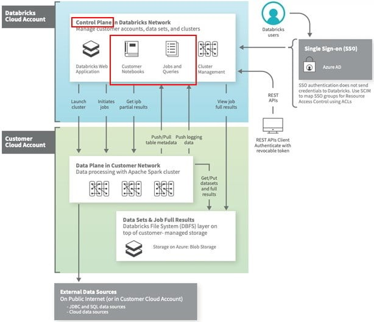

```
Domain
Databricks Lakehouse Platform
```

<br />

#### Q8. You are currently working on a notebook that will populate a reporting table for downstream process consumption, this process needs to run on a schedule every hour. what type of cluster are you going to use to set up this job?

a) Since it’s just a single job and we need to run every hour, we can use an all-purpose cluster

b) ***The job cluster is best suited for this purpose.***

c) Use Azure VM to read and write delta tables in Python

d) Use delta live table pipeline to run in continuous mode

**Overall explanation**

The answer is, The Job cluster is best suited for this purpose.

Since you don't need to interact with the notebook during the execution especially when it's a scheduled job, job cluster makes sense. Using an all-purpose cluster can be twice as expensive as a job cluster.
FYI,
When you run a job scheduler with option of creating a new cluster when the job is complete it terminates the cluster. You cannot restart a job cluster.

```
Domain
Databricks Lakehouse Platform
```

<br />

#### Q9. Which of the following developer operations in CI/CD flow can be implemented in Databricks Repos?

a) Merge when code is committed

b) Pull request and review process  

c) ***Trigger Databricks Repos API to pull the latest version of code into production folder***

d) Resolve merge conflicts

e) Delete a branch

**Overall explanation**

See the below diagram to understand the role Databricks Repos and Git provider plays when building a CI/CD workflow.
All the steps highlighted in yellow can be done Databricks Repo, all the steps highlighted in Gray are done in a git provider like Github or Azure DevOps

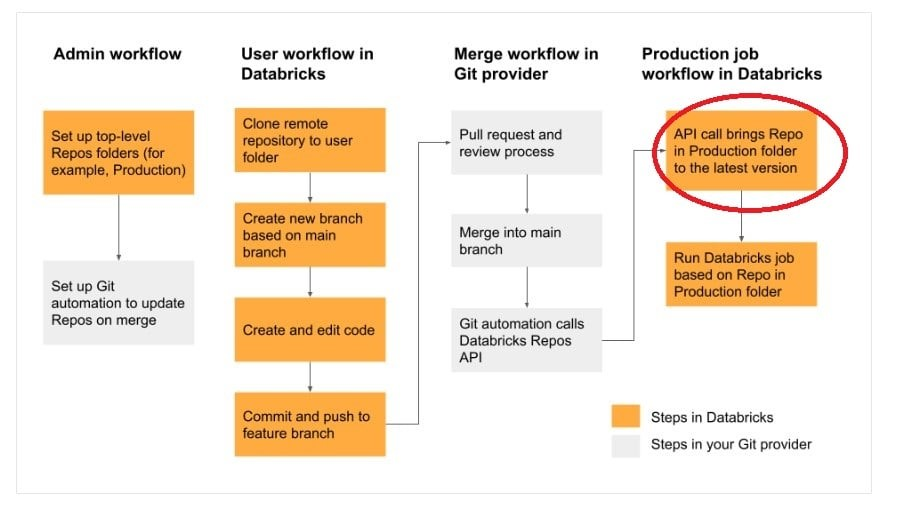

```
Domain
Databricks Lakehouse Platform
```

<br />

#### Q10. You are currently working with the second team and both teams are looking to modify the same notebook, you noticed that the second member is copying the notebooks to the personal folder to edit and replace the collaboration notebook, which notebook feature do you recommend to make the process easier to collaborate.

a) Databricks notebooks should be copied to a local machine and setup source control locally to version the notebooks

b) Databricks notebooks support automatic change tracking and versioning

c) ***Databricks Notebooks support real-time coauthoring on a single notebook***

d) Databricks notebooks can be exported into dbc archive files and stored in data lake

e) Databricks notebook can be exported as HTML and imported at a later time

**Overall explanation**

Answer is Databricks Notebooks support real-time coauthoring on a single notebook

Every change is saved, and a notebook can be changed my multiple users.


```
Domain
Databricks Lakehouse Platform
```

<br />

### Q11. You are currently working on a project that requires the use of SQL and Python in a given notebook, what would be your approach

a) Create two separate notebooks, one for SQL and the second for Python

b) ***A single notebook can support multiple languages, use the magic command to switch between the two.***

c) Use an All-purpose cluster for python, SQL endpoint for SQL

d) Use job cluster to run python and SQL Endpoint for SQL


**Overall explanation**

The answer is, A single notebook can support multiple languages, use the magic command to switch between the two.

Use `%sql` and `%python` magic commands within the same notebook.

```
Domain
Databricks Lakehouse Platform
```

<br />

#### Q12. Which of the following statements are correct on how Delta Lake implements a lake house?

a) Delta lake uses a proprietary format to write data, optimized for cloud storage

b) Using Apache Hadoop on cloud object storage

c) Delta lake always stores meta data in memory vs storage

d) ***Delta lake uses open source, open format, optimized cloud storage and scalable meta data***

e) Delta lake stores data and meta data in computes memory

**Overall explanation**

Delta lake is
· Open source
· Builds up on standard data format
· Optimized for cloud object storage
· Built for scalable metadata handling
Delta lake is not
· Proprietary technology
· Storage format
· Storage medium
· Database service or data warehouse

```
Domain
Databricks Lakehouse Platform
```

<br />

#### Q13. You were asked to create or overwrite an existing delta table to store the below transaction data.

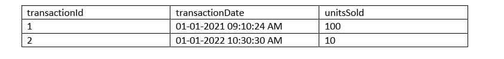

a) 
```
CREATE OR REPLACE DELTA TABLE transactions (
    transactionId int,
    transactionDate timestamp,
    unitsSold int)
```

b) 
```
CREATE OR REPLACE TABLE IF EXISTS transactions (
    transactionId int,
    transactionDate timestamp,
    unitsSold int)
FORMAT DELTA
```

c) 
```
CREATE IF EXSITS REPLACE TABLE transactions (
    transactionId int,
    transactionDate timestamp,
    unitsSold int)
```

d) ***CORRECT ANSWER***
```
CREATE OR REPLACE TABLE transactions (
    transactionId int,
    transactionDate timestamp,
    unitsSold int)
```

**Overall explanation**

The answer is
```
1.	CREATE OR REPLACE TABLE transactions (
2.	transactionId int,
3.	transactionDate timestamp,
4.	unitsSold int)
```
When creating a table in Databricks by default the table is stored in DELTA format.

```
Domain
Databricks Lakehouse Platform
```

<br />

#### Q14. If you run the command `VACUUM transactions retain 0 hours`? What is the outcome of this command?

a) Command will be successful, but no data is removed

b) Command will fail if you have an active transaction running

c) ***Command will fail, you cannot run the command with retentionDurationcheck enabled***

d) Command will be successful, but historical data will be removed

e) Command runs successful and compacts all of the data in the table

**Overall explanation**

The answer is,
Command will fail, you cannot run the command with retentionDurationcheck enabled.

1.	VACUUM [ [db_name.]table_name | path] [RETAIN num HOURS] [DRY RUN]
•	Recursively vacuum directories associated with the Delta table and remove data files that are no longer in the latest state of the transaction log for the table and are older than a retention threshold. Default is 7 Days.
•	The reason this check is enabled is because, DELTA is trying to prevent unintentional deletion of history, and also one important thing to point out is with 0 hours of retention there is a possibility of data loss(see below kb)

Documentation in VACUUM 
https://docs.delta.io/latest/delta-utility.html
https://kb.databricks.com/delta/data-missing-vacuum-parallel-write.html

```
Domain
Databricks Lakehouse Platform
```

<br />

#### Q15. You noticed a colleague is manually copying the data to the backup folder prior to running an update command, incase if the update command did not provide the expected outcome so he can use the backup copy to replace table, which Delta Lake feature would you recommend simplifying the process?

a) ***Use time travel feature to refer old data instead of manually copying***

b) Use DEEP CLONE to clone the table prior to update to make a backup copy

c) Use SHADOW copy of the table as preferred backup choice

d) Cloud object storage retains previous version of the file

e) Cloud object storage automatically backups the data

**Overall explanation**

The answer is, Use time travel feature to refer old data instead of manually copying.

https://databricks.com/blog/2019/02/04/introducing-delta-time-travel-for-large-scale-data-lakes.html

1.	`SELECT count(*) FROM my_table TIMESTAMP AS OF "2019-01-01"`
2.	`SELECT count(*) FROM my_table TIMESTAMP AS OF date_sub(current_date(), 1)`
3.	`SELECT count(*) FROM my_table TIMESTAMP AS OF "2019-01-01 01:30:00.000"`

```
Domain
Databricks Lakehouse Platform
```

<br />

#### Q16. Which one of the following is not a Databricks lakehouse object?

a) Tables

b) Views

c) Database/Schemas

d) Catalog

e) Functions

f) ***Stored Procedures***

**Overall explanation**

The answer is, Stored Procedures.
Databricks lakehouse does not support stored procedures.

```
Domain
ELT with Spark SQL and Python
```

<br />

#### Q17. What type of table is created when you create delta table with below command?

`CREATE TABLE transactions USING DELTA LOCATION "DBFS:/mnt/bronze/transactions"`

a) Managed delta table

b) ***External table***

c) Managed table

d) Temp table

e) Delta Lake table

**Overall explanation**

Anytime a table is created using the LOCATION keyword it is considered an external table, below is the current syntax.
Syntax
CREATE TABLE table_name ( column column_data_type…) USING format LOCATION "dbfs:/"
format -> DELTA, JSON, CSV, PARQUET, TEXT


I created the table command based on the above question, you can see it created an external table,

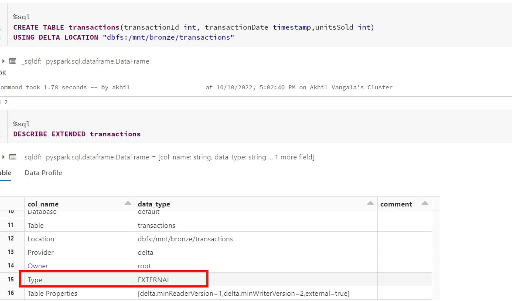

Let's remove the `location` keyword and run again, same syntax except for the `LOCATION` keyword is removed.

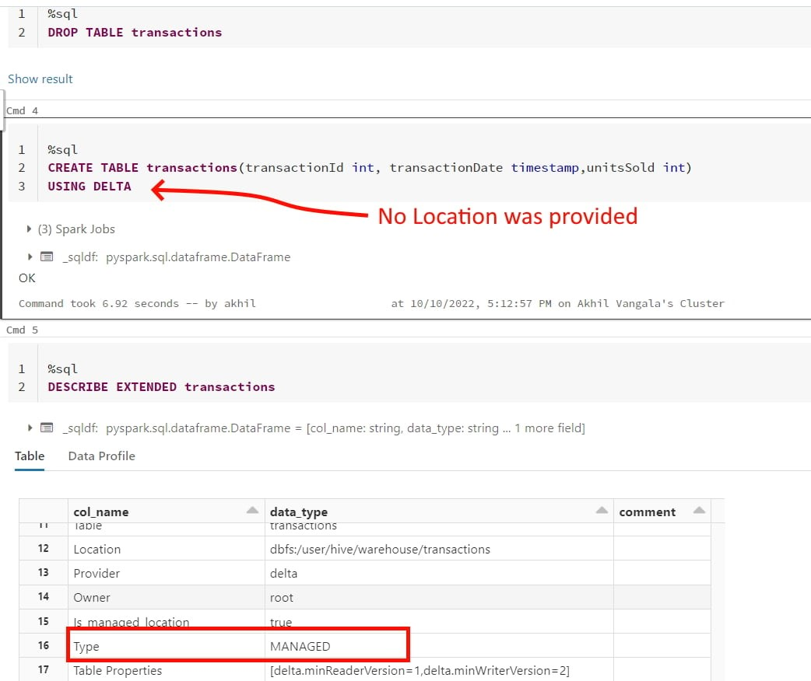

```
Domain
ELT with Spark SQL and Python
```

<br />

#### Q18. Which of the following command can be used to drop a managed delta table and the underlying files in the storage?

a) `DROP TABLE table_name CASCADE`

b) ***`DROP TABLE table_name`***

c) Use `DROP TABLE table_name` command and manually delete files using command `dbutils.fs.rm("/path",True)`

d) `DROP TABLE table_name INCLUDE_FILES`

e) `DROP TABLE table` and run `VACUUM` command

**Overall explanation**

The answer is DROP TABLE table_name,

When a managed table is dropped, the table definition is dropped from metastore and everything including data, metadata, and history are also dropped from storage.

```
Domain
ELT with Spark SQL and Python
```

<br />

#### Q19. Which of the following is the correct statement for a session scoped temporary view?

a) Temporary views are lost once the notebook is detached and re-attached

b) Temporary views stored in memory

c) Temporary views can be still accessed even if the notebook is detached and attached

d) Temporary views can be still accessed even if cluster is restarted

e) Temporary views are created in local_temp database

**Overall explanation**

The answer is Temporary views are lost once the notebook is detached and attached

There are two types of temporary views that can be created, Session scoped and Global

•	A local/session scoped temporary view is only available with a spark session, so another notebook in the same cluster can not access it. if a notebook is detached and reattached local temporary view is lost.
•	A global temporary view is available to all the notebooks in the cluster, if a cluster restarts global temporary view is lost.

```
Domain
ELT with Spark SQL and Python
```

<br />

#### Q20. Which of the following is correct for the global temporary view?

a) global temporary views cannot be accessed once the notebook is detached and attached

b) global temporary views can be accessed across many clusters

c) ***global temporary views can be still accessed even if the notebook is detached and attached***

d) global temporary views can be still accessed even if the cluster is restarted

e) global temporary views are created in a database called temp database

**Overall explanation**

The answer is global temporary views can be still accessed even if the notebook is detached and attached

There are two types of temporary views that can be created Local and Global
· A local temporary view is only available with a spark session, so another notebook in the same cluster can not access it. if a notebook is detached and reattached local temporary view is lost.
· A global temporary view is available to all the notebooks in the cluster, even if the notebook is detached and reattached it can still be accessible but if a cluster is restarted the global temporary view is lost.

```
Domain
ELT with Spark SQL and Python
```

<br />

### Q21. You are currently working on reloading customer_sales tables using the below query

```
INSERT OVERWRITE customer_sales
SELECT * FROM customers c
INNER JOIN sales_monthly s on s.customer_id = c.customer_id
```

After you ran the above command, the Marketing team quickly wanted to review the old data that was in the table. How does INSERT OVERWRITE impact the data in the customer_sales table if you want to see the previous version of the data prior to running the above statement?

a) Overwrites the data in the table, all historical versions of the data, you can not time travel to previous versions

b) ***Overwrites the data in the table but preserves all historical versions of the data, you can time travel to previous versions***

c) Overwrites the current version of the data but clears all historical versions of the data, so you can not time travel to previous versions.

d) Appends the data to the current version, you can time travel to previous versions

e) By default, overwrites the data and schema, you cannot perform time travel


**Overall explanation**

The answer is,  INSERT OVERWRITE  Overwrites the current version of the data but preserves all historical versions of the data, you can time travel to previous versions.

```
INSERT OVERWRITE customer_sales
SELECT * FROM customers c
INNER JOIN sales s on s.customer_id = c.customer_id
```

Let's just assume that this is the second time you are running the above statement, you can still query the prior version of the data using time travel, and any DML/DDL except DROP TABLE creates new PARQUET files so you can still access the previous versions of data.

SQL Syntax for Time travel
SELECT * FROM table_name as of [version number]
with customer_sales example
SELECT * FROM customer_sales as of 1 -- previous version
SELECT * FROM customer_sales as of 2 -- current version

You see all historical changes on the table using DESCRIBE HISTORY table_name

Note: the main difference between INSERT OVERWRITE and CREATE OR REPLACE TABLE(CRAS) is that  CRAS can modify the schema of the table, i.e it can add new columns or change data types of existing columns.  By default  INSERT OVERWRITE  only overwrites the data.

INSERT OVERWRITE  can also be used to update the schema when spark.databricks.delta.schema.autoMerge.enabled is set true if this option is not enabled and if there is a schema mismatch command  INSERT OVERWRITEwill fail.

Any DML/DDL operation(except DROP TABLE) on the Delta table preserves the historical version of the data.

```
Domain
ELT with Spark SQL and Python
```

<br />

#### Q22. Which of the following SQL statement can be used to query a table by eliminating duplicate rows from the query results?

a) ***SELECT DISTINCT * FROM table_name***

b) SELECT DISTINCT * FROM table_name HAVING COUNT(*) > 1

c) SELECT DISTINCT_ROWS (*) FROM table_name

d) SELECT * FROM table_name GROUP BY * HAVING COUNT(*) < 1

e) SELECT * FROM table_name GROUP BY * HAVING COUNT(*) > 1

**Overall explanation**

The  answer is  `SELECT DISTINCT * FROM table_name`

```
Domain
ELT with Spark SQL and Python
```

<br />

#### Q23. Which of the below SQL Statements can be used to create a SQL UDF to convert Celsius to Fahrenheit and vice versa, you need to pass two parameters to this function one, actual temperature, and the second that identifies if its needs to be converted to Fahrenheit or Celcius with a one-word letter F or C?

select udf_convert(60,'C')  will result in 15.5
select udf_convert(10,'F')  will result in 50

a) 
> CREATE UDF FUNCTION udf_convert(temp DOUBLE, measure STRING)
    RETURNS DOUBLE
	RETURN 
        CASE WHEN measure == 'F' then (temp * 9/5) + 32
	    ELSE (temp – 33 ) * 5/9
    END

b) 
> CREATE UDF FUNCTION udf_convert(temp DOUBLE, measure STRING)
    RETURN CASE WHEN measure == 'F' then (temp * 9/5) + 32
	    ELSE (temp – 33 ) * 5/9
	END

c) 
> CREATE FUNCTION udf_convert(temp DOUBLE, measure STRING)
	RETURN CASE WHEN measure == 'F' then (temp * 9/5) + 32
        ELSE (temp – 33 ) * 5/9
	END

d) ***CORRECT ANSWER***
> CREATE FUNCTION udf_convert(temp DOUBLE, measure STRING)
	RETURNS DOUBLE
    RETURN CASE WHEN measure == 'F' then (temp * 9/5) + 32
        ELSE (temp – 33 ) * 5/9
    END

e) 
> CREATE USER FUNCTION udf_convert(temp DOUBLE, measure STRING)
	RETURNS DOUBLE
	RETURN CASE WHEN measure == 'F' then (temp * 9/5) + 32
	    ELSE (temp – 33 ) * 5/9 
	END

**Overall explanation**

The answer is
```
1.	CREATE FUNCTION udf_convert(temp DOUBLE, measure STRING)
2.	RETURNS DOUBLE
3.	RETURN CASE WHEN measure == ‘F’ then (temp * 9/5) + 32
4.	        ELSE (temp – 33 ) * 5/9
5.	       END
```

```
Domain
ELT with Spark SQL and Python
```

<br />

#### Q24. You are trying to calculate total sales made by all the employees by parsing a complex struct data type that stores employee and sales data, how would you approach this in SQL

Table definition :
> batchId INT, performance ARRAY<STRUCT<employeeId: BIGINT, sales: INT>>, insertDate TIMESTAMP

Sample data of performance column
```
[
    { "employeeId":1234
    "sales" : 10000},

    { "employeeId":3232
    "sales" : 30000}
]
```

Calculate total sales made by all the employees?

Sample data with create table syntax for the data: 

```
1.	create or replace table sales as 
2.	select 1 as batchId ,
3.		from_json('[{ "employeeId":1234,"sales" : 10000 },{ "employeeId":3232,"sales" : 30000 }]',
4.	         'ARRAY<STRUCT<employeeId: BIGINT, sales: INT>>') as performance,
5.	  current_timestamp() as insertDate
6.	union all 
7.	select 2 as batchId ,
8.	  from_json('[{ "employeeId":1235,"sales" : 10500 },{ "employeeId":3233,"sales" : 32000 }]',
9.	                'ARRAY<STRUCT<employeeId: BIGINT, sales: INT>>') as performance,
10.	                current_timestamp() as insertDate
```

a) 
> WITH CTE as (SELECT EXPLODE (performance) FROM table_name)
	SELECT SUM (performance.sales) FROM CTE

b) 
> WITH CTE as (SELECT FLATTEN (performance) FROM table_name)
    SELECT SUM (sales) FROM CTE

c) ***CORRECT ANSWER***
> select aggregate(flatten(collect_list(performance.sales)), 0, (x, y) -> x + y) 
	as  total_sales from sales  

d) 
> SELECT SUM(SLICE (performance, sales)) FROM employee

e) 
> select reduce(flatten(collect_list(performance:sales)), 0, (x, y) -> x + y) 
    as  total_sales from sales  

**Overall explanation**

The answer is
> select aggregate(flatten(collect_list(performance.sales)), 0, (x, y) -> x + y) 
    as  total_sales from sales 

Nested Struct can be queried using the . notation performance.sales will give you access to all the sales values in the performance column. 

Note: option D is wrong because it uses performance:sales not performance.sales. ":" this is only used when referring to JSON data but here we are dealing with a struct data type.  for the exam please make sure to understand if you are dealing with JSON data or Struct data.

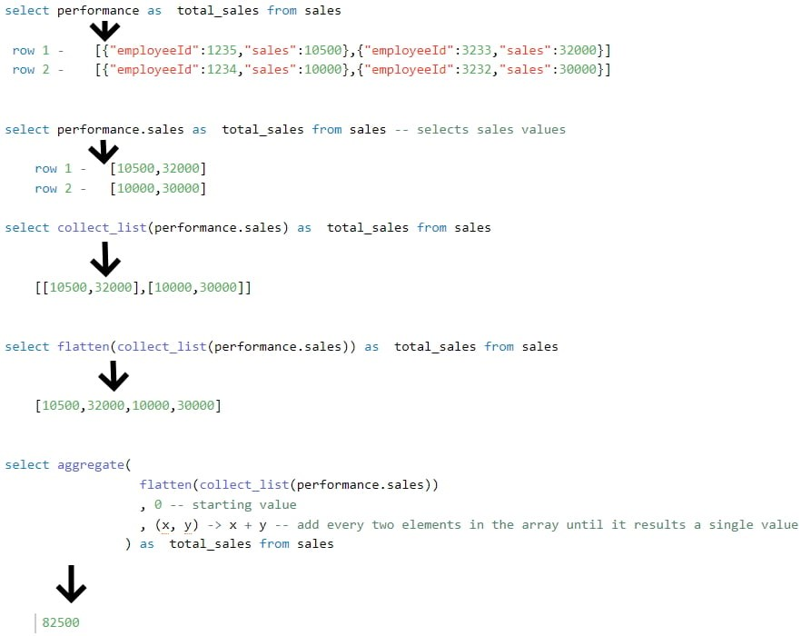

Here are some additional examples
https://docs.databricks.com/spark/latest/spark-sql/language-manual/functions/dotsign.html

**Other solutions**:
we can also use reduce instead of aggregate
select reduce(flatten(collect_list(performance.sales)), 0, (x, y) -> x + y) as  total_sales from sales
we can also use explode and sum instead of using any higher-order funtions.

```
1.	with cte as (
2.	  select
3.	    explode(flatten(collect_list(performance.sales))) sales from sales
4.	)
5.	select
6.	  sum(sales) from cte
```

Sample data with create table syntax for the data: 
```
1.	create or replace table sales as 
2.	select 1 as batchId ,
3.		from_json('[{ "employeeId":1234,"sales" : 10000 },{ "employeeId":3232,"sales" : 30000 }]',
4.	         'ARRAY<STRUCT<employeeId: BIGINT, sales: INT>>') as performance,
5.	  current_timestamp() as insertDate
6.	union all 
7.	select 2 as batchId ,
8.	  from_json('[{ "employeeId":1235,"sales" : 10500 },{ "employeeId":3233,"sales" : 32000 }]',
9.	                'ARRAY<STRUCT<employeeId: BIGINT, sales: INT>>') as performance,
10.	                current_timestamp() as insertDate
```

```
Domain
ELT with Spark SQL and Python
```

<br />

#### Q25. Which of the following statements can be used to test the functionality of code to test number of rows in the table equal to 10 in python?

> row_count = spark.sql("select count(*) from table").collect()[0][0]

a) assert (row_count = 10, "Row count did not match")

b) assert if (row_count = 10, "Row count did not match")

c) ***assert row_count == 10, "Row count did not match"***

d) assert if row_count == 10, "Row count did not match"

e) assert row_count = 10, "Row count did not match"

**Overall explanation**

The answer is assert row_count == 10, "Row count did not match"

Review below documentation

(Assert Python](https://www.w3schools.com/python/ref_keyword_assert.asp)

```
Domain
ELT with Spark SQL and Python
```

<br />

#### Q26. How do you handle failures gracefully when writing code in Pyspark,  fill in the blanks to complete the below statement

```	 
Spark.read.table("table_name").select("column").write.mode("append").SaveAsTable("new_table_name")
____
print(f"query failed")
```

a) try: failure:

b) try: catch:

c) ***try: except:***

d) try: fail:

e) try: error:

**Overall explanation**

The answer is try: and except:

```
Domain
ELT with Spark SQL and Python
```

<br />

#### Q27. You are working on a process to query the table based on batch date, and batch date is an input parameter and expected to change every time the program runs, what is the best way to we can parameterize the query to run without manually changing the batch date?

a) ***Create a notebook parameter for batch date and assign the value to a python variable and use a spark data frame to filter the data based on the python variable***

b) Create a dynamic view that can calculate the batch date automatically and use the view to query the data

c) There is no way we can combine python variable and spark code

d) Manually edit code every time to change the batch date

e) Store the batch date in the spark configuration and use a spark data frame to filter the data based on the spark configuration.

**Overall explanation**

The answer is, Create a notebook parameter for batch date and assign the value to a python variable and use a spark data frame to filter the data based on the python variable

```
Domain
ELT with Spark SQL and Python
```

<br />

#### Q28. Which of the following commands results in the successful creation of a view on top of the delta stream(stream on delta table)?

a) `Spark.read.format("delta").table("sales").createOrReplaceTempView("streaming_vw")`

b) ***`Spark.readStream.format("delta").table("sales").createOrReplaceTempView("streaming_vw")`***

c) `Spark.read.format("delta").table("sales").mode("stream").createOrReplaceTempView("streaming_vw")`

d) `Spark.read.format("delta").table("sales").trigger("stream").createOrReplaceTempView("streaming_vw")`

e) `Spark.read.format("delta").stream("sales").createOrReplaceTempView("streaming_vw")`

f) You can not create a view on streaming data source.

**Overall explanation**

The answer is
`Spark.readStream.table("sales").createOrReplaceTempView("streaming_vw")`

When you load a Delta table as a stream source and use it in a streaming query, the query processes all of the data present in the table as well as any new data that arrives after the stream is started.
You can load both paths and tables as a stream, you also have the ability to ignore deletes and changes(updates, Merge, overwrites) on the delta table.

Here is more information,
https://docs.databricks.com/delta/delta-streaming.html#delta-table-as-a-source

```
Domain
Incremental Data Processing
```

<br />

#### Q29. Which of the following techniques structured streaming uses to create an end-to-end fault tolerance?

a) Checkpointing and Water marking

b) Write ahead logging and water marking

c) ***Checkpointing and idempotent sinks***

d) Write ahead logging and idempotent sinks

e) Stream will failover to available nodes in the cluste

**Overall explanation**

The answer is Checkpointing and idempotent sinks

How does structured streaming achieves end to end fault tolerance:
•	First, Structured Streaming uses checkpointing and write-ahead logs to record the offset range of data being processed during each trigger interval.
•	Next, the streaming sinks are designed to be _idempotent_—that is, multiple writes of the same data (as identified by the offset) do not result in duplicates being written to the sink.
Taken together, replayable data sources and idempotent sinks allow Structured Streaming to ensure end-to-end, exactly-once semantics under any failure condition.

```
Domain
Incremental Data Processing
```

<br />

#### Q30. Which of the following two options are supported in identifying the arrival of new files, and incremental data from Cloud object storage using Auto Loader?

a) ***Directory listing, File notification***

b) Checking pointing, watermarking

c) Writing ahead logging, read head logging

d) File hashing, Dynamic file lookup

e) Checkpointing and Write ahead logging

**Overall explanation**

The answer is A, Directory listing, File notifications

*Directory listing*: Auto Loader identifies new files by listing the input directory.
*File notification*: Auto Loader can automatically set up a notification service and queue service that subscribe to file events from the input directory.

[Choosing between file notification and directory listing modes | Databricks on AWS](https://docs.databricks.com/ingestion/auto-loader/file-detection-modes.html)

```
Domain
Incremental Data Processing
```

<br />

### Q31. Which of the following data workloads will utilize a Bronze table as its destination?

a) A job that aggregates cleaned data to create standard summary statistics

b) A job that queries aggregated data to publish key insights into a dashboard

c) ***A job that ingests raw data from a streaming source into the Lakehouse***

d) A job that develops a feature set for a machine learning application

e) A job that enriches data by parsing its timestamps into a human-readable format


**Overall explanation**

The answer is A job that ingests raw data from a streaming source into the Lakehouse.

The ingested data from the raw streaming data source like Kafka is first stored in the Bronze layer as first destination before it is further optimized and stored in Silver.

[Medallion Architecture – Databricks](https://databricks.com/glossary/medallion-architecture)

Bronze Layer:
1. Raw copy of ingested data
2. Replaces traditional data lake
3. Provides efficient storage and querying of full, unprocessed history of data
4. No schema is applied at this layer

*Exam focus: Please review the below image and understand the role of each layer(bronze, silver, gold) in medallion architecture, you will see varying questions targeting each layer and its purpose.*


```
Domain
Incremental Data Processing
```

<br />

#### Q32. Which of the following data workloads will utilize a silver table as its source?

a) A job that enriches data by parsing its timestamps into a human-readable format

b) A job that queries aggregated data that already feeds into a dashboard

c) A job that ingests raw data from a streaming source into the Lakehouse

d) ***A job that aggregates cleaned data to create standard summary statistics***

e) A job that cleans data by removing malformatted records

**Overall explanation**

The answer is,  A job that aggregates cleaned data to create standard summary statistics

Silver zone maintains the grain of the original data, in this scenario a job is taking data from the silver zone as the source and aggregating and storing them in the gold zone.

Medallion Architecture – Databricks
Silver Layer:

1. Reduces data storage complexity, latency, and redundency
2. Optimizes ETL throughput and analytic query performance
3. Preserves grain of original data (without aggregation)
4. Eliminates duplicate records
5. production schema enforced
6. Data quality checks, quarantine corrupt data

*Exam focus: Please review the below image and understand the role of each layer(bronze, silver, gold) in medallion architecture, you will see varying questions targeting each layer and its purpose.*


```
Domain
Incremental Data Processing
```

<br />

#### Q33. Which of the following data workloads will utilize a gold table as its source?

a) A job that enriches data by parsing its timestamps into a human-readable format

b) ***A job that queries aggregated data that already feeds into a dashboard***

c) A job that ingests raw data from a streaming source into the Lakehouse

d) A job that aggregates cleaned data to create standard summary statistics

e) A job that cleans data by removing malformatted records

**Overall explanation**

The answer is,  A job that queries aggregated data that already feeds into a dashboard

The gold layer is used to store aggregated data, which are typically used for dashboards and reporting.


Review the below link for more info,
[Medallion Architecture – Databricks](https://databricks.com/glossary/medallion-architecture)
Gold Layer:

1. Powers Ml applications, reporting, dashboards, ad hoc analytics
2. Refined views of data, typically with aggregations
3. Reduces strain on production systems
4. Optimizes query performance for business-critical data

*Exam focus: Please review the below image and understand the role of each layer(bronze, silver, gold) in medallion architecture, you will see varying questions targeting each layer and its purpose.*

```
Domain
Databricks Lakehouse Platform
```

<br />

#### Q34. You are currently asked to work on building a data pipeline, you have noticed that you are currently working with a data source that has a lot of data quality issues and you need to monitor data quality and enforce it as part of the data ingestion process, which of the following tools can be used to address this problem?

a) AUTO LOADER

b) ***DELTA LIVE TABLES***

c) JOBS and TASKS

d) UNITY Catalog and Data Governance

e) STRUCTURED STREAMING with MULTI HOP

**Overall explanation**

The answer is, DELTA LIVE TABLES

Delta live tables expectations can be used to identify and quarantine bad data, all of the data quality metrics are stored in the event logs which can be used to later analyze and monitor.

[DELTA LIVE Tables expectations](https://docs.microsoft.com/en-us/azure/databricks/data-engineering/delta-live-tables/delta-live-tables-expectations)

Below are three types of expectations, make sure to pay attention differences between these three. 

**Retain invalid records**:
Use the expect operator when you want to keep records that violate the expectation. Records that violate the expectation are added to the target dataset along with valid records:

Python
> @dlt.expect("valid timestamp", "col(“timestamp”) > '2012-01-01'")

SQL
> CONSTRAINT valid_timestamp EXPECT (timestamp > '2012-01-01')

**Drop invalid records**:
Use the `expect or drop` operator to prevent the processing of invalid records. Records that violate the expectation are dropped from the target dataset:

Python
> @dlt.expect_or_drop("valid_current_page", "current_page_id IS NOT NULL AND current_page_title IS NOT NULL")

SQL
> CONSTRAINT valid_current_page EXPECT (current_page_id IS NOT NULL and current_page_title IS NOT NULL) ON VIOLATION DROP ROW

**Fail on invalid records**:
When invalid records are unacceptable, use the expect or fail operator to halt execution immediately when a record fails validation. If the operation is a table update, the system atomically rolls back the transaction:

Python
> @dlt.expect_or_fail("valid_count", "count > 0")

SQL
> CONSTRAINT valid_count EXPECT (count > 0) ON VIOLATION FAIL UPDATE

```
Domain
Incremental Data Processing
```

<br />

#### Q35. When building a DLT s pipeline you have two options to create a live tables, what is the main difference between CREATE STREAMING LIVE TABLE vs CREATE LIVE TABLE?

a) CREATE STREAMING LIVE table is used in MULTI HOP Architecture

b) CREATE LIVE TABLE is used when working with Streaming data sources and Incremental data

c) ***CREATE STREAMING LIVE TABLE is used when working with Streaming data sources and Incremental data***

d) There is no difference both are the same, CREATE STRAMING LIVE will be deprecated soon

e) CREATE LIVE TABLE is used in DELTA LIVE TABLES, CREATE STREAMING LIVE can only used in Structured Streaming applications

**Overall explanation**

The answer is,  CREATE STREAMING LIVE TABLE is used when working with Streaming data sources and Incremental data

```
Domain
Incremental Data Processing
```

<br />

#### Q36. A particular job seems to be performing slower and slower over time, the team thinks this started to happen when a recent production change was implemented, you were asked to take look at the job history and see if we can identify trends and root cause, where in the workspace UI can you perform this analysis?

a) ***Under jobs UI select the job you are interested, under runs we can see current active runs and last 60 days historical run***

b) Under jobs UI select the job cluster, under spark UI select the application job logs, then you can access last 60 day historical runs

c) Under Workspace logs, select job logs and select the job you want to monitor to view the last 60 day historical runs

d) Under Compute UI, select Job cluster and select the job cluster to see last 60 day historical runs

e) Historical job runs can only be accessed by REST API

**Overall explanation**

The answer is, 
Under jobs UI select the job you are interested, under runs we can see current active runs and last 60 days historical run

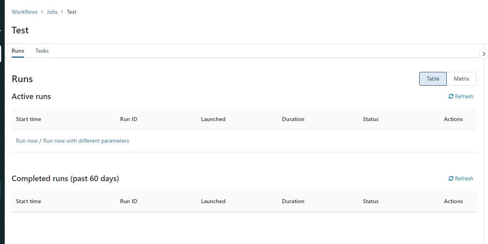

```
Domain
Production Pipelines
```

<br />

#### Q37. What are the different ways you can schedule a job in Databricks workspace?

a) Continuous, Incremental

b) On-Demand runs, File notification from Cloud object storage

c) ***Cron, On Demand runs***

d) Cron, File notification from Cloud object storage

e) Once, Continuous

**Overall explanation**

The answer is, Cron, On-Demand runs

Supports running job immediately or using can be scheduled using CRON syntax

[Jobs in Databricks](https://docs.databricks.com/data-engineering/jobs/jobs.html#run-a-job)

```
Domain
Production Pipelines
```

<br />

#### Q38. You have noticed that Databricks SQL queries are running slow, you are asked to look reason why queries are running slow and identify steps to improve the performance, when you looked at the issue you noticed all the queries are running in parallel and using a SQL endpoint(SQL Warehouse) with a single cluster. Which of the following steps can be taken to improve the performance/response times of the queries?

*Please note Databricks recently renamed SQL endpoint to SQL warehouse.

a) They can turn on the Serverless feature for the SQL endpoint(SQL warehouse).

b) ***They can increase the maximum bound of the SQL endpoint(SQL warehouse)’s scaling range***

c) They can increase the warehouse size from 2X-Smal to 4XLarge of the SQL endpoint(SQL warehouse).

d) They can turn on the Auto Stop feature for the SQL endpoint(SQL warehouse).

e) They can turn on the Serverless feature for the SQL endpoint(SQL warehouse) and change the Spot Instance Policy to "Reliability Optimized".

**Overall explanation**

The answer is, They can increase the maximum bound of the SQL endpoint’s scaling range when you increase the max scaling range more clusters are added so queries instead of waiting in the queue can start running using available clusters, see below for more explanation.

The question is looking to test your ability to know how to scale a SQL Endpoint(SQL Warehouse) and you have to look for cue words or need to understand if the queries are running sequentially or concurrently. if the queries are running sequentially then scale up(Size of the cluster from 2X-Small to 4X-Large) if the queries are running concurrently or with more users then scale out(add more clusters).

SQL Endpoint(SQL Warehouse) Overview: (Please read all of the below points and the below diagram to understand )

1.	A SQL Warehouse should have at least one cluster
2.	A cluster comprises one driver node and one or many worker nodes
3.	No of worker nodes in a cluster is determined by the size of the cluster (2X -Small ->1 worker, X-Small ->2 workers.... up to 4X-Large -> 128 workers) this is called Scale up
4.	A single cluster irrespective of cluster size(2X-Smal.. to ...4XLarge) can only run 10 queries at any given time if a user submits 20 queries all at once to a warehouse with 3X-Large cluster size and cluster scaling (min 1, max1) while 10 queries will start running the remaining 10 queries wait in a queue for these 10 to finish.
5.	Increasing the Warehouse cluster size can improve the performance of a query, for example, if a query runs for 1 minute in a 2X-Small warehouse size it may run in 30 Seconds if we change the warehouse size to X-Small. this is due to 2X-Small having 1 worker node and X-Small having 2 worker nodes so the query has more tasks and runs faster (note: this is an ideal case example, the scalability of a query performance depends on many factors, it can not always be linear)
6.	A warehouse can have more than one cluster this is called Scale out. If a warehouse is configured with X-Small cluster size with cluster scaling(Min1, Max 2) Databricks spins up an additional cluster if it detects queries are waiting in the queue, If a warehouse is configured to run 2 clusters(Min1, Max 2), and let's say a user submits 20 queries, 10 queriers will start running and holds the remaining in the queue and databricks will automatically start the second cluster and starts redirecting the 10 queries waiting in the queue to the second cluster.
7.	A single query will not span more than one cluster, once a query is submitted to a cluster it will remain in that cluster until the query execution finishes irrespective of how many clusters are available to scale.


Please review the below diagram to understand the above concepts: 


SQL endpoint(SQL Warehouse) scales horizontally(scale-out) and vertical (scale-up), you have to understand when to use what.
Scale-out -> to add more clusters for a SQL endpoint, change max number of clusters
If you are trying to improve the throughput, being able to run as many queries as possible then having an additional cluster(s) will improve the performance.

Databricks SQL automatically scales as soon as it detects queries are in queuing state, in this example scaling is set for min 1 and max 3 which means the warehouse can add three clusters if it detects queries are waiting. 

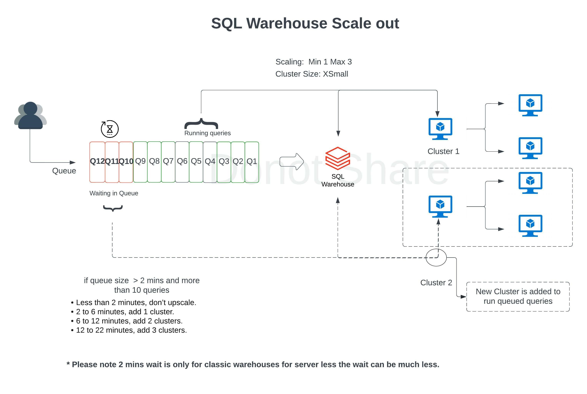

During the warehouse creation or after you have the ability to change the warehouse size (2X-Small....to ...4XLarge) to improve query performance and the maximize scaling range to add more clusters on a SQL Endpoint(SQL Warehouse) scale-out, if you are changing an existing warehouse you may have to restart the warehouse to make the changes effective.

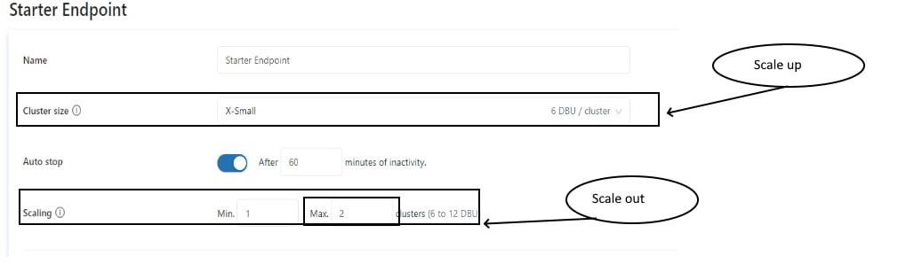

How do you know how many clusters you need(How to set Max cluster size)?
When you click on an existing warehouse and select the monitoring tab, you can see warehouse utilization information(see below), there are two graphs that provide important information on how the warehouse is being utilized, if you see queries are being queued that means your warehouse can benefit from additional clusters. Please review the additional DBU cost associated with adding clusters so you can take a well balanced decision between cost and performance.


```
Domain
Production Pipelines
```

<br />

#### Q39. You currently working with the marketing team to setup a dashboard for ad campaign analysis, since the team is not sure how often the dashboard should be refreshed they have decided to do a manual refresh on an as needed basis. Which of the following steps can be taken to reduce the overall cost of the compute when the team is not using the compute?

*Please note that Databricks recently change the name of SQL Endpoint to SQL Warehouses.

a) They can turn on the Serverless feature for the SQL endpoint(SQL Warehouse).

b) They can decrease the maximum bound of the SQL endpoint(SQL Warehouse) scaling range.

c) They can decrease the cluster size of the SQL endpoint(SQL Warehouse).

d) ***They can turn on the Auto Stop feature for the SQL endpoint(SQL Warehouse).***

e) They can turn on the Serverless feature for the SQL endpoint(SQL Warehouse) and change the Spot Instance Policy from “Reliability Optimized” to  “Cost optimized”

**Overall explanation**

The answer is, They can turn on the Auto Stop feature for the SQL endpoint(SQL Warehouse).

Use auto stop to automatically terminate the cluster when you are not using it.

```
Domain
Production Pipelines
```

<br />

#### Q40. You had worked with the Data analysts team to set up a SQL Endpoint(SQL warehouse) point so they can easily query and analyze data in the gold layer, but once they started consuming the SQL Endpoint(SQL warehouse)  you noticed that during the peak hours as the number of users increase you are seeing queries taking longer to finish, which of the following steps can be taken to resolve the issue?

*Please note Databricks recently renamed SQL endpoint to SQL warehouse.

a) They can turn on the Serverless feature for the SQL endpoint(SQL warehouse).

b) ***They can increase the maximum bound of the SQL endpoint(SQL warehouse) ’s scaling range.***

c) They can increase the cluster size from 2X-Small to 4X-Large of the SQL endpoint(SQL warehouse) .

d) They can turn on the Auto Stop feature for the SQL endpoint(SQL warehouse) .

e) They can turn on the Serverless feature for the SQL endpoint(SQL warehouse)  and change the Spot Instance Policy from “Cost optimized” to “Reliability Optimized.”

**Overall explanation**

the answer is, 
They can increase the maximum bound of the SQL endpoint’s scaling range, when you increase the maximum bound you can add more clusters to the warehouse which can then run additional queries that are waiting in the queue to run, focus on the below explanation that talks about Scale-out.

The question is looking to test your ability to know how to scale a SQL Endpoint(SQL Warehouse) and you have to look for cue words or need to understand if the queries are running sequentially or concurrently. if the queries are running sequentially then scale up(Size of the cluster from 2X-Small to 4X-Large) if the queries are running concurrently or with more users then scale out(add more clusters).

SQL Endpoint(SQL Warehouse) Overview: (Please read all of the below points and the below diagram to understand )

1.	A SQL Warehouse should have at least one cluster
2.	A cluster comprises one driver node and one or many worker nodes
3.	No of worker nodes in a cluster is determined by the size of the cluster (2X -Small ->1 worker, X-Small ->2 workers.... up to 4X-Large -> 128 workers) this is called Scale up
4.	A single cluster irrespective of cluster size(2X-Smal.. to ...4XLarge) can only run 10 queries at any given time if a user submits 20 queries all at once to a warehouse with 3X-Large cluster size and cluster scaling (min 1, max1) while 10 queries will start running the remaining 10 queries wait in a queue for these 10 to finish.
5.	Increasing the Warehouse cluster size can improve the performance of a query, example if a query runs for 1 minute in a 2X-Small warehouse size, it may run in 30 Seconds if we change the warehouse size to X-Small. this is due to 2X-Small has 1 worker node and X-Small has 2 worker nodes so the query has more tasks and runs faster (note: this is an ideal case example, the scalability of a query performance depends on many factors, it can not always be linear)
6.	A warehouse can have more than one cluster this is called Scale out. If a warehouse is configured with X-Small cluster size with cluster scaling(Min1, Max 2) Databricks spins up an additional cluster if it detects queries are waiting in the queue, If a warehouse is configured to run 2 clusters(Min1, Max 2), and let's say a user submits 20 queries, 10 queriers will start running and holds the remaining in the queue and databricks will automatically start the second cluster and starts redirecting the 10 queries waiting in the queue to the second cluster.
7.	A single query will not span more than one cluster, once a query is submitted to a cluster it will remain in that cluster until the query execution finishes irrespective of how many clusters are available to scale.

Please review the below diagram to understand the above concepts: 

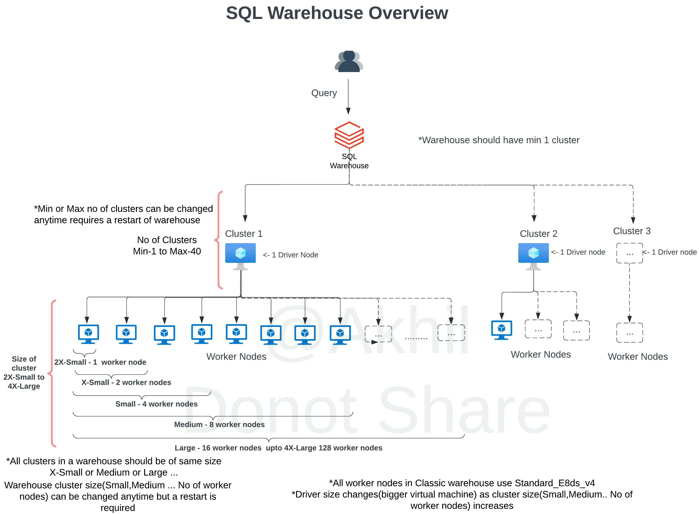

SQL endpoint(SQL Warehouse) scales horizontally(scale-out) and vertical (scale-up), you have to understand when to use what.
Scale-out -> to add more clusters for a SQL endpoint, change max number of clusters
If you are trying to improve the throughput, being able to run as many queries as possible then having an additional cluster(s) will improve the performance.

Databricks SQL automatically scales as soon as it detects queries are in queuing state, in this example scaling is set for min 1 and max 3 which means the warehouse can add three clusters if it detects queries are waiting. 


During the warehouse creation or after you have the ability to change the warehouse size (2X-Small....to ...4XLarge) to improve query performance and the maximize scaling range to add more clusters on a SQL Endpoint(SQL Warehouse) scale-out, if you are changing an existing warehouse you may have to restart the warehouse to make the changes effective.


How do you know how many clusters you need(How to set Max cluster size)?
When you click on an existing warehouse and select the monitoring tab, you can see warehouse utilization information(see below), there are two graphs that provide important information on how the warehouse is being utilized, if you see queries are being queued that means your warehouse can benefit from additional clusters. Please review the additional DBU cost associated with adding clusters so you can take a well balanced decision between cost and performance.

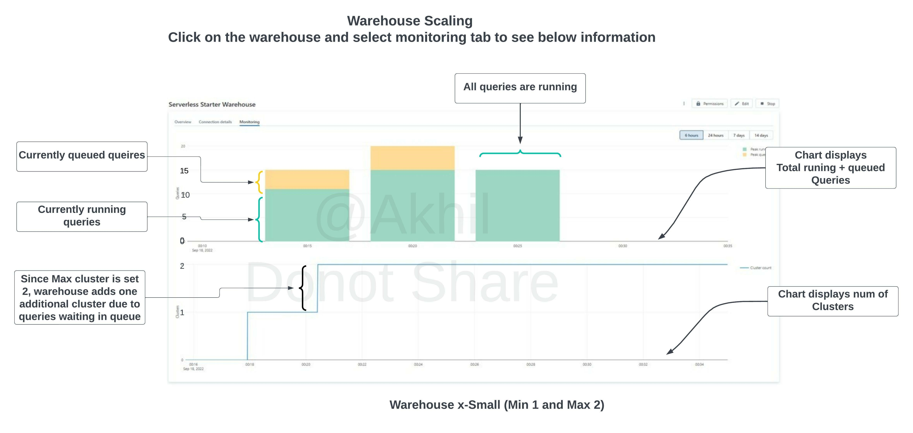

```
Domain
Databricks Lakehouse Platform
```

<br />

### Q41. The research team has put together a funnel analysis query to monitor the customer traffic on the e-commerce platform, the query takes about 30 mins to run on a small SQL endpoint cluster with max scaling set to 1 cluster. What steps can be taken to improve the performance of the query?

a) They can turn on the Serverless feature for the SQL endpoint.

b) They can increase the maximum bound of the SQL endpoint’s scaling range anywhere from between 1 to 100 to review the performance and select the size that meets the required SLA.

c) ***They can increase the cluster size anywhere from X small to 3XL to review the performance and select the size that meets the required SLA.***

d) They can turn off the Auto Stop feature for the SQL endpoint to more than 30 mins.

e) They can turn on the Serverless feature for the SQL endpoint and change the Spot Instance Policy from “Cost optimized” to “Reliability Optimized.”


**Overall explanation**

The answer is,  They can increase the cluster size anywhere from 2X-Small to 4XL(Scale Up) to review the performance and select the size that meets your SLA. If you are trying to improve the performance of a single query at a time having additional memory, additional worker nodes mean that more tasks can run in a cluster which will improve the performance of that query.

The question is looking to test your ability to know how to scale a SQL Endpoint(SQL Warehouse) and you have to look for cue words or need to understand if the queries are running sequentially or concurrently. if the queries are running sequentially then scale up(Size of the cluster from 2X-Small to 4X-Large) if the queries are running concurrently or with more users then scale out(add more clusters).

SQL Endpoint(SQL Warehouse) Overview: (Please read all of the below points and the below diagram to understand )

1.	A SQL Warehouse should have at least one cluster
2.	A cluster comprises one driver node and one or many worker nodes
3.	No of worker nodes in a cluster is determined by the size of the cluster (2X -Small ->1 worker, X-Small ->2 workers.... up to 4X-Large -> 128 workers) this is called Scale Up
4.	A single cluster irrespective of cluster size(2X-Smal.. to ...4XLarge) can only run 10 queries at any given time if a user submits 20 queries all at once to a warehouse with 3X-Large cluster size and cluster scaling (min 1, max1) while 10 queries will start running the remaining 10 queries wait in a queue for these 10 to finish.
5.	Increasing the Warehouse cluster size can improve the performance of a query, example if a query runs for 1 minute in a 2X-Small warehouse size, it may run in 30 Seconds if we change the warehouse size to X-Small. this is due to 2X-Small has 1 worker node and X-Small has 2 worker nodes so the query has more tasks and runs faster (note: this is an ideal case example, the scalability of a query performance depends on many factors, it can not always be linear)
6.	A warehouse can have more than one cluster this is called Scale Out. If a warehouse is configured with X-Small cluster size with cluster scaling(Min1, Max 2) Databricks spins up an additional cluster if it detects queries are waiting in the queue, If a warehouse is configured to run 2 clusters(Min1, Max 2), and let's say a user submits 20 queries, 10 queriers will start running and holds the remaining in the queue and databricks will automatically start the second cluster and starts redirecting the 10 queries waiting in the queue to the second cluster.
7.	A single query will not span more than one cluster, once a query is submitted to a cluster it will remain in that cluster until the query execution finishes irrespective of how many clusters are available to scale.

Please review the below diagram to understand the above concepts: 


Scale-up-> Increase the size of the SQL endpoint, change cluster size from 2X-Small to up to 4X-Large
If you are trying to improve the performance of a single query having additional memory, additional worker nodes and cores will result in more tasks running in the cluster will ultimately improve the performance.

During the warehouse creation or after, you have the ability to change the warehouse size (2X-Small....to ...4XLarge) to improve query performance and the maximize scaling range to add more clusters on a SQL Endpoint(SQL Warehouse) scale-out if you are changing an existing warehouse you may have to restart the warehouse to make the changes effective.


```
Domain
Production Pipelines
```

<br />

#### Q42. Unity catalog simplifies managing multiple workspaces, by storing and managing permissions and ACL at _______ level

a) Workspace

b) ***Account***

c) Storage

d) Data pane

e) Control pane

**Overall explanation**

The answer is, Account Level
The classic access control list (tables, workspace, cluster) is at the workspace level, Unity catalog is at the account level and can manage all the workspaces in an Account.

```
Domain
Data Governance
```

<br />

#### Q43. Which of the following section in the UI can be used to manage permissions and grants to tables?

a) User Settings

b) Admin UI

c) Workspace admin settings

d) User access control lists

e) ***Data Explorer***

**Overall explanation**

The answer is Data Explorer

[Data explorer](https://docs.databricks.com/sql/user/data/index.html)

```
Domain
Data Governance
```

<br />

#### Q44. Which of the following is not a privilege in the Unity catalog?

a) SELECT

b) MODIFY

c) ***DELETE***

d) CREATE TABLE

e) EXECUTE

**Overall explanation**

The Answer is DELETE and UPDATE permissions do not exit, you have to use MODIFY which provides both Update and Delete permissions.

*Please note: TABLE ACL privilege types are different from Unity Catalog privilege types, please read the question carefully.*

Here is the list of all privileges in Unity Catalog:
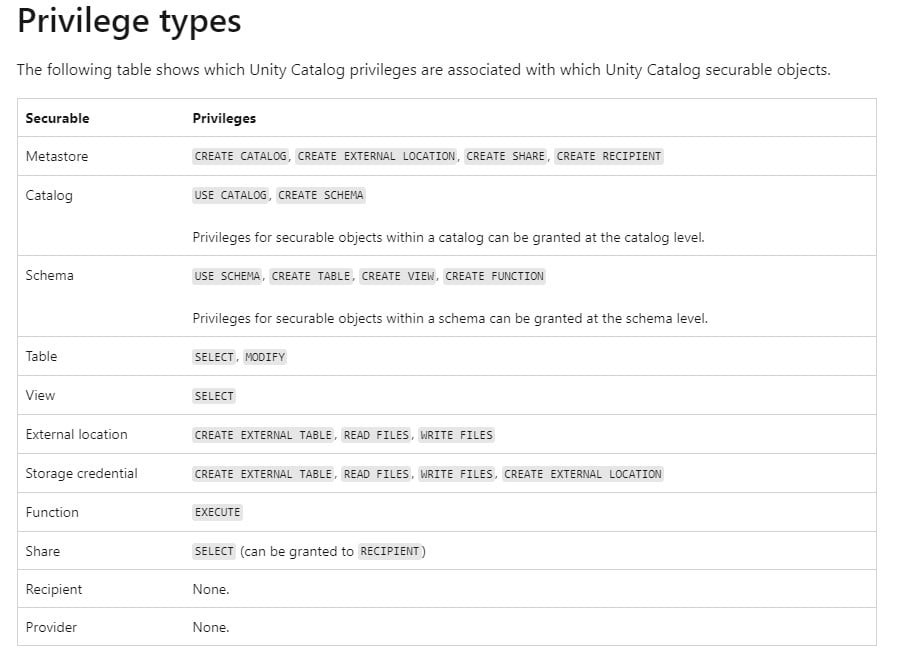

Unity Catalog Privileges
https://learn.microsoft.com/en-us/azure/databricks/spark/latest/spark-sql/language-manual/sql-ref-privileges#privilege-types

Table ACL privileges
https://learn.microsoft.com/en-us/azure/databricks/security/access-control/table-acls/object-privileges#privileges

```
Domain
Data Governance
```

<br />

#### Q45. A team member is leaving the team and he/she is currently the owner of the few tables, instead of transfering the ownership to a user you have decided to transfer the ownership to a group so in the future anyone in the group can manage the permissions rather than a single individual, which of the following commands help you accomplish this?

a) ***`ALTER TABLE table_name OWNER to 'group'`***

b) `TRANSFER OWNER table_name to 'group'`

c) `GRANT OWNER table_name to 'group'`

d) `ALTER OWNER ON table_name to 'group'`

e) `GRANT OWNER On table_name to 'group'`

**Overall explanation**

The answer is ALTER TABLE table_name OWNER to ‘group’
[Assign owner to object](https://docs.microsoft.com/en-us/azure/databricks/security/access-control/table-acls/object-privileges#assign-owner-to-object)

```
Domain
Data Governance
```
