# T_004 (Practice Test 4)

#### Q1. You are designing an analytical to store structured data from your e-commerce platform and unstructured data from website traffic and app store, how would you approach where you store this data?

a) Use traditional data warehouse for structured data and use data lakehouse for unstructured data.

b) Data lakehouse can only store unstructured data but cannot enforce a schema

c) ***Data lakehouse can store structured and unstructured data and can enforce schema***

d) Traditional data warehouses are good for storing structured data and enforcing schema

**Overall explanation**

The answer is, Data lakehouse can store structured and unstructured data and can enforce schema
[What Is a Lakehouse? - The Databricks Blog](https://databricks.com/blog/2020/01/30/what-is-a-data-lakehouse.html)

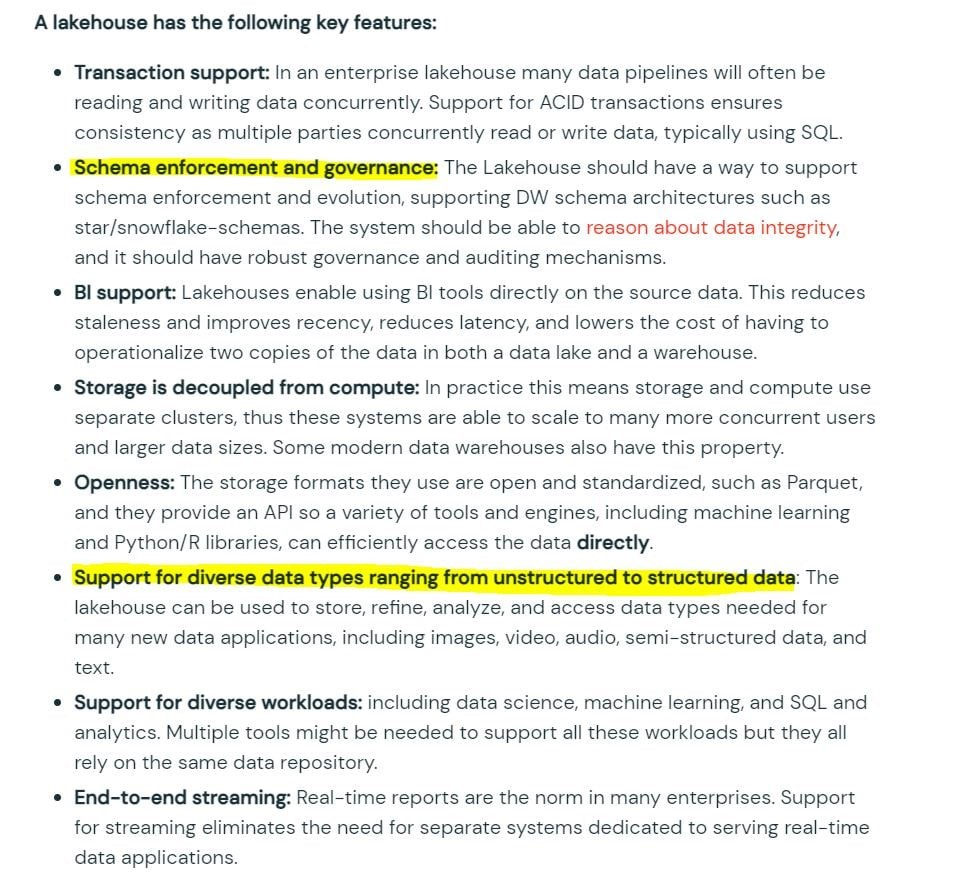

```
Domain
Databricks Lakehouse Platform
```

<br />

#### Q2. What is the best way to describe a data lakehouse compared to a data warehouse?

a) A data lakehouse provides a relational system of data management

b) A data lakehouse captures snapshots of data for version control purposes.

c) A data lakehouse couples storage and compute for complete control.

d) A data lakehouse utilizes proprietary storage formats for data.

e) ***A data lakehouse enables both batch and streaming analytics.***

**Overall explanation**

Anser is A data lakehouse enables both batch and streaming analytics.

A lakehouse has the following key features:

•	**Transaction support**: In an enterprise lakehouse many data pipelines will often be reading and writing data concurrently. Support for ACID transactions ensures consistency as multiple parties concurrently read or write data, typically using SQL.
•	**Schema enforcement and governance**: The Lakehouse should have a way to support schema enforcement and evolution, supporting DW schema architectures such as star/snowflake-schemas. The system should be able to reason about data integrity, and it should have robust governance and auditing mechanisms.
•	**BI support**: Lakehouses enable using BI tools directly on the source data. This reduces staleness and improves recency, reduces latency, and lowers the cost of having to operationalize two copies of the data in both a data lake and a warehouse.
•	**Storage is decoupled from compute**: In practice this means storage and compute use separate clusters, thus these systems are able to scale to many more concurrent users and larger data sizes. Some modern data warehouses also have this property.
•	**Openness**: The storage formats they use are open and standardized, such as Parquet, and they provide an API so a variety of tools and engines, including machine learning and Python/R libraries, can efficiently access the data directly.
•	**Support for diverse data types ranging from unstructured to structured data**: The lakehouse can be used to store, refine, analyze, and access data types needed for many new data applications, including images, video, audio, semi-structured data, and text.
•	**Support for diverse workloads**: including data science, machine learning, and SQL and analytics. Multiple tools might be needed to support all these workloads but they all rely on the same data repository.
•	**End-to-end streaming**: Real-time reports are the norm in many enterprises. Support for streaming eliminates the need for separate systems dedicated to serving real-time data applications.

```
Domain
Databricks Lakehouse Platform
```

<br />

#### Q3. Which of the following is a correct statement on how the data is organized in the storage when when managing a DELTA table?

a) ***All of the data is broken down into one or many parquet files, log files are broken down into one or many JSON files, and each transaction creates a new data file(s) and log file.***

b) All of the data and log are stored in a single parquet file

c) All of the data is broken down into one or many parquet files, but the log file is stored as a single json file, and every transaction creates a new data file(s) and log file gets appended.

d) All of the data is broken down into one or many parquet files, log file is removed once the transaction is committed.

e) All of the data is stored into one parquet file, log files are broken down into one or many json files.

**Overall explanation**

Answer is
All of the data is broken down into one or many parquet files, log files are broken down into one or many json files, and each transaction creates a new data file(s) and log file.

here is sample layout of how DELTA table might look,

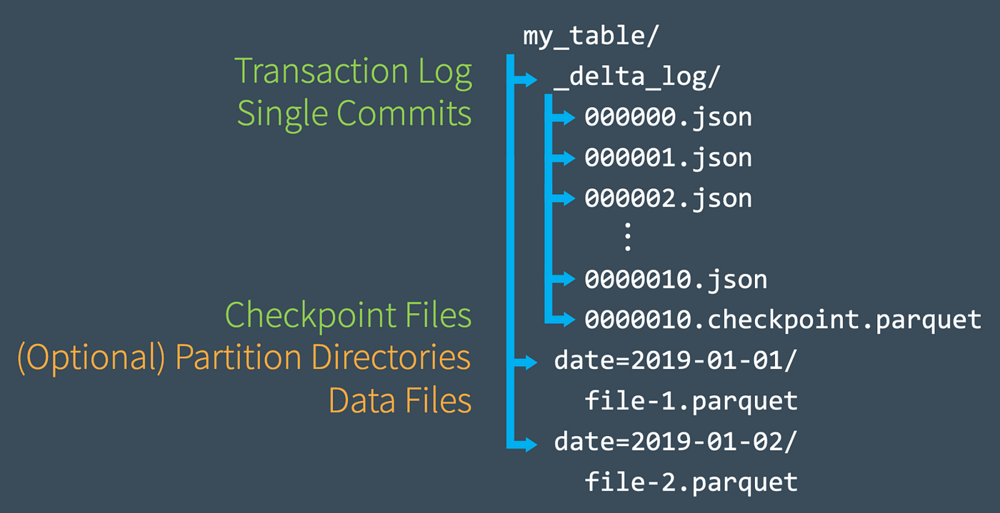

```
Domain
Databricks Lakehouse Platform
```

<br />

#### Q4. As a Data Engineer, you were asked to create a delta table to store below transaction data?


a) 
```
1.	CREATE DELTA TABLE transactions (
2.	                  transactionId int,
3.	                  transactionDate timestamp,
4.	                  unitsSold int)
```

b) 
```
1.	CREATE TABLE transactions (
2.	transactionId int,
3.	transactionDate timestamp,
4.	unitsSold int)
5.  FORMAT DELTA
```

c) ***CORRECT ANSWER***
```
1.	CREATE TABLE transactions (
2.	transactionId int,
3.	transactionDate timestamp,
4.	unitsSold int)
```

d) 
```
1.	CREATE TABLE USING DELTA transactions (
2.	transactionId int,
3.	transactionDate timestamp,
4.	unitsSold int) 
```

e) 
```
1.	CREATE TABLE transactions (
2.	transactionId int,
3.	transactionDate timestamp,
4.	unitsSold int)
5.	LOCATION DELTA
```

**Overall explanation**

Answer is

> 1.	CREATE TABLE transactions (
2.	transactionId int,
3.	transactionDate timestamp,
4.	unitsSold int)

When creating a table in Databricks by default the table is stored in DELTA format.

```
Domain
Databricks Lakehouse Platform
```

<br />

#### Q5. How does a Delta Lake differ from a traditional data lake?

a) Delta lake is Datawarehouse service on top of data lake that can provide reliability, security, and performance

b) Delta lake is a caching layer on top of data lake that can provide reliability, security, and performance

c) ***Delta lake is an open storage format like parquet with additional capabilities that can provide reliability, security, and performance***

d) Delta lake is an open storage format designed to replace flat files with additional capabilities that can provide reliability, security, and performance

e) Delta lake is proprietary software designed by Databricks that can provide reliability, security, and performance

**Overall explanation**

Answer is, Delta lake is an open storage format like parquet with additional capabilities that can provide reliability, security, and performance

Delta lake is
· Open source
· Builds up on standard data format
· Optimized for cloud object storage
· Built for scalable metadata handling

Delta lake is not
· Proprietary technology
· Storage format
· Storage medium
· Database service or data warehouse

```
Domain
Databricks Lakehouse Platform
```

<br />

#### Q6. Newly joined data analyst requested read-only access to tables, assuming you are owner/admin which section of Databricks platform is going to facilitate granting select access to the user

a) Admin console

b) User settings

c) ***Data explorer***

d) Azure Databricks control pane IAM

e) Azure RBAC

**Overall explanation**

Anser is Data Explorer

https://docs.databricks.com/sql/user/data/index.html

Data explorer lets you easily explore and manage permissions on databases and tables. Users can view schema details, preview sample data, and see table details and properties. Administrators can view and change owners, and admins and data object owners can grant and revoke permissions.

To open data explorer, click 

Data in the sidebar.

```
Domain
Databricks Lakehouse Platform
```

<br />

#### Q7. You noticed that colleague is manually copying the notebook with _bkp to store the previous versions, which of the following feature would you recommend instead.

a) ***Databricks notebooks support change tracking and versioning***

b) Databricks notebooks should be copied to a local machine and setup source control locally to version the notebooks

c) Databricks notebooks can be exported into dbc archive files and stored in data lake

d) Databricks notebook can be exported as HTML and imported at a later time

**Overall explanation**

Answer is Databricks notebooks support automatic change tracking and versioning.

When you are editing the notebook on the right side check version history to view all the changes, every change you are making is captured and saved.

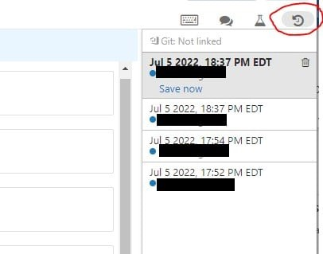

```
Domain
Databricks Lakehouse Platform
```

<br />

#### Q8. Which of the following describes how Databricks Repos can help facilitate CI/CD workflows on the Databricks Lakehouse Platform?

a) Databricks Repos can facilitate the pull request, review, and approval process before merging branches

b) Databricks Repos can merge changes from a secondary Git branch into a main Git branch

c) Databricks Repos can be used to design, develop, and trigger Git automation pipelines

d) Databricks Repos can store the single-source-of-truth Git repository

e) ***Databricks Repos can commit or push code changes to trigger a CI/CD process***

**Overall explanation**

Answer is Databricks Repos can commit or push code changes to trigger a CI/CD process

See below diagram to understand the role Databricks Repos  and Git provider plays when building a CI/CD workdlow.
All the steps highlighted in yellow can be done Databricks Repo, all the steps highlighted in Gray are done in a git provider like Github or Azure Devops.

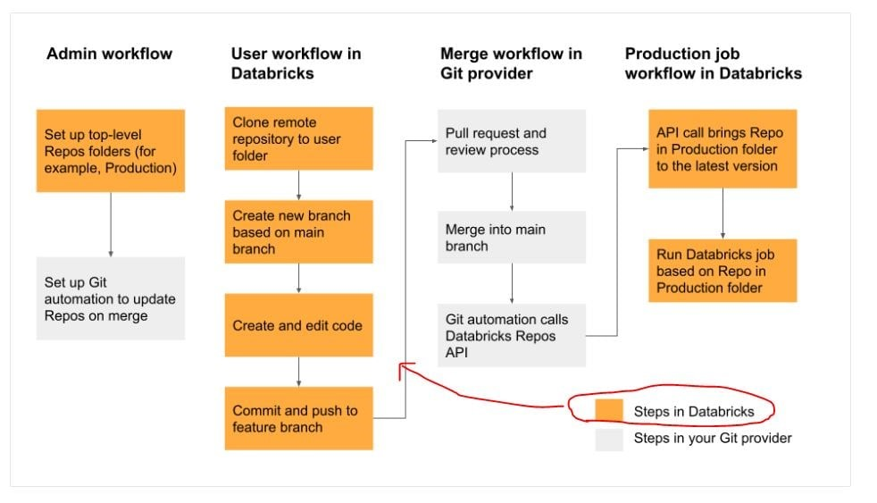

```
Domain
Databricks Lakehouse Platform
```

<br />

#### Q9. You are currently working on a production job failure with a job set up in job clusters due to a data issue, what cluster do you need to start to investigate and analyze the data?

a) A Job cluster can be used to analyze the problem

b) ***All-purpose cluster/ interactive cluster is the recommended way to run commands and view the data.***

c) Existing job cluster can be used to investigate the issue

d) Databricks SQL Endpoint can be used to investigate the issue

**Overall explanation**

Answer is  All-purpose cluster/ interactive cluster is the recommended way to run commands and view the data.

A job cluster can not provide a way for a user to interact with a notebook once the job is submitted, but an Interactive cluster allows to you display data, view visualizations write or edit quries, which makes it a perfect fit to investigate and analyze the data.


```
Domain
Databricks Lakehouse Platform
```

<br />

#### Q10. What is the purpose of the bronze layer in a Multi-hop architecture?

a) Can be used to eliminate duplicate records

b) Used as a data source for Machine learning applications.

c) Perform data quality checks, corrupt data quarantined

d) Contains aggregated data that is to be consumed into Silver

e) ***Provides efficient storage and querying of full unprocessed history of data***

**Overall explanation**

The answer is Provides efficient storage and querying of full unprocessed history of data
Medallion Architecture – Databricks

Bronze Layer: 
1.	Raw copy of ingested data
2.	Replaces traditional data lake
3.	Provides efficient storage and querying of full, unprocessed history of data
4.	No schema is applied at this layer

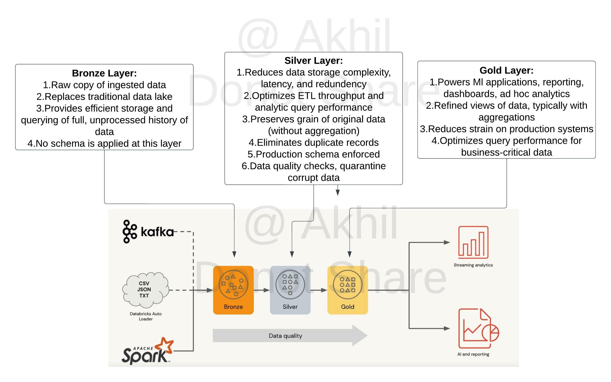

```
Domain
Databricks Lakehouse Platform
```

<br />

#### Q11. A dataset has been defined using Delta Live Tables and includes an expectations clause: CONSTRAINT valid_timestamp EXPECT (timestamp > '2020-01-01') ON VIOLATION FAIL
*What is the expected behavior when a batch of data containing data that violates these constraints is processed?*

a) Records that violate the expectation are added to the target dataset and recorded as invalid in the event log.

b) Records that violate the expectation are dropped from the target dataset and recorded as invalid in the event log.

c) ***Records that violate the expectation cause the job to fail***

d) Records that violate the expectation are added to the target dataset and flagged as invalid in a field added to the target dataset.

e) Records that violate the expectation are dropped from the target dataset and loaded into a quarantine table.

**Overall explanation**

The answer is  Records that violate the expectation cause the job to fail.
Delta live tables support three types of expectations to fix bad data in DLT pipelines
Review below example code to examine these expectations, 

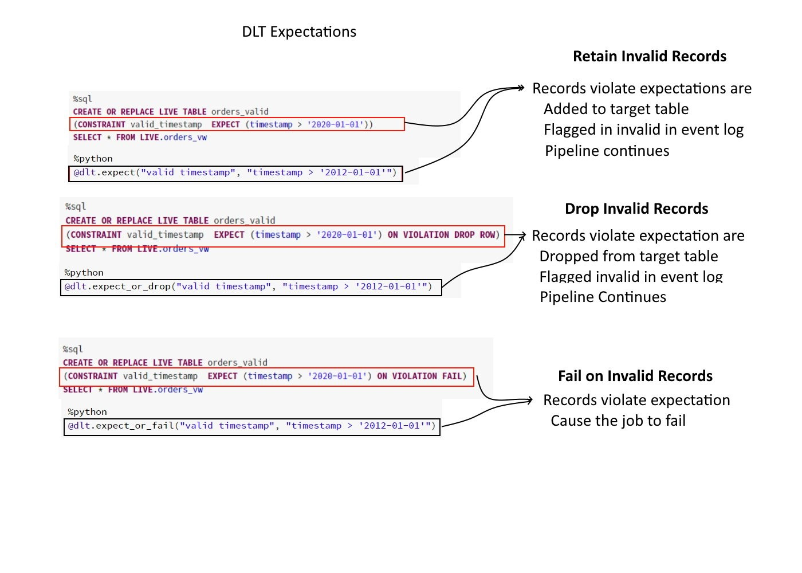

**Invalid records**:
Use the expect operator when you want to keep records that violate the expectation. Records that violate the expectation are added to the target dataset along with valid records:

SQL
> CONSTRAINT valid_timestamp EXPECT (timestamp > '2020-01-01')

**Drop invalid records**:
Use the expect or drop operator to prevent the processing of invalid records. Records that violate the expectation are dropped from the target dataset:

SQL
> CONSTRAINT valid_timestamp EXPECT (timestamp > '2020-01-01')  ON VIOLATION DROP ROW

**Fail on invalid records**:
When invalid records are unacceptable, use the expect or fail operator to halt execution immediately when a record fails validation. If the operation is a table update, the system atomically rolls back the transaction:

SQL
> CONSTRAINT valid_timestamp EXPECT (timestamp > '2020-01-01') ON VIOLATION FAIL UPDATE

```
Domain
Incremental Data Processing
```

<br />

#### Q12. What is the purpose of a silver layer in Multi hop architecture?

a) Replaces a traditional data lake

b) Efficient storage and querying of full and unprocessed history of data

c) ***A schema is enforced, with data quality checks.***

d) Refined views with aggregated data

e) Optimized query performance for business-critical data

**Overall explanation**

The answer is, A schema is enforced, with data quality checks.
[Medallion Architecture – Databricks](https://databricks.com/glossary/medallion-architecture)
Silver Layer: 

1.	Reduces data storage complexity, latency, and redundency
2.	Optimizes ETL throughput and analytic query performance
3.	Preserves grain of original data (without aggregation)
4.	Eliminates duplicate records
5.	production schema enforced
6.	Data quality checks, quarantine corrupt data

```
Domain
Databricks Lakehouse Platform
```

<br />

#### Q13. What is the purpose of a gold layer in Multi-hop architecture?

a) Optimizes ETL throughput and analytic query performance

b) Eliminate duplicate records

c) Preserves grain of original data, without any aggregations

d) Data quality checks and schema enforcement

e) ***Powers ML applications, reporting, dashboards and adhoc reports.***

**Overall explanation**

The answer is Powers ML applications, reporting, dashboards and adhoc reports.
Review the below link for more info,
[Medallion Architecture – Databricks](https://databricks.com/glossary/medallion-architecture)
Gold Layer:

1.	Powers Ml applications, reporting, dashboards, ad hoc analytics
2.	Refined views of data, typically with aggregations
3.	Reduces strain on production systems
4.	Optimizes query performance for business-critical data

```
Domain
Incremental Data Processing
```

<br />

#### Q14. You are currently asked to work on building a data pipeline, you have noticed that you are currently working on a very large scale ETL many data dependencies, which of the following tools can be used to address this problem?

a) AUTO LOADER

b) JOBS and TASKS

c) SQL Endpoints

d) ***DELTA LIVE TABLES***

e) STRUCTURED STREAMING with MULTI HOP

**Overall explanation**

The answer is, DELTA LIVE TABLES

DLT simplifies data dependencies by building DAG-based joins between live tables. Here is a view of how the dag looks with data dependencies without additional meta data,
```
1.	create or replace live view customers 
2.	select * from customers;
3.	 
4.	create or replace live view sales_orders_raw
5.	select * from sales_orders;
6.	 
7.	create or replace live view sales_orders_cleaned 
8.	as
9.	select sales.* from 
10.	live.sales_orders_raw s
11.	 join live.customers c 
12.	on c.customer_id = s.customer_id
13.	where c.city = 'LA';
14.	 
15.	create or replace live table sales_orders_in_la
16.	select * from sales_orders_cleaned;
```
Above code creates below dag

Documentation on DELTA LIVE TABLES,
https://databricks.com/product/delta-live-tables
https://databricks.com/blog/2022/04/05/announcing-generally-availability-of-databricks-delta-live-tables-dlt.html

DELTA LIVE TABLES, addresses below challenges when building ETL processes

1.	Complexities of large scale ETL
    a.	Hard to build and maintain dependencies
    b.	Difficult to switch between batch and stream
2.	Data quality and governance
    a.	Difficult to monitor and enforce data quality
    b.	Impossible to trace data lineage
3.	Difficult pipeline operations
    a.	Poor observability at granular data level
    b.	Error handling and recovery is laborious

```
Domain
Databricks Lakehouse Platform
```

<br />

#### Q15. How do you create a delta live tables pipeline and deploy using DLT UI?

a) ***Within the Workspace UI, click on Workflows, select Delta Live tables and create a pipeline and select the notebook with DLT code.***

b) Under Cluster UI, select SPARK UI and select Structured Streaming and click create pipeline and select the notebook with DLT code.

c) There is no UI, you can only setup DELTA LIVE TABLES using Python and SQL API and select the notebook with DLT code.

d) Use VS Code and download DBX plugin, once the plugin is loaded you can build DLT pipelines and select the notebook with DLT code.

e) Within the Workspace UI, click on SQL Endpoint, select Delta Live tables and create pipelinea and select the notebook with DLT code.

**Overall explanation**

The answer is, Within the Workspace UI, click on Workflows, select Delta Live tables and create a pipeline and select the notebook with DLT code.
https://docs.databricks.com/data-engineering/delta-live-tables/delta-live-tables-quickstart.html

```
Domain
Incremental Data Processing
```

<br />

#### Q16. You are noticing job cluster is taking 6 to 8 mins to start which is delaying your job to finish on time, what steps you can take to reduce the amount of time cluster startup time

a) Setup a second job ahead of first job to start the cluster, so the cluster is ready with resources when the job starts

b) Use All purpose cluster instead to reduce cluster start up time

c) Reduce the size of the cluster, smaller the cluster size shorter it takes to start the cluster

d) ***Use cluster pools to reduce the startup time of the jobs***

e) Use SQL endpoints to reduce the startup time

**Overall explanation**

The answer is, Use cluster pools to reduce the startup time of the jobs.
Cluster pools allow us to reserve VM's ahead of time, when a new job cluster is created VM are grabbed from the pool. Note: when the VM's are waiting to be used by the cluster only cost incurred is Azure. Databricks run time cost is only billed once VM is allocated to a cluster.

Here is a demo of how to setup and follow some best practices,
https://www.youtube.com/watch?v=FVtITxOabxg&ab_channel=DatabricksAcademy

```
Domain
Building Production Pipelines
```

<br />

#### Q17. Data engineering team has a job currently setup to run a task load data into a reporting table every day at 8: 00 AM takes about 20 mins, Operations teams are planning to use that data to run a second job, so they access latest complete set of data. What is the best to way to orchestrate this job setup?

a) Add Operation reporting task in the same job and set the Data Engineering task to depend on Operations reporting task

b) Setup a second job to run at 8:20 AM in the same workspace

c) ***Add Operation reporting task in the same job and set the operations reporting task to depend on Data Engineering task***

d) Use Auto Loader to run every 20 mins to read the initial table and set the trigger to once and create a second job

e) Setup a Delta live to table based on the first table, set the job to run in continuous mode

**Overall explanation**

The answer is Add Operation reporting task in the same job and set the operations reporting task to depend on Data Engineering task.

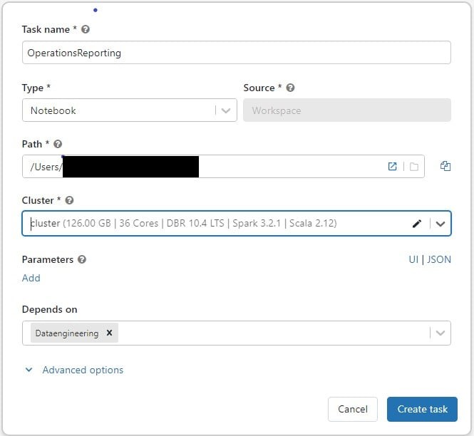

View
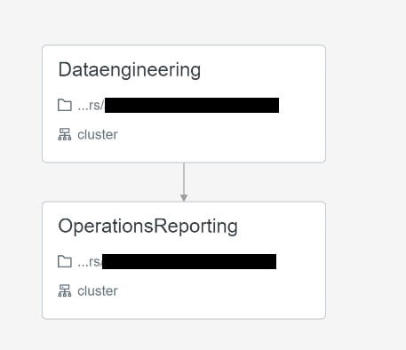

```
Domain
Databricks Lakehouse Platform
```

<br />

#### Q18. The data engineering team noticed that one of the job normally finishes in 15 mins but gets stuck randomly when reading remote databases due to a network packet drop, which of the following steps can be used to improve the stability of the job?

a) Use Databrick REST API to monitor long running jobs and issue a kill command

b) Use Jobs runs, active runs UI section to monitor and kill long running job

c) ***Modify the task, to include a timeout to kill the job if it runs more than 15 mins.***

d) Use Spark job time out setting in the Spark UI

e) Use Cluster timeout setting in the Job cluster UI

**Overall explanation**

The answer is, Modify the task, to include time out to kill the job if it runs more than 15 mins.
https://docs.microsoft.com/en-us/azure/databricks/data-engineering/jobs/jobs#timeout

```
Domain
Building Production Pipelines
```

<br />

#### Q19. Which of the following programming languages can be used to build a Databricks SQL dashboard?

a) Python

b) Scala

c) ***SQL***

d) R

e) All of the above

**Overall explanation**

The answer is SQL

```
Domain
Building Production Pipelines
```

<br />

#### Q20. The data analyst team had put together queries that identify items that are out of stock based on orders and replenishment but when they run all together for final output the team noticed it takes a really long time, you were asked to look at the reason why queries are running slow and identify steps to improve the performance and when you looked at it you noticed all the code queries are running sequentially and using a SQL endpoint cluster. Which of the following steps can be taken to resolve the issue?

Here is the example query
```
1.	--- Get order summary 
2.	create or replace table orders_summary
3.	as 
4.	select product_id, sum(order_count) order_count
5.	from 
6.	 (
7.	  select product_id,order_count from orders_instore
8.	  union all 
9.	  select product_id,order_count from orders_online
10.	 )
11.	group by product_id
12.	-- get supply summary 
13.	create or repalce tabe supply_summary
14.	as 
15.	select product_id, sum(supply_count) supply_count
16.	from supply
17.	group by product_id
18.	 
19.	-- get on hand based on orders summary and supply summary
20.	 
21.	with stock_cte
22.	as (
23.	select nvl(s.product_id,o.product_id) as product_id,
24.		 nvl(supply_count,0) -  nvl(order_count,0) as on_hand
25.	from supply_summary s 
26.	full outer join orders_summary o
27.	        on s.product_id = o.product_id
28.	)
29.	select *
30.	from 
31.	stock_cte
32.	where on_hand = 0 
```

a) Turn on the Serverless feature for the SQL endpoint.

b) Increase the maximum bound of the SQL endpoint’s scaling range.

c) ***Increase the cluster size of the SQL endpoint.***

d) Turn on the Auto Stop feature for the SQL endpoint.

e) Turn on the Serverless feature for the SQL endpoint and change the Spot 

f) Instance Policy to “Reliability Optimized.”

**Overall explanation**

The answer is to increase the cluster size of the SQL Endpoint,  here queries are running sequentially and since the single query can not span more than one cluster adding more clusters won't improve the query but rather increasing the cluster size will improve performance so it can use additional compute in a warehouse.

In the exam please note that additional context will not be given instead you have to look for cue words or need to understand if the queries are running sequentially or concurrently. if the queries are running sequentially then scale up(more nodes) if the queries are running concurrently (more users) then scale out(more clusters).

Below is the snippet from Azure, as you can see by increasing the cluster size you are able to add more worker nodes.

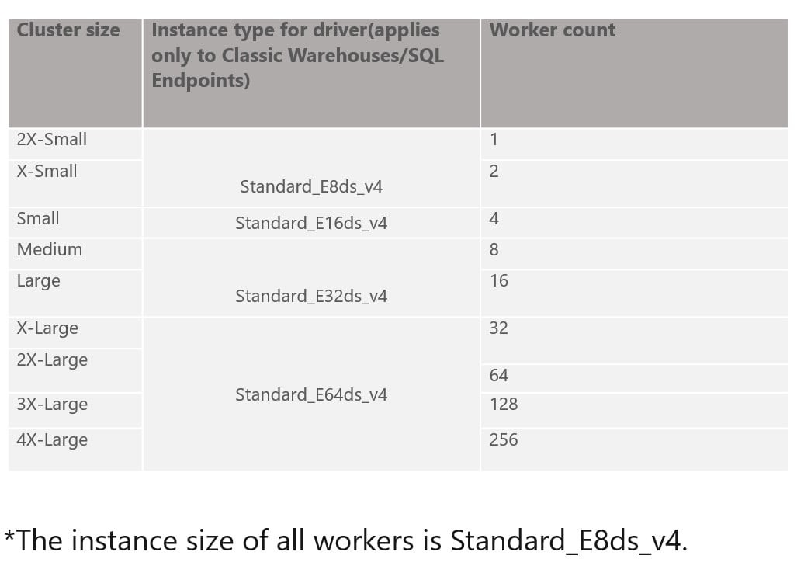

SQL endpoint scales horizontally(scale-out) and vertically (scale-up), you have to understand when to use what.

Scale-up-> Increase the size of the cluster from x-small to small, to medium, X Large....
If you are trying to improve the performance of a single query having additional memory, additional nodes and cpu in the cluster will improve the performance.

Scale-out -> Add more clusters, change max number of clusters
If you are trying to improve the throughput, being able to run as many queries as possible then having an additional cluster(s) will improve the performance.

SQL endpoint

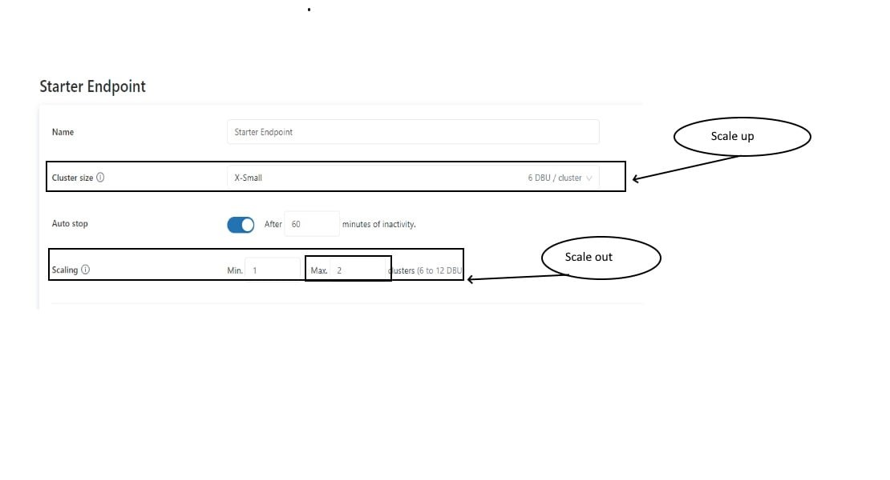

```
Domain
Building Production Pipelines
```

<br />

#### Q21. The operations team is interested in monitoring the recently launched product, team wants to set up an email alert when the number of units sold increases by more than 10,000 units. They want to monitor this every 5 mins.

Fill in the below blanks to finish the steps we need to take
```
Create ___ query that calculates total units sold
· Setup ____ with query on trigger condition Units Sold > 10,000
· Setup ____ to run every 5 mins
· Add destination ______
```

a) Python, Job, SQL Cluster, email address

b) ***SQL, Alert, Refresh, email address***

c) SQL, Job, SQL Cluster, email address

d) SQL, Job, Refresh, email address

e) Python, Job, Refresh, email address

**Overall explanation**


```
Domain
Incremental Data Processing
```

<br />

```
Domain
Databricks Lakehouse Platform
```

<br />

#### Q22. The marketing team is launching a new campaign to monitor the performance of the new campaign for the first two weeks, they would like to set up a dashboard with a refresh schedule to run every 5 minutes, which of the below steps can be taken to reduce of the cost of this refresh over time?

a) Reduce the size of the SQL Cluster size

b) Reduce the max size of auto scaling from 10 to 5

c) ***Setup the dashboard refresh schedule to end in two weeks***

d) Change the spot instance policy from reliability optimized to cost optimized

e) Always use X-small cluster

**Overall explanation**

The answer is Setup the dashboard refresh schedule to end in two weeks

```
Domain
Building Production Pipelines
```

<br />

#### Q23. Which of the following tool provides Data Access control, Access Audit, Data Lineage, and Data discovery?

a) DELTA LIVE Pipelines

b) ***Unity Catalog***

c) Data Governance

d) DELTA lake

e) DELTA lake

**Overall explanation**

The answer is Unity Catalog

```
Domain
Data Governance
```

<br />

#### Q24. Data engineering team is required to share the data with Data science team and both the teams are using different workspaces in the same organizatio which of the following techniques can be used to simplify sharing data across?

*Please note the question is asking how data is shared within an organization across multiple workspaces.*

a) Data Sharing

b) ***Unity Catalog***

c) DELTA lake

d) Use a single storage location

e) DELTA LIVE Pipelines

**Overall explanation**


```
Domain
Databricks Lakehouse Platform
```

<br />

#### Q25. A newly joined team member John Smith in the Marketing team who currently does not have any access to the data requires read access to customers table, which of the following statements can be used to grant access.

a) GRANT SELECT, USAGE TO john.smith@marketing.com ON TABLE customers

b) GRANT READ, USAGE TO john.smith@marketing.com ON TABLE customers

c) ***GRANT SELECT, USAGE ON TABLE customers TO john.smith@marketing.com***

d) GRANT READ, USAGE ON TABLE customers TO john.smith@marketing.com

e) GRANT READ, USAGE ON customers TO john.smith@marketing.com

**Overall explanation**


```
Domain
Databricks Lakehouse Platform
```

<br />

#### Q26. Grant full privileges to new marketing user Kevin Smith to table sales

a) GRANT FULL PRIVILEGES TO kevin.smith@marketing.com ON TABLE sales

b) GRANT ALL PRIVILEGES TO kevin.smith@marketing.com ON TABLE sales

c) GRANT FULL PRIVILEGES ON TABLE sales TO kevin.smith@marketing.com

d) ***GRANT ALL PRIVILEGES ON TABLE sales TO kevin.smith@marketing.com***

e) GRANT ANY PRIVILEGE ON TABLE sales TO kevin.smith@marketing.com

**Overall explanation**


```
Domain
Databricks Lakehouse Platform
```

<br />

#### Q27. Which of the following locations in the Databricks product architecture hosts the notebooks and jobs?

a) Data plane

b) ***Control plane***

c) Databricks Filesystem

d) JDBC data source

e) Databricks web application

**Overall explanation**


```
Domain
Databricks Lakehouse Platform
```

<br />

#### Q28. What could be the expected output of query SELECT COUNT (DISTINCT *) FROM user on this table

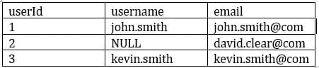

a) 3

b) ***2***

c) 1

d) 0

e) NULL

**Overall explanation**


```
Domain
Databricks Lakehouse Platform
```

<br />

#### Q29. You are still noticing slowness in query after performing optimize which helped you to resolve the small files problem, the column(transactionId) you are using to filter the data has high cardinality and auto incrementing number. Which delta optimization can you enable to filter data effectively based on this column?

a) Create BLOOM FLTER index on the transactionId

b) ***Perform Optimize with Zorder on transactionId***

c) transactionId has high cardinality, you cannot enable any optimization.

d) Increase the cluster size and enable delta optimization

e) Increase the driver size and enable delta optimization

**Overall explanation**


```
Domain
Databricks Lakehouse Platform
```

<br />

#### Q30. If you create a database sample_db with the statement `CREATE DATABASE sample_db` what will be the *default* location of the database in DBFS?

a) Default location, DBFS:/user/

b) Default location, /user/db/

c) Default Storage account

d) Statement fails “Unable to create database without location”

e) ***Default Location, dbfs:/user/hive/warehouse***

**Overall explanation**


```
Domain
Databricks Lakehouse Platform
```

<br />

#### Q31. Which of the following results in the creation of an external table?

a) CREATE TABLE transactions (id int, desc string) USING DELTA LOCATION EXTERNAL

b) CREATE TABLE transactions (id int, desc string)

c) CREATE EXTERNAL TABLE transactions (id int, desc string)

d) CREATE TABLE transactions (id int, desc string) TYPE EXTERNAL

e) ***CREATE TABLE transactions (id int, desc string) LOCATION '/mnt/delta/transactions'***

**Overall explanation**


```
Domain
Databricks Lakehouse Platform
```

<br />

#### Q32. When you drop an external DELTA table using the SQL Command DROP TABLE table_name, how does it impact metadata(delta log, history), and data stored in the storage?

a) Drops table from metastore, metadata(delta log, history)and data in storage

b) Drops table from metastore, data but keeps metadata(delta log, history) in storage

c) Drops table from metastore, metadata(delta log, history)but keeps the data in storage

d) ***Drops table from metastore, but keeps metadata(delta log, history)and data in storage***

e) Drops table from metastore and data in storage but keeps metadata(delta log, history)

**Overall explanation**


```
Domain
Databricks Lakehouse Platform
```

<br />

#### Q33. Which of the following is a true statement about the global temporary view?

a) ***A global temporary view is available only on the cluster it was created, when the cluster restarts global temporary view is automatically dropped.***

b) A global temporary view is available on all clusters for a given workspace

c) A global temporary view persists even if the cluster is restarted

d) A global temporary view is stored in a user database

e) A global temporary view is automatically dropped after 7 days

**Overall explanation**


```
Domain
Databricks Lakehouse Platform
```

<br />

#### Q34. You are trying to create an object by joining two tables that and it is accessible to data scientist’s team, so it does not get dropped if the cluster restarts or if the notebook is detached. What type of object are you trying to create?

a) Temporary view

b) Global Temporary view

c) Global Temporary view with cache option

d) External view

e) ***View***

**Overall explanation**


```
Domain
Databricks Lakehouse Platform
```

<br />

#### Q35. What is the best way to query external csv files located on DBFS Storage to inspect the data using SQL? 

a) SELECT * FROM 'dbfs:/location/csv_files/' FORMAT = 'CSV'

b) SELECT CSV. * from 'dbfs:/location/csv_files/'

c) ***SELECT * FROM CSV. 'dbfs:/location/csv_files/'***

d) You can not query external files directly, us COPY INTO to load the data into a table first

e) SELECT * FROM 'dbfs:/location/csv_files/' USING CSV

**Overall explanation**


```
Domain
Databricks Lakehouse Platform
```

<br />

#### Q36. Direct query on external files limited options, create external tables for CSV files with header and pipe delimited CSV files, fill in the blanks to complete the create table statement

```
CREATE TABLE sales (id int, unitsSold int, price FLOAT, items STRING)
    ________
    ________

LOCATION “dbfs:/mnt/sales/*.csv”
```

a) 
> FORMAT CSV
OPTIONS ( “true”,”|”)


b) 
> USING CSV
TYPE ( “true”,”|”)

c) ***CORRECT ANSWER***
> USING CSV
OPTIONS ( header =“true”, delimiter = ”|”)

d) 
> FORMAT CSV
FORMAT TYPE ( header =“true”, delimiter = ”|”)

e) 
> FORMAT CSV
TYPE ( header =“true”, delimiter = ”|”)

**Overall explanation**


```
Domain
Databricks Lakehouse Platform
```

<br />

#### Q37. At the end of the inventory process, a file gets uploaded to the cloud object storage, you are asked to build a process to ingest data which of the following method can be used to ingest the data incrementally, schema of the file is expected to change overtime ingestion process should be able to handle these changes automatically. Below is the auto loader to command to load the data, fill in the blanks for successful execution of below code. 

```
1.	spark.readStream
2.	.format("cloudfiles")
3.	.option("_______",”csv)
4.	.option("_______", ‘dbfs:/location/checkpoint/’)
5.	.load(data_source)
6.	.writeStream
7.	.option("_______",’ dbfs:/location/checkpoint/’)
8.	.option("_______", "true")
9.	.table(table_name))
```

a) format, checkpointlocation, schemalocation, overwrite

b) cloudfiles.format, checkpointlocation, cloudfiles.schemalocation, overwrite

c) ***cloudfiles.format, cloudfiles.schemalocation, checkpointlocation, mergeSchema***

d) cloudfiles.format, cloudfiles.schemalocation, checkpointlocation, overwrite

e) cloudfiles.format, cloudfiles.schemalocation, checkpointlocation, append

**Overall explanation**


```
Domain
Databricks Lakehouse Platform
```

<br />

#### Q38. You are working on a table called orders which contains data for 2021 and you have the second table called orders_archive which contains data for 2020, you need to combine the data from two tables and there could be a possibility of the same rows between both the tables, you are looking to combine the results from both the tables and eliminate the duplicate rows, which of the following SQL statements helps you accomplish this?

a) ***SELECT * FROM orders UNION SELECT * FROM orders_archive***

b) SELECT * FROM orders INTERSECT SELECT * FROM orders_archive

c) SELECT * FROM orders UNION ALL SELECT * FROM orders_archive

d) SELECT * FROM orders_archive MINUS SELECT * FROM orders

e) SELECT distinct * FROM orders JOIN orders_archive on order.id = orders_archive.id

**Overall explanation**


```
Domain
Databricks Lakehouse Platform
```

<br />

#### Q39. Which of the following python statement can be used to replace the schema name and table name in the query statement?

a) 
```
1.	table_name = "sales"
2.	schema_name = "bronze"
3.	query = f”select * from schema_name.table_name”
```

b) 
```
1.	table_name = "sales"
2.	schema_name = "bronze"
3.	query = "select * from {schema_name}.{table_name}"
```

c) ***CORRECT***
```
1.	table_name = "sales"
2.	schema_name = "bronze"
3.	query = f"select * from { schema_name}.{table_name}"
```

d) 
```
1.	table_name = "sales"
2.	schema_name = "bronze"
3.	query = f"select * from + schema_name +"."+table_name"
```

**Overall explanation**


```
Domain
Databricks Lakehouse Platform
```

<br />

#### Q40. Which of the following SQL statements can replace python variables in Databricks SQL code, when the notebook is set in SQL mode?

```
1.	%python 
2.	table_name = "sales"
3.	schema_name = "bronze"
4.	 
5.	%sql
6.	SELECT * FROM ____________________
```

a) `SELECT * FROM f{schema_name.table_name}`

b) `SELECT * FROM {schem_name.table_name}`

c) ***`SELECT * FROM ${schema_name}.${table_name}`***

d) `SELECT * FROM schema_name.table_name`

**Overall explanation**


```
Domain
Databricks Lakehouse Platform
```

<br />

#### Q41. A notebook accepts an input parameter that is assigned to a python variable called department and this is an optional parameter to the notebook, you are looking to control the flow of the code using this parameter. you have to check department variable is present then execute the code and if no department value is passed then skip the code execution. How do you achieve this using python?

a) 
```
1.	if department is not None:
2.	  #Execute code
3.	else:
4.	  pass
```

b) 
```
1.	if (department is not None)
2.	   #Execute code
3.	else
4.	  pass
```

c) 
```
1.	if department is not None:
2.	 #Execute code
3.	end:
4.	 pass
```

d) 
```
1.	if department is not None:
2.	 #Execute code
3.	then:
4.	 pass
```

e) ***OPTIMIZE***
```
1.	if department is None:
2.	  #Execute code
3.	else:
4.	  pass
```

**Overall explanation**


```
Domain
Databricks Lakehouse Platform
```

<br />

#### Q42. Which of the following operations are not supported on a streaming dataset view?
`spark.readStream.format("delta").table("sales").createOrReplaceTempView("streaming_view")`

a) SELECT sum(unitssold) FROM streaming_view

b) SELECT max(unitssold) FROM streaming_view

c) SELECT id, sum(unitssold) FROM streaming_view GROUP BY id ORDER BY id

d) SELECT id, count(*) FROM streaming_view GROUP BY id

e) ***SELECT * FROM streadming_view ORDER BY id***

**Overall explanation**


```
Domain
Databricks Lakehouse Platform
```

<br />

#### Q43. Which of the following techniques structured streaming uses to ensure recovery of failures during stream processing?

a) Checkpointing and Watermarking

b) Write ahead logging and watermarking

c) ***Checkpointing and write-ahead logging***

d) Delta time travel

e) The stream will failover to available nodes in the cluster

f) Checkpointing and Idempotent sinks

**Overall explanation**


```
Domain
Databricks Lakehouse Platform
```

<br />

#### Q44. What is the underlying technology that makes the Auto Loader work?

a) Loader

b) Delta Live Tables

c) ***Structured Streaming***

d) DataFrames

e) Live DataFames

**Overall explanation**


```
Domain
Databricks Lakehouse Platform
```

<br />

#### Q45. You are currently working to ingest millions of files that get uploaded to the cloud object storage for consumption, and you are asked to build a process to ingest this data, the schema of the file is expected to change over time, and the ingestion process should be able to handle these changes automatically. Which of the following method can be used to ingest the data incrementally?

a) AUTO APPEND

b) ***AUTO LOADER***

c) COPY INTO

d) Structured Streaming

e) Checkpoint

**Overall explanation**


```
Domain
Databricks Lakehouse Platform
```

<br />

