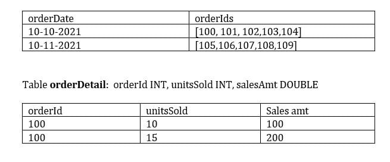

# T_005 (Practice Test 5)

#### Q1. Which of the statements are incorrect when choosing between lakehouse and Datawarehouse?

a) Lakehouse can have special indexes and caching which are optimized for Machine learning

b) ***Lakehouse cannot serve low query latency with high reliability for BI workloads, only suitable for batch workloads.***

c) Lakehouse can be accessed through various API’s including but not limited to Python/R/SQL

d) Traditional Data warehouses have storage and compute are coupled.

e) Lakehouse uses standard data formats like Parquet.


**Overall explanation**


```
Domain
Databricks Lakehouse Platform
```

<br />

#### Q2. Which of the statements are correct about lakehouse?

a) Lakehouse only supports Machine learning workloads and Data warehouses support BI workloads

b) Lakehouse only supports end-to-end streaming workloads and Data warehouses support Batch workloads

c) Lakehouse does not support ACID

d) In Lakehouse Storage and compute are coupled

e) ***Lakehouse supports schema enforcement and evolution***

**Overall explanation**


```
Domain
Databricks Lakehouse Platform
```

<br />

#### Q3. Which of the following are stored in the control pane of Databricks Architecture?

a) Job Clusters

b) All Purpose Clusters

c) Databricks Filesystem

d) ***Databricks Web Application***

e) Delta tables

**Overall explanation**


```
Domain
Databricks Lakehouse Platform
```

<br />

#### Q4. You have written a notebook to generate a summary data set for reporting, Notebook was scheduled using the job cluster, but you realized it takes 8 minutes to start the cluster, what feature can be used to start the cluster in a timely fashion so your job can run immediatley?

a) Setup an additional job to run ahead of the actual job so the cluster is running second job starts

b) ***Use the Databricks cluster pools feature to reduce the startup time***

c) Use Databricks Premium edition instead of Databricks standard edition

d) Pin the cluster in the cluster UI page so it is always available to the jobs

e) Disable auto termination so the cluster is always running

**Overall explanation**


```
Domain
Databricks Lakehouse Platform
```

<br />

#### Q5. Which of the following developer operations in the CI/CD can only be implemented through a GIT provider when using Databricks Repos.

a) Trigger Databricks Repos pull API to update the latest version

b) Commit and push code

c) Create and edit code

d) Create a new branch

e) ***Pull request and review process***

**Overall explanation**


```
Domain
Databricks Lakehouse Platform
```

<br />

#### Q6. You have noticed the Data scientist team is using the notebook versioning feature with git integration, you have recommended them to switch to using Databricks Repos, which of the below reasons could be the reason the why the team needs to switch to Databricks Repos.

a) Databricks Repos allows multiple users to make changes

b) Databricks Repos allows merge and conflict resolution

c) Databricks Repos has a built-in version control system

d) Databricks Repos automatically saves changes

e) ***Databricks Repos allow you to add comments and select the changes you want to commit.***

**Overall explanation**


```
Domain
Databricks Lakehouse Platform
```

<br />

#### Q7. Data science team members are using a single cluster to perform data analysis, although cluster size was chosen to handle multiple users and auto-scaling was enabled, the team realized queries are still running slow, what would be the suggested fix for this?

a) Setup multiple clusters so each team member has their own cluster

b) Disable the auto-scaling feature

c) ***Use High concurrency mode instead of the standard mode***

d) Increase the size of the driver node

**Overall explanation**


```
Domain
Databricks Lakehouse Platform
```

<br />

#### Q8. Which of the following SQL commands are used to append rows to an existing delta table?

a) APPEND INTO DELTA table_name

b) APPEND INTO table_name

c) COPY DELTA INTO table_name

d) ***INSERT INTO table_name***

e) UPDATE table_name

**Overall explanation**


```
Domain
Databricks Lakehouse Platform
```

<br />

#### Q9. How are Delt tables stored?

a) ***A Directory where parquet data files are stored, a sub directory _delta_log where meta data, and the transaction log is stored as JSON files.***

b) A Directory where parquet data files are stored, all of the meta data is stored in memory

c) A Directory where parquet data files are stored in Data plane, a sub directory _delta_log where meta data, history and log is stored in control pane.

d) A Directory where parquet data files are stored, all of the metadata is stored in parquet files

e) Data is stored in Data plane and Metadata and delta log are stored in control pane

**Overall explanation**


```
Domain
Databricks Lakehouse Platform
```

<br />

#### Q10. While investigating a data issue in a Delta table, you wanted to review logs to see when and who updated the table, what is the best way to review this data?

a) Review event logs in the Workspace

b) Run SQL SHOW HISTORY table_name

c) Check Databricks SQL Audit logs

d) ***Run SQL command DESCRIBE HISTORY table_name***

e) Review workspace audit logs

**Overall explanation**


```
Domain
Databricks Lakehouse Platform
```

<br />

#### Q11. While investigating a performance issue, you realized that you have too many small files for a given table, which command are you going to run to fix this issue

a) COMPACT table_name

b) VACUUM table_name

c) MERGE table_name

d) SHRINK table_name   

e) ***OPTIMIZE table_name***


**Overall explanation**


```
Domain
Databricks Lakehouse Platform
```

<br />

#### Q12. Create a sales database using the DBFS location `dbfs:/mnt/delta/databases/sales.db/`.

a) CREATE DATABASE sales FORMAT DELTA LOCATION 'dbfs:/mnt/delta/databases/sales.db/'’

b) CREATE DATABASE sales USING LOCATION 'dbfs:/mnt/delta/databases/sales.db/'

c) ***CREATE DATABASE sales LOCATION 'dbfs:/mnt/delta/databases/sales.db/'***

d) The sales database can only be created in Delta lake

e) CREATE DELTA DATABASE sales LOCATION 'dbfs:/mnt/delta/databases/sales.db/'


**Overall explanation**


```
Domain
Databricks Lakehouse Platform
```

<br />

#### Q13. What is the type of table created when you issue SQL DDL command `CREATE TABLE sales (id int, units int)`

a) Query fails due to missing location

b) Query fails due to missing format

c) ***Managed Delta table***

d) External Table

e) Managed Parquet table

**Overall explanation**


```
Domain
Databricks Lakehouse Platform
```

<br />

#### Q14. How to determine if a table is a managed table vs external table? 

a) Run IS_MANAGED(‘table_name’) function

b) All external tables are stored in data lake, managed tables are stored in DELTA lake

c) All managed tables are stored in unity catalog

d) ***Run SQL command DESCRIBE EXTENDED table_name and check type***

e) Run SQL command SHOW TABLES to see the type of the table

**Overall explanation**


```
Domain
Databricks Lakehouse Platform
```

<br />

#### Q15. Which of the below SQL commands creates a session scoped temporary view?

a) ***CORRECT***
> 1.	CREATE OR REPLACE TEMPORARY VIEW view_name
2.	AS SELECT * FROM table_name

b) 
> 1.	CREATE OR REPLACE LOCAL TEMPORARY VIEW view_name
2.	AS SELECT * FROM table_name

c) 
> 1.	CREATE OR REPLACE GLOBAL TEMPORARY VIEW view_name
2.	AS SELECT * FROM table_name

d) 
> 1.	CREATE OR REPLACE VIEW view_name
2.	AS SELECT * FROM table_name

e) 
> 1.	CREATE OR REPLACE LOCAL VIEW view_name
2.	AS SELECT * FROM table_name

**Overall explanation**


```
Domain
Databricks Lakehouse Platform
```

<br />

#### Q16. Drop the customers database and associated tables and data, all of the tables inside the database are managed tables. Which of the following SQL commands will help you accomplish this?

a) DROP DATABASE customers FORCE

b) ***DROP DATABASE customers CASCADE***

c) DROP DATABASE customers  INCLUDE

d) All the tables must be dropped first before dropping database

e) DROP DELTA DATABSE customers

**Overall explanation**


```
Domain
Databricks Lakehouse Platform
```

<br />

#### Q17. Define an external SQL table by connecting to a local instance of an SQLite database using JDBC

a) 
```
1.	CREATE TABLE users_jdbc
2.	USING SQLITE
3.	OPTIONS (
4.	    url = "jdbc:/sqmple_db",
5.	    dbtable = "users"
6.	)
```

b) 
```
1.	CREATE TABLE users_jdbc
2.	USING SQL
3.	URL = {server:"jdbc:/sqmple_db",dbtable: “users”}
```

c) 
```
1.	CREATE TABLE users_jdbc
2.	USING SQL
3.	OPTIONS (
4.	    url = "jdbc:sqlite:/sqmple_db",
5.	    dbtable = "users"
6.	)
```

d) 
```
1.	CREATE TABLE users_jdbc
2.	USING org.apache.spark.sql.jdbc.sqlite
3.	OPTIONS (
4.	    url = "jdbc:/sqmple_db",
5.	    dbtable = "users"
6.	)
```

e) ***CORRECT ANSWER***
```
1.	CREATE TABLE users_jdbc
2.	USING org.apache.spark.sql.jdbc
3.	OPTIONS (
4.	    url = "jdbc:sqlite:/sqmple_db",
5.	    dbtable = "users"
6.	)
```

**Overall explanation**


```
Domain
Databricks Lakehouse Platform
```

<br />

#### Q18. When defining external tables using formats CSV, JSON, TEXT, BINARY any query on the external tables caches the data and location for performance reasons, so within a given spark session any new files that may have arrived will not be available after the initial query. How can we address this limitation?

a) UNCACHE TABLE table_name

b) CACHE TABLE table_name

c) ***REFRESH TABLE table_name***

d) BROADCAST TABLE table_name

e) CLEAR CACH table_name

**Overall explanation**


```
Domain
Databricks Lakehouse Platform
```

<br />

#### Q19. Which of the following table constraints that can be enforced on Delta lake tables are supported?

a) Primary key, foreign key, Not Null, Check Constraints

b) Primary key, Not Null, Check Constraints

c) Default, Not Null, Check Constraints

d) ***Not Null, Check Constraints***

e) Unique, Not Null, Check Constraints

**Overall explanation**


```
Domain
Databricks Lakehouse Platform
```

<br />

#### Q20. The data engineering team is looking to add a new column to the table, but the QA team would like to test the change before implementing in production, which of the below options allow you to quickly copy the table from Prod to the QA environment, modify and run the tests?

a) DEEP CLONE

b) SHADOW CLONE

c) ZERO COPY CLONE

d) ***SHALLOW CLONE***

e) METADATA CLONE

**Overall explanation**


```
Domain
Databricks Lakehouse Platform
```

<br />

#### Q21. Sales team is looking to get a report on a measure number of units sold by date, below is the schema. Fill in the blank with the appropriate array function.

> Table orders: orderDate DATE, orderIds ARRAY<INT>

> Table orderDetail: orderId INT, unitsSold INT, salesAmt DOUBLE



```
1.	SELECT orderDate, SUM(unitsSold)
2.	      FROM orderDetail od
3.	JOIN (select orderDate, ___________(orderIds) as orderId FROM orders) o
4.	    ON o.orderId = od.orderId
5.	GROUP BY orderDate
```

a) FLATTEN

b) EXTEND

c) ***EXPLODE***

d) EXTRACT

e) ARRAY_FLATTEN


**Overall explanation**


```
Domain
Databricks Lakehouse Platform
```

<br />

#### Q22. You are asked to write a python function that can read data from a delta table and return the DataFrame, which of the following is correct?

a) Python function cannot return a DataFrame

b) Python function cannot return a DataFrame

c) Write SQL UDF that can return tabular data

d) Python function will result in out of memory error due to data volume

e) ***Python function can return a DataFrame***

**Overall explanation**


```
Domain
Databricks Lakehouse Platform
```

<br />

#### Q23. What is the output of the below function when executed with input parameters 1, 3  :

```
1.	def check_input(x,y):
2.	    if x < y:
3.	        x= x+1
4.	        if x<y:
5.	            x= x+1
6.	            if x <y:
7.	                x = x+1
8.	     return x
```
check_input(1,3)

a) 1

b) 2

c) ***3***

d) 4

e) 5

**Overall explanation**


```
Domain
Databricks Lakehouse Platform
```

<br />

#### Q24. Which of the following SQL statements can replace a python variable, when the notebook is set in SQL mode
```
1.	table_name = "sales"
2.	schema_name = "bronze"
```

a) `spark.sql(f"SELECT * FROM f{schema_name.table_name}")`

b) `spark.sql(f"SELECT * FROM {schem_name.table_name}")`

c) `spark.sql(f"SELECT * FROM ${schema_name}.${table_name}")`

d) ***`spark.sql(f"SELECT * FROM {schema_name}.{table_name}")`***

e) `spark.sql("SELECT * FROM schema_name.table_name")`

**Overall explanation**


```
Domain
Databricks Lakehouse Platform
```

<br />

#### Q25. When writing streaming data, Spark’s structured stream supports the below write modes

a) Append, Delta, Complete

b) Delta, Complete, Continuous

c) ***Append, Complete, Update***

d) Complete, Incremental, Update

e) Append, overwrite, Continuous

**Overall explanation**


```
Domain
Databricks Lakehouse Platform
```

<br />

#### Q26. When using the complete mode to write stream data, how does it impact the target table?

a) Entire stream waits for complete data to write

b) Stream must complete to write the data

c) Target table cannot be updated while stream is pending

d) ***Target table is overwritten for each batch***

e) Delta commits transaction once the stream is stopped

**Overall explanation**


```
Domain
Databricks Lakehouse Platform
```

<br />

#### Q27. At the end of the inventory process a file gets uploaded to the cloud object storage, you are asked to build a process to ingest data which of the following method can be used to ingest the data incrementally, the schema of the file is expected to change overtime ingestion process should be able to handle these changes automatically. Below is the auto loader command to load the data, fill in the blanks for successful execution of the below code.
```
1.	spark.readStream
2.	.format("cloudfiles")
3.	.option("cloudfiles.format",”csv)
4.	.option("_______", ‘dbfs:/location/checkpoint/’)
5.	.load(data_source)
6.	.writeStream
7.	.option("_______",’ dbfs:/location/checkpoint/’)
8.	.option("mergeSchema", "true")
9.	.table(table_name))
```

a) checkpointlocation, schemalocation

b) checkpointlocation, cloudfiles.schemalocation

c) schemalocation, checkpointlocation

d) ***cloudfiles.schemalocation, checkpointlocation***

e) cloudfiles.schemalocation, cloudfiles.checkpointlocation

**Overall explanation**


```
Domain
Databricks Lakehouse Platform
```

<br />

#### Q28. When working with AUTO LOADER you noticed that most of the columns that were inferred as part of loading are string data types including columns that were supposed to be integers, how can we fix this?

a) Provide the schema of the source table in the cloudfiles.schemalocation

b) Provide the schema of the target table in the cloudfiles.schemalocation

c) ***Provide schema hints***

d) Update the checkpoint location

e) Correct the incoming data by explicitly casting the data types

**Overall explanation**


```
Domain
Databricks Lakehouse Platform
```

<br />

#### Q29. You have configured AUTO LOADER to process incoming IOT data from cloud object storage every 15 mins, recently a change was made to the notebook code to update the processing logic but the team later realized that the notebook was failing for the last 24 hours, what steps team needs to take to reprocess the data that was not loaded after the notebook was corrected?

a) Move the files that were not processed to another location and manually copy the files into the ingestion path to reprocess them

b) Enable back_fill = TRUE to reprocess the data

c) Delete the checkpoint folder and run the autoloader again

d) ***Autoloader automatically re-processes data that was not loaded***

e) Manually re-load the data

**Overall explanation**


```
Domain
Databricks Lakehouse Platform
```

<br />

#### Q30. Which of the following Structured Streaming queries is performing a hop from a bronze table to a Silver table?

a) 
```
1.	(spark.table("sales").groupBy("store")
2.	.agg(sum("sales")).writeStream
3.	.option("checkpointLocation",checkpointPath)
4.	.outputMode("complete")
5.	.table("aggregatedSales")) 
```

b) 
```
1.	(spark.table("sales").agg(sum("sales"),sum("units"))
2.	.writeStream
3.	.option("checkpointLocation",checkpointPath)
4.	.outputMode("complete")
5.	.table("aggregatedSales"))
```

c) ***CORRECT***
```
1.	(spark.table("sales")
2.	.withColumn("avgPrice", col("sales") / col("units"))
3.	.writeStream
4.	.option("checkpointLocation", checkpointPath)
5.	.outputMode("append") 
6.	.table("cleanedSales"))
```

d) 
```
1.	(spark.readStream.load(rawSalesLocation)
2.	.writeStream 
3.	.option("checkpointLocation", checkpointPath) 
4.	.outputMode("append") 
5.	.table("uncleanedSales") )
```

e) 
```
1.	(spark.read.load(rawSalesLocation) 
2.	.writeStream 
3.	.option("checkpointLocation", checkpointPath) 
4.	.outputMode("append") 
5.	.table("uncleanedSales") ) 
```

**Overall explanation**


```
Domain
Databricks Lakehouse Platform
```

<br />

#### Q31. Which of the following Structured Streaming queries successfully performs a hop from a Silver to Gold table?

a) ***CORRECT***
```
1.	(spark.table("sales") 
2.	.groupBy("store") 
3.	.agg(sum("sales")) 
4.	.writeStream 
5.	.option("checkpointLocation", checkpointPath) 
6.	.outputMode("complete") 
7.	.table("aggregatedSales") ) 
```

b) 
```
1.	(spark.table("sales") 
2.	.writeStream 
3.	.option("checkpointLocation", checkpointPath) 
4.	.outputMode("complete") 
5.	.table("sales") ) 
```

c) 
```
1.	(1.	(spark.table("sales") 
2.	.withColumn("avgPrice", col("sales") / col("units")) 
3.	.writeStream 
4.	.option("checkpointLocation", checkpointPath) 
5.	.outputMode("append") 
6.	.table("cleanedSales") ) 
```

d) 
```
1.	(spark.readStream.load(rawSalesLocation) 
2.	.writeStream 
3.	.option("checkpointLocation", checkpointPath) 
4.	.outputMode("append") 
5.	.table("uncleanedSales") ) 
```

e) 
```
1.	(spark.read.load(rawSalesLocation) 
2.	    .writeStream
3.	    .option("checkpointLocation", checkpointPath) 
4.	    .outputMode("append") 
5.	    .table("uncleanedSales") )
```


**Overall explanation**


```
Domain
Databricks Lakehouse Platform
```

<br />

#### Q32. Which of the following Auto loader structured streaming commands successfully performs a hop from the landing area into Bronze?

a) 
```
1.	spark\
2.	.readStream\
3.	.format("csv")\
4.	.option("cloudFiles.schemaLocation", checkpoint_directory)\
5.	.load("landing")\
6.	.writeStream.option("checkpointLocation", checkpoint_directory)\
7.	.table(raw)
```

b) ***CORRECT***
```
1.	spark\
2.	.readStream\
3.	.format("cloudFiles")\
4.	.option("cloudFiles.format","csv")\
5.	.option("cloudFiles.schemaLocation", checkpoint_directory)\
6.	.load("landing")\
7.	.writeStream.option("checkpointLocation", checkpoint_directory)\
8.	.table(raw)
```

c) 
```
1.	spark\
2.	.read\
3.	.format("cloudFiles")\
4.	.option("cloudFiles.format",”csv”)\
5.	.option("cloudFiles.schemaLocation", checkpoint_directory)\
6.	.load("landing")\
7.	.writeStream.option("checkpointLocation", checkpoint_directory)\
8.	.table(raw)
```

d) 
```
1.	spark\
2.	.readStream\
3.	.load(rawSalesLocation)\
4.	.writeStream \
5.	.option("checkpointLocation", checkpointPath).outputMode("append")\
6.	.table("uncleanedSales")
```

e) 
```
1.	spark\
2.	.read\
3.	.load(rawSalesLocation) \
4.	.writeStream\
5.	.option("checkpointLocation", checkpointPath) \
6.	.outputMode("append")\
7.	.table("uncleanedSales")
```

**Overall explanation**


```
Domain
Databricks Lakehouse Platform
```

<br />

#### Q33. A DELTA LIVE TABLE pipelines can be scheduled to run in two different modes, what are these two different modes?

a) Triggered, Incremental

b) Once, Continuous

c) ***Triggered, Continuous***

d) Once, Incremental

e) Continuous, Incremental

**Overall explanation**


```
Domain
Databricks Lakehouse Platform
```

<br />

#### Q34. Your team member is trying to set up a delta pipeline and build a second gold table to the same pipeline with aggregated metrics based on an existing Delta Live table called sales_orders_cleaned but he is facing a problem in starting the pipeline, the pipeline is failing to state it cannot find the table sales_orders_cleaned, you are asked to identify and fix the problem.

```
1.	CREATE LIVE TABLE sales_order_in_chicago
2.	AS
3.	SELECT order_date, city, sum(price) as sales,
4.	FROM sales_orders_cleaned
5.	WHERE city = 'Chicago')
6.	GROUP BY order_date, city
```

a) Use STREAMING LIVE instead of LIVE table

b) Delta live table can be used in a group by clause

c) Delta live tables pipeline can only have one table

d) ***Sales_orders_cleaned table is missing schema name LIVE***

e) The pipeline needs to be deployed so the first table is created before we add a second table

**Overall explanation**


```
Domain
Databricks Lakehouse Platform
```

<br />

#### Q35. Which of the following type of tasks cannot setup through a job?

a) Notebook

b) DELTA LIVE PIPELINE

c) Spark Submit

d) Python

e) ***Databricks SQL Dashboard refresh***

**Overall explanation**


```
Domain
Databricks Lakehouse Platform
```

<br />

#### Q36. Which of the following approaches can the data engineer use to obtain a version-controllable configuration of the Job’s schedule and configuration?

a) They can link the Job to notebooks that are a part of a Databricks Repo.

b) They can submit the Job once on a Job cluster.

c) ***They can download the JSON equivalent of the job from the Job’s page.***

d) They can submit the Job once on an all-purpose cluster.

e) They can download the XML description of the Job from the Job’s page

**Overall explanation**


```
Domain
Databricks Lakehouse Platform
```

<br />

#### Q37. What steps need to be taken to set up a DELTA LIVE PIPELINE as a job using the workspace UI?

a) DELTA LIVE TABLES do not support job cluster

b) ***Select Workflows UI and Delta live tables tab, under task type select Delta live tables pipeline and select the notebook***

c) Select Workflows UI and Delta live tables tab, under task type select Delta live tables pipeline and select the pipeline JSON file

d) Use Pipeline creation UI, select a new pipeline and job cluster

**Overall explanation**


```
Domain
Databricks Lakehouse Platform
```

<br />

#### Q38. Data engineering team has provided 10 queries and asked Data Analyst team to build a dashboard and refresh the data every day at 8 AM, identify the best approach to set up data refresh for this dashaboard?

a) Each query requires a separate task and setup 10 tasks under a single job to run at 8 AM to refresh the dashboard

b) ***The entire dashboard with 10 queries can be refreshed at once, single schedule needs to be set up to refresh at 8 AM.***

c) Setup JOB with linear dependency to all load all 10 queries into a table so the dashboard can be refreshed at once.

d) A dashboard can only refresh one query at a time, 10 schedules to set up the refresh.

e) Use Incremental refresh to run at 8 AM every day.

**Overall explanation**


```
Domain
Databricks Lakehouse Platform
```

<br />

#### Q39. The data engineering team is using a SQL query to review data completeness every day to monitor the ETL job, and query output is being used in multiple dashboards which of the following approaches can be used to set up a schedule and automate this process?

a) They can schedule the query to run every day from the Jobs UI.

b) ***They can schedule the query to refresh every day from the query’s page in Databricks SQL***

c) They can schedule the query to run every 12 hours from the Jobs UI.

d) They can schedule the query to refresh every day from the SQL endpoint’s page in Databricks SQL.

e) They can schedule the query to refresh every 12 hours from the SQL endpoint’s page in Databricks SQL

**Overall explanation**


```
Domain
Databricks Lakehouse Platform
```

<br />

#### Q40. A data engineer is using a Databricks SQL query to monitor the performance of an ELT job. The ELT job is triggered by a specific number of input records being ready to process. The Databricks SQL query returns the number of minutes since the job’s most recent runtime. Which of the following approaches can enable the data engineering team to be notified if the ELT job has not been run in an hour?

a) They can set up an Alert for the accompanying dashboard to notify them if the returned value is greater than 60.

b) They can set up an Alert for the query to notify when the ELT job fails.

c) They can set up an Alert for the accompanying dashboard to notify when it has not refreshed in 60 minutes.

d) ***They can set up an Alert for the query to notify them if the returned value is greater than 60.***

e) This type of alert is not possible in Databricks

**Overall explanation**


```
Domain
Databricks Lakehouse Platform
```

<br />

#### Q41. Which of the following is true, when building a Databricks SQL dashboard?

a) A dashboard can only use results from one query

b) Only one visualization can be developed with one query result

c) A dashboard can only connect to one schema/Database

d) ***More than one visualization can be developed using a single query result***

e) A dashboard can only have one refresh schedule


**Overall explanation**


```
Domain
Databricks Lakehouse Platform
```

<br />

#### Q42. A newly joined team member John Smith in the Marketing team currently has access read access to sales tables but does not have access to update the table, which of the following commands help you accomplish this?

a) `GRANT UPDATE ON TABLE table_name TO john.smith@marketing.com`

b) `GRANT USAGE ON TABLE table_name TO john.smith@marketing.com`

c) ***`GRANT MODIFY ON TABLE table_name TO john.smith@marketing.com`***

d) `GRANT UPDATE TO TABLE table_name ON john.smith@marketing.com`

e) `GRANT MODIFY TO TABLE table_name ON john.smith@marketing.com`

**Overall explanation**


```
Domain
Databricks Lakehouse Platform
```

<br />

#### Q43. A new user who currently does not have access to the catalog or schema is requesting access to the customer table in sales schema, but the customer table contains sensitive information, so you have decided to create view on the table excluding columns that are sensitive and granted access to the view `GRANT SELECT ON view_name to user@company`.com but when the user tries to query the view, gets the error view does not exist. What is the issue preventing user to access the view and how to fix it?

a) User requires SELECT on the underlying table

b) User requires to be put in a special group that has access to PII data

c) User has to be the owner of the view

d) ***User requires USAGE privilege on Sales schema***

e) User needs ADMIN privilege on the view

**Overall explanation**


```
Domain
Databricks Lakehouse Platform
```

<br />

#### Q44. How do you access or use tables in the unity catalog?

a) schema_name.table_name

b) schema_name.catalog_name.table_name

c) catalog_name.table_name

d) catalog_name.database_name.schema_name.table_name

e) ***catalog_name.schema_name.table_name***

**Overall explanation**


```
Domain
Databricks Lakehouse Platform
```

<br />

#### Q45. How do you upgrade an existing workspace managed table to a unity catalog table?

a) ALTER TABLE table_name SET UNITY_CATALOG = TRUE

b) `***Create table catalog_name.schema_name.table_name
as select * from hive_metastore.old_schema.old_table`***

c) Create table table_name as select * from hive_metastore.old_schema.old_table

d) Create table table_name format = UNITY as select * from old_table_name

e) ***Create or replace table_name format = UNITY using deep clone old_table_name

**Overall explanation**


```
Domain
Databricks Lakehouse Platform
```

<br />

