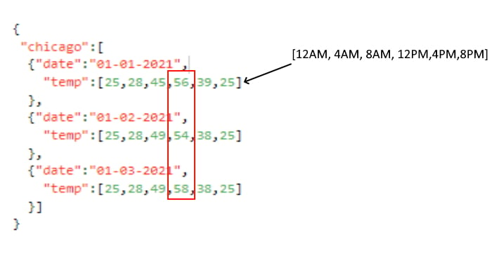
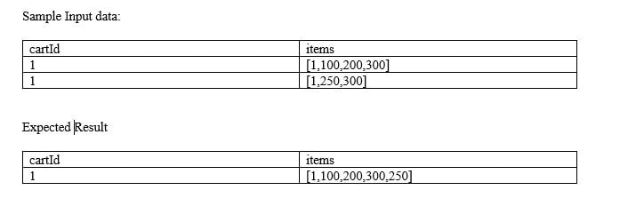
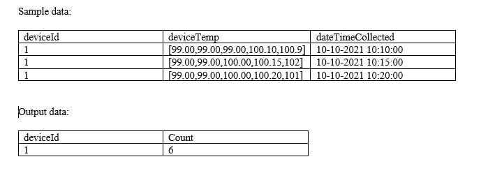
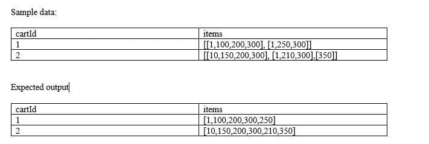
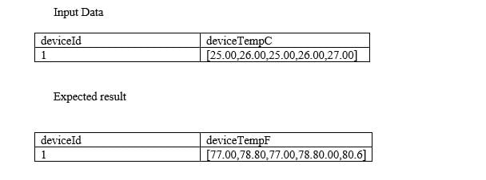

**Question 1Skipped**

You are asked to debug a databricks job that is taking too long to run on Sunday’s, what are the steps you are going to take to identify the step that is taking longer to run?

**A notebook activity of job run is only visible when using all-purpose cluster.**

**Correct answer**

**Under Workflow UI and jobs select job you want to monitor and select the run, notebook activity can be viewed.**

**Enable debug mode in the Jobs to see the output activity of a job, output should be available to view.**

**Once a job is launched, you cannot access the job’s notebook activity.**

**Use the compute’s spark UI to monitor the job activity.**

 

**Question 2Skipped**

Which of the following python statements can be used to replace the schema name and table name in the query?

1. table_name = "sales"
2. schema_name = "bronze"
3. query = f"select \* from schema_name.table_name"
4. table_name = "sales"
5. query = "select \* from {schema_name}.{table_name}"

**Correct answer**

1. table_name = "sales"
2. query = f"select \* from {schema_name}.{table_name}"
3. table_name = "sales"
4. query = f"select \* from + schema_name +"."+table_name"

 

**Question 3Skipped**

you are currently working on creating a spark stream process to read and write in for a one-time micro batch, and also rewrite the existing target table, fill in the blanks to complete the below command sucesfully.

1. spark.table("source_table")
2. .writeStream
3. .option("\___\_", “dbfs:/location/silver")
4. .outputMode("\___\_")
5. .trigger(Once=\___\_)
6. .table("target_table")

**Correct answer**

**checkpointlocation, complete, True**

**targetlocation, overwrite, True**

**checkpointlocation, True, overwrite**

**checkpointlocation, True, complete**

**checkpointlocation, overwrite, True**

 

**Question 4Skipped**

You were asked to write python code to stop all running streams, which of the following command can be used to get a list of all active streams currently running so we can stop them, fill in the blank.

1. for s in \_**\_**\_**\_**\___:
2. s.stop()

**Spark.getActiveStreams()**

**Correct answer**

**spark.streams.active**

**activeStreams()**

**getActiveStreams()**

**spark.streams.getActive**

 

**Question 5Skipped**

At the end of the inventory process a file gets uploaded to the cloud object storage, you are asked to build a process to ingest data which of the following method can be used to ingest the data incrementally, schema of the file is expected to change overtime ingestion process should be able to handle these changes automatically. Below is the auto loader to command to load the data, fill in the blanks for successful execution of below code.

1. spark.readStream
2. .format("cloudfiles")
3. .option("\_**\_**\_",”csv)
4. .option("\_**\_**\_", ‘dbfs:/location/checkpoint/’)
5. .load(data_source)
6. .writeStream
7. .option("\_**\_**\_",’ dbfs:/location/checkpoint/’)
8. .option("\_**\_**\_", "true")
9. .table(table_name))

**format, checkpointlocation, schemalocation, overwrite**

**cloudfiles.format, checkpointlocation, cloudfiles.schemalocation, overwrite**

**Correct answer**

**cloudfiles.format, cloudfiles.schemalocation, checkpointlocation, mergeSchema**

**cloudfiles.format, cloudfiles.schemalocation, checkpointlocation, append**

 

**Question 6Skipped**

Which of the following scenarios is the best fit for AUTO LOADER?

**Correct answer**

**Efficiently process new data incrementally from cloud object storage**

**Efficiently move data incrementally from one delta table to another delta table**

**Incrementally process new data from streaming data sources like Kafka into delta lake**

**Incrementally process new data from relational databases like MySQL**

**Efficiently copy data from one data lake location to another data lake location**

 

**Question 7Skipped**

You are asked to setup an AUTO LOADER to process the incoming data, this data arrives in JSON format and get dropped into cloud object storage and you are required to process the data as soon as it arrives in cloud storage, which of the following statements is correct

**AUTO LOADER is native to DELTA lake it cannot support external cloud object storage**

**AUTO LOADER has to be triggered from an external process when the file arrives in the cloud storage**

**AUTO LOADER needs to be converted to a Structured stream process**

**AUTO LOADER can only process continuous data when stored in DELTA lake**

**Correct answer**

**AUTO LOADER can support file notification method so it can process data as it arrives**

 

**Question 8Skipped**

What is the main difference between the bronze layer and silver layer in a medallion architecture?

**Duplicates are removed in bronze, schema is applied in silver**

**Silver may contain aggregated data**

**Correct answer**

**Bronze is raw copy of ingested data, silver contains data with production schema and optimized for ELT/ETL throughput**

**Bad data is filtered in Bronze, silver is a copy of bronze data**

 

**Question 9Skipped**

What is the main difference between the silver layer and the gold layer in medalion architecture?

**Silver may contain aggregated data**

**Correct answer**

**Gold may contain aggregated data**

**Data quality checks are applied in gold**

**Silver is a copy of bronze data**

**God is a copy of silver data**

 

**Question 10Skipped**

What is the main difference between the silver layer and gold layer in medallion architecture?

**Correct answer**

**Silver optimized to perform ETL, Gold is optimized query performance**

**Gold is optimized go perform ETL, Silver is optimized for query performance**

**Silver is copy of Bronze, Gold is a copy of Silver**

**Silver is stored in Delta Lake, Gold is stored in memory**

**Silver may contain aggregated data, gold may preserve the granularity of original data**

 

**Question 11Skipped**

A dataset has been defined using Delta Live Tables and includes an expectations clause: CONSTRAINT valid_timestamp EXPECT (timestamp > '2020-01-01')

What is the expected behavior when a batch of data containing data that violates these constraints is processed?

**Correct answer**

**Records that violate the expectation are added to the target dataset and recorded as invalid in the event log.**

**Records that violate the expectation are dropped from the target dataset and recorded as invalid in the event log.**

**Records that violate the expectation cause the job to fail.**

**Records that violate the expectation are added to the target dataset and flagged as invalid in a field added to the target dataset.**

**Records that violate the expectation are dropped from the target dataset and loaded into a quarantine table.**

 

**Question 12Skipped**

A dataset has been defined using Delta Live Tables and includes an expectations clause: CONSTRAINT valid_timestamp EXPECT (timestamp > '2020-01-01') ON VIOLATION DROP ROW

What is the expected behavior when a batch of data containing data that violates these constraints is processed?

**Records that violate the expectation are added to the target dataset and recorded as invalid in the event log.**

**Correct answer**

**Records that violate the expectation are dropped from the target dataset and recorded as invalid in the event log.**

**Records that violate the expectation cause the job to fail.**

**Records that violate the expectation are added to the target dataset and flagged as invalid in a field added to the target dataset.**

**Records that violate the expectation are dropped from the target dataset and loaded into a quarantine table.**

 

**Question 13Skipped**

What is the output of below function when executed with input parameters 1, 3 :

1. def check_input(x,y):
2. if x < y:
3. x= x+1
4. if x>y:
5. x= x+1
6. if x <y:
7. x = x+1
8. return x

**1**

**Correct answer**

**2**

**3**

**4**

**5**

 

**Question 14Skipped**

Your colleague was walking you through how a job was setup, but you noticed a warning message that said, “Jobs running on all-purpose cluster are considered all purpose compute", the colleague was not sure why he was getting the warning message, how do you best explain this warning message?

**All-purpose clusters cannot be used for Job clusters, due to performance issues.**

**All-purpose clusters take longer to start the cluster vs a job cluster**

**All-purpose clusters are less expensive than the job clusters**

**Correct answer**

**All-purpose clusters are more expensive than the job clusters**

**All-purpose cluster provide interactive messages that can not be viewed in a job**

 

**Question 15Skipped**

Your team has hundreds of jobs running but it is difficult to track cost of each job run, you are asked to provide a recommendation on how to monitor and track cost across various workloads

**Create jobs in different workspaces, so we can track the cost easily**

**Correct answer**

**Use Tags, during job creation so cost can be easily tracked**

**Use job logs to monitor and track the costs**

**Use workspace admin reporting**

**Use a single cluster for all the jobs, so cost can be easily tracked**

 

**Question 16Skipped**

The sales team has asked the Data engineering team to develop a dashboard that shows sales performance for all stores, but the sales team would like to use the dashboard but would like to select individual store location, which of the following approaches Data Engineering team can use to build this functionality into the dashboard.

**Correct answer**

**Use query Parameters which then allow user to choose any location**

**Currently dashboards do not support parameters**

**Use Databricks REST API to create a dashboard for each location**

**Use SQL UDF function to filter the data based on the location**

**Use Dynamic views to filter the data based on the location**

 

**Question 17Skipped**

You are working on a dashboard that takes a long time to load in the browser, due to the fact that each visualization contains a lot of data to populate, which of the following approaches can be taken to address this issue?

**Increase size of the SQL endpoint cluster**

**Increase the scale of maximum range of SQL endpoint cluster**

**Correct answer**

**Use Databricks SQL Query filter to limit the amount of data in each visualization**

**Remove data from Delta Lake**

**Use Delta cache to store the intermediate results**

 

**Question 18Skipped**

One of the queries in the Databricks SQL Dashboard takes a long time to refresh, which of the below steps can be taken to identify the root cause of this issue?

**Restart the SQL endpoint**

**Select the SQL endpoint cluster, spark UI, SQL tab to see the execution plan and time spent in each step**

**Run optimize and Z ordering**

**Change the Spot Instance Policy from “Cost optimized” to “Reliability Optimized.”**

**Correct answer**

**Use Query History, to view queries and select query, and check query profile to time spent in each step**

 

**Question 19Skipped**

A SQL Dashboard was built for the supply chain team to monitor the inventory and product orders, but all of the timestamps displayed on the dashboards are showing in UTC format, so they requested to change the time zone to the location of New York. How would you approach resolving this issue?

**Move the workspace from Central US zone to East US Zone**

**Change the timestamp on the delta tables to America/New_York format**

**Change the spark configuration of SQL endpoint to format the timestamp to America/New_York**

**Correct answer**

**Under SQL Admin Console, set the SQL configuration parameter time zone to America/New_York**

**Add SET Timezone = America/New_York on every of the SQL queries in the dashboard.**

 

**Question 20Skipped**

Which of the following technique can be used to implement fine-grained access control to rows and columns of the Delta table based on the user's access?

**Use Unity catalog to grant access to rows and columns**

**Row and column access control lists**

**Correct answer**

**Use dynamic view functions**

**Data access control lists**

**Dynamic Access control lists with Unity Catalog**

 

**Question 21Skipped**

Unity catalog helps you manage the below resources in Databricks at account level

**Tables**

**ML Models**

**Dashboards**

**Meta Stores and Catalogs**

**Correct answer**

**All of the above**

 

**Question 22Skipped**

John Smith is a newly joined team member in the Marketing team who currently has access read access to sales tables but does not have access to delete rows from the table, which of the following commands help you accomplish this?

**GRANT USAGE ON TABLE table_name TO <john.smith@marketing.com>**

**GRANT DELETE ON TABLE table_name TO <john.smith@marketing.com>**

**GRANT DELETE TO TABLE table_name ON <john.smith@marketing.com>**

**GRANT MODIFY TO TABLE table_name ON <john.smith@marketing.com>**

**Correct answer**

**GRANT MODIFY ON TABLE table_name TO <john.smith@marketing.com>**

 

**Question 23Skipped**

Kevin is the owner of both the sales table and regional_sales_vw view which uses the sales table as the underlying source for the data, and Kevin is looking to grant select privilege on the view regional_sales_vw to one of newly joined team members Steven. Which of the following is a true statement?

**Kevin can not grant access to Steven since he does not have security admin privilege**

**Kevin although is the owner but does not have ALL PRIVILEGES permission**

**Correct answer**

**Kevin can grant access to the view, because he is the owner of the view and the underlying table**

**Kevin can not grant access to Steven since he does have workspace admin privilege**

**Steve will also require SELECT access on the underlying table**

 

**Question 24Skipped**

Identify one of the below statements that can query a delta table in PySpark Dataframe API

**Spark.read.mode("delta").table("table_name")**

**Spark.read.table.delta("table_name")**

**Correct answer**

**Spark.read.table("table_name")**

**Spark.read.format("delta").LoadTableAs("table_name")**

**Spark.read.format("delta").TableAs("table_name")**

 

**Question 25Skipped**

You are currently working on storing data you received from different customer surveys, this data is highly unstructured and changes over time,  why Lakehouse is a better choice compared to a Data warehouse?

**Correct answer**

**Lakehouse supports schema enforcement and evolution, traditional data warehouses lack schema evolution.**

**Lakehouse supports SQL**

**Lakehouse supports ACID**

**Lakehouse enforces data integrity**

**Lakehouse supports primary and foreign keys like a data warehouse**

 

**Question 26Skipped**

Which of the following locations hosts the driver and worker nodes of a Databricks-managed cluster?

**Correct answer**

**Data plane**

**Control plane**

**Databricks Filesystem**

**JDBC data source**

**Databricks web application**

 

**Question 27Skipped**

You have written a notebook to generate a summary data set for reporting, Notebook was scheduled using the job cluster, but you realized it takes an average of 8 minutes to start the cluster, what feature can be used to start the cluster in a timely fashion?

**Setup an additional job to run ahead of the actual job so the cluster is running second job starts**

**Correct answer**

**Use the Databricks cluster pools feature to reduce the startup time**

**Use Databricks Premium edition instead of Databricks standard edition**

**Pin the cluster in the cluster UI page so it is always available to the jobs**

**Disable auto termination so the cluster is always running**

 

**Question 28Skipped**

Which of the following statement is true about Databricks repos?

**You can approve the pull request if you are the owner of Databricks repos**

**A workspace can only have one instance of git integration**

**Databricks Repos and Notebook versioning are the same features**

**You cannot create a new branch in Databricks repos**

**Correct answer**

**Databricks repos allow you to comment and commit code changes and push them to a remote branch**

 

**Question 29Skipped**

Which of the statement is correct about the cluster pools?

**Cluster pools allow you to perform load balancing**

**Cluster pools allow you to create a cluster**

**Correct answer**

**Cluster pools allow you to save time when starting a new cluster**

**Cluster pools are used to share resources among multiple teams**

**Cluster pools allow you to have all the nodes in the cluster from single physical server rack**

 

**Question 30Skipped**

Once a cluster is deleted, below additional actions need to performed by the administrator

**Remove virtual machines but storage and networking are automatically dropped**

**Drop storage disks but Virtual machines and networking are automatically dropped**

**Remove networking but Virtual machines and storage disks are automatically dropped**

**Remove logs**

**Correct answer**

**No action needs to be performed. All resources are automatically removed.**

 

**Question 31Skipped**

How does a Delta Lake differ from a traditional data lake?

**Delta lake is Datawarehouse service on top of data lake that can provide reliability, security, and performance**

**Delta lake is a caching layer on top of data lake that can provide reliability, security, and performance**

**Correct answer**

**Delta lake is an open storage format like parquet with additional capabilities that can provide reliability, security, and performance**

**Delta lake is an open storage format designed to replace flat files with additional capabilities that can provide reliability, security, and performance**

**Delta lake is proprietary software designed by Databricks that can provide reliability, security, and performance**

 

**Question 32Skipped**

How VACCUM and OPTIMIZE commands can be used to manage the DELTA lake?

**VACCUM command can be used to compact small parquet files, and the OPTIMZE command can be used to delete parquet files that are marked for deletion/unused.**

**VACCUM command can be used to delete empty/blank parquet files in a delta table. OPTIMIZE command can be used to update stale statistics on a delta table.**

**VACCUM command can be used to compress the parquet files to reduce the size of the table, OPTIMIZE command can be used to cache frequently delta tables for better performance.**

**VACCUM command can be used to delete empty/blank parquet files in a delta table, OPTIMIZE command can be used to cache frequently delta tables for better performance.**

**Correct answer**

**OPTIMIZE command can be used to compact small parquet files, and the VACCUM command can be used to delete parquet files that are marked for deletion/unused.**

 

**Question 33Skipped**

Which of the below commands can be used to drop a DELTA table?

**DROP DELTA table_name**

**Correct answer**

**DROP TABLE table_name**

**DROP TABLE table_name FORMAT DELTA**

**DROP  table_name**

 

**Question 34Skipped**

Delete records from the transactions Delta table where transactionDate is greater than current timestamp?

**DELETE FROM transactions FORMAT DELTA where transactionDate > currenct_timestmap()**

**DELETE FROM transactions if transctionDate > current_timestamp()**

**Correct answer**

**DELETE FROM transactions where transactionDate > current_timestamp()**

**DELETE FROM transactions where transactionDate > current_timestamp() KEEP_HISTORY**

**DELET FROM transactions where transactionDate GE current_timestamp()**

 

**Question 35Skipped**

How does Lakehouse replace the dependency on using Data lakes and Data warehouses in a Data and Analytics solution?

**Open, direct access to data stored in standard data formats.**

**Supports ACID transactions.**

**Supports BI and Machine learning workloads**

**Support for end-to-end streaming and batch workloads**

**Correct answer**

**All the above**

 

**Question 36Skipped**

The default threshold of VACUUM is 7 days, internal audit team asked to certain tables to maintain at least 365 days as part of compliance requirement, which of the below setting is needed to implement.

**Correct answer**

**ALTER TABLE table_name set TBLPROPERTIES (delta.deletedFileRetentionDuration= ‘interval 365 days’)**

**MODIFY TABLE table_name set TBLPROPERTY (delta.maxRetentionDays = ‘interval 365 days’)**

**ALTER TABLE table_name set EXENDED TBLPROPERTIES (delta.deletedFileRetentionDuration= ‘interval 365 days’)**

**ALTER TABLE table_name set EXENDED TBLPROPERTIES (delta.vaccum.duration= ‘interval 365 days’)**

 

**Question 37Skipped**

Which of the following commands can be used to query a delta table?

1. %python
2. spark.sql("select \* from table_name")

1. %sql
2. Select \* from table_name

**Correct answer**

**Both A & B**

1. %python
2. execute.sql("select \* from table")

1. %python
2. delta.sql("select \* from table")

 

**Question 38Skipped**

Below table **temp_data** has one column called **raw** contains JSON data that records temperature for every four hours in the day for the city of **Chicago**, you are asked to calculate the **maximum** temperature that was ever recorded for **12:00 PM** hour across all the days.  Parse the JSON data and use the necessary array function to calculate the max temp.

Table: temp_date

Column: raw

Datatype: string

**Expected output: 58**

> 1. select max(raw.chicago.temp[3]) from temp_data

> 2. select array_max(raw.chicago[*].temp[3]) from temp_data

> 3. select array_max(from_json(raw['chicago'].temp[3],'array<int>')) from temp_data

**Correct answer**

> 1. select array_max(from_json(raw:chicago[*].temp[3],'array<int>')) from temp_data

> 1.select max(from_json(raw:chicago[3].temp[3],'array<int>')) from temp_data

 

**Question 39Skipped**

Which of the following SQL statements can be used to update a transactions table, to set a flag on the table from Y to N

**MODIFY transactions SET active_flag = 'N' WHERE active_flag = 'Y'**

**MERGE transactions SET active_flag = 'N' WHERE active_flag = 'Y'**

**Correct answer**

**UPDATE transactions SET active_flag = 'N' WHERE active_flag = 'Y'**

**REPLACE transactions SET active_flag = 'N' WHERE active_flag = 'Y'**

 

**Question 40Skipped**

Below sample input data contains two columns, one cartId also known as session id, and the second column is called items, every time a customer makes a change to the cart this is stored as an array in the table, the Marketing team asked you to create a unique list of item’s that were ever added to the cart by each customer, fill in blanks by choosing the appropriate array function so the query produces below **expected** result as shown below.

Schema: cartId INT, items Array&lt;INT&gt;

Sample Data

1.SELECT cartId, ___ (___(items)) as items
2.FROM carts GROUP BY cartId

Expected result:
cartId              items
1                 [1,100,200,300,250]

**FLATTEN, COLLECT_UNION**

**ARRAY_UNION, FLATTEN**

**ARRAY_UNION, ARRAY_DISTINT**

**Correct answer**

**ARRAY_UNION, COLLECT_SET**

**ARRAY_DISTINCT, ARRAY_UNION**

 

**Question 41Skipped**

You were asked to identify number of times a temperature sensor exceed threshold temperature (100.00) by each device, each row contains 5 readings collected every 5 minutes, fill in the blank with the appropriate functions.

Schema: deviceId INT, deviceTemp ARRAY&lt;double&gt;, dateTimeCollected TIMESTAMP

> SELECT deviceId, __ (__ (__(deviceTemp], i -> i > 100.00)))
FROM devices
GROUP BY deviceId

**SUM, COUNT, SIZE**

**SUM, SIZE, SLICE**

**SUM, SIZE, ARRAY_CONTAINS**

**SUM, SIZE, ARRAY_FILTER**

**Correct answer**

**SUM, SIZE, FILTER**

 

**Question 42Skipped**

You are currently looking at a table that contains data from an e-commerce platform, each row contains a list of items(Item number) that were present in the cart, when the customer makes a change to the cart the entire information is saved as a separate list and appended to an existing list for the duration of the customer session, to identify all the items customer bought you have to make a unique list of items, you were asked to create a unique item’s list that was added to the cart by the user, **fill in the blanks** of below query by choosing the appropriate higher-order function?

Note: See below sample data and expected output.

Schema: cartId INT, items Array&lt;INT&gt;

Fill in the blanks: 

SELECT cartId, _(_(items)) FROM carts

**ARRAY_UNION, ARRAY_DISCINT**

**ARRAY_DISTINCT, ARRAY_UNION**

**Correct answer**

**ARRAY_DISTINCT, FLATTEN**

**FLATTEN, ARRAY_DISTINCT**

**ARRAY_DISTINCT, ARRAY_FLATTEN**

 

**Question 43Skipped**

You are working on IOT data where each device has 5 reading in an array collected in Celsius, you were asked to covert each individual reading from Celsius to Fahrenheit, fill in the blank with an appropriate function that can be used in this scenario.

> Schema: deviceId INT, deviceTemp ARRAY<double>

> SELECT deviceId, __(deviceTempC,i-> (i * 9/5) + 32) as deviceTempF
FROM sensors

**APPLY**

**MULTIPLY**

**ARRAYEXPR**

**Correct answer**

**TRANSFORM**

**FORALL**

 

**Question 44Skipped**

Which of the following array functions takes input column return unique list of values in an array?

**COLLECT_LIST**

**Correct answer**

**COLLECT_SET**

**COLLECT_UNION**

**ARRAY_INTERSECT**

**ARRAY_UNION**

 

**Question 45Skipped**

You are looking to process the data based on two variables, one to check if the department is supply chain or check if process flag is set to True

**if department = “supply chain” | process:**

**if department == “supply chain” or process = TRUE:**

**if department == “supply chain” | process == TRUE:**

**if department == “supply chain” | if process == TRUE:**

**Correct answer**

**if department == “supply chain” or process:**

 

 

 

 

 

 

 

 

 

 

 

 

 