# T_014 (ExamTopics)

#### Q1. A data organization leader is upset about the data analysis team’s reports being different from the data engineering team’s reports. The leader believes the siloed nature of their organization’s data engineering and data analysis architectures is to blame.
**Which of the following describes how a data lakehouse could alleviate this issue?**

A. Both teams would autoscale their work as data size evolves

B. ***Both teams would use the same source of truth for their work***

C. Both teams would reorganize to report to the same department

D. Both teams would be able to collaborate on projects in real-time 

E. Both teams would respond more quickly to ad-hoc requests

**Overall explanation**

One of the core advantages of a Data Lakehouse is that it combines the flexibility of a data lake with the data management and consistency features of a data warehouse. This means:

Both the data engineering team and the data analysis team can access the same unified data platform.

It eliminates data silos.

All teams work from the same data source for development and analysis, ensuring consistency across reports.

<br />

#### Q2. Which of the following describes a scenario in which a data team will want to utilize cluster pools?

A.***An automated report needs to be refreshed as quickly as possible.***

B. An automated report needs to be made reproducible.

C. An automated report needs to be tested to identify errors.

D. An automated report needs to be version-controlled across multiple collaborators.

E. An automated report needs to be runnable by all stakeholders.

**Overall explanation**

Cluster pools are used in Databricks to reduce the time needed to create and scale clusters by maintaining a set of pre-configured, ready-to-use instances. When an automated report needs to be refreshed quickly, cluster pools help by minimizing cluster startup time, allowing the report generation process to start almost immediately. This is especially beneficial in scenarios where low latency is required to ensure data is updated in near real-time.

The other options (B, C, D, and E) do not directly benefit from the use of cluster pools, as they involve aspects like reproducibility, testing, version control, and stakeholder access, which are not specifically addressed by the primary function of cluster pools.

<br />

#### Q3. Which of the following is hosted completely in the control plane of the classic Databricks architecture?

A. Worker node

B. JDBC data source

C. ***Databricks web application***

D. Databricks Filesystem

E. Driver node

**Overall explanation**

In the classic Databricks architecture, the control plane includes components like the Databricks web application, the Databricks REST API, and the Databricks Workspace. These components are responsible for managing and controlling the Databricks environment, including cluster provisioning, notebook management, access control, and job scheduling.

The other options, such as worker nodes, JDBC data sources, Databricks Filesystem (DBFS), and driver nodes, are typically part of the data plane or the execution environment, which is separate from the control plane. Worker nodes are responsible for executing tasks and computations, JDBC data sources are used to connect to external databases, DBFS is a distributed file system for data storage, and driver nodes are responsible for coordinating the execution of Spark jobs.

<br />

#### Q4. Which of the following benefits of using the Databricks Lakehouse Platform is provided by Delta Lake?

A. The ability to manipulate the same data using a variety of languages

B. The ability to collaborate in real time on a single notebook

C. The ability to set up alerts for query failures

D. ***The ability to support batch and streaming workloads***

E. The ability to distribute complex data operations

**Overall explanation**

Delta Lake is a key component of the Databricks Lakehouse Platform that provides several benefits, and one of the most significant benefits is its ability to support both batch and streaming workloads seamlessly. Delta Lake allows you to process and analyze data in real-time (streaming) as well as in batch, making it a versatile choice for various data processing needs.

While the other options may be benefits or capabilities of Databricks or the Lakehouse Platform in general, they are not specifically associated with Delta Lake.

<br />

#### Q5. Which of the following describes the storage organization of a Delta table?

A. Delta tables are stored in a single file that contains data, history, metadata, and other attributes.

B. Delta tables store their data in a single file and all metadata in a collection of files in a separate location.

C. ***Delta tables are stored in a collection of files that contain data, history, metadata, and other attributes.***

D. Delta tables are stored in a collection of files that contain only the data stored within the table.

E. Delta tables are stored in a single file that contains only the data stored within the table.

**Overall explanation**

Delta tables store data in a structured manner using Parquet files, and they also maintain metadata and transaction logs in separate directories. This organization allows for versioning, transactional capabilities, and metadata tracking in Delta Lake. Thank you for pointing out the error, and I appreciate your understanding.

Delta tables use a distributed storage format, where data, history, metadata, and other attributes are stored across multiple files. This includes data files (e.g., Parquet files) for the actual data and log files for transaction history and metadata, allowing Delta Lake to support version control, schema enforcement, and ACID properties.

<br />

#### Q6. Which of the following code blocks will remove the rows where the value in column age is greater than 25 from the existing Delta table my_table and save the updated table?

A. SELECT * FROM my_table WHERE age > 25;

B. UPDATE my_table WHERE age > 25;

C. ***DELETE FROM my_table WHERE age > 25;***

D. UPDATE my_table WHERE age <= 25;

E. DELETE FROM my_table WHERE age <= 25; 

<br />

#### Q7. A data engineer has realized that they made a mistake when making a daily update to a table. They need to use Delta time travel to restore the table to a version that is 3 days old. However, when the data engineer attempts to time travel to the older version, they are unable to restore the data because the data files have been deleted.
**Which of the following explains why the data files are no longer present?**

A. ***The VACUUM command was run on the table***

B. The TIME TRAVEL command was run on the table

C. The DELETE HISTORY command was run on the table 

D. The OPTIMIZE command was nun on the table

E. The HISTORY command was run on the table

**Overall explanation**

- There is no `DELETE HISTORY` command in Databricks
- `VACCUM` command can remove history and we can also specify the retention period with `VACCUM` Command. Default Retention period is 7 days.
    - To allow changing the default retention period you can rum the following command
- `ALTER TABLE table_name SET TBLPROPERTIES ('delta.retentionDurationCheck.enabled' = 'true')`;

<br />

#### Q8. Which of the following Git operations must be performed outside of Databricks Repos?

A. Commit

B. Pull

C. Push

D. ***Clone***

E. Merge

**Overall explanation**

Clone is the correct answer is because cloning a repository involves creating a copy of the entire repository, including all of its history, branches, and files, on your local machine. This operation is typically performed outside of Databricks Repos, using Git commands in a terminal or a Git client.

On the other hand, operations like Commit, Pull, Push, and Merge can be performed within Databricks Repos, as they involve interacting with the repository's content and history that is already cloned and available in the Databricks environment.

<br />

#### Q9. Which of the following data lakehouse features results in improved data quality over a traditional data lake?

A. A data lakehouse provides storage solutions for structured and unstructured data.

B. ***A data lakehouse supports ACID-compliant transactions.***

C. A data lakehouse allows the use of SQL queries to examine data.

D. A data lakehouse stores data in open formats.

E. A data lakehouse enables machine learning and artificial Intelligence workloads.

**Overall explanation**

A data lakehouse is a data management architecture that combines the flexibility, cost-efficiency, and scale of data lakes with the data management and ACID transactions of data warehouses, enabling business intelligence (BI) and machine learning (ML) on all data12. One of the key features of a data lakehouse is that it supports ACID-compliant transactions, which means that it ensures data integrity, consistency, and isolation across concurrent read and write operations3. This feature results in improved data quality over a traditional data lake, which does not support transactions and may suffer from data corruption, duplication, or inconsistency due to concurrent or streaming data ingestion and processing.

<br />

#### Q10. A data engineer needs to determine whether to use the built-in Databricks Notebooks versioning or version their project using Databricks Repos.
**Which of the following is an advantage of using Databricks Repos over the Databricks Notebooks versioning?**

A. Databricks Repos automatically saves development progress

B. ***Databricks Repos supports the use of multiple branches***

C. Databricks Repos allows users to revert to previous versions of a notebook 

D. Databricks Repos provides the ability to comment on specific changes

E. Databricks Repos is wholly housed within the Databricks Lakehouse Platform

**Overall explanation**

Databricks Repos is a visual Git client and API in Databricks that supports common Git operations such as cloning, committing, pushing, pulling, and branch management. Databricks Notebooks versioning is a legacy feature that allows users to link notebooks to GitHub repositories and perform basic Git operations. However, Databricks Notebooks versioning does not support the use of multiple branches for development work, which is an advantage of using Databricks Repos. With Databricks Repos, users can create and manage branches for different features, experiments, or bug fixes, and merge, rebase, or resolve conflicts between them. Databricks recommends using a separate branch for each notebook and following data science and engineering code development best practices using Git for version control, collaboration, and CI/CD.

<br />

#### Q11. A data engineer has left the organization. The data team needs to transfer ownership of the data engineer’s Delta tables to a new data engineer. The new data engineer is the lead engineer on the data team.
**Assuming the original data engineer no longer has access, which of the following individuals must be the one to transfer ownership of the Delta tables in Data Explorer?**

A. Databricks account representative

B. This transfer is not possible

C. ***Workspace administrator***

D. New lead data engineer

E. Original data engineer

**Overall explanation**

The workspace administrator is the only individual who can transfer ownership of the Delta tables in Data Explorer, assuming the original data engineer no longer has access. The workspace administrator has the highest level of permissions in the workspace and can manage all resources, users, and groups. 
The other options are either not possible or not sufficient to perform the ownership transfer. 
The Databricks account representative is not involved in the workspace management.
The transfer is possible and not dependent on the original data engineer. The new lead data engineer may not have the
necessary permissions to access or modify the Delta tables, unless granted by the workspace administrator or the original
data engineer before leaving.

<br />

#### Q12. A data analyst has created a Delta table `sales` that is used by the entire data analysis team. They want help from the data engineering team to implement a series of tests to ensure the data is clean. However, the data engineering team uses Python for its tests rather than SQL.
**Which of the following commands could the data engineering team use to access sales in PySpark?**

A. SELECT * FROM sales

B. There is no way to share data between PySpark and SQ

C. spark.sql("sales")

D. ***spark.delta.table("sales")***

E. spark.table("sales")

**Overall explanation**

The data engineering team can use the spark.table method to
access the Delta table sales in PySpark. This method returns a
DataFrame representation of the Delta table, which can be used
for further processing or testing. The spark.table method works
for any table that is registered in the Hive metastore or the Spark
catalog, regardless of the file format1. Alternatively, the data
engineering team can also use the DeltaTable.forPath method to
load the Delta table from its path2.

<br />

#### Q13. Which of the following commands will return the location of database customer360?

A. DESCRIBE LOCATION customer360;

B. DROP DATABASE customer360;

C. ***DESCRIBE DATABASE customer360;***

D. ALTER DATABASE customer360 SET DBPROPERTIES ('location' = '/user'};

E. USE DATABASE customer360;

<br />

#### Q14. A data engineer wants to create a new table containing the names of customers that live in France.

**They have written the following command:**

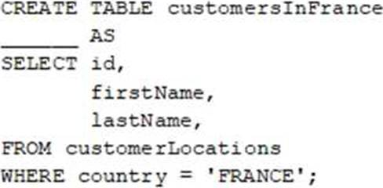

**A senior data engineer mentions that it is organization policy to include a table property indicating that the new table includes personally identifiable information (PII).**

**Which of the following lines of code fills in the above blank to successfully complete the task?**

A. There is no way to indicate whether a table contains PI

B. "COMMENT PII"

C. ***TBLPROPERTIES PII***

D. COMMENT "Contains PII"

E. PII

<br />

#### Q15. Which of the following benefits is provided by the array functions from Spark SQL?

A. An ability to work with data in a variety of types at once

B. An ability to work with data within certain partitions and windows

C. An ability to work with time-related data in specified intervals

D. ***An ability to work with complex, nested data ingested from JSON files***

E. An ability to work with an array of tables for procedural automation

<br />

#### Q16. Which of the following commands can be used to write data into a Delta table while avoiding the writing of duplicate records?

A. DROP

B. IGNORE

C. ***MERGE***

D. APPEND

E. INSERT

<br />

#### Q17. A data engineer needs to apply custom logic to string column city in table stores for a specific use case. In order to apply this custom logic at scale, the data engineer wants to create a SQL user-defined function (UDF).

**Which of the following code blocks creates this SQL UDF?**

A. ***Option A***
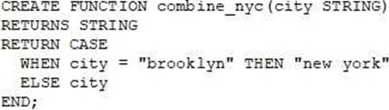

B. Option B
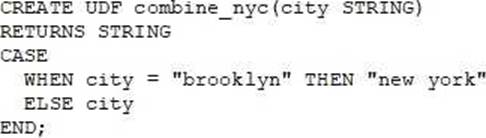

C. Option C
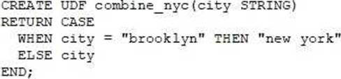

D. Option D
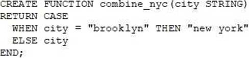

E. Option E
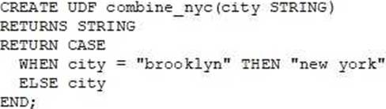

<br />

#### Q18. A data analyst has a series of queries in a SQL program. The data analyst wants this program to run every day. They only want the final query in the program to run on Sundays. They ask for help from the data engineering team to complete this task.

**Which of the following approaches could be used by the data engineering team to complete this task?**

A. They could submit a feature request with Databricks to add this functionality.

B. ***They could wrap the queries using PySpark and use Python’s control flow system to determine when to run the final query.***

C. They could only run the entire program on Sundays.

D. They could automatically restrict access to the source table in the final query so that it is only accessible on Sundays.

E. They could redesign the data model to separate the data used in the final query into a new table.

<br />

#### Q19. A data engineer runs a statement every day to copy the previous day’s sales into the table transactions. Each day’s sales are in their own file in the location `/transactions/raw`.

**Today, the data engineer runs the following command to complete this task:**

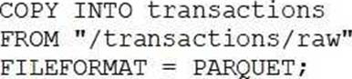

**After running the command today, the data engineer notices that the number of records in table transactions has not changed.**
**Which of the following describes why the statement might not have copied any new records into the table?**

A. The format of the files to be copied were not included with the FORMAT_OPTIONS keyword.

B. The names of the files to be copied were not included with the FILES keyword.

C. ***The previous day’s file has already been copied into the table.***

D. The PARQUET file format does not support COPY INT

E. The COPY INTO statement requires the table to be refreshed to view the copied rows.

<br />

#### Q20. A data engineer needs to create a table in Databricks using data from their organization’s existing SQLite database.
**They run the following command:**

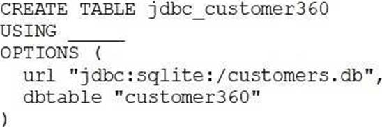

**Which of the following lines of code fills in the above blank to successfully complete the task?**

A. org.apache.spark.sql.jdbc

B. autoloader

C. DELTA

D. ***sqlite***

E. org.apache.spark.sql.sqlite

<br />

#### Q21.A data engineering team has two tables. The first table march_transactions is a collection of all retail transactions in the month of March. The second table april_transactions is a collection of all retail transactions in the month of April. There are no duplicate records between the tables.

**Which of the following commands should be run to create a new table all_transactions that contains all records from march_transactions and april_transactions without duplicate records?**

A. 
```
CREATE TABLE all_transactions 
AS 
    SELECT * 
    FROM march_transactions 
    INNER JOIN 
    SELECT * 
    FROM april_transactions;
```

B. ***CORRECT ANSWER***
```
CREATE TABLE all_transactions 
AS 
    SELECT * FROM march_transactions 
    UNION 
    SELECT * FROM april_transactions;
```

C. 
```
CREATE TABLE all_transactions 
AS 
    SELECT * FROM march_transactions 
    OUTER JOIN 
    SELECT * FROM april_transactions;
```

D. 
```
CREATE TABLE all_transactions 
AS 
    SELECT * FROM march_transactions 
    INTERSECT 
    SELECT * from april_transactions;
```

E. 
```
CREATE TABLE all_transactions 
AS 
    SELECT * FROM march_transactions 
    MERGE 
    SELECT * FROM april_transactions;
```

**Overall explanation**

One of the core advantages of a Data Lakehouse is that it combines the flexibility of a data lake with the data management and consistency features of a data warehouse. This means:

Both the data engineering team and the data analysis team can access the same unified data platform.

It eliminates data silos.

All teams work from the same data source for development and analysis, ensuring consistency across reports.

<br />

#### Q22. A data engineer only wants to execute the final block of a Python program if the Python variable day_of_week is equal to 1 and the Python variable review_period is True.

**Which of the following control flow statements should the data engineer use to begin this conditionally executed code block?**

A. if day_of_week = 1 and review_period:

B. if day_of_week = 1 and review_period = "True":

C. if day_of_week == 1 and review_period == "True":

D. ***if day_of_week == 1 and review_period:***

E. if day_of_week = 1 & review_period: = "True":

<br />

#### Q23. A data engineer is attempting to drop a Spark SQL table my_table. The data engineer wants to delete all table metadata and data.
**They run the following command:**

> DROP TABLE IF EXISTS my_table

**While the object no longer appears when they run SHOW TABLES, the data files still exist.**

**Which of the following describes why the data files still exist and the metadata files were deleted?**

A. The table’s data was larger than 10 GB

B. The table’s data was smaller than 10 GB

C. ***The table was external***

D. The table did not have a location

E. The table was managed

<br />

#### Q24. A data engineer wants to create a data entity from a couple of tables. The data entity must be used by other data engineers in other sessions. It also must be saved to a physical location.
**Which of the following data entities should the data engineer create?**

A. Database

B. Function

C. View

D. Temporary view

E. ***Table***

<br />

#### Q25. A data engineer is maintaining a data pipeline. Upon data ingestion, the data engineer notices that the source data is starting to have a lower level of quality. The data engineer would like to automate the process of monitoring the quality level.
**Which of the following tools can the data engineer use to solve this problem?**

A. Unity Catalog

B. Data Explorer

C. Delta Lake

D. ***Delta Live Tables***

E. Auto Loader

<br />

#### Q26. A Delta Live Table pipeline includes two datasets defined using STREAMING LIVE TABLE. Three datasets are defined against Delta Lake table sources using LIVE TABLE.

**The table is configured to run in Production mode using the Continuous Pipeline Mode.**

**Assuming previously unprocessed data exists and all definitions are valid, what is the expected outcome after clicking Start to update the pipeline?**

A. All datasets will be updated at set intervals until the pipeline is shut down. The compute resources will persist to allow for additional testing.

B. All datasets will be updated once and the pipeline will persist without any processing. The compute resources will persist but go unused.

C. ***All datasets will be updated at set intervals until the pipeline is shut down. The compute resources will be deployed for the update and terminated when the pipeline is stopped.***

D. All datasets will be updated once and the pipeline will shut down. The compute resources will be terminated.

E. All datasets will be updated once and the pipeline will shut down. The compute resources will persist to allow for additional testing.

<br />

#### Q27. In order for Structured Streaming to reliably track the exact progress of the processing so that it can handle any kind of failure by restarting and/or reprocessing, which of the following two approaches is used by Spark to record the offset range of the data being processed in each trigger?

A. ***Checkpointing and Write-ahead Logs***

B. Structured Streaming cannot record the offset range of the data being processed in each trigger.

C. Replayable Sources and Idempotent Sinks

D. Write-ahead Logs and Idempotent Sinks

E. Checkpointing and Idempotent Sinks

**Overall explanation**

Structured Streaming uses checkpointing and write-ahead logs to
record the offset range of the data being processed in each
trigger. This ensures that the engine can reliably track the exact
progress of the processing and handle any kind of failure by
restarting and/or reprocessing. Checkpointing is the mechanism
of saving the state of a streaming query to fault-tolerant storage
(such as HDFS) so that it can be recovered after a failure. Write-
ahead logs are files that record the offset range of the data being
processed in each trigger and are written to the checkpoint
location before the processing starts. These logs are used to
recover the query state and resume processing from the last
processed offset range in case of a failure.

<br />

#### Q28. Which of the following describes the relationship between Gold tables and Silver tables?

A. ***Gold tables are more likely to contain aggregations than Silver tables.***

B. Gold tables are more likely to contain valuable data than Silver tables.

C. Gold tables are more likely to contain a less refined view of data than Silver tables.

D. Gold tables are more likely to contain more data than Silver tables.

E. Gold tables are more likely to contain truthful data than Silver tables.

<br />

#### Q29. Which of the following describes the relationship between Bronze tables and raw data?

A. Bronze tables contain less data than raw data files.

B. Bronze tables contain more truthful data than raw data.

C. Bronze tables contain aggregates while raw data is unaggregated.

D. Bronze tables contain a less refined view of data than raw data.

E. ***Bronze tables contain raw data with a schema applied.***

<br />

#### Q30. Which of the following tools is used by Auto Loader process data incrementally?

A. Checkpointing

B. ***Spark Structured Streaming***

C. Data Explorer

D. Unity Catalog

E. Databricks SQL

<br />

#### Q31. A data engineer has configured a Structured Streaming job to read from a table, manipulate the data, and then perform a streaming write into a new table.
**The cade block used by the data engineer is below:**
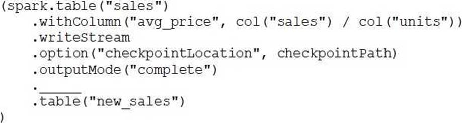

**If the data engineer only wants the query to execute a micro-batch to process data every 5 seconds, which of the following lines of code should the data engineer use to fill in the blank?**

A. trigger("5 seconds")

B. trigger()

C. trigger(once="5 seconds")

D. ***trigger(processingTime="5 seconds")***

E. trigger(continuous="5 seconds")

<br />

#### Q32. A dataset has been defined using Delta Live Tables and includes an expectations clause:

> CONSTRAINT valid_timestamp EXPECT (timestamp > '2020-01-01') ON VIOLATION DROP ROW

**What is the expected behavior when a batch of data containing data that violates these constraints is processed?**

A. Records that violate the expectation are dropped from the target dataset and loaded into a quarantine table.

B. Records that violate the expectation are added to the target dataset and flagged as invalid in a field added to the target dataset.

C. ***Records that violate the expectation are dropped from the target dataset and recorded as invalid in the event log.***

D. Records that violate the expectation are added to the target dataset and recorded as invalid in the event log.

E. Records that violate the expectation cause the job to fail.

<br />

#### Q33. Which of the following describes when to use the CREATE STREAMING LIVE TABLE (formerly CREATE INCREMENTAL LIVE TABLE) syntax over the CREATE LIVE TABLE syntax when creating Delta Live Tables (DLT) tables using SQL?

A. `CREATE STREAMING LIVE TABLE` should be used when the subsequent step in the DLT pipeline is static.

B. ***`CREATE STREAMING LIVE TABLE` should be used when data needs to be processed incrementally.***

C. `CREATE STREAMING LIVE TABLE` is redundant for DLT and it does not need to be used.

D. `CREATE STREAMING LIVE TABLE` should be used when data needs to be processed through complicated aggregations.

E. `CREATE STREAMING LIVE TABLE` should be used when the previous step in the DLT pipeline is static.

<br />

#### Q34. A data engineer is designing a data pipeline. The source system generates files in a shared directory that is also used by other processes. As a result, the files should be kept as is and will accumulate in the directory. The data engineer needs to identify which files are new since the previous run in the pipeline, and set up the pipeline to only ingest those new files with each run.
**Which of the following tools can the data engineer use to solve this problem?**

A. Unity Catalog

B. Delta Lake

C. Databricks SQL

D. Data Explorer

E. ***Auto Loader***

**Overall explanation**

Auto Loader is a tool that can incrementally and efficiently
process new data files as they arrive in cloud storage without any
additional setup. Auto Loader provides a Structured Streaming
source called cloud Files, which automatically detects and
processes new files in a given input directory path on the cloud
file storage. Auto Loader also tracks the ingestion progress and
ensures exactly-once semantics when writing data into Delta
Lake. Auto Loader can ingest various file formats, such as JSON,
CSV, XML, PARQUET, AVRO, ORC, TEXT, and BINARYFILE. Auto
Loader has support for both Python and SQL in Delta Live
Tables, which are a declarative way to build production-quality
data pipelines with Databricks.

<br />

#### Q35. Which of the following Structured Streaming queries is performing a hop from a Silver table to a Gold table?

A. Option A
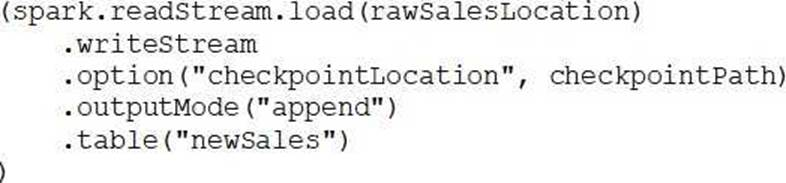

B. Option B
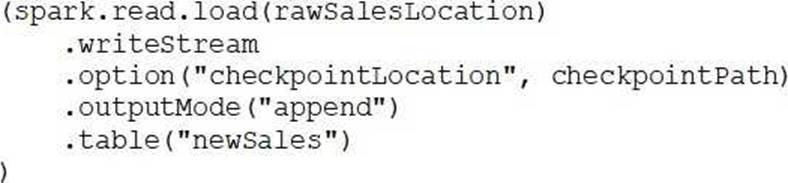

C. Option C
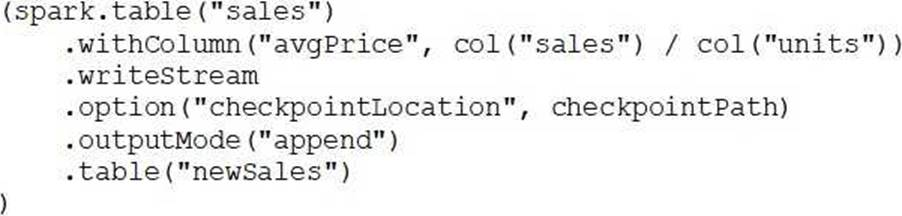

D. Option D
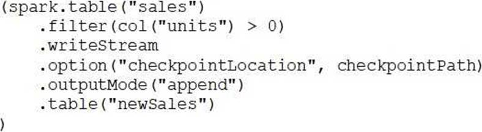

E. ***Option E***
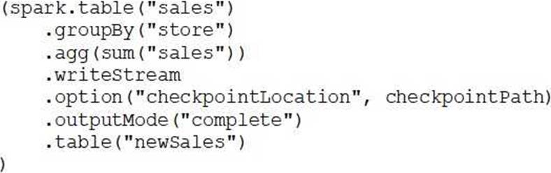

<br />

#### Q36. A data engineer has three tables in a Delta Live Tables (DLT) pipeline. They have configured the pipeline to drop invalid records at each table. They notice that some data is being dropped due to quality concerns at some point in the DLT pipeline. They would like to determine at which table in their pipeline the data is being dropped.
**Which of the following approaches can the data engineer take to identify the table that is dropping the records?**

A. They can set up separate expectations for each table when developing their DLT pipeline.

B. They cannot determine which table is dropping the records.

C. They can set up DLT to notify them via email when records are dropped.

D. ***They can navigate to the DLT pipeline page, click on each table, and view the data quality statistics.***

E. They can navigate to the DLT pipeline page, click on the “Error” button, and review the present errors.

<br />

#### Q37. A data engineer has a single-task Job that runs each morning before they begin working. After identifying an upstream data issue, they need to set up another task to run a new notebook prior to the original task.
**Which of the following approaches can the data engineer use to set up the new task?**

A. They can clone the existing task in the existing Job and update it to run the new notebook.

B. ***They can create a new task in the existing Job and then add it as a dependency of the original task.***

C. They can create a new task in the existing Job and then add the original task as a dependency of the new task. 

D. They can create a new job from scratch and add both tasks to run concurrently.

E. They can clone the existing task to a new Job and then edit it to run the new notebook.

<br />

#### Q38. An engineering manager wants to monitor the performance of a recent project using a Databricks SQL query. For the first week following the project’s release, the manager wants the query results to be updated every minute. However, the manager is concerned that the compute resources used for the query will be left running and cost the organization a lot of money beyond the first week of the project’s release.
**Which of the following approaches can the engineering team use to ensure the query does not cost the organization any money beyond the first week of the project’s release?**

A. They can set a limit to the number of DBUs that are consumed by the SQL Endpoint.

B. They can set the query’s refresh schedule to end after a certain number of refreshes.

C. They cannot ensure the query does not cost the organization money beyond the first week of the project’s release.

D. They can set a limit to the number of individuals that are able to manage the query’s refresh schedule.

E. ***They can set the query’s refresh schedule to end on a certain date in the query scheduler.***

<br />

#### Q39. A data analysis team has noticed that their Databricks SQL queries are running too slowly when connected to their always-on SQL endpoint. They claim that this issue is present when many members of the team are running small queries simultaneously. They ask the data engineering team for help. The data engineering team notices that each of the team’s queries uses the same SQL endpoint.
**Which of the following approaches can the data engineering team use to improve the latency of the team’s queries?**

A. They can increase the cluster size of the SQL endpoint.

B. They can increase the maximum bound of the SQL endpoint’s scaling range.

C. ***They can turn on the Auto Stop feature for the SQL endpoint.***

D. They can turn on the Serverless feature for the SQL endpoint.

E. They can turn on the Serverless feature for the SQL endpoint and change the Spot Instance Policy to "Reliability Optimized".

<br />

#### Q40. A data engineer wants to schedule their Databricks SQL dashboard to refresh once per day, but they only want the associated SQL endpoint to be running when it is necessary.
**Which of the following approaches can the data engineer use to minimize the total running time of the SQL endpoint used in the refresh schedule of their dashboard?**

A. They can ensure the dashboard’s SQL endpoint matches each of the queries’ SQL endpoints.

B. ***They can set up the dashboard’s SQL endpoint to be serverless.***

C. They can turn on the Auto Stop feature for the SQL endpoint.

D. They can reduce the cluster size of the SQL endpoint.

E. They can ensure the dashboard’s SQL endpoint is not one of the included query’s SQL endpoint.

<br />
