# T_014 (ExamTopics)

#### Q1. A data organization leader is upset about the data analysis team’s reports being different from the data engineering team’s reports. The leader believes the siloed nature of their organization’s data engineering and data analysis architectures is to blame.
**Which of the following describes how a data lakehouse could alleviate this issue?**

A. Both teams would autoscale their work as data size evolves

B. ***Both teams would use the same source of truth for their work***

C. Both teams would reorganize to report to the same department

D. Both teams would be able to collaborate on projects in real-time 

E. Both teams would respond more quickly to ad-hoc requests

<u> **Explanation** </u>:

One of the core advantages of a Data Lakehouse is that it combines the flexibility of a data lake with the data management and consistency features of a data warehouse. This means:

Both the data engineering team and the data analysis team can access the same unified data platform.

It eliminates data silos.

All teams work from the same data source for development and analysis, ensuring consistency across reports.

The correct answer is B: Both teams would use the same source of truth for their work.

A data lakehouse architecture unifies the best aspects of data lakes and data warehouses. Critically, it provides a single, consistent source of truth for both data engineers and data analysts. Currently, the leader notes discrepancies between reports generated by the data analysis and data engineering teams, suggesting these teams are operating on different data sets or transformations. A data lakehouse eliminates this discrepancy by providing a single repository for all data, accessible to both teams.

With a data lakehouse, data is ingested, transformed, and stored in a way that is consistent and accessible to all stakeholders. Data engineers can focus on building pipelines to ingest and transform data, while data analysts can use the same data for reporting and analysis. This eliminates the need for data to be copied or transformed multiple times, reducing the risk of errors and inconsistencies. Options A, C, D, and E are advantages of cloud architectures or organizational structures but don't directly address the core issue of differing reports due to separate data sources. The centralization of data and metadata within a unified platform is the key benefit a data lakehouse offers in resolving the leader's concern.

For further information, explore these resources:

Databricks Lakehouse Platform: https://www.databricks.com/product/data-lakehouse
What is a Data Lakehouse?: https://aws.amazon.com/what-is/data-lakehouse/

<br />

#### Q2. Which of the following describes a scenario in which a data team will want to utilize cluster pools?

A.***An automated report needs to be refreshed as quickly as possible.***

B. An automated report needs to be made reproducible.

C. An automated report needs to be tested to identify errors.

D. An automated report needs to be version-controlled across multiple collaborators.

E. An automated report needs to be runnable by all stakeholders.

<u> **Explanation** </u>:

Cluster pools are used in Databricks to reduce the time needed to create and scale clusters by maintaining a set of pre-configured, ready-to-use instances. When an automated report needs to be refreshed quickly, cluster pools help by minimizing cluster startup time, allowing the report generation process to start almost immediately. This is especially beneficial in scenarios where low latency is required to ensure data is updated in near real-time.

The other options (B, C, D, and E) do not directly benefit from the use of cluster pools, as they involve aspects like reproducibility, testing, version control, and stakeholder access, which are not specifically addressed by the primary function of cluster pools.

The correct answer is A, "An automated report needs to be refreshed as quickly as possible." Here's why:

Cluster pools significantly reduce the time it takes to start a Databricks cluster. This is because pre-allocated, idle instances are maintained in the pool. When a job, like refreshing an automated report, requires a cluster, it can attach to an instance from the pool almost instantly, bypassing the usual cluster provisioning time. This dramatically improves the speed of the refresh process, meeting the requirement of getting the report refreshed "as quickly as possible."

Option B (reproducible reports) is more about consistent environments and configurations, which can be achieved through Databricks Repos, Delta Lake time travel, and specifying library versions. Option C (testing to identify errors) involves testing frameworks and unit testing best practices within the Databricks environment. Option D (version control) relies on Git integration via Databricks Repos. Option E (runnable by all stakeholders) is more about permissions and access control within Databricks and how you share notebooks/dashboards.

Cluster pools are primarily designed to accelerate cluster startup, focusing on speed rather than the features described in the other options. They offer a performance advantage when cluster initialization time is a bottleneck. Other approaches, like using serverless compute, could also provide rapid startup, but cluster pools are a direct solution offered within the Databricks environment for this specific problem.

Further reading on Databricks Cluster Pools can be found here: https://docs.databricks.com/clusters/instance-pools/index.html and https://www.databricks.com/blog/2020/07/08/introducing-instance-pools-reduce-cluster-start-times-and-cloud-costs.html.

<br />

#### Q3. Which of the following is hosted completely in the control plane of the classic Databricks architecture?

A. Worker node

B. JDBC data source

C. ***Databricks web application***

D. Databricks Filesystem

E. Driver node

<u> **Explanation** </u>:

In the classic Databricks architecture, the control plane includes components like the Databricks web application, the Databricks REST API, and the Databricks Workspace. These components are responsible for managing and controlling the Databricks environment, including cluster provisioning, notebook management, access control, and job scheduling.

The other options, such as worker nodes, JDBC data sources, Databricks Filesystem (DBFS), and driver nodes, are typically part of the data plane or the execution environment, which is separate from the control plane. Worker nodes are responsible for executing tasks and computations, JDBC data sources are used to connect to external databases, DBFS is a distributed file system for data storage, and driver nodes are responsible for coordinating the execution of Spark jobs.

The Databricks architecture separates the control plane and the data plane. The control plane manages the overall Databricks environment, while the data plane is where the data processing occurs.

Option A, Worker nodes, reside in the data plane. They are virtual machines that execute the distributed computations.

Option B, JDBC data sources, are external systems, and their location is independent of the Databricks control plane. JDBC connections are configured within Databricks, but the database itself (the data source) resides outside.

Option C, the Databricks web application, is hosted entirely within the control plane. It is the user interface for interacting with Databricks, managing clusters, notebooks, jobs, and other administrative tasks. The control plane handles the front-end and back-end services to manage the Databricks environment. This includes features like workspace administration, security, user management, and job scheduling, which are all core elements of the control plane's responsibility.

Option D, the Databricks File System (DBFS), while accessible through the control plane, has its underlying storage typically residing within the data plane in cloud storage services such as AWS S3 or Azure Blob Storage. So it is not completely hosted in the control plane.

Option E, the Driver node, although interacting closely with the control plane for job submission and coordination, is part of the data plane as it is responsible for executing the main application code and distributing tasks to worker nodes.

Therefore, only the Databricks web application is fully hosted within the control plane, making option C the correct answer. The control plane is responsible for orchestration, monitoring, and management, and the web application serves as the primary interface for these functions.

Further research:

Databricks Architecture: https://docs.databricks.com/en/getting-started/concepts.html

<br />

#### Q4. Which of the following benefits of using the Databricks Lakehouse Platform is provided by Delta Lake?

A. The ability to manipulate the same data using a variety of languages

B. The ability to collaborate in real time on a single notebook

C. The ability to set up alerts for query failures

D. ***The ability to support batch and streaming workloads***

E. The ability to distribute complex data operations

<u> **Explanation** </u>:

Delta Lake is a key component of the Databricks Lakehouse Platform that provides several benefits, and one of the most significant benefits is its ability to support both batch and streaming workloads seamlessly. Delta Lake allows you to process and analyze data in real-time (streaming) as well as in batch, making it a versatile choice for various data processing needs.

While the other options may be benefits or capabilities of Databricks or the Lakehouse Platform in general, they are not specifically associated with Delta Lake.

The correct answer is D: The ability to support batch and streaming workloads. Delta Lake is a storage layer that brings reliability to data lakes. A key characteristic of Delta Lake is its ACID (Atomicity, Consistency, Isolation, Durability) transaction support. This enables Delta Lake to handle both batch and streaming data reliably. Batch processing involves large volumes of data processed at once, whereas streaming processes data in near real-time. Delta Lake's ability to handle both types of workloads provides flexibility. Options A, B, and C are features of the Databricks platform but aren't directly enabled by Delta Lake. Option E describes a general function that could be executed on the data itself, not a fundamental benefit provided by Delta Lake. The ability to support both batch and streaming is a direct feature of the Delta Lake storage layer.

Further Research:

Databricks Delta Lake: https://www.databricks.com/product/delta-lake
Delta Lake Documentation: https://docs.databricks.com/delta/index.html

<br />

#### Q5. Which of the following describes the storage organization of a Delta table?

A. Delta tables are stored in a single file that contains data, history, metadata, and other attributes.

B. Delta tables store their data in a single file and all metadata in a collection of files in a separate location.

C. ***Delta tables are stored in a collection of files that contain data, history, metadata, and other attributes.***

D. Delta tables are stored in a collection of files that contain only the data stored within the table.

E. Delta tables are stored in a single file that contains only the data stored within the table.

<u> **Explanation** </u>:

Delta tables store data in a structured manner using Parquet files, and they also maintain metadata and transaction logs in separate directories. This organization allows for versioning, transactional capabilities, and metadata tracking in Delta Lake. Thank you for pointing out the error, and I appreciate your understanding.

Delta tables use a distributed storage format, where data, history, metadata, and other attributes are stored across multiple files. This includes data files (e.g., Parquet files) for the actual data and log files for transaction history and metadata, allowing Delta Lake to support version control, schema enforcement, and ACID properties.

The correct answer is C because Delta Lake, the technology behind Delta tables, is built on top of cloud storage like AWS S3, Azure Blob Storage, or Google Cloud Storage. It leverages the distributed nature of these object storage systems for scalability and reliability.

Delta Lake doesn't store all data in a single file. Instead, data is partitioned into multiple data files (typically Parquet format), and these files are stored in the underlying cloud storage. This allows for parallel processing and efficient querying.

The "history" and "metadata" are critical components of Delta Lake's functionality, enabling features like time travel, ACID transactions, and schema evolution. This metadata isn't stored within each data file but rather as a transaction log alongside the data files. The transaction log is an ordered record of every operation performed on the Delta table.

Specifically, each commit to a Delta table creates a new entry (a metadata file) in the _delta_log directory, which is typically located alongside the data files in the same storage location. This log tracks changes to the data, including additions, deletions, and updates. These metadata files (often stored in JSON format) contain information about the data files involved in each transaction, enabling Delta Lake to track the table's state over time.

Therefore, a Delta table isn't a single file. It's a directory containing data files and a _delta_log directory containing metadata files. Answer C accurately reflects this distributed storage model, encompassing both the data and the necessary metadata for transaction management and data versioning. The distributed storage enables efficient processing and scaling provided by the underlying cloud storage layer. Options A, B, D, and E are incorrect because they imply a single-file storage or an incomplete view of how metadata is managed within a Delta table.

Here are some authoritative links for further research:

Delta Lake Documentation (Databricks): https://docs.databricks.com/delta/index.html - This is the official documentation for Delta Lake and contains detailed information on its architecture and features.
Delta Lake: High-Performance ACID Table Storage over Cloud Object Stores: https://databricks.com/blog/2019/04/24/delta-lake-high-performance-acid-table-storage-over-cloud-object-stores.html - Databricks blog explaining the architecture and benefits of Delta Lake.
Understanding the Delta Lake Transaction Log: https://medium.com/datascale/understanding-the-delta-lake-transaction-log-416503e29f64 - A deep dive into how Delta Lake manages transactions using the transaction log.

<br />

#### Q6. Which of the following code blocks will remove the rows where the value in column age is greater than 25 from the existing Delta table my_table and save the updated table?

A. SELECT * FROM my_table WHERE age > 25;

B. UPDATE my_table WHERE age > 25;

C. ***DELETE FROM my_table WHERE age > 25;***

D. UPDATE my_table WHERE age <= 25;

E. DELETE FROM my_table WHERE age <= 25; 

<u> **Explanation** </u>:

The correct answer is C, DELETE FROM my_table WHERE age > 25;. This SQL command directly and efficiently removes rows from the my_table Delta table where the age column's value exceeds 25. Delta Lake, built on Apache Spark, supports standard SQL DELETE operations for modifying data within Delta tables. This functionality is crucial for data governance, regulatory compliance (like GDPR), and overall data quality management.

Option A (SELECT * FROM my_table WHERE age > 25;) only selects rows meeting the condition; it doesn't modify the table. Options B and D use UPDATE, which is designed to modify existing values in specified columns. UPDATE isn't used for row deletion. Option E (DELETE FROM my_table WHERE age <= 25;) is incorrect because it deletes the wrong rows; it removes rows where the age is less than or equal to 25, which is the opposite of what the question asks for.

The DELETE command with the WHERE clause provides the precise filtering logic required to remove the specific rows based on the given condition. Using Delta Lake transactions, this DELETE operation ensures atomicity, consistency, isolation, and durability (ACID) properties. If the DELETE command encounters an error, the entire operation is rolled back, maintaining data integrity. This contrasts sharply with non-ACID data storage systems where partial updates might leave the data in an inconsistent state. Delta Lake also automatically maintains a version history, enabling auditing and rollback to previous versions if needed after the DELETE operation.

For further reading on Delta Lake DELETE operations, refer to the official Databricks documentation:

Databricks Delta Lake Documentation: https://docs.databricks.com/delta/index.html
Delta Lake SQL Commands: https://docs.databricks.com/sql/language-manual/delta-lake-sql.html
These links provide comprehensive information on using Delta Lake and its SQL commands, including DELETE, with transaction guarantees.

<br />

#### Q7. A data engineer has realized that they made a mistake when making a daily update to a table. They need to use Delta time travel to restore the table to a version that is 3 days old. However, when the data engineer attempts to time travel to the older version, they are unable to restore the data because the data files have been deleted.
**Which of the following explains why the data files are no longer present?**

A. ***The VACUUM command was run on the table***

B. The TIME TRAVEL command was run on the table

C. The DELETE HISTORY command was run on the table 

D. The OPTIMIZE command was nun on the table

E. The HISTORY command was run on the table

<u> **Explanation** </u>:

- There is no `DELETE HISTORY` command in Databricks
- `VACCUM` command can remove history and we can also specify the retention period with `VACCUM` Command. Default Retention period is 7 days.
    - To allow changing the default retention period you can rum the following command
- `ALTER TABLE table_name SET TBLPROPERTIES ('delta.retentionDurationCheck.enabled' = 'true')`;

The reason the data engineer is unable to time travel to a version of the Delta table that is 3 days old is most likely due to the VACUUM command having been run on the table. The VACUUM command removes data files from the Delta Lake table's underlying storage that are no longer needed by the Delta Lake transaction log. Its primary purpose is to reduce storage costs and improve query performance by eliminating outdated files. By default, Delta Lake retains historical versions of the data for 30 days, allowing users to time travel to any point within that window. However, if the VACUUM command is executed with a retention period shorter than 3 days (or if the default 7-day retention is already applied automatically), the data files required for the 3-day-old version would have been physically removed from the storage.

The TIME TRAVEL command itself is used to restore a table to a previous version, so it cannot be the cause. The DELETE HISTORY command, while related to removing versions, is not a standard Delta Lake command. Optimizing the table with the OPTIMIZE command reorganizes data files for better performance but doesn't inherently delete historical data. Similarly, the HISTORY command simply displays the table's history and doesn't modify or remove any data files. Therefore, VACUUM, with its function of physically removing data files based on a retention policy, directly explains why the data files are no longer available for time travel to a version older than the retention period. If VACUUM has been executed with a retention interval less than 3 days, restoring the table to a version 3 days old will be impossible, as the data files needed for that version are already purged.

Authoritative Links:

Databricks Delta Lake Vacuum: https://docs.databricks.com/delta/optimizations/vacuum.html
Databricks Delta Lake Time Travel: https://docs.databricks.com/delta/versioning.html

<br />

#### Q8. Which of the following Git operations must be performed outside of Databricks Repos?

A. Commit

B. Pull

C. Push

D. ***Clone***

E. Merge

<u> **Explanation** </u>:

Clone is the correct answer is because cloning a repository involves creating a copy of the entire repository, including all of its history, branches, and files, on your local machine. This operation is typically performed outside of Databricks Repos, using Git commands in a terminal or a Git client.

On the other hand, operations like Commit, Pull, Push, and Merge can be performed within Databricks Repos, as they involve interacting with the repository's content and history that is already cloned and available in the Databricks environment.

The correct answer is E, Merge. Here's why:

Databricks Repos provide a Git-integrated development environment directly within the Databricks workspace. This allows data engineers to perform common Git operations such as committing (A), pulling (B), pushing (C), and even cloning (D) within the Databricks UI. These actions are directly supported and streamlined by the Databricks Repos functionality.

However, the merge operation is typically more complex and involves resolving potential conflicts between different branches. While Databricks Repos allows you to create merge requests or pull requests, the actual process of resolving conflicts and completing the merge often requires a more comprehensive Git client or integrated development environment (IDE) outside of Databricks. This is because resolving merge conflicts is usually best handled with tools offering visual diffing and conflict resolution capabilities, something not natively built into Databricks Repos.

Specifically, while Databricks repos can visually show you what code differences exist, the tool to resolve those conflicts can be cumbersome. It may involve downloading the impacted file, making the changes locally in a more robust IDE, and uploading the changed file back. It is more common to resolve conflicts in a common git tool like VS Code, or using a code repository like Github or Gitlab. Databricks repos focuses on facilitating collaboration and version control within the Databricks environment, but defers conflict resolution to dedicated Git tools. Therefore, the actual merge operation with conflict resolution is often, and more efficiently, handled externally.

In summary, commit, pull, push, and clone are core operations handled directly by Databricks Repos, while merge, particularly when involving conflict resolution, is usually performed externally for a more seamless workflow.

Further reading:

Databricks Repos Documentation: https://docs.databricks.com/repos/index.html (Explains core functionality)
Git Documentation: https://git-scm.com/doc (General Git concepts)
Github Documentation: https://docs.github.com/en/pull-requests/collaborating-with-pull-requests/addressing-merge-conflicts/resolving-a-merge-conflict-on-github

<br />

#### Q9. Which of the following data lakehouse features results in improved data quality over a traditional data lake?

A. A data lakehouse provides storage solutions for structured and unstructured data.

B. ***A data lakehouse supports ACID-compliant transactions.***

C. A data lakehouse allows the use of SQL queries to examine data.

D. A data lakehouse stores data in open formats.

E. A data lakehouse enables machine learning and artificial Intelligence workloads.

<u> **Explanation** </u>:

A data lakehouse is a data management architecture that combines the flexibility, cost-efficiency, and scale of data lakes with the data management and ACID transactions of data warehouses, enabling business intelligence (BI) and machine learning (ML) on all data12. One of the key features of a data lakehouse is that it supports ACID-compliant transactions, which means that it ensures data integrity, consistency, and isolation across concurrent read and write operations3. This feature results in improved data quality over a traditional data lake, which does not support transactions and may suffer from data corruption, duplication, or inconsistency due to concurrent or streaming data ingestion and processing.

The correct answer is B. A data lakehouse supports ACID-compliant transactions.

Here's why:

Data quality directly benefits from ACID (Atomicity, Consistency, Isolation, Durability) transactions. ACID properties ensure that data operations are reliable and consistent, preventing data corruption and maintaining data integrity.

Atomicity: Guarantees that a transaction is treated as a single, indivisible unit of work. Either all changes within the transaction are applied, or none are. This prevents partial updates that could lead to inconsistent data.
Consistency: Ensures that a transaction moves the database from one valid state to another. Constraints, rules, and validations are enforced, preventing invalid data from being written.
Isolation: Dictates that concurrent transactions do not interfere with each other. Each transaction operates as if it were the only transaction running on the system, preventing data corruption from concurrent updates.
Durability: Ensures that once a transaction is committed, it is permanently recorded and will survive system failures (e.g., power outages, crashes).
Traditional data lakes often lack ACID transaction support, leading to "dirty reads" and inconsistent data during concurrent writes or failures. Data lakehouses, by incorporating ACID transactions, provide a more reliable and consistent foundation for data, thus improving data quality. Features like Delta Lake are used to provide the ACID properties to Databricks Data Lakehouse.

The other options are less directly related to improved data quality compared to a traditional data lake, although they provide benefits to the general functionality. For example, storing data in open formats or using SQL are also typical of a data lake, and they don't ensure the correctness of the data being stored.

Supporting Resources:

Databricks Documentation on Delta Lake (ACID Transactions): https://www.databricks.com/product/delta-lake
ACID Transactions in Data Warehousing: https://www.ibm.com/docs/en/db2/11.5?topic=concepts-acid-properties

<br />

#### Q10. A data engineer needs to determine whether to use the built-in Databricks Notebooks versioning or version their project using Databricks Repos.
**Which of the following is an advantage of using Databricks Repos over the Databricks Notebooks versioning?**

A. Databricks Repos automatically saves development progress

B. ***Databricks Repos supports the use of multiple branches***

C. Databricks Repos allows users to revert to previous versions of a notebook 

D. Databricks Repos provides the ability to comment on specific changes

E. Databricks Repos is wholly housed within the Databricks Lakehouse Platform

<u> **Explanation** </u>:

Databricks Repos is a visual Git client and API in Databricks that supports common Git operations such as cloning, committing, pushing, pulling, and branch management. Databricks Notebooks versioning is a legacy feature that allows users to link notebooks to GitHub repositories and perform basic Git operations. However, Databricks Notebooks versioning does not support the use of multiple branches for development work, which is an advantage of using Databricks Repos. With Databricks Repos, users can create and manage branches for different features, experiments, or bug fixes, and merge, rebase, or resolve conflicts between them. Databricks recommends using a separate branch for each notebook and following data science and engineering code development best practices using Git for version control, collaboration, and CI/CD.

The correct answer is B: Databricks Repos supports the use of multiple branches. Here's a detailed justification:

Databricks Notebooks versioning offers a basic level of version control, primarily focused on tracking changes within a single notebook. While it allows users to revert to previous versions (option C) and automatically saves progress, it lacks the robust capabilities of a full-fledged Git-based version control system. Databricks Repos, on the other hand, integrates directly with Git providers like GitHub, GitLab, Azure DevOps, or Bitbucket. This integration enables a full suite of version control features.

The key advantage highlighted in option B, "Databricks Repos supports the use of multiple branches," is crucial for collaborative development workflows. Branching allows data engineers to work on new features or bug fixes in isolation without disrupting the main codebase (e.g., the main or master branch). This is vital for larger projects and teams where multiple developers are working concurrently. Each developer or feature can have its own branch, promoting parallel development and reducing the risk of conflicts. Once changes are tested and approved, the branch can be merged back into the main branch.

Databricks Notebooks versioning does not provide branch management; changes are linear and applied directly to the existing notebook version. While both methods enable reverting (C), Databricks Repos via Git offers a more granular and auditable change history. Neither Notebook Versioning nor Repos provide in-platform commenting on specific changes directly as described in option D. Repos depend on the features offered in the connected git provider, which may include commenting features. Automatic saves (A) also apply to built-in Notebook versioning. Therefore, branching is the distinguishing advantage of Repos. Repos, by leveraging Git, aren't wholly housed within the Databricks Lakehouse Platform (E) but rather integrate with external Git repositories, making it a Git-based version control system integrated into Databricks.

For more information, refer to the official Databricks documentation:

[Databricks Repos](https://docs.databricks.com/repos/index.html)
[Notebook Versioning](https://docs.databricks.com/notebooks/index.html#version-history)

<br />

#### Q11. A data engineer has left the organization. The data team needs to transfer ownership of the data engineer’s Delta tables to a new data engineer. The new data engineer is the lead engineer on the data team.
**Assuming the original data engineer no longer has access, which of the following individuals must be the one to transfer ownership of the Delta tables in Data Explorer?**

A. Databricks account representative

B. This transfer is not possible

C. ***Workspace administrator***

D. New lead data engineer

E. Original data engineer

<u> **Explanation** </u>:

The workspace administrator is the only individual who can transfer ownership of the Delta tables in Data Explorer, assuming the original data engineer no longer has access. The workspace administrator has the highest level of permissions in the workspace and can manage all resources, users, and groups. 
The other options are either not possible or not sufficient to perform the ownership transfer. 
The Databricks account representative is not involved in the workspace management.
The transfer is possible and not dependent on the original data engineer. The new lead data engineer may not have the
necessary permissions to access or modify the Delta tables, unless granted by the workspace administrator or the original
data engineer before leaving.

The correct answer is C: Workspace administrator. Here's why:

Delta tables in Databricks, like other securable objects, have an owner. Ownership determines who has full control over the object, including the ability to grant permissions to others and, crucially, transfer ownership. When an employee leaves, their access is typically revoked, making them unable to transfer ownership. The new lead data engineer, while designated for future ownership, doesn't automatically inherit the privileges needed to perform the transfer unless they already possess them. Databricks account representatives lack the necessary workspace-level privileges to directly modify object ownership.

The key to resolving this lies with the workspace administrator. Workspace administrators possess elevated privileges within a Databricks workspace. They have the authority to manage users, groups, and, importantly, control access to data objects, including Delta tables. Because of these elevated permissions, a workspace administrator can reassign ownership of the Delta tables to the new lead data engineer. The command used would be ALTER TABLE <table_name> OWNER TO <new_owner>. This command requires the MODIFY permission on the table, which is implicitly held by the table owner or a workspace administrator.

Transferring ownership is a crucial step in ensuring continued data governance and operational continuity. By assigning ownership to the appropriate person, the organization maintains control over its data assets and can ensure that the new lead data engineer has the necessary permissions to manage and maintain the tables. Thus, the workspace administrator is the only individual with the required privilege after the original owner has departed the organization.

[Databricks Documentation on Privileges](https://docs.databricks.com/security/access-control/table-acls/object-privileges.html)
[Databricks Documentation on Workspace Admin](https://docs.databricks.com/administration-guide/users-groups/workspace-admin.html)

<br />

#### Q12. A data analyst has created a Delta table `sales` that is used by the entire data analysis team. They want help from the data engineering team to implement a series of tests to ensure the data is clean. However, the data engineering team uses Python for its tests rather than SQL.
**Which of the following commands could the data engineering team use to access sales in PySpark?**

A. SELECT * FROM sales

B. There is no way to share data between PySpark and SQ

C. spark.sql("sales")

D. ***spark.delta.table("sales")***

E. spark.table("sales")

<u> **Explanation** </u>:

The data engineering team can use the spark.table method to
access the Delta table sales in PySpark. This method returns a
DataFrame representation of the Delta table, which can be used
for further processing or testing. The spark.table method works
for any table that is registered in the Hive metastore or the Spark
catalog, regardless of the file format1. Alternatively, the data
engineering team can also use the DeltaTable.forPath method to
load the Delta table from its path2.

The correct answer is E. spark.table("sales").

Here's why:

The spark.table("sales") command in PySpark allows you to access a table that has already been registered in the Spark catalog (metastore). When a Delta table is created or registered in Databricks (which is generally done using SQL CREATE TABLE or CREATE TABLE AS SELECT statements, or even through the Delta Lake APIs) it becomes accessible through the Spark catalog. Data analysts likely created sales using SQL, which automatically registers it in the Spark catalog.

Option A (SELECT FROM sales) is SQL syntax, not PySpark syntax. While you can execute SQL queries from PySpark using spark.sql("SELECT FROM sales"), the question specifically asks for a way to directly access the table object in PySpark without writing SQL.

Option B is incorrect. PySpark and Spark SQL are designed to interoperate seamlessly, especially within the Databricks environment.

Option C (spark.sql("sales")) is also incorrect. spark.sql() expects a full SQL query string as input. Passing just the table name will cause a syntax error.

Option D (spark.delta.table("sales")) is also not correct. spark.delta.table() is used to create a DeltaTable object if you have the path to the underlying Delta Lake storage location and the table is not yet registered in the catalog. Since the table already exists and is accessible in SQL, it has already been registered. Using this would not be the appropriate way to load the table.

spark.table("sales") will return a DataFrame representing the sales Delta table, which can then be manipulated using PySpark's DataFrame API for data validation and testing. It is the most direct way to get a DataFrame reference to an existing table by its name, when it's been registered.

Here are some authoritative links for further research:

Databricks Documentation on Accessing Tables in PySpark: https://docs.databricks.com/en/spark/latest/dataframes-datasets/index.html (General documentation on working with DataFrames)
Delta Lake Documentation on Table Creation and Management: https://docs.delta.io/latest/delta-batch.html

<br />

#### Q13. Which of the following commands will return the location of database customer360?

A. DESCRIBE LOCATION customer360;

B. DROP DATABASE customer360;

C. ***DESCRIBE DATABASE customer360;***

D. ALTER DATABASE customer360 SET DBPROPERTIES ('location' = '/user'};

E. USE DATABASE customer360;

<u> **Explanation** </u>:

The correct command to retrieve the location of a database in Databricks is DESCRIBE DATABASE customer360;. This command provides detailed metadata about the specified database, including its location. Options A, B, D, and E perform different operations. DESCRIBE LOCATION is not a valid command in Databricks SQL for retrieving database metadata. DROP DATABASE removes the database entirely, which is destructive and not intended for information retrieval. ALTER DATABASE modifies the database properties; while it can set the location, it doesn't retrieve it, and the example provided sets a new property rather than querying the existing one. USE DATABASE simply sets the current database context for subsequent operations.

DESCRIBE DATABASE provides a comprehensive overview of the database's properties. Databricks leverages a metastore (either the default Hive metastore or Unity Catalog) to manage the metadata for databases, tables, and other data assets. The database location is a crucial piece of this metadata, indicating where the database's managed tables and other associated data are physically stored in cloud storage (e.g., AWS S3, Azure Data Lake Storage, or Google Cloud Storage). The DESCRIBE DATABASE command retrieves this metadata from the metastore. The output includes the database name, description (if any), location (specifying the storage path), and other relevant database properties. By parsing the output of the DESCRIBE DATABASE command, you can programmatically determine the database's storage location.

For further information on Databricks SQL commands and database management, you can refer to the official Databricks documentation:

Databricks SQL Reference: https://docs.databricks.com/sql/language-manual/index.html
DESCRIBE DATABASE Command: (This would be in the SQL Reference above, search for "DESCRIBE DATABASE")
Databricks Unity Catalog: https://docs.databricks.com/data-governance/unity-catalog/index.html (for understanding metastore concepts).

<br />

#### Q14. A data engineer wants to create a new table containing the names of customers that live in France.

**They have written the following command:**


**A senior data engineer mentions that it is organization policy to include a table property indicating that the new table includes personally identifiable information (PII).**

**Which of the following lines of code fills in the above blank to successfully complete the task?**

A. There is no way to indicate whether a table contains PI

B. "COMMENT PII"

C. ***TBLPROPERTIES PII***

D. COMMENT "Contains PII"

E. PII

<u> **Explanation** </u>:

D. COMMENT "Contains PII"

In SQL (especially when working with data platforms like Databricks, Hive, or Spark SQL), metadata can be added to tables using the COMMENT clause to describe the contents or purpose of the table.

If your organization requires tagging tables that contain Personally Identifiable Information (PII), adding a comment like "Contains PII" is a standard and accepted way to do it.

<br />

#### Q15. Which of the following benefits is provided by the array functions from Spark SQL?

A. An ability to work with data in a variety of types at once

B. An ability to work with data within certain partitions and windows

C. An ability to work with time-related data in specified intervals

D. ***An ability to work with complex, nested data ingested from JSON files***

E. An ability to work with an array of tables for procedural automation

<u> **Explanation** </u>:

The correct answer is D because Spark SQL's array functions are specifically designed to handle complex, nested data structures, commonly encountered when ingesting data from sources like JSON files. JSON often contains arrays of values or nested objects, which can be challenging to process with traditional SQL. Array functions provide the means to manipulate and extract information from these array structures, such as accessing elements by index, transforming array contents, and performing operations on array elements.

Options A, B, and C are less relevant to the primary purpose of array functions. While Spark SQL can handle a variety of data types (A), that's not the exclusive domain of array functions. Window functions (B) handle calculations across sets of rows, not array manipulation, and date/time functions (C) are designed for time-series data, not array processing. Option E refers to handling an array of tables, which can be accomplished via other Spark SQL features like UNION or dynamic views, but doesn't directly represent the capability of array functions.

Therefore, the most direct and accurate benefit offered by Spark SQL's array functions is the ability to efficiently process and transform complex, nested data structures, especially those originating from JSON or similar semi-structured formats. They simplify the task of working with these intricate data structures and provide a more accessible way to extract insights from the data.

Reference:

Databricks documentation on array functions: https://docs.databricks.com/sql/language-manual/functions/array_contains.html (Example - illustrates usage)
Apache Spark SQL documentation: https://spark.apache.org/docs/latest/sql-ref.html (Provides a complete overview of all SQL functions, including array functions)

<br />

#### Q16. Which of the following commands can be used to write data into a Delta table while avoiding the writing of duplicate records?

A. DROP

B. IGNORE

C. ***MERGE***

D. APPEND

E. INSERT

<u> **Explanation** </u>:

The correct answer is C. MERGE. Here's a detailed justification:

The MERGE command in Delta Lake is specifically designed for performing upserts - combining update and insert operations based on a specified condition. This is precisely what's needed to avoid writing duplicate records. The MERGE command essentially allows you to specify a source dataset (the new data you're trying to write) and a target Delta table. You then define a condition that determines when a row from the source matches a row in the target.

If a match is found based on this condition, you can specify how to update the existing row in the target table (the "update" part of upsert). If no match is found, you can specify how to insert the new row from the source into the target table (the "insert" part of upsert).

By using MERGE with an appropriate matching condition (e.g., based on a unique key or combination of fields), you can effectively prevent the creation of duplicate records. If a record with the same key already exists, it will be updated; otherwise, a new record will be inserted. This ensures that your Delta table maintains data integrity.

Options A, B, D, and E are incorrect:

DROP: This command is used to delete entire tables or partitions, not to avoid writing duplicates during data ingestion.
IGNORE: While some database systems might have an IGNORE option, it's not a standard Delta Lake or Spark command for handling duplicate records. It wouldn't provide the necessary logic for an upsert operation.
APPEND: This command simply adds new data to the end of the table without checking for duplicates. It's the opposite of what we need.
INSERT: Similar to APPEND, INSERT adds new rows without any de-duplication logic. Using INSERT alone is a guaranteed way to potentially introduce duplicate records.
In summary, MERGE provides the fine-grained control needed to update existing records or insert new ones only when necessary, avoiding duplication and maintaining data integrity within your Delta table.

Further reading on Delta Lake MERGE can be found here:

[Databricks Documentation: MERGE INTO](https://docs.databricks.com/en/delta/delta-update.html#merge-into)

<br />

#### Q17. A data engineer needs to apply custom logic to string column city in table stores for a specific use case. In order to apply this custom logic at scale, the data engineer wants to create a SQL user-defined function (UDF).

**Which of the following code blocks creates this SQL UDF?**

A. ***Option A***


B. Option B


C. Option C


D. Option D


E. Option E


<u> **Explanation** </u>:

The answer E is incorrect. A user defined function is never written as CREATE UDF. The correct way is CREATE FUNCTION. So that leaves us with the choices A and D. Out of that, in D, there is no such thing as RETURN CASE so the correct answer is A.

<br />

#### Q18. A data analyst has a series of queries in a SQL program. The data analyst wants this program to run every day. They only want the final query in the program to run on Sundays. They ask for help from the data engineering team to complete this task.

**Which of the following approaches could be used by the data engineering team to complete this task?**

A. They could submit a feature request with Databricks to add this functionality.

B. ***They could wrap the queries using PySpark and use Python’s control flow system to determine when to run the final query.***

C. They could only run the entire program on Sundays.

D. They could automatically restrict access to the source table in the final query so that it is only accessible on Sundays.

E. They could redesign the data model to separate the data used in the final query into a new table.

<u> **Explanation** </u>:

The correct answer is B. Here's why:

Option B leverages the flexibility of PySpark combined with Python's control flow capabilities to precisely meet the requirement. The data engineering team can encapsulate the entire SQL program within a PySpark script. Within this script, Python's datetime module can be used to determine the current day of the week. Based on this, a conditional statement (e.g., an if statement checking if the day is Sunday) can be used to decide whether to execute the final SQL query or skip it. The other queries will execute regardless of the day, fulfilling the requirement of running daily. This approach ensures that the entire process is automated, scheduled, and maintains the initial SQL logic provided by the data analyst.

Option A, submitting a feature request, is not a practical immediate solution. It relies on Databricks implementing the feature, which is uncertain and time-consuming. Option C, running the entire program only on Sundays, contradicts the requirement that the initial queries must run every day. Option D, restricting table access, is a poor design choice. It is not recommended to control query execution through data access restrictions, which would be very difficult to manage and could impact other processes. Option E, redesigning the data model, is an unnecessarily complex solution for this requirement. Redesigning data models requires significant effort, testing, and potential changes to other parts of the system. It is not justified by the simple requirement of conditionally executing one query.

Therefore, using PySpark's ability to run SQL queries and Python's control flow mechanisms is the most efficient and direct way to automate the analyst's request without causing unnecessary disruption or adding complex overhead to the system.

Further research:

PySpark SQL: https://spark.apache.org/docs/latest/sql-getting-started.html
Python datetime module: https://docs.python.org/3/library/datetime.html

<br />

#### Q19. A data engineer runs a statement every day to copy the previous day’s sales into the table transactions. Each day’s sales are in their own file in the location `/transactions/raw`.

**Today, the data engineer runs the following command to complete this task:**


**After running the command today, the data engineer notices that the number of records in table transactions has not changed.**
**Which of the following describes why the statement might not have copied any new records into the table?**

A. The format of the files to be copied were not included with the FORMAT_OPTIONS keyword.

B. The names of the files to be copied were not included with the FILES keyword.

C. ***The previous day’s file has already been copied into the table.***

D. The PARQUET file format does not support COPY INT

E. The COPY INTO statement requires the table to be refreshed to view the copied rows.

<u> **Explanation** </u>:

The previous day’s file has already been copied into the table.

Reference:

https://docs.databricks.com/ingestion/copy-into/tutorial-notebook.html

<br />

#### Q20. A data engineer needs to create a table in Databricks using data from their organization’s existing SQLite database.
**They run the following command:**


**Which of the following lines of code fills in the above blank to successfully complete the task?**

A. ***org.apache.spark.sql.jdbc***

B. autoloader

C. DELTA

D. sqlite

E. org.apache.spark.sql.sqlite

<u> **Explanation** </u>:

A. org.apache.spark.sql.jdbc

To read from or write to a JDBC-compatible database (such as MySQL, PostgreSQL, SQL Server, etc.) in Apache Spark, you use the format("jdbc") API.

<br />

#### Q21.A data engineering team has two tables. The first table march_transactions is a collection of all retail transactions in the month of March. The second table april_transactions is a collection of all retail transactions in the month of April. There are no duplicate records between the tables.

**Which of the following commands should be run to create a new table all_transactions that contains all records from march_transactions and april_transactions without duplicate records?**

A. 
```
CREATE TABLE all_transactions 
AS 
    SELECT * 
    FROM march_transactions 
    INNER JOIN 
    SELECT * 
    FROM april_transactions;
```

B. ***CORRECT ANSWER***
```
CREATE TABLE all_transactions 
AS 
    SELECT * FROM march_transactions 
    UNION 
    SELECT * FROM april_transactions;
```

C. 
```
CREATE TABLE all_transactions 
AS 
    SELECT * FROM march_transactions 
    OUTER JOIN 
    SELECT * FROM april_transactions;
```

D. 
```
CREATE TABLE all_transactions 
AS 
    SELECT * FROM march_transactions 
    INTERSECT 
    SELECT * from april_transactions;
```

E. 
```
CREATE TABLE all_transactions 
AS 
    SELECT * FROM march_transactions 
    MERGE 
    SELECT * FROM april_transactions;
```

<u> **Explanation** </u>:

One of the core advantages of a Data Lakehouse is that it combines the flexibility of a data lake with the data management and consistency features of a data warehouse. This means:

Both the data engineering team and the data analysis team can access the same unified data platform.

It eliminates data silos.

All teams work from the same data source for development and analysis, ensuring consistency across reports.

The correct command to combine all records from march_transactions and april_transactions into a new table all_transactions without duplicates is option B: CREATE TABLE all_transactions AS SELECT FROM march_transactions UNION SELECT FROM april_transactions;

Here's why:

UNION: The UNION operator in SQL is specifically designed to combine the result-sets of two or more SELECT statements. Importantly, UNION automatically removes duplicate rows from the final result, ensuring each record is unique. This directly addresses the requirement of creating a table without duplicate records from the two source tables.

INNER JOIN, OUTER JOIN, INTERSECT, MERGE: These other options are not suitable for combining records from two separate tables in the way described in the prompt.

INNER JOIN and OUTER JOIN are used to combine rows from two tables based on a related column. Since the goal is to combine all rows regardless of a shared key, these are incorrect.
INTERSECT returns only the rows that are present in both tables, not all rows from both.
MERGE is typically used for complex data manipulations, such as synchronizing two tables based on a condition, and it is not a standard SQL command in all database systems. Databricks may support it through variations in spark SQL, but it is not the simplest solution.
CREATE TABLE AS SELECT (CTAS): The CREATE TABLE all_transactions AS SELECT ... syntax allows creating a new table based on the results of a SELECT query. This is an efficient way to directly populate the new table with the combined and de-duplicated data.

Therefore, the UNION operator within a CREATE TABLE AS SELECT statement is the most appropriate way to create the all_transactions table with unique records from both input tables.

Supporting Documentation:

Databricks SQL Reference - UNION: https://docs.databricks.com/sql/language-manual/sql-ref-syntax-qry-select-union.html
Databricks SQL Reference - CREATE TABLE AS SELECT: https://docs.databricks.com/sql/language-manual/sql-ref-syntax-ddl-create-table-as-select.html

<br />

#### Q22. A data engineer only wants to execute the final block of a Python program if the Python variable day_of_week is equal to 1 and the Python variable review_period is True.

**Which of the following control flow statements should the data engineer use to begin this conditionally executed code block?**

A. if day_of_week = 1 and review_period:

B. if day_of_week = 1 and review_period = "True":

C. if day_of_week == 1 and review_period == "True":

D. ***if day_of_week == 1 and review_period:***

E. if day_of_week = 1 & review_period: = "True":

<u> **Explanation** </u>:

The correct answer is D: if day_of_week == 1 and review_period:.

The if statement in Python is used to execute a block of code only if a certain condition is met. This condition is evaluated as a boolean (True or False). In this scenario, the data engineer wants the code to execute only when day_of_week is equal to 1 and review_period is True.

Let's break down why other options are incorrect:

A. if day_of_week = 1 and review_period:: The = operator is an assignment operator, not a comparison operator. Using it in an if statement like this would attempt to assign the value 1 to day_of_week, which is syntactically incorrect and will raise an error. You need the comparison operator == to check for equality.

B. if day_of_week = 1 and review_period = "True":: This suffers from the same assignment error as option A. Additionally, even if corrected to use ==, comparing a boolean variable review_period to the string "True" is generally incorrect and will likely not produce the desired result. A boolean variable is already True or False.

C. if day_of_week == 1 and review_period == "True":: Correctly uses the == operator, however this incorrectly compares a boolean variable review_period to a string "True". This will only evaluate True if review_period is the string value "True" which is unlikely to be the case.

E. if day_of_week = 1 & review_period: = "True":: Contains both the assignment error (=) and uses the bitwise AND operator (&) instead of the logical AND operator (and). Additionally, has the same boolean comparison issue as option B and C.

Option D, if day_of_week == 1 and review_period:, correctly uses the equality operator == to compare day_of_week to 1. It also correctly checks if review_period is True. Because review_period is already a boolean variable (either True or False), simply stating its name after the and implicitly checks if it's True. The whole condition will only be true if both conditions are satisfied.

In short, using and ensures that both conditions, day_of_week == 1 and review_period, must be True for the conditional code block to execute.

Relevant links for more information:

Python if statement: https://www.w3schools.com/python/python_conditions.asp
Python comparison operators: https://www.w3schools.com/python/python_operators.asp
Python boolean data type: https://www.w3schools.com/python/python_booleans.asp

<br />

#### Q23. A data engineer is attempting to drop a Spark SQL table my_table. The data engineer wants to delete all table metadata and data.
**They run the following command:**

> DROP TABLE IF EXISTS my_table

**While the object no longer appears when they run SHOW TABLES, the data files still exist.**

**Which of the following describes why the data files still exist and the metadata files were deleted?**

A. The table’s data was larger than 10 GB

B. The table’s data was smaller than 10 GB

C. ***The table was external***

D. The table did not have a location

E. The table was managed

<u> **Explanation** </u>:

The reason the data files still exist despite dropping the table is that the table was an external table. In Spark SQL, when you drop a managed table (also known as an internal table), Spark removes both the metadata and the underlying data from the metastore and storage location, respectively. However, when you drop an external table, only the metadata is removed from the metastore. The data files themselves, residing in the external storage location (e.g., cloud object storage like AWS S3 or Azure Blob Storage), remain untouched. The DROP TABLE command only removes the table's definition from the metastore, disconnecting the table name from the actual data location. The IF EXISTS clause simply prevents an error if the table does not exist, and it doesn't affect the behavior regarding data deletion. The size of the data (options A and B) is irrelevant. Option D, "The table did not have a location," is contradictory, as external tables are defined by their location, unlike managed tables that default to the metastore's managed location. In summary, the defining characteristic of external tables is that their data lives outside the control of the metastore and is unaffected by table dropping operations.

Further research can be done here:https://spark.apache.org/docs/latest/sql-data-sources-hive-tables.htmlhttps://docs.databricks.com/en/sql/language-manual/sql-ref-syntax-ddl-drop-table.html

<br />

#### Q24. A data engineer wants to create a data entity from a couple of tables. The data entity must be used by other data engineers in other sessions. It also must be saved to a physical location.
**Which of the following data entities should the data engineer create?**

A. Database

B. Function

C. View

D. Temporary view

E. ***Table***

<u> **Explanation** </u>:

The correct answer is E. Table. Here's why:

The requirement is to create a data entity accessible across multiple sessions and persistently stored in a physical location. Let's examine each option:

A. Database: A database is a container for schemas, tables, views, and functions. While necessary for organizing data, it doesn't directly represent a data entity derived from other tables. It's more like the overall storage structure.

B. Function: Functions are reusable code blocks, not data entities derived from tables. They perform operations, not store data.

C. View: Views are virtual tables based on the result-set of a query. While they can combine data from multiple tables, they are not physically stored. Views are simply stored queries.

D. Temporary View: Temporary views are session-scoped. This means they exist only for the duration of the Databricks session in which they were created. This directly contradicts the requirement of being accessible across multiple sessions.

E. Table: Tables are physical representations of data stored in a structured format. They persist across sessions and are stored in a defined physical location (e.g., cloud storage like AWS S3 or Azure Data Lake Storage). A table can be created by selecting data from other tables, fulfilling the data engineer's requirement to combine data. Thus, other data engineers can access it in other sessions. This makes it the correct option. A managed table stores the data and metadata in the metastore while an unmanaged table only stores metadata in the metastore, and references the physical storage location that is manually defined.

In summary, only a table provides the required combination of persistence, cross-session availability, and physical storage for the derived data entity.

Further Research:

Databricks Tables: https://docs.databricks.com/en/tables/index.html
Databricks Views: https://docs.databricks.com/en/sql/language-manual/sql-ref-syntax-aux-show-views.html

<br />

#### Q25. A data engineer is maintaining a data pipeline. Upon data ingestion, the data engineer notices that the source data is starting to have a lower level of quality. The data engineer would like to automate the process of monitoring the quality level.
**Which of the following tools can the data engineer use to solve this problem?**

A. Unity Catalog

B. Data Explorer

C. Delta Lake

D. ***Delta Live Tables***

E. Auto Loader

<u> **Explanation** </u>:

The correct answer is D. Delta Live Tables (DLT). Here's why:

Delta Live Tables is the best choice for automating data quality monitoring in a Databricks data pipeline. DLT allows you to define data quality constraints directly within your data pipeline code using expectations. Expectations are boolean expressions that, when evaluated against your data, determine whether the data meets a certain quality threshold. DLT automatically monitors these expectations during pipeline execution and tracks data quality metrics over time. This allows data engineers to create a continuous data quality monitoring system without manual intervention.

DLT provides features like expect and expect_or_drop that can enforce data quality. You can set actions based on expectation results, such as dropping records that fail a quality check or simply recording the violations. This active monitoring and enforcement of data quality rules during the transformation process ensures that only clean, reliable data proceeds through the pipeline.

Furthermore, DLT's UI provides detailed metrics and dashboards that visualize data quality trends. You can readily identify data quality issues, track improvements after implementing fixes, and set alerts to be notified when data quality metrics fall below acceptable levels. The pipeline's lineage and data flow are visualized, making it easier to understand the impact of data quality issues.

While other options might play roles in a data pipeline, they don't directly provide the automated data quality monitoring features of DLT. Unity Catalog (A) focuses on data governance and discovery. Data Explorer (B) is more for interactive data browsing and exploration. Delta Lake (C) provides reliable storage but doesn't actively monitor data quality during pipeline execution. Auto Loader (E) efficiently ingests data but doesn't enforce or monitor data quality.

Therefore, Delta Live Tables is purpose-built for automating data quality monitoring within a Databricks data pipeline, making it the optimal solution.

Relevant links:

Delta Live Tables documentation
Declarative Data Quality with Delta Live Tables

<br />

#### Q26. A Delta Live Table pipeline includes two datasets defined using STREAMING LIVE TABLE. Three datasets are defined against Delta Lake table sources using LIVE TABLE.

**The table is configured to run in Production mode using the Continuous Pipeline Mode.**

**Assuming previously unprocessed data exists and all definitions are valid, what is the expected outcome after clicking Start to update the pipeline?**

A. All datasets will be updated at set intervals until the pipeline is shut down. The compute resources will persist to allow for additional testing.

B. All datasets will be updated once and the pipeline will persist without any processing. The compute resources will persist but go unused.

C. ***All datasets will be updated at set intervals until the pipeline is shut down. The compute resources will be deployed for the update and terminated when the pipeline is stopped.***

D. All datasets will be updated once and the pipeline will shut down. The compute resources will be terminated.

E. All datasets will be updated once and the pipeline will shut down. The compute resources will persist to allow for additional testing.

<u> **Explanation** </u>:

The correct answer is C because of the combination of STREAMING LIVE TABLE, LIVE TABLE, Continuous pipeline mode, and Production mode.

Let's break down why:

STREAMING LIVE TABLE: This keyword signifies datasets that continuously ingest and process new data as it arrives. They are designed for incremental updates.
LIVE TABLE: These datasets are also updated by the DLT pipeline, but may or may not be updated incrementally.
Continuous Pipeline Mode: This mode instructs the pipeline to run continuously, processing data as it becomes available. In contrast to Triggered mode, which runs once and then shuts down, Continuous mode aims for near real-time data processing.
Production Mode: In production mode, the DLT pipeline is optimized for efficiency and cost. This means compute resources are deployed when needed for updates and then terminated when the pipeline is stopped. This differs from development mode, where compute may persist for faster iterations.
Therefore, in this scenario, both the streaming and non-streaming tables will be updated continuously at set intervals as governed by the DLT pipeline's internal mechanisms. Because it is production mode, the infrastructure will shut down when you hit the stop button.

Here are some relevant resources to enhance your understanding:

Delta Live Tables Modes: https://docs.databricks.com/workflows/delta-live-tables/delta-live-tables-concepts.html#pipeline-modes
STREAMING LIVE TABLE: https://docs.databricks.com/workflows/delta-live-tables/delta-live-tables-syntax.html#streaming-live-table
Delta Live Tables Concepts: https://docs.databricks.com/workflows/delta-live-tables/delta-live-tables-concepts.html

<br />

#### Q27. In order for Structured Streaming to reliably track the exact progress of the processing so that it can handle any kind of failure by restarting and/or reprocessing, which of the following two approaches is used by Spark to record the offset range of the data being processed in each trigger?

A. ***Checkpointing and Write-ahead Logs***

B. Structured Streaming cannot record the offset range of the data being processed in each trigger.

C. Replayable Sources and Idempotent Sinks

D. Write-ahead Logs and Idempotent Sinks

E. Checkpointing and Idempotent Sinks

<u> **Explanation** </u>:

Structured Streaming uses checkpointing and write-ahead logs to
record the offset range of the data being processed in each
trigger. This ensures that the engine can reliably track the exact
progress of the processing and handle any kind of failure by
restarting and/or reprocessing. Checkpointing is the mechanism
of saving the state of a streaming query to fault-tolerant storage
(such as HDFS) so that it can be recovered after a failure. Write-
ahead logs are files that record the offset range of the data being
processed in each trigger and are written to the checkpoint
location before the processing starts. These logs are used to
recover the query state and resume processing from the last
processed offset range in case of a failure.

The correct answer is A. Checkpointing and Write-ahead Logs. Here's a detailed justification:

Structured Streaming's fault tolerance and ability to guarantee exactly-once or at-least-once processing relies heavily on tracking the progress of data ingestion and processing in a reliable manner. This involves recording the offset range of data processed in each trigger. This enables the system to recover from failures and resume processing from the correct point.

Checkpointing: Checkpointing involves periodically saving the state of the streaming application to a reliable storage system, such as cloud storage (e.g., S3, ADLS). This state includes information about the processed offsets, aggregations, and any other relevant information. In case of a failure, the application can restart from the last checkpoint, effectively rewinding the state to a known good point. Checkpointing is used to store metadata about the streaming query itself, including information about the progress of data consumption.

Write-Ahead Logs (WAL): The Write-Ahead Log is a persistent record of all changes made to the state. Before any changes are applied, they are first written to the WAL. This ensures that even if a failure occurs during processing, the system can replay the WAL to reconstruct the exact state of the data processing, including the offsets that have been processed. The WAL provides durability for the per-micro-batch changes.

Together, checkpointing and WAL guarantee fault tolerance. The WAL provides immediate recovery in case of minor failures, while checkpoints allow for recovery from more significant failures. Without checkpointing or write-ahead logs, Structured Streaming would be unable to reliably resume processing after a failure, potentially leading to data loss or duplication.

The other options are incorrect for the following reasons:

B: Structured Streaming does record offset ranges for fault tolerance.
C: Replayable Sources and Idempotent Sinks are related to fault tolerance but do not, on their own, provide the mechanism for tracking offsets. While ideal, not all sources are replayable. Sinks being idempotent prevents duplicate writes, but this is not directly related to tracking offsets.
D: Write-ahead Logs are important, and Idempotent Sinks are beneficial to avoid duplicates, but checkpoints are essential for long-term fault tolerance.
E: Checkpointing alone is insufficient; a Write-Ahead Log provides a finer-grained level of fault tolerance between checkpoints.
Authoritative Links:

Spark Structured Streaming Programming Guide - Fault Tolerance Semantics: https://spark.apache.org/docs/latest/structured-streaming-programming-guide.html#fault-tolerance-semantics
Databricks - Fault tolerance in Structured Streaming: https://www.databricks.com/glossary/structured-streaming (Search for the term Fault tolerance)

<br />

#### Q28. Which of the following describes the relationship between Gold tables and Silver tables?

A. ***Gold tables are more likely to contain aggregations than Silver tables.***

B. Gold tables are more likely to contain valuable data than Silver tables.

C. Gold tables are more likely to contain a less refined view of data than Silver tables.

D. Gold tables are more likely to contain more data than Silver tables.

E. Gold tables are more likely to contain truthful data than Silver tables.

<u> **Explanation** </u>:

The correct answer is A. Gold tables are more likely to contain aggregations than Silver tables. This relates to the Medallion Architecture (Bronze, Silver, Gold), a common data lake design pattern used in Databricks and other cloud data platforms.

Bronze tables represent the raw data ingested from source systems, often without transformation. Silver tables are refined versions of Bronze tables, typically cleansed, filtered, and joined. Gold tables sit at the top of the pyramid, designed for specific business use cases, reporting, and analysis.

Therefore, Gold tables often involve aggregations, such as calculating daily sales totals, customer lifetime value, or inventory summaries. Silver tables, while refined, are more likely to be at a row-level detail, providing the foundation for these aggregations. Options B, D, and E aren't correct because Silver tables contain refined and valuable data, though perhaps not tailored to a specific end-user use case, so they would not necessarily contain "more data" or "more truthful data" than Silver tables. While Gold tables are valuable, the type of value is different. Option C is incorrect because Gold tables provide a more refined view of the data tailored to answering specific business questions. The Medallion architecture is all about progressive refinement as data moves from Bronze to Gold.

Here are some authoritative links for further research:

Databricks Medallion Architecture: https://www.databricks.com/glossary/medallion-architecture
Understanding the Medallion Architecture: https://towardsdatascience.com/understanding-the-medallion-architecture-d566f8364164
Delta Lake Documentation (related to table structure): https://docs.delta.io/latest/index.html

<br />

#### Q29. Which of the following describes the relationship between Bronze tables and raw data?

A. Bronze tables contain less data than raw data files.

B. Bronze tables contain more truthful data than raw data.

C. Bronze tables contain aggregates while raw data is unaggregated.

D. Bronze tables contain a less refined view of data than raw data.

E. ***Bronze tables contain raw data with a schema applied.***

<u> **Explanation** </u>:

The correct answer is E: Bronze tables contain raw data with a schema applied. Let's break down why.

Bronze tables in the Databricks Lakehouse architecture represent the first layer of data ingestion. Think of them as landing zones for your data. The primary purpose of a Bronze table is to reliably and incrementally ingest raw data from various sources into your data lake.

Importantly, data in Bronze tables is not transformed or cleaned. It is persisted in its original form, ensuring a complete and auditable record of the incoming information. The key difference between the raw files themselves and the Bronze table is the imposition of a schema. This schema provides structure to the raw data, making it queryable and discoverable within the Databricks environment. Without a schema, the raw data files would be difficult to query directly using SQL or other data processing tools.

Options A, B, C, and D are incorrect because they describe transformations or refinements that occur in later stages of the medallion architecture (Silver and Gold layers). Bronze tables should not be reducing data volume (A), improving data quality (B), aggregating data (C), or refining the view of the data (D). These are all responsibilities of subsequent layers in the data pipeline.

Therefore, the defining characteristic of a Bronze table is that it provides a structured view (through schema enforcement) of raw, untransformed data. It forms the foundation for building a robust and reliable data pipeline within the Databricks Lakehouse.

For further research, consult the official Databricks documentation on the Lakehouse architecture and Delta Lake:

Databricks Lakehouse Architecture: https://www.databricks.com/product/lakehouse-architecture
Delta Lake Documentation: https://docs.databricks.com/delta/index.html
Medallion Architecture: Search Databricks Documentation for "Medallion Architecture"

<br />

#### Q30. Which of the following tools is used by Auto Loader process data incrementally?

A. Checkpointing

B. ***Spark Structured Streaming***

C. Data Explorer

D. Unity Catalog

E. Databricks SQL

<u> **Explanation** </u>:

The correct answer is B. Spark Structured Streaming.

Auto Loader leverages Spark Structured Streaming as its underlying engine for processing data incrementally. This means instead of processing entire datasets at once, Auto Loader reads new data as it arrives, offering a near real-time data ingestion pipeline. Checkpointing (A) is a mechanism used by Spark Structured Streaming to provide fault tolerance and recover state, but it's not the tool driving the incremental processing itself. Data Explorer (C) and Databricks SQL (E) are tools for data discovery, visualization, and querying of data stored in a Databricks workspace. Unity Catalog (D) provides centralized data governance, security, and access control across Databricks workspaces, but is not directly involved in the incremental processing mechanism.

Spark Structured Streaming defines a stream, which is a continuously updating table that represents new data arriving. Auto Loader uses this stream to automatically discover new files in the source data location. As new files are discovered, Structured Streaming processes them and appends the data to the target table. This continuous processing model is what allows Auto Loader to process data incrementally. The entire process is designed to be fault-tolerant and scalable thanks to the capabilities inherited from Spark Structured Streaming. Without Spark Structured Streaming, Auto Loader would not be able to offer its core functionality of incremental data ingestion. In essence, Auto Loader is a specialized application built on top of Spark Structured Streaming for simplified incremental data loading from cloud storage.

For further research, consider exploring these resources:

Databricks Auto Loader Documentation: https://docs.databricks.com/ingestion/auto-loader/index.html
Spark Structured Streaming Programming Guide: https://spark.apache.org/docs/latest/structured-streaming-programming-guide.html

<br />

#### Q31. A data engineer has configured a Structured Streaming job to read from a table, manipulate the data, and then perform a streaming write into a new table.
**The cade block used by the data engineer is below:**


**If the data engineer only wants the query to execute a micro-batch to process data every 5 seconds, which of the following lines of code should the data engineer use to fill in the blank?**

A. trigger("5 seconds")

B. trigger()

C. trigger(once="5 seconds")

D. ***trigger(processingTime="5 seconds")***

E. trigger(continuous="5 seconds")

<u> **Explanation** </u>:

D. trigger(processingTime="5 seconds")

In Structured Streaming with Apache Spark, if a data engineer wants to run the stream as a micro-batch every 5 seconds, they need to specify a processing time trigger.

<br />

#### Q32. A dataset has been defined using Delta Live Tables and includes an expectations clause:

> CONSTRAINT valid_timestamp EXPECT (timestamp > '2020-01-01') ON VIOLATION DROP ROW

**What is the expected behavior when a batch of data containing data that violates these constraints is processed?**

A. Records that violate the expectation are dropped from the target dataset and loaded into a quarantine table.

B. Records that violate the expectation are added to the target dataset and flagged as invalid in a field added to the target dataset.

C. ***Records that violate the expectation are dropped from the target dataset and recorded as invalid in the event log.***

D. Records that violate the expectation are added to the target dataset and recorded as invalid in the event log.

E. Records that violate the expectation cause the job to fail.

<u> **Explanation** </u>:

The correct answer is C because it accurately describes the behavior of Delta Live Tables (DLT) when handling expectation violations with the ON VIOLATION DROP ROW clause. When this clause is specified, any record that fails to meet the defined expectation (in this case, timestamp > '2020-01-01') is removed from the target dataset during the DLT pipeline execution. Crucially, DLT provides a way to track these violations without failing the entire pipeline. It does this by logging the details of the dropped records in the DLT event log. This log provides valuable insights into data quality issues and allows for monitoring and auditing of data transformations.

Option A is incorrect because DLT does not automatically load violating records into a quarantine table when ON VIOLATION DROP ROW is used. The records are simply dropped. Option B is incorrect as DLT does not add records to the target dataset and flag them as invalid when using DROP ROW. Option D is partially correct as invalid records are indeed recorded in the event log. However, it incorrectly suggests the records are added to the target dataset, which is not the case when using DROP ROW. Finally, option E is incorrect because the DROP ROW clause is specifically designed to prevent the job from failing due to data quality issues. Instead, DLT gracefully handles the violations by dropping the problematic records. The overall goal of expectations within DLT is to maintain data quality without interrupting the continuous flow of data processing.

For further research on DLT expectations, you can refer to the official Databricks documentation:

Expectations in Delta Live Tables: https://docs.databricks.com/delta-live-tables/expectations.html
Monitor Delta Live Tables Pipelines: https://docs.databricks.com/delta-live-tables/monitor.html

<br />

#### Q33. Which of the following describes when to use the CREATE STREAMING LIVE TABLE (formerly CREATE INCREMENTAL LIVE TABLE) syntax over the CREATE LIVE TABLE syntax when creating Delta Live Tables (DLT) tables using SQL?

A. `CREATE STREAMING LIVE TABLE` should be used when the subsequent step in the DLT pipeline is static.

B. ***`CREATE STREAMING LIVE TABLE` should be used when data needs to be processed incrementally.***

C. `CREATE STREAMING LIVE TABLE` is redundant for DLT and it does not need to be used.

D. `CREATE STREAMING LIVE TABLE` should be used when data needs to be processed through complicated aggregations.

E. `CREATE STREAMING LIVE TABLE` should be used when the previous step in the DLT pipeline is static.

<u> **Explanation** </u>:

The correct answer is B. CREATE STREAMING LIVE TABLE should be used when data needs to be processed incrementally.

Here's a detailed justification:

Delta Live Tables (DLT) is a framework for building reliable, maintainable, and testable data pipelines on Databricks. It automatically manages data dependencies, optimizes execution, and handles data quality. Within DLT, the CREATE LIVE TABLE and CREATE STREAMING LIVE TABLE commands serve distinct purposes.

CREATE LIVE TABLE is used for batch processing. It's suitable when you need to process the entire input dataset at once. The entire table is recomputed upon each update. If the underlying data changes, the entire table will be reprocessed during the next pipeline update. This is ideal for scenarios where you want to ensure the table always reflects the complete and accurate view of the underlying data, irrespective of incremental changes.

CREATE STREAMING LIVE TABLE, on the other hand, is specifically designed for incremental data processing. This is crucial when dealing with continuously arriving data streams or when you only want to process new data since the last update, avoiding full refreshes. The command leverages Structured Streaming for continuous data ingestion and processing. It maintains state and only processes new records as they arrive, significantly improving efficiency and reducing processing time for streaming data or large datasets with frequent updates.

When using CREATE STREAMING LIVE TABLE, DLT understands that the source data is continuously changing. Hence, it's optimized to incrementally update the table based on the changes in the source data. Using this with batch data that doesn't incrementally change will lead to inefficient pipeline execution. The statement correctly relates to processing of continuously arriving data stream or when only processing new data since the last update.

Option A is incorrect because the nature of the subsequent step (static or not) doesn't dictate whether to use CREATE STREAMING LIVE TABLE. The key factor is whether the input is a continuous stream.

Option C is incorrect because CREATE STREAMING LIVE TABLE has a very specific and important function in incremental data processing.

Option D is incorrect. Complicated aggregations can be performed with both CREATE LIVE TABLE and CREATE STREAMING LIVE TABLE, so this isn't a defining factor. CREATE STREAMING LIVE TABLE can handle aggregations too, albeit in a streaming fashion.

Option E is incorrect. The nature of the previous step is not the primary determinant. The main consideration is whether the data feeding into the current table is a stream.

Therefore, CREATE STREAMING LIVE TABLE excels when the underlying data is constantly evolving and you only need to process the new or changed data incrementally to update the table.

Further Reading:

Delta Live Tables: https://docs.databricks.com/delta-live-tables/index.html
CREATE LIVE TABLE: https://docs.databricks.com/delta-live-tables/delta-live-tables-sql-ref.html#create-live-table
CREATE STREAMING LIVE TABLE: https://docs.databricks.com/delta-live-tables/delta-live-tables-sql-ref.html#create-streaming-live-table

<br />

#### Q34. A data engineer is designing a data pipeline. The source system generates files in a shared directory that is also used by other processes. As a result, the files should be kept as is and will accumulate in the directory. The data engineer needs to identify which files are new since the previous run in the pipeline, and set up the pipeline to only ingest those new files with each run.
**Which of the following tools can the data engineer use to solve this problem?**

A. Unity Catalog

B. Delta Lake

C. Databricks SQL

D. Data Explorer

E. ***Auto Loader***

<u> **Overall explanation** </u>

Auto Loader is a tool that can incrementally and efficiently
process new data files as they arrive in cloud storage without any
additional setup. Auto Loader provides a Structured Streaming
source called cloud Files, which automatically detects and
processes new files in a given input directory path on the cloud
file storage. Auto Loader also tracks the ingestion progress and
ensures exactly-once semantics when writing data into Delta
Lake. Auto Loader can ingest various file formats, such as JSON,
CSV, XML, PARQUET, AVRO, ORC, TEXT, and BINARYFILE. Auto
Loader has support for both Python and SQL in Delta Live
Tables, which are a declarative way to build production-quality
data pipelines with Databricks.

The correct answer is E, Auto Loader, because it's specifically designed for incrementally and efficiently ingesting new files as they arrive in a cloud storage location (like a shared directory). Auto Loader automatically detects new files without requiring you to manually track which files have already been processed. It does this by leveraging either directory listing, file notification, or a combination of both, optimizing for different scale and latency requirements.

Here's a breakdown of why the other options are not suitable:

A. Unity Catalog: Unity Catalog is a data governance solution for managing data assets across Databricks workspaces. While it's important for data discovery and access control, it doesn't directly address the problem of identifying and ingesting new files.

B. Delta Lake: Delta Lake is a storage layer that brings reliability to data lakes by providing ACID transactions, scalable metadata handling, and unified streaming and batch data processing. While Delta Lake is excellent for storing and managing ingested data, it doesn't solve the initial problem of identifying new files for ingestion.

C. Databricks SQL: Databricks SQL is a serverless data warehouse on Databricks that allows you to run SQL queries on data stored in your data lake. It's useful for analyzing the data after it's been ingested, but it's not a tool for incremental file ingestion.

D. Data Explorer: Data Explorer allows users to explore the Databricks filesystem, display table metadata, and display sample data. This does not solve the ingestion challenge.

Auto Loader's ability to handle the continuous arrival of new files in a shared directory, especially in scenarios where other processes are also writing to the same location, makes it the ideal choice for this data pipeline requirement. It's built to handle the scale and complexity of such scenarios without requiring manual intervention or custom scripting to track file ingestion status.

Authoritative Links:

[Auto Loader](https://docs.databricks.com/ingestion/auto-loader/index.html)

<br />

#### Q35. Which of the following Structured Streaming queries is performing a hop from a Silver table to a Gold table?

A. Option A


B. Option B


C. Option C


D. Option D


E. ***Option E***


<u> **Explanation** </u>:

E is the right answer. The "gold layer" is used to store aggregated clean data, E is the only answer in which aggregation is performed.

<br />

#### Q36. A data engineer has three tables in a Delta Live Tables (DLT) pipeline. They have configured the pipeline to drop invalid records at each table. They notice that some data is being dropped due to quality concerns at some point in the DLT pipeline. They would like to determine at which table in their pipeline the data is being dropped.
**Which of the following approaches can the data engineer take to identify the table that is dropping the records?**

A. They can set up separate expectations for each table when developing their DLT pipeline.

B. They cannot determine which table is dropping the records.

C. They can set up DLT to notify them via email when records are dropped.

D. ***They can navigate to the DLT pipeline page, click on each table, and view the data quality statistics.***

E. They can navigate to the DLT pipeline page, click on the “Error” button, and review the present errors.

<u> **Explanation** </u>:

The correct approach for identifying the table in a Delta Live Tables (DLT) pipeline where records are being dropped due to quality concerns is option D: "They can navigate to the DLT pipeline page, click on each table, and view the data quality statistics."

Here's why this is the best solution and why the other options are less suitable:

Delta Live Tables (DLT) Observability: DLT provides built-in monitoring and observability features specifically designed to track data quality metrics. This is a core benefit of using DLT for data transformation pipelines. The DLT UI provides a visual representation of the pipeline's data flow, including information about data quality.

Data Quality Statistics per Table: DLT automatically tracks data quality statistics for each table in the pipeline. These statistics include metrics like the number of records processed, the number of records that passed quality checks (expectations), and the number of records that were dropped or failed expectations.

Navigation and Inspection: By navigating to the DLT pipeline UI in Databricks and clicking on a specific table node in the graph, the data engineer can access detailed statistics for that table. The "Data Quality" section displays metrics related to expectations that were defined and how many records satisfied or violated each expectation. This allows direct inspection of the data quality results at each stage of the pipeline.

Option A (Separate Expectations): Setting up separate expectations is a good practice when developing the pipeline, but it doesn't directly help after the fact if you just observe that data is being dropped. Separate expectations are necessary to enable the tracking that option D relies on. Having defined specific expectations for each table's data quality will then allow you to see the resulting statistics in the DLT UI.

Option B (Cannot Determine): This is incorrect. DLT is designed to provide this type of data lineage and quality tracking information.

Option C (Email Notifications): While DLT does offer the ability to configure email notifications based on pipeline status, it wouldn't directly point to which table is dropping the data. Custom code would be needed to generate the proper notification content.

Option E (Error Button): The "Error" button in the DLT UI typically displays errors that prevented the pipeline from running or errors caused by syntax issues. Errors related to data quality are not necessarily indicated by the "Error" button, especially when configured to drop invalid records using constraint clause or expectations using expect_or_drop or expect_all_or_drop functions. Data quality issues are generally tracked as data quality statistics related to expectation results.

Authoritative Links:

[Delta Live Tables documentation](https://docs.databricks.com/delta-live-tables/index.html)
[Monitor Delta Live Tables pipelines](https://docs.databricks.com/delta-live-tables/monitor.html)
[Manage data quality with Delta Live Tables](https://docs.databricks.com/delta-live-tables/expectations.html)

<br />

#### Q37. A data engineer has a single-task Job that runs each morning before they begin working. After identifying an upstream data issue, they need to set up another task to run a new notebook prior to the original task.
**Which of the following approaches can the data engineer use to set up the new task?**

A. They can clone the existing task in the existing Job and update it to run the new notebook.

B. ***They can create a new task in the existing Job and then add it as a dependency of the original task.***

C. They can create a new task in the existing Job and then add the original task as a dependency of the new task. 

D. They can create a new job from scratch and add both tasks to run concurrently.

E. They can clone the existing task to a new Job and then edit it to run the new notebook.

<u> **Explanation** </u>:

The correct answer is B: "They can create a new task in the existing Job and then add it as a dependency of the original task." Here's why:

The scenario requires executing a new notebook before the existing one within the same automated daily schedule. Jobs in Databricks provide the capability to define dependencies between tasks, enabling a directed acyclic graph (DAG) workflow.

Option B leverages this dependency feature perfectly. Creating a new task that executes the new notebook, and then configuring the original task to depend on the new task, ensures the new notebook finishes successfully before the original one starts. This achieves the required sequential execution.

Option A is incorrect because cloning and updating the existing task would simply replace the notebook it executes, not run one before it. Option C has the dependency relationship reversed. The original task depending on the new task means the original task would run after the new one, contradicting the requirement. Option D proposes a new job, which is unnecessary. Creating a new job would decouple the original task and introduce scheduling complexities. Option E is also incorrect because moving a task to a new job does not solve the dependency problem. The data engineer aims to execute two notebooks sequentially within a single workflow.

In summary, Databricks Jobs' task dependency feature is specifically designed to handle sequential task execution within a workflow. Option B correctly applies this feature to meet the scenario's requirements.

For more information, refer to the Databricks documentation on [Jobs](https://docs.databricks.com/workflows/jobs/index.html) and [task dependencies](https://docs.databricks.com/workflows/jobs/jobs-concepts.html#dependencies).

<br />

#### Q38. An engineering manager wants to monitor the performance of a recent project using a Databricks SQL query. For the first week following the project’s release, the manager wants the query results to be updated every minute. However, the manager is concerned that the compute resources used for the query will be left running and cost the organization a lot of money beyond the first week of the project’s release.
**Which of the following approaches can the engineering team use to ensure the query does not cost the organization any money beyond the first week of the project’s release?**

A. They can set a limit to the number of DBUs that are consumed by the SQL Endpoint.

B. They can set the query’s refresh schedule to end after a certain number of refreshes.

C. They cannot ensure the query does not cost the organization money beyond the first week of the project’s release.

D. They can set a limit to the number of individuals that are able to manage the query’s refresh schedule.

E. ***They can set the query’s refresh schedule to end on a certain date in the query scheduler.***

<u> **Explanation** </u>:

The correct answer is E: They can set the query’s refresh schedule to end on a certain date in the query scheduler.

Here's a detailed justification:

Databricks SQL provides a query scheduler that allows users to define how frequently a query should be executed and its results updated. The key to controlling costs in this scenario is to ensure that the query stops running after the first week.

Option E directly addresses this requirement. By setting an end date in the query scheduler, you can ensure that the scheduled refreshes will automatically stop after the specified date, preventing further compute resource consumption and associated costs. This provides a precise and automated way to stop the query from running beyond the intended period. The Databricks SQL UI enables users to specify the end date during schedule creation/modification.

Options A, B, C, and D are not suitable solutions:

A: Limiting DBUs consumed by the SQL Endpoint may prevent a single query from consuming excessive resources, but it does not guarantee that the query will stop running after the first week. It only controls the resource usage per run, not the overall duration of the query's execution.
B: Setting a limit on the number of refreshes might work if the query is refreshed at exact one-minute intervals. However, it is not a robust solution because intervals may vary and will cause the query to stop early or run late and cost additional money.
C: This statement is incorrect. The query execution can be precisely controlled.
D: Limiting the individuals that manage the refresh schedule doesn't automatically ensure that the query costs are limited.
Ultimately, the best way to limit query costs is to schedule the query to stop running automatically after the needed period, which is achieved by specifying an end date in the scheduler.

Here are some useful links for further information:

[Databricks SQL scheduling](https://docs.databricks.com/sql/user/queries/query-history.html)
[Optimize Databricks SQL costs](https://www.databricks.com/blog/2023/03/16/optimize-databricks-sql-costs.html)

<br />

#### Q39. A data analysis team has noticed that their Databricks SQL queries are running too slowly when connected to their always-on SQL endpoint. They claim that this issue is present when many members of the team are running small queries simultaneously. They ask the data engineering team for help. The data engineering team notices that each of the team’s queries uses the same SQL endpoint.
**Which of the following approaches can the data engineering team use to improve the latency of the team’s queries?**

A. They can increase the cluster size of the SQL endpoint.

B. They can increase the maximum bound of the SQL endpoint’s scaling range.

C. ***They can turn on the Auto Stop feature for the SQL endpoint.***

D. They can turn on the Serverless feature for the SQL endpoint.

E. They can turn on the Serverless feature for the SQL endpoint and change the Spot Instance Policy to "Reliability Optimized".

<u> **Explanation** </u>:

- The problem described involves slow Databricks SQL query performance due to concurrent small queries overwhelming a single SQL endpoint. The goal is to improve query latency under high concurrency.

- Option B, increasing the maximum bound of the SQL endpoint’s scaling range, is the most appropriate solution. A SQL endpoint is a compute resource, and if multiple users simultaneously submit queries, the endpoint may become overloaded. By increasing the maximum bound of the scaling range, the endpoint can automatically scale up to a larger size (more compute resources) to handle the increased load. This allows more queries to be processed concurrently, reducing latency.

- Option A, increasing the cluster size, could help temporarily but doesn't address the dynamic nature of the workload. Increasing the cluster size directly sets a fixed size and doesn't automatically adapt to fluctuations in query load. A larger fixed size might lead to underutilization and unnecessary costs during periods of lower activity.

- Option C, turning on Auto Stop, is counterproductive. Auto Stop is designed to shut down the endpoint after a period of inactivity to save costs. This would only exacerbate the problem because the endpoint would need to restart frequently, adding significant latency to the initial queries after periods of inactivity.

- Option D, turning on the Serverless feature is also a very good answer and, depending on Databricks account configuration, may be the best answer. Databricks Serverless SQL Endpoints (if available) automatically scale resources based on workload demands and are managed entirely by Databricks. This removes the need to manually configure and manage cluster sizes. Serverless SQL is designed for exactly this type of scenario: concurrent small queries from many users.

- Option E is redundant. Turning on Serverless inherently involves Databricks managing the infrastructure. Changing the Spot Instance Policy is a more fine-grained optimization option, but not the primary solution for this issue. While "Reliability Optimized" can improve things, Serverless as a whole is more impactful.

- The most appropriate solution is therefore either B or D, depending on the context and the specific architecture of the Data Engineering Team's Databricks platform. B is acceptable as the answer if Serverless is not an option, or considered too risky to enable immediately.

- Here are some resources:
    - [Databricks SQL Endpoints](https://docs.databricks.com/sql/admin/sql-endpoints.html)
    - [Databricks Serverless SQL](https://docs.databricks.com/sql/admin/serverless.html)
    - [Autoscaling Databricks Clusters](https://docs.databricks.com/clusters/auto-scaling.html)

<br />

#### Q40. A data engineer wants to schedule their Databricks SQL dashboard to refresh once per day, but they only want the associated SQL endpoint to be running when it is necessary.
**Which of the following approaches can the data engineer use to minimize the total running time of the SQL endpoint used in the refresh schedule of their dashboard?**

A. They can ensure the dashboard’s SQL endpoint matches each of the queries’ SQL endpoints.

B. They can set up the dashboard’s SQL endpoint to be serverless.

C. ***They can turn on the Auto Stop feature for the SQL endpoint.***

D. They can reduce the cluster size of the SQL endpoint.

E. They can ensure the dashboard’s SQL endpoint is not one of the included query’s SQL endpoint.

<u> **Explanation** </u>:

- The correct answer is C, enabling the Auto Stop feature for the SQL endpoint. Here's a detailed justification:

- The goal is to minimize the total running time (and thus cost) of the SQL endpoint used by the dashboard's refresh schedule. The most direct way to achieve this is to automatically shut down the endpoint when it's not actively processing queries for the dashboard refresh. The "Auto Stop" feature does precisely that. When enabled, the SQL endpoint will automatically terminate after a specified period of inactivity. This prevents the endpoint from running unnecessarily when the dashboard doesn't need to be refreshed, drastically reducing compute costs.

- Option A is incorrect because matching SQL endpoints of queries to the dashboard doesn't inherently minimize runtime. The endpoint still needs to run to execute the queries.

- Option B (serverless) is not applicable to Databricks SQL. Serverless compute for dashboards and SQL workloads is a feature available in other cloud platforms but is not a direct option in Databricks SQL as of the current available knowledge base.

- Option D (reducing cluster size) might reduce costs per hour of runtime, but it doesn't guarantee minimizing total runtime. A smaller cluster might take longer to execute the queries, potentially offsetting the cost savings. It can also cause performance issues and query timeouts if the cluster is too small to handle the workload.

- Option E is incorrect. There's no performance reason for the dashboard's SQL endpoint not to match the queries.

- In summary, the Auto Stop feature directly addresses the requirement to minimize the running time of the SQL endpoint by automatically shutting it down when not in use, leading to significant cost savings.

- Authoritative Link:

- While a direct link focusing solely on the 'Auto Stop' feature within Databricks documentation is limited (the interface and location of that setting can change), the core concept of auto-scaling and auto-stopping compute resources is a fundamental principle in cloud computing cost optimization. Search the Databricks documentation for "SQL endpoint configuration" and "cost management" for relevant details, as well as looking for topics on "Auto Stop." The UI for auto-stopping is generally located in the SQL endpoint settings configuration.

A serverless SQL endpoint is a compute resource that is automatically managed by Databricks and scales up or down based on the workload. A serverless SQL endpoint can be used to run queries and dashboards without requiring manual configuration or management. A serverless SQL endpoint is only active when it is needed and shuts down automatically when idle, minimizing the total running time and cost. A serverless SQL endpoint can be created and assigned to a dashboard using the Databricks SQL UI or the SQL Analytics API.Reference:

[Create a serverless SQL endpoint](https://community.databricks.com/t5/data-engineering/databricks-sql-dashboard-refresh/td-p/23424)

[Assign a SQL endpoint to a dashboard](https://community.databricks.com/t5/warehousing-analytics/refreshing-sql-dashboardyou-can-schedule-the-dashboard-to/td-p/4734)

[SQL Analytics API](https://docs.databricks.com/en/sql/get-started/sample-dashboards.html)

<br />

#### Q41. A data engineer that is new to using Python needs to create a Python function to add two integers together and return the sum?

Which of the following code blocks can the data engineer use to complete this task?

A. Option A
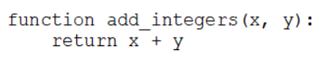

B. Option B
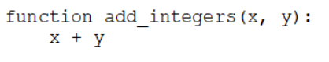

C. Option C
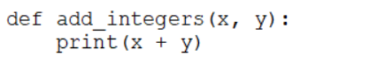

D. ***Option D***
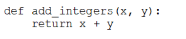

E. Option E
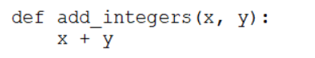

<u> **Explanation** </u>:

[Link 1](https://www.w3schools.com/python/python_functions.asp)

[Link 2](https://www.geeksforgeeks.org/python-functions/)

<br />

#### Q42. A data engineer is using the following code block as part of a batch ingestion pipeline to read from a composable table:

```
transaction_df = (
        spark.read
        .schema(schema)
        .format("delta")
        .table("transactions")
    )
```
Which of the following changes needs to be made so this code block will work when the transactions table is a stream source?

A. Replace predict with a stream-friendly prediction function

B. Replace `schema(schema)` with option ('maxFilesPerTrigger', 1)

C. Replace 'transactions' with the path to the location of the Delta table

D. Replace `format('delta')` with `format('stream')`

E. ***Replace `spark.read` with `spark.readStream`***

<u> **Explanation** </u>:

To read from a stream source, the data engineer needs to use the spark.readStream method instead of the spark.read method. The spark.readStream method returns a DataStreamReader object that can be used to specify the details of the input source, such as the format, the schema, the path, and the options. The spark.read method is only suitable for batch processing, not streaming processing. The other changes are not necessary or correct for reading from a stream source.Reference:Structured Streaming Programming Guide,Read a stream,Databricks Data Sources

<br />

#### Q43. A data engineer has configured a Structured Streaming job to read from a table, manipulate the data, and then perform a streaming write into a new table.

The cade block used by the data engineer is below:

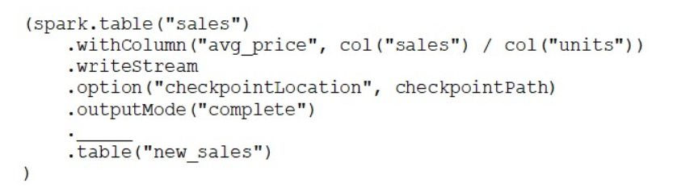

Which of the following changes needs to be made so this code block will work when the transactions table is a stream source?

A. `trigger('5 seconds')`

B. `trigger()`

C. `trigger(once='5 seconds')`

D. ***`trigger(processingTime='5 seconds')`***

E. `trigger(continuous='5 seconds')`

<u> **Explanation** </u>:

The processingTime option specifies a time-based trigger interval for fixed interval micro-batches. This means that the query will execute a micro-batch to process data every 5 seconds, regardless of how much data is available. This option is suitable for near-real time processing workloads that require low latency and consistent processing frequency. The other options are either invalid syntax (A, C), default behavior (B), or experimental feature (E).Reference:Databricks Documentation - Configure Structured Streaming trigger intervals,Databricks Documentation - Trigger.

<br />

#### Q44. Which type of workloads are compatible with Auto Loader?

A. ***Streaming workloads***

B. Machine learning workloads

C. Serverless workloads

D. Batch workloads

<u> **Explanation** </u>:

<br />

#### Q45. Which of the following code blocks will remove the rows where the value in column age is greater than 25 from the existing Delta table my_table and save the updated table?

A. SELECT * FROM my_table WHERE age > 25;

B. UPDATE my_table WHERE age > 25;

C. ***DELETE FROM my_table WHERE age > 25;***

D. UPDATE my_table WHERE age <= 25;

E. DELETE FROM my_table WHERE age <= 25;

<u> **Explanation** </u>:

The DELETE command in Delta Lake allows you to remove data that matches a predicate from a Delta table. This command will delete all the rows where the value in the column age is greater than 25 from the existing Delta table my_table and save the updated table. The other options are either incorrect or do not achieve the desired result. Option A will only select the rows that match the predicate, but not delete them. Option B will update the rows that match the predicate, but not delete them. Option D will update the rows that do not match the predicate, but not delete them. Option E will delete the rows that do not match the predicate, which is the opposite of what we want.Reference:Table deletes, updates, and merges --- Delta Lake Documentation

<br />

#### Q46. A data engineer is working with two tables. Each of these tables is displayed below in its entirety. The data engineer runs the following query to join these tables together: Which of the following will be returned by the above query?

A. ***Option A***
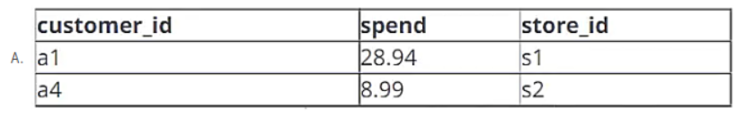

B. Option B
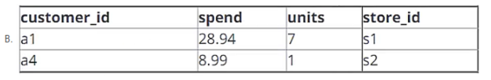

C. Option C
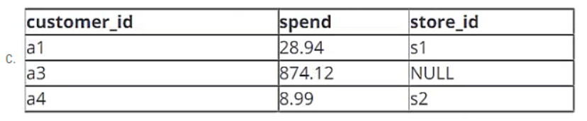

D. Option D
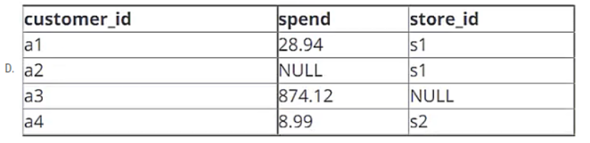

E. Option E
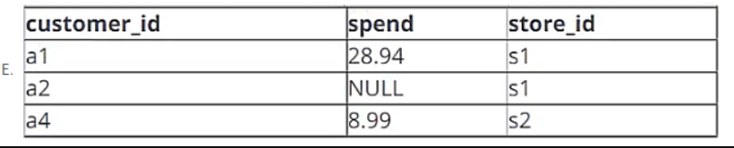

<u> **Explanation** </u>:

Option A is the correct answer because it shows the result of an INNER JOIN between the two tables. An INNER JOIN returns only the rows that have matching values in both tables based on the join condition. In this case, the join condition isON a.customer_id = c.customer_id, which means that only the rows that have the same customer ID in both tables will be included in the output. The output will have four columns: customer_id, name, account_id, and overdraft_amt. The output will have four rows, corresponding to the four customers who have accounts in the account table.

<br />

#### Q47. A data engineer runs a statement every day to copy the previous day's sales into the table transactions. Each day's sales are in their own file in the location "/transactions/raw".

Today, the data engineer runs the following command to complete this task:

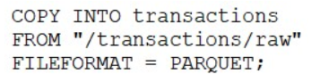

#### After running the command today, the data engineer notices that the number of records in table transactions has not changed.

#### Which of the following describes why the statement might not have copied any new records into the table?

A. The format of the files to be copied were not included with the `FORMAT_OPTIONS` keyword.

B. The names of the files to be copied were not included with the FILES keyword.

C. ***The previous day's file has already been copied into the table.***

D. The PARQUET file format does not support COPY INTO.

E. The `COPY INTO` statement requires the table to be refreshed to view the copied rows.

<u> **Explanation** </u>:

The COPY INTO statement is an idempotent operation, which means that it will skip any files that have already been loaded into the target table1. This ensures that the data is not duplicated or corrupted by multiple attempts to load the same file. Therefore, if the data engineer runs the same command every day without specifying the names of the files to be copied with the FILES keyword or a glob pattern with the PATTERN keyword, the statement will only copy the first file that matches the source location and ignore the rest. To avoid this problem, the data engineer should either use the `FILES` or `PATTERN` keywords to filter the files to be copied based on the date or some other criteria, or delete the files from the source location after they are copied into the table2.

**Reference**:
1: [COPY INTO | Databricks on AWS](https://docs.databricks.com/aws/en/sql/language-manual/delta-copy-into)
2: Get started using COPY INTO to load data | Databricks on AWS

<br />