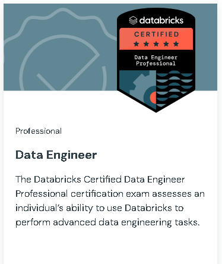

# Databricks Certified Data Engineer Professional

[Link](https://www.databricks.com/learn/certification/data-engineer-professional)

### **This exam covers:**

Developing Code for Data Processing using Python and SQL – 22%
Data Ingestion & Acquisition – 7%
Data Transformation, Cleansing, and Quality – 10%
Data Sharing and Federation – 5%
Monitoring and Alerting – 10%
Cost & Performance Optimisation – 13%
Ensuring Data Security and Compliance – 10%
Data Governance – 7%
Debugging and Deploying – 10%
Data Modelling – 6%
