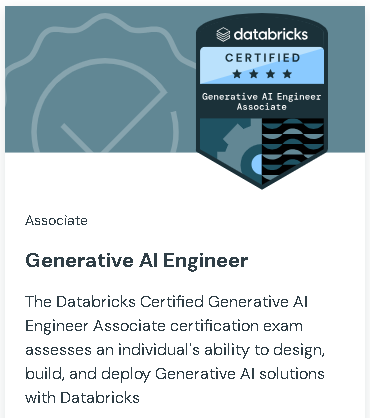

# Databricks Certified Generative AI Engineer Associate

[Link](https://www.databricks.com/learn/certification/genai-engineer-associate?itm_source=www&itm_category=learn&itm_page=certification&itm_location=Generative%20AI%20Engineer&itm_component=card&itm_offer=genai-engineer-associate)

### **This exam covers:**

Design Applications – 14%
Data Preparation – 14%
Application Development – 30%
Assembling and Deploying Apps – 22%
Governance – 8%
Evaluation and Monitoring – 12%
